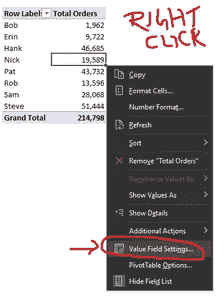
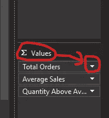
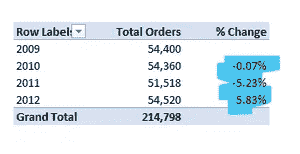

# 对数据透视表执行更多操作—值字段设置

> 原文：<https://medium.com/analytics-vidhya/do-more-with-pivot-tables-value-field-settings-3cc76d6ed79?source=collection_archive---------18----------------------->

卡尔·海尔达尔在 [Unsplash](https://unsplash.com?utm_source=medium&utm_medium=referral) 上拍摄的照片

数据透视表毫不费力。它不仅能够进行繁重的数据提升，快速汇总和分析数据，还可以执行一些额外的计算。

值字段设置提供了大量的快速计算选项。这篇文章涵盖了我最喜欢的 5 个特性。

# 如何获取值字段设置？

值字段设置为计算提供了很大的灵活性。有两种方法可以访问值字段设置:

右键单击包含要转换的值的任何单元格:

在值下，单击下拉选项箭头:

# 列总计或行总计的百分比

百分比是任何分析的一个重要方面，因为它提供了一个基线。使用百分比，我们可以比较不同时期或不同 KPI 的绩效。

最常见的计算是计算列总计或行总计的百分比。值字段设置带有广泛的计算选项。

# 占列总数的百分比

值字段设置>将值显示为列总数的> %

输出:

**分析结论:**史蒂夫对总销售额的贡献率为 23.95%，而鲍勃的贡献率仅为 0.91%。

# 占行总数的百分比

值字段设置>将值显示为行合计的> %

**分析结论:**Bob 的大部分销售(大约。70%)来自企业和家庭办公领域。总体来看，小企业对销售额的贡献最低(17.98%)。

# 占父代总数的百分比

当我们有多级报表结构时，透视表提供了选择分母的灵活性:

**分析结论:**桌子贡献了家具细分市场 38%的销售额和整个产品类别 13%的销售额。技术对销售的贡献最大(大约。42%).

值字段设置>将值显示为>父合计的百分比>选择父类别

# 累计百分比

这有助于区分排名靠前和靠后的贡献者。我们也知道这是帕累托法则或 80/20 法则。

输出:

**分析结论:**突出显示的部分对大约。总销量的 80%。

我们还可以获得绝对数字(在中选择运行总数)

# 与前一行或前一列的百分比差异

另一个相关的有用特性是，我们可以计算与前一行或前一列的百分比差异。当我们比较一个时期和另一个时期时，这种类型的计算很方便。

# 与前一行的百分比变化

值字段设置>将值显示为> %差异自

输出

**分析结论:**从 2010 年到 2011 年，总订单减少了 5.23%。

# 与前一列相比的变化百分比

汇总数据:

与前一列相比的变化百分比:

**分析结论:**大西洋地区 2011 年的销售额下降了 20.32%。

# 添加排名

在分析过程中，排序是很方便的。在 Excel 中，我们可以使用 RANK 之类的函数。AVG 或 RANK.EQ. Pivot 提供了一个拖放选项来计算排名。

**分析结论:**我们排名前三的产品是办公机器、电话和通讯以及桌子。

支点最棒的部分是它提供的动力。

你可以通过这篇文章了解更多关于排名的信息:[使用排名进行比较](https://www.vivran.in/post/using-rank-for-comparison)

更少的努力，更多的产出！

*我写一下*[*MS Excel*](https://www.vivran.in/my-blog/categories/excel)*，* [*权力查询*](https://www.vivran.in/my-blog/categories/powerquery) *，* [*权力毕*](https://www.vivran.in/my-blog/categories/powerbi) *，* [*权力中枢*](https://www.vivran.in/my-blog/categories/power-pivot) *，*[*DAX*](https://www.vivran.in/my-blog/categories/dax)*，*

[@imVivRan](https://twitter.com/imvivran)