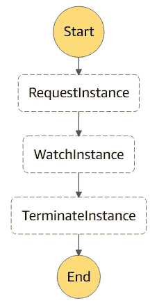

# 不要将您的 ML 模型放在 AWS EBS 中

> 原文：<https://medium.com/analytics-vidhya/do-not-put-your-ml-models-in-aws-ebs-3ae0db559669?source=collection_archive---------12----------------------->


## (从快照启动时)

这是我想要的。我想要一个 AMI，我可以将它启动到 Amazon EC2 实例(使用 GPU)中，以便在每周二早上运行一个模型。实例必须加载模型，完成工作，然后终止。我希望一切尽可能快地执行，我想 100%确定图像将死亡，以避免一个大的 AWS 法案。

本文建议了一种实现上述内容的方法。我还讨论了我犯的一个错误，即在 EBS 中存储我的 ML 模型，以及应该怎么做。

如果您只是想知道，为什么不是 EBS，那么跳到文章的第二部分，忽略代码。

# 阶跃函数+ Lambda + EC2

其想法是创建一个步骤函数工作流，该工作流将由星期二的 Cloudwatch 事件触发。工作流将依次执行以下操作:

1.  启动 Lambda，这将启动 EC2 实例；Lambda 返回启动的实例的实例 id
2.  观察 EC2 实例的活动；在我们的实例中运行的程序必须启动活动，每分钟提交心跳，然后报告任务成功。
3.  启动相同的 Lambda，它将使用提供的实例 id 终止 EC2 实例。

这是这个工作流的亚马逊州语言规范。



注意，我们将 AMI id 和动作“start”传递给 Lambda 函数来启动实例，并将 AMI id、动作“stop”和生成的实例 id 传递给 stop 实例。我们的 lambda 函数应该读取“action”字符串，并启动或终止一个实例。

# 为什么 EBS 对 ML 车型没有好处？

我的 ML 型号大约是 5GB。不是一个巨大的模型，但嘿，我不是 OpenAI，他们(OpenAI)甚至不喜欢我(仍在等待进入 GPT-3)。

我最初的想法是将模型打包到 AMI 中。我不希望模型频繁更新，我认为将所有东西都放在实例的根卷中已经足够快了。毕竟，有什么设置会比在操作系统驱动器中启动所有必需文件的服务器更有效呢！

我错了。

将 **5 GB 型号**加载到我的桌面服务器上大约需要两分钟。同一型号的**花了 20-30 分钟从 EBS** 加载。与此同时，GPU 基本上处于休眠状态，等待 I/O 完成——浪费时间和金钱。

也许，最让人惊讶的是，这一点都不奇怪！

AWS [警告](https://docs.aws.amazon.com/AWSEC2/latest/UserGuide/ebs-initialize.html)不要从快照加载 EBS 图像:

> 对于从快照创建的卷，存储块必须从亚马逊 S3 下载并写入卷，然后才能访问它们。这一初步操作需要时间，并且在第一次访问每个数据块时，可能会导致 I/O 操作延迟显著增加。

真扫兴。基于以上所述，每当我们从 AMI 启动一个新实例时，我们的程序都必须等待模型从 S3 复制到 EBS。虽然 S3 可以很快，但由 AWS 实现的同步过程相当慢。

想法？

这里有一个。

EBS 卷是网络连接驱动器。它们速度很慢，不适合高 I/O。对于更高的 I/O，您需要直接连接 SSD 驱动器(无网络)。

你猜怎么着。GPU 实例附带 SSD 驱动器，作为临时存储。例如， [*g4dn.xlarge*](https://aws.amazon.com/ec2/instance-types/g4/) 实例带有一个 125 GB 的 NVMe SSD，可在设备`“/dev/nvme0n1”`上使用。呜哇！

问题在于，NVMe 的短暂储存是短暂的。这意味着，如果停止或休眠实例，数据将会丢失。由于我们只启动实例一次，然后终止它，这对我们没有太大影响。然而，在实例启动时，临时存储将是空的；因此，我们需要将模型从其他地方复制到临时存储中。

显而易见的选择是 S3。这也给我们带来了无需接触实例就能更新模型的优势。我们所要做的就是添加一些额外的逻辑，将模型从 S3 复制到安装了临时存储的本地目录中。

转让费怎么样？如果您的 S3 存储桶和实例在同一个地区，您需要为每 GB 拷贝支付*0.02 美元。对于 5 GB，那是 10 美分，比最便宜的 *g4dn* 实例 20 分钟便宜 50%。*

这似乎有悖直觉。为什么每次启动时复制数据比使用映像中已有的数据启动更快、更便宜？其实就应该这样。EBS 卷中的大多数内容(操作系统文件和库)永远不会被读取，因此不需要高 I/O。当需要时，您应该使用临时存储。

## 让它工作

我说过这个短暂的驱动器连接到了`“/dev/nvme0n1”`(根据 AWS 的仪表板)，但是我发现在 Ubuntu 机器学习基础 AMI 实例中情况并非如此。

在我的实例中，临时存储被附加到`“/dev/nvme1n1”` 上，并且必须被分区和挂载。我的解决方案是添加一个脚本，在引导时对临时存储进行分区和挂载。

```
sudo nano /etc/rc.localmkfs -t xfs /dev/nvme1n1
/dev/nvme1n1 ~/<YOUR ML MODEL DIRECTORY>sudo chmod a+x /etc/rc.local
```

如果您在 docker 容器中运行您的程序，您还需要使用`**-v**`标志将上述目录挂载到 docker:

```
sudo docker run -ti — gpus all -v ~/<YOUR ML MODEL DIRECTORY>:/app/<YOUR ML MODEL DIRECTORY> — name [NAME] [IMAGE]
```

# 经验教训

应该“明显”起作用的东西，并不总是起作用，但它可以成为一篇好文章。