# 班加罗尔的初创企业获得的资金更多吗？

> 原文：<https://medium.com/analytics-vidhya/do-startups-in-bangalore-get-funded-more-19cbf1ed56b6?source=collection_archive---------18----------------------->

## 印度创业融资数据集的 EDA。

在接下来的 7 分钟里，我们将对印度初创企业融资数据集进行探索性数据分析。此外，我们将推断一些见解，并尝试回答一些关于印度创业生态系统的问题。


[Startaê Team](https://unsplash.com/@startaeteam?utm_source=medium&utm_medium=referral) 在 [Unsplash](https://unsplash.com?utm_source=medium&utm_medium=referral) 上的照片

## 动机:

印度是世界上增长最快的经济体之一。在过去的十年里，我们已经看到大量的独角兽创业公司在印度创业生态系统中崛起，这具有全球影响。初创公司可能是小公司，但它们可以在经济增长中发挥重要作用。他们创造更多的工作，这意味着更多的就业，更多的就业意味着经济的改善。不仅如此，初创企业还可以通过刺激创新和注入竞争来促进经济活力。通过使用数据分析技术，我们可以分析数据并回答与印度创业生态系统相关的各种问题。

## 什么是探索性数据分析？

艾伦·B·唐尼(Allen B.Downey)的书[*‘Think Stats’*](https://greenteapress.com/thinkstats/)对 EDA 总结得很好，如下:

> 我们寻找解决我们感兴趣的问题的模式、差异和其他特征。

## 步骤 0:导入库和数据集

在开始任何数据分析项目之前，第一步是导入必要的库和数据集。对于这个项目，我们可以使用这个[链接](https://www.kaggle.com/sudalairajkumar/indian-startup-funding)在 Kaggle 上找到数据集。我们将导入所有标准的 python 库，如用于数据操作和分析的 pandas、用于线性代数运算的 numpy、用于数据可视化的 matplotlib 和 seaborn。

```
*# Importing libraries*
import pandas as pd
import numpy as np 
import matplotlib.pyplot as plt
import seaborn as sns*# Importing dataset*
dataset = pd.read_csv('startup_funding.csv')
```

## 步骤 1:了解数据集

```
# Preview dataset
dataset.head()
```

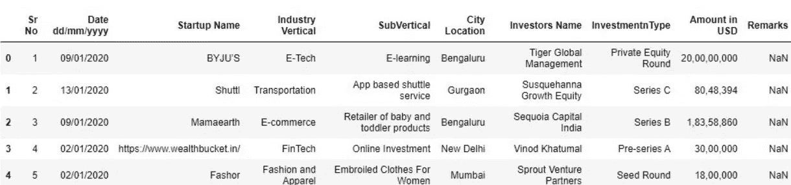

```
# Dataset dimensions - (rows, columns)
dataset.shape**output:**(3044, 10)# Features data-type
dataset.info()**output:** <class 'pandas.core.frame.DataFrame'>
RangeIndex: 3044 entries, 0 to 3043
Data columns (total 10 columns):
 #   Column             Non-Null Count  Dtype 
---  ------             --------------  ----- 
 0   Sr No              3044 non-null   int64 
 1   Date dd/mm/yyyy    3044 non-null   object
 2   Startup Name       3044 non-null   object
 3   Industry Vertical  2873 non-null   object
 4   SubVertical        2108 non-null   object
 5   City  Location     2864 non-null   object
 6   Investors Name     3020 non-null   object
 7   InvestmentnType    3040 non-null   object
 8   Amount in USD      2084 non-null   object
 9   Remarks            419 non-null    object
dtypes: int64(1), object(9)
memory usage: 237.9+ KB# Checking for Null values
(dataset.isnull().sum() / dataset.shape[0] * 100).sort_values(ascending = False).round(2).astype(str) + ' %'**output:** Remarks              86.24 %
Amount in USD        31.54 %
SubVertical          30.75 %
City  Location        5.91 %
Industry Vertical     5.62 %
Investors Name        0.79 %
InvestmentnType       0.13 %
Startup Name           0.0 %
Date dd/mm/yyyy        0.0 %
Sr No                  0.0 %
dtype: object
```

> **观察:**
> 
> 1.在从属功能中，即“美元金额”，需要进行一些预处理，如删除逗号和处理空值。
> 
> 2.需要对“日期”功能进行预处理并将其转换为数字，以便它可以用于创建绘图。
> 
> 3.“Remarks”特性包含大约 86.23%的空值，因此我们可以删除它。

## 步骤 2:数据预处理

在我们开始绘制图表和从数据中推断洞察力之前，我们需要做一些数据清理，比如修复空值。

在从属功能“美元金额”中，每个值都包含需要删除的逗号。此外，还有一些错误的值需要修复，如“14342000+”，并转换为数字格式。然后，我们通过用相同特征的平均值填充空值来修复它们。

“日期”功能包含一些需要更正的错误值，如“22/01//2015”。使用此功能，我们创建了另一个名为“Year Month”的功能，它包含中相应值的年份和月份，不带正斜杠。

“Remarks”特性包含许多缺失值，因此我们可以使用 pandas 删除整个列。

在“城市位置”功能中，班加罗尔被拼错为 Bengaluru，这需要修复，因为两者是相同的位置。同样，在“投资者姓名”一栏，未披露的投资者经常被拼错，这是固定的，因为两者是相同的。

启动名称“Ola Cabs”需要转换为一个单词，因为在单词云图中，它会产生两个不同的单词。

在“投资类型”功能中，同一个单词的多种形式以拼写错误的形式出现，这一问题需要解决。

## 步骤 3:探索性数据分析

## Q1。资金生态系统如何随时间变化？

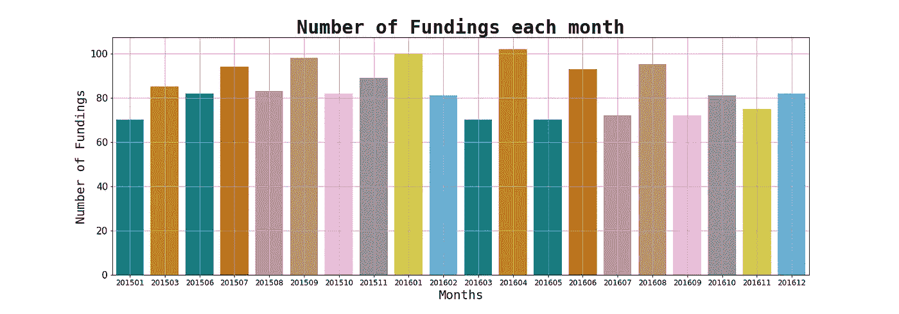

> **观察:**
> 
> 1.2015 年和 2016 年期间的资助次数平均约为 84 次，没有大幅增加或减少
> 
> 2.2016 年 4 月，最高资助额为 102 英镑。
> 
> 3.2015 年 1 月，最低资助额为 70 英镑。

## Q2。城市位置在资金方面起主要作用吗？

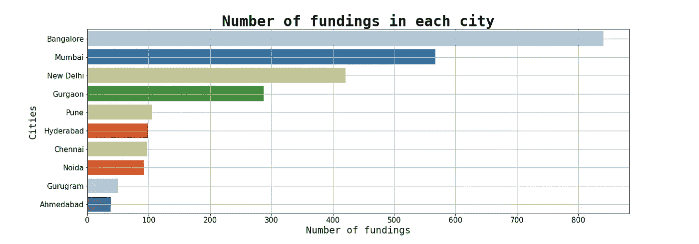

> **观察:**
> 
> 1.班加罗尔、孟买和新德里等城市是获得资金最多的城市，在印度创业生态系统中占了大部分资金。
> 
> 2.在低端，我们有像艾哈迈达巴德和古鲁格拉姆这样的城市，它们的资助数量无法与顶级城市相比
> 
> 3.从图表中，我们可以推断出，如果一家初创公司位于像孟加拉鲁鲁这样的顶级城市，那么它比那些位于低资助城市的人获得资助的概率更高。

## Q3。哪些行业受到投资人的资金青睐？

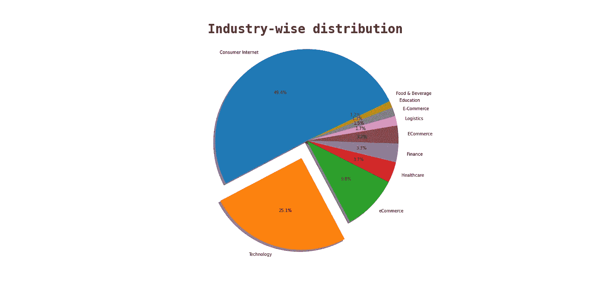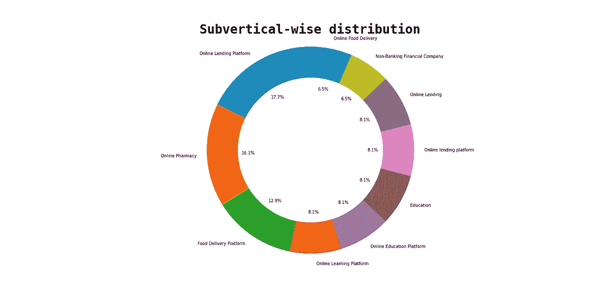

> **观察:**
> 
> 1.在饼状图中，我们可以看到技术和消费互联网初创公司约占市场的 74%。
> 
> 2.如甜甜圈图所示，大多数初创企业，如网上药店、网上借贷、食品配送平台，都是基于技术的。
> 
> 3.从上面的图表中，我们可以说基于消费者的科技创业公司受到投资者的青睐。

## Q4。谁是印度创业生态系统中最重要的投资者？

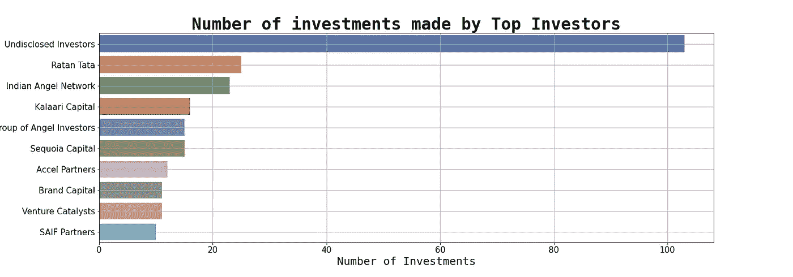

> **观察:**
> 
> 1.上图中的顶级投资者是不公开的，这是因为在许多初创公司中，投资者选择保持隐藏。
> 
> 2.印度创业生态系统中已知的顶级投资者是拉坦·塔塔、印度天使网络和 Kalaari Capital。

## **Q5。创业公司在印度一般能拿到多少资金？**

```
# Preview of details of top 5 most funded startups
dataset.sort_values(by = 'Amount in USD', ascending = False).head(5)
```

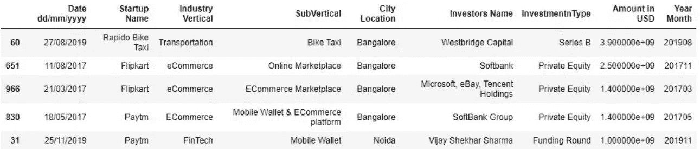

```
# Preview of details of least funded startups
dataset.sort_values(by = 'Amount in USD').head(5)
```

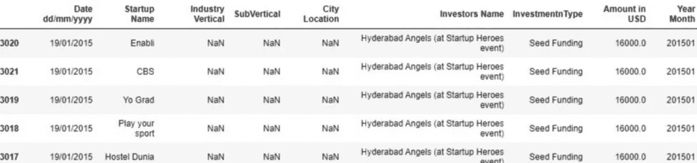

```
# Calculating average funding received by a startup
print('Average funding received by startups is',round(dataset['Amount in USD'].mean(), 2))**Output:** Average funding received by startups is 18429897.27
```

> **观察:**
> 
> 1.获得资金最多的初创公司是“Rapido Bike taxi”、“Paytm”和“Flipkart”。
> 
> 2.印度创业生态系统的平均资金为 18429897 美元。
> 
> 3.资金最少的初创公司是“Dunia 招待所”、“玩你的运动”和“Yo Grad”，每家大约 16000 美元。

## Q6。哪些初创企业获得的资金最多？

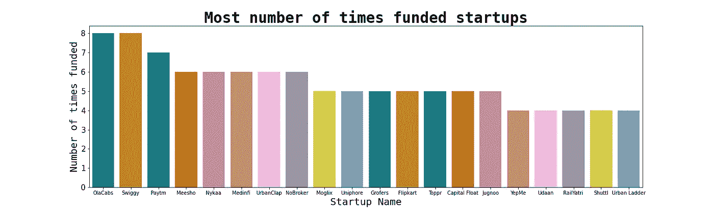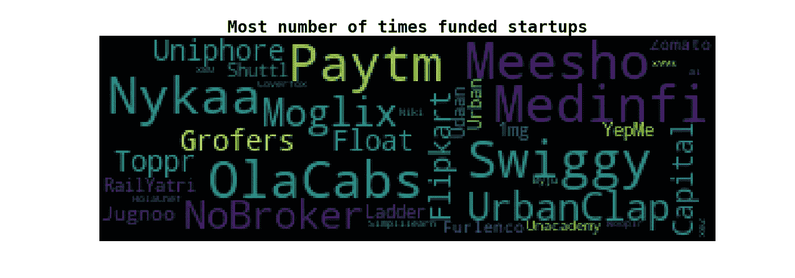

> **观察:**
> 
> 1.被资助次数最多的创业公司分别是‘Swiggy’、‘ol acabs’和‘pay TM’。

## Q7。创业公司有哪些不同类型的资助？

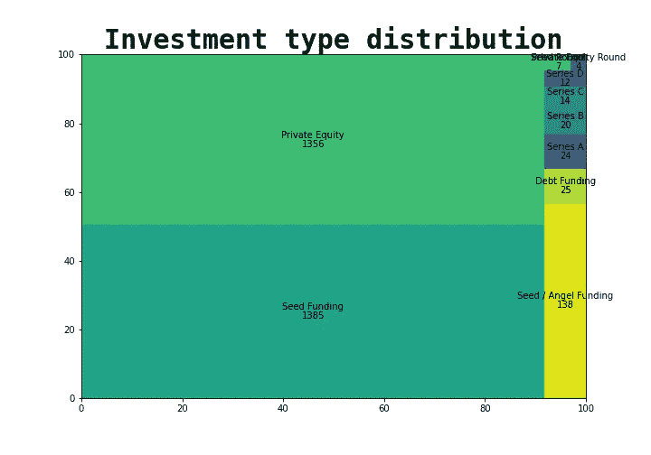

> **观察:**
> 
> 1.投资的主要类型是私募股权和种子资金，占融资的 90%以上。
> 
> 2.其他类型的融资有债务融资、种子/天使融资、首轮融资、B 轮融资、C 轮融资，但它们非常罕见。

## 结论:

*   为日常消费者提供服务的科技型创业公司很有可能获得大量资金。我们看到过像 Flipkart 和 Paytm 这样的创业公司。
*   班加罗尔和孟买等大都市的大量初创公司都得到了资助，这可能是因为这些城市人才济济。
*   大多数基金都是私募股权和种子基金类型的。
*   拉坦·塔塔、印度天使网络和 Kalaari Capital 是印度创业生态系统中的一些顶级投资者。
*   Flipkart、Paytm 和 Rapido Bike taxi 是获得资金最多的初创公司之一，而 Ola Cabs 和 Swiggy 获得的资金最多。

## 进一步的工作:

可以使用频率编码器对数据集中的分类特征进行编码。然后我们可以利用这些特征建立一个树外回归模型，并得到特征的重要性。使用这些特征的重要性，我们可以确定影响资金数额的最重要的因素。

既然你看完了这篇文章，我很乐意向你展示一种有趣的方式，以 [**xkcd**](https://xkcd.com/303/) 风格漫画的形式绘制剧情。

通常，我们使用以下命令绘制图形:

```
plt.plot()                        OR                  sns.plotname()
```

输出是这样的:

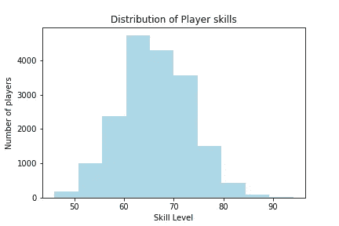

而是使用 [**plt.xkcd()**](https://matplotlib.org/3.1.1/api/_as_gen/matplotlib.pyplot.xkcd.html) 命令:

```
with plt.xkcd():
      plt.plotname() // sns.plotname() 
```

我们得到了这个图:

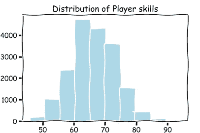

这适用于所有类型的图形，甚至在 seaborn 中也是如此。

这个项目的所有代码都可以在我的 GitHub 资源库中找到:

[](https://github.com/Aditya-Mankar/Indian-Startup-Funding-EDA) [## aditya-Mankar/Indian-Startup-Funding-EDA

### 在印度创业基金上表演 EDA。

github.com](https://github.com/Aditya-Mankar/Indian-Startup-Funding-EDA)