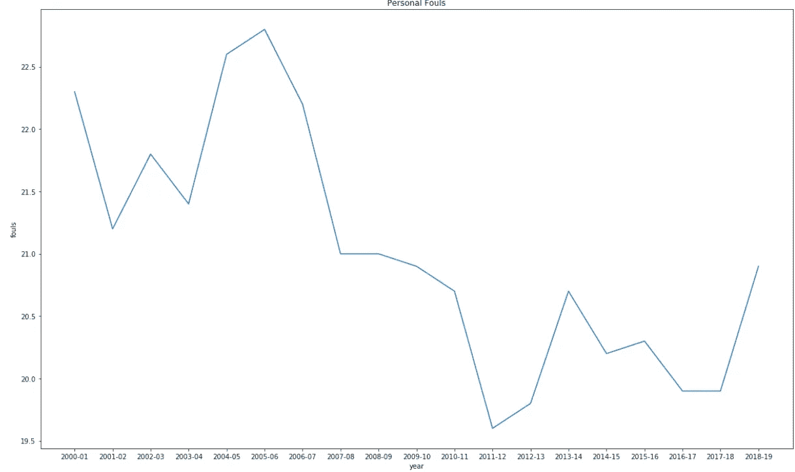

# 三安抚吗？

> 原文：<https://medium.com/analytics-vidhya/do-threes-appease-5e3be97ce220?source=collection_archive---------10----------------------->

## 三分球是导致 NBA 人气上升还是下降？

我从小就一直在看篮球。当俄克拉荷马城最终获得他们的第一个职业 NBA 时间时，我对 NBA 的一切都押上了全部赌注。在过去的几年里，NBA 的观众人数和上座率都出现了飙升，所以我想深入研究这些数据，看看像三分球的数量这样的东西，无论是命中还是尝试命中，是否可能是 NBA 受欢迎程度上升的原因。

在本教程中，我将展示一些我在网上找到的 NBA CSV。其中一个 CSV 有点乱，很难处理，所以我将展示我是如何清理数据的，以便更好地可视化我的发现。

我的第一个 CSV 文件来自 NBA.com，里面有你能想到的所有 NBA 数据。这是我从那里找到的一张照片:

我将删除一些我认为对我们没有多大用处的列，这样我们就有了这个简单的数据框架:

然而，经过仔细检查，似乎在“起始年”列下，每个团队每年都有多个实例。例如，有 30 支 NBA 球队，因此对于每个赛季来说，“2015”将出现 30 次。让我们看看我们是否能找到一种方法来对抗它。

在这里，我使用 set.index()方法来重新排列数据，这可能有助于我们更好地了解 NBA 上座率数据中的情况:

我想这样会好一点，但是让我们看看，如果我们在“起始年”拆分它会发生什么:

好吧！这稍微好一点，但我看到我们有一些丢失的数据，让我们继续运行一点代码来替换我们的数据框中所有丢失的数据，或 NaN。以下是我使用的代码:

成功了吗？

让我们仔细检查数据帧，看看我们是否将这些 NaN 设置为零

在这种情况下，用零填充空值是行不通的，它会打乱我们的条形图。相反，我将使用下面这段代码用数据框的平均出勤率来填充空值:

现在，让我们看一个条形图，看看哪些团队的平均出席人数最高:

芝加哥公牛队在 2000 年至 2015 年期间的上座率最高。

现在我已经展示了如何清理一些杂乱的数据，让我们找到一个我们可以挖掘的数据集，并尝试找到一些趋势！

正如你从这张图表中看到的，basketball-references.com，NBA 电视观众人数自 2002 年以来一直呈上升趋势，但在过去两年有所下降。

让我们深入研究这些数据，看看是否能发现发生了什么事。我再次去 basketball-reference.com 寻找一些统计数据，并运行了 2001 年至 2019 年的 NBA 平均值。这些数据看起来是这样的:

我不知道其中一些统计数据的含义，如“Pace”或“ORB ”,因此我将删除我认为不重要的列，这样我们就有了一个如下所示的数据框:

下图从上个赛季开始，一直下降到 2000-2001 年。条形代表每个赛季每场比赛的平均三分球数。颜色代表平均每场比赛的三分出手次数。正如你将看到的，在 2011-2012 赛季，尝试和三分球开始上升。让我们看看每场比赛的个人犯规，也许这是对为什么现在这么多三分球被制造/尝试的影响。

从每场比赛，每支球队的平均个人犯规图表(下图)来看。看来肯定有事发生了。2005-2006 赛季后，犯规开始急剧下降。不幸的是，数据并没有告诉我们 NBA 个人犯规急剧减少的原因。快速的谷歌搜索没有帮助，因为在如何判定个人犯规的协议上似乎没有任何明显的变化。

然而，如果我们看看上面的 NBA 电视收视率，我们会发现 2005-2006 赛季对 NBA 来说并不是一个好的收视赛季。也许有一些与 NBA 老板和官员的后台会议，他们同意让球员多一点身体接触，不允许这么多犯规？毕竟，犯规确实会拖慢比赛，这可能会导致不经意的球迷不停地换到下一个频道。

下面是我对“赛季”、“三分尝试(蓝色)”和“个人犯规(橙色)”进行分组的图表

似乎在个人犯规和三分出手之间有一些关联。在过去的三到四年里，个人犯规开始停滞不前，三分投篮开始飙升。

**结论:**

从这里所做的小样本数据分析来看，有潜在的内部因素似乎对 NBA 的收视率有某种影响。我相信有足够的证据允许进一步的分析。在未来的 Medium post 中，我希望引入其他数据，例如每张门票的平均成本、不同体育场的食品成本、停车场的价格以及体育场周围的平均家庭收入。最后，我想在 NBA 比赛期间浏览一下 Twitter，看看是否有任何独特或有趣的流行标签。将所有的数据合并成一个数据集，并进行多元回归测试，可能会让我们更仔细地了解是什么影响了 NBA 的上座率和收视率。

**偏差:**

我没有感觉到我为这篇文章分析的数据有任何偏差。我使用的两个来源，NBA.com 和 Basketball-Reference.com 以其大量的档案而闻名，我没有理由认为它们不准确。