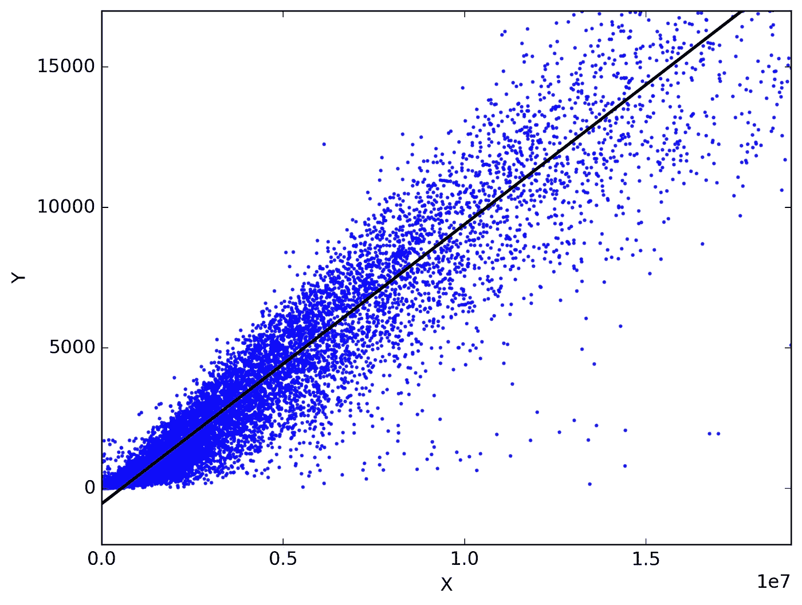
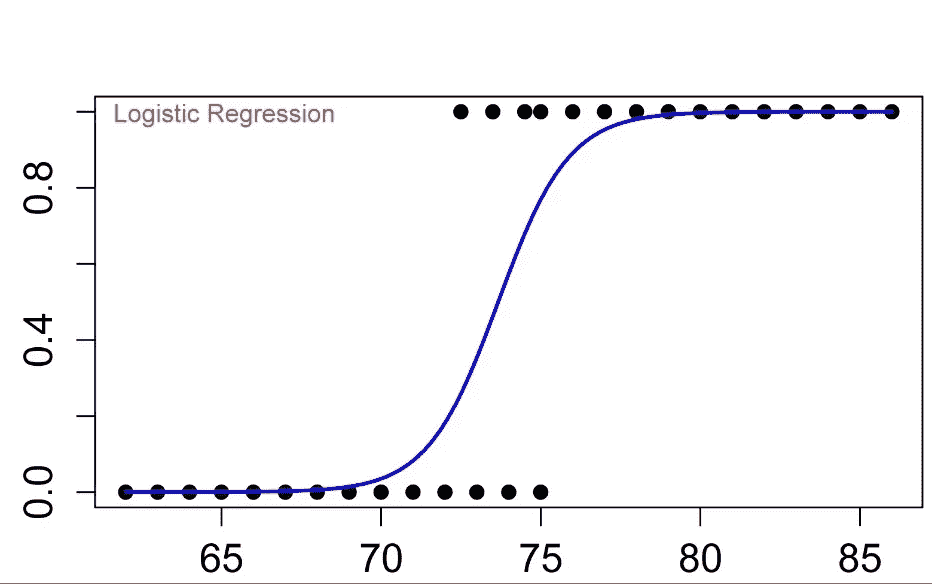
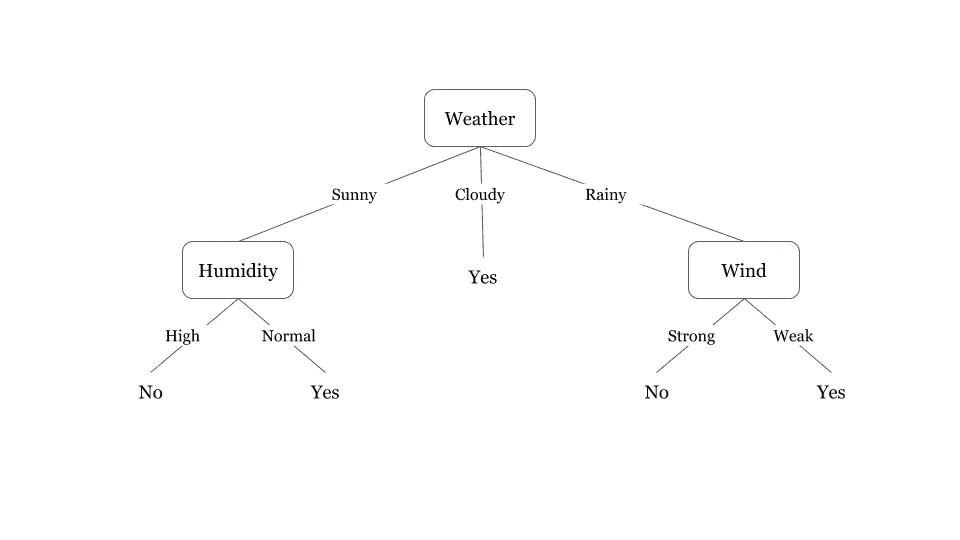
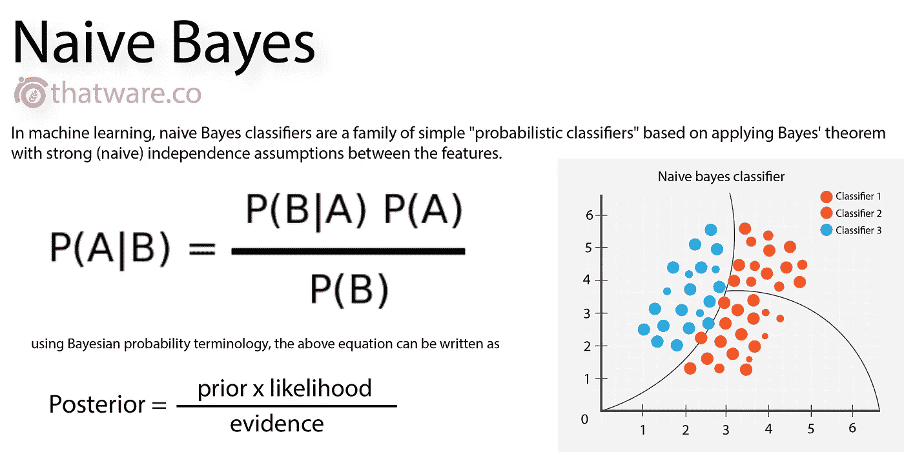
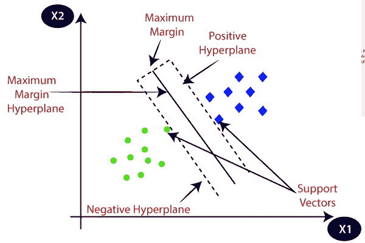

# 我们知道机器学习为什么吗？

> 原文：<https://medium.com/analytics-vidhya/do-we-know-why-machine-learning-3f7f0ea0601?source=collection_archive---------32----------------------->

所以，从一个很基本的问题开始，为什么“机器学习”看起来被炒作的这么厉害？？为什么每个即将毕业的学生都能听到这个消息？当我们寻求答案时，我们通常会说“**机器** **学习**是未来”来保持沉默。那么，为什么是未来呢？？这个真的没人回答。。对吗？？嗯，所以我把这个作为我的题目。

为了回答这个问题，让我们首先讨论一下什么是**机器** **学习**的定义，因此**机器** **学习**是一个过程/方法，它为系统提供了从经验中学习和改进的能力(就像人类一样)，而无需显式编程。它的可取之处在于它能够提供分析大量数据的智能替代方案。通过开发快速高效的算法和数据驱动的模型对数据进行实时处理，**机器** ***学习*** 可以产生准确的结果和分析。

“如果机器能做人类所做的事情，那该有多神奇”，在这里我引用了人们说他们希望能发生的事情，哇哦！！它正在发生！！

# 机器学习是如何工作的？

*   机器学习算法是在数据集上训练的，因此它们通过调整权重来“学习”。
*   数据集分为两部分，训练部分和测试部分。(80%–20%)
*   将训练数据集提供给算法，以便它可以学习，然后通过测试数据集检查其准确性
*   它们首先使用一些随机权重，然后调整权重，以使结果最接近数据集的输出。(训练集)
*   经过训练后，将测试数据集输入其中，然后检查其准确性。(准确度是预测输出和实际输出之间的相似程度)
*   如果精度不令人满意，我们可以进行调整，如调整学习速率(算法学习/调整权重的速率)，或通过改变时期数(数据被训练的迭代次数)等。

如我们所见，这样复杂的预测是可能的，只需要几行代码，只需要很少的人力。如此复杂的数学计算是在(算法的)后端完成的，不需要我们做太多的思考和脑力劳动，这是多么令人惊讶啊。这只是一个例子，**机器** **学习**几乎可以做一个人能做的每一件事，只是耗费的时间和人力更少。

# 还有什么…？？？

好了，那么我们再来讨论一下**机**学**的一些应用。**

*   机器学习的美丽也美化了医学领域。有了这么好的算法，我们可以用很少的因素预测很多疾病，从而减轻卫生工作者的负担。

1.  我们可以通过胆固醇、血压、心率等许多因素来预测一个人是否会患心脏病。
2.  此外，我们可以通过细胞的数据，即细胞半径、大小等来预测肿瘤是良性还是恶性。

*   机器学习可以是营销中的一个很好的工具，因为它可以预测预期的销售/客户数量，因此可以通过修改所提供服务的特征来帮助所有者增加销售/客户数量。
*   它还可以通过从网络爬虫获取输入来预测新闻文章的病毒式传播。这是通过考虑许多特征来实现的，例如新闻文章的主题、其情感分数、其内容的平均长度等。

# 什么是机器学习算法？

简单来说，机器学习算法是一种由数学和逻辑组成的程序，它可以随着数据暴露的增加而自我调整以表现更好。数据越多，性能越好。

不同类型的**机** **学习** **算法**有不同的参数设置和不同的调整方式。这里我们不会深入其中的任何一个，我们只是对每一个进行快速介绍(我还遇到过的，记住这些不是全部。)

*   *线性*如果你想深入了解这种类型，请参考我的[文章](https://link.medium.com/cnRqhmR6w6)

*   *逻辑回归* *回归*:逻辑回归是一种分类算法。在分类问题中，对于一组给定的输入，输出只能取离散值(例如是/否)。逻辑回归给出介于 0 和 1 之间的值，但永远不会精确到这些极限。

*   *决策树* *树*:决策树算法属于监督学习的范畴。它们可以用来解决回归和分类问题。决策树使用树表示来解决每个叶节点对应一个类标签，属性在树的内部节点上表示的问题。

*   *随机* *森林*:顾名思义，“森林”是健壮的，有很多树，同样这个森林也有很多树，决策树。随机森林是一种监督学习算法。随机森林使用数据样本创建决策树，然后从每个决策树中获得预测，然后通过投票的方式给出最终输出。显然，许多决策树放在一起会比单独一个发挥更好的作用。

*   *朴素* *贝叶斯*:朴素贝叶斯算法，顾名思义，是基于贝叶斯定理工作的。它们是概率分类器家族。，并且输出是以概率表示的(非常明显)

*   *支持* *向量* *机器*:支持向量机(SVMs)是强大而灵活的监督机器学习算法。它们以处理多个连续和分类变量的能力而闻名。SVM 模型是多维空间中超平面中不同类别的表示。超平面将由 SVM 以迭代的方式生成，从而可以最小化误差。SVM 的目标是将数据集分类。

谢谢你的时间。