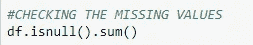
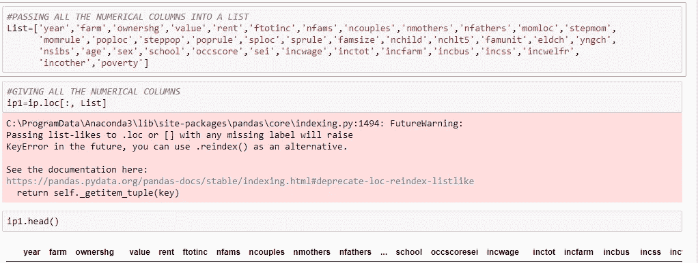

# 你知道 IPUMS 吗？

> 原文：<https://medium.com/analytics-vidhya/do-you-know-ipums-c0e6d15b5b2a?source=collection_archive---------14----------------------->

## 写这篇博客是为了通过使用不同的机器学习算法来检查 ipums 数据集的准确性，以达到 100%。

## 数据集是关于什么的？

*   IPUMS 指综合公共用途微观数据系列。
*   IPUMS 是世界上最大的个人人口数据库。
*   IPUMS 包括来自美国(IPUMS-美国)和国际(IPUMS-国际)人口普查记录的微观数据样本，以及来自美国和国际调查的数据。
*   IPUMS-国际只有在国家统计局合作并严格保密的情况下，才发布个人和家庭的综合微观数据。

# **数据集的规则:**

*   在将数据分发给个体研究人员之前，必须签署并批准电子许可协议。
*   为了获得数据，研究者必须同意以下内容:

1.实施安全措施，防止未经授权访问人口普查微观数据。根据 IPUMS 与合作机构的国际协议，禁止向第三方重新分发数据。

2.将微观数据仅用于学术研究和教育目的。研究人员必须明确同意不使用为任何商业或创收项目获取的微观数据。

3.为个人、家庭和其他实体保密。禁止试图从微观数据中确定个人或家庭的身份。声称一个人或一个家庭已经被识别也是被禁止的。

4.向 IPUMS 国际组织报告所有基于这些数据的出版物，该组织将把这些信息传递给相关的国家统计机构。

# 数据集的发现是什么:

*   数据是关于国际住户调查的。
*   它涉及家庭的许多特征。

数据集有许多变量，我们将它们分为输入和输出变量。

**61 特色栏目:**

年，gq，gqtypeg，farm，ownership g，value，rent，ftotinc，nfams，ncouples，nmothers，nfathers，momloc，step mop，momrule，poploc，steppop，poprule，sploc，sprule，famsize，nchild，nchlt5，famunit，eldch，yngch，nsibs，relateg，age，sex，raceg，marst，chborn，bplg，school，schltype，empstatg，labforce，occ1950

**1 目标列**(Movedin)——我们认为它们是“输出变量”

*   检查丢失的值。
*   清除了没有任何空值的数据。
*   我的所有数据变量由数字和分类数据组成，目标列包含 0 和 1。将数值数据转换为 0–1。
*   对所有分类数据进行标号编码，转换成 0，1，2，3…取决于每列中的不同类别。
*   进行一次热编码，将分类数据转换为 0–1 的方差
*   将所有标准化的和一次热编码的数据转换成数据帧并组合整个数据

> 我们开始吧，

> 导入库以开始分析

> 导入数据集

> 检查变量是否有缺失值

> 检查数据集中的行和列的总数

数据集中有 7486 列和 61 行

# 要点:

*   为了应用机器学习算法，所有的数据集值应该仅为 0 或 1。
*   将所有数据转换为 0 和 1 非常重要。

> 所有输入都应转换成 0 或 1。但是输出变量不应该被触摸(或)改变(或)转换。

*   我们必须检查不同的数据类型，要么是数字数据，要么是分类数据
*   在这种情况下，我们应该分开所有的数字和分类数据。

# 先说数值数据:

数字数据的规则:

*   每列应该只包含 2 个不同的类别
*   将数据转换为 0 和 1

*   这样，我们将通过将一个变量作为 0，将第二个变量作为 1，将所有 2 个类别变量转换为 0 和 1

> 注意:我们可以直接做一个 hotencoding 来把它们转换成数字，或者我们也可以通过上面的代码来转换它们

*   我们把所有的数字数据分成一个数据名。

从图中可以看出:

1.  给定列表中所有的数字列名
2.  将该列表分配给一个名为“ip1”的新名称
3.  检查它是否被分配。

在数据集的 61 列中，37 列是数字列和列名

> 规范化数字列，使数字介于 0–1 或 0 和 1 之间。

> 将标准化数据转换成数据帧。

> 检查所有数据变量是否都是数字

Float64 将其表示为数值变量

# 让我们来谈谈分类数据

分类数据的规则:

类别数据由 2 个以上的变量组成，可以是类别、组、数字、名称、类型等。

*   为了将所有的分类数据转换成数字数据，我们将进行“标签编码”

# 什么是标签编码？

> **LabelEncoder** 可以被**用来**规范化**标签**。也可以用**用**将非数字**标签**转换成数字**标签**。

> 我们将所有分类或对象数据类型存储在一个名为 X 的新变量中

> 检查列数及其名称

有 22 个变量是分类数据及其名称

# 什么是 OneHotEncoding？

*   one hot 编码是将分类变量表示为二进制向量。
*   这首先需要将分类值映射到整数值。
*   然后，每个整数值都被表示为一个二进制向量，除了用 1 标记的整数索引之外，其他都是零值。

通过进行一次热编码，22 列分类被转换成 595 个数字列

> 在转换成数值后，将数值和分类数据合并成一个数据集。

# 让我们讨论一下分类方法:

*   我们给出变量作为输入和输出，其中 X_ input，y_Output。
*   将整个数据集分为测试数据和训练数据
*   我把 20%作为测试数据，80%作为训练数据
*   首先，我将在训练数据上训练不同的方法，并在测试数据上测试结果
*   为了检查准确性

# 逻辑回归(监督学习)

# 分析:

*   逻辑回归模型根据训练数据集进行训练，并根据测试数据进行测试
*   将训练数据应用于测试数据。
*   现在模型的准确率是->**77.8%**

# 神经网络(监督学习)

# 分析:

*   神经网络模型在训练数据集上进行训练，在测试数据上进行测试
*   现在模型的准确率是->**【77.1%】**

# 决策树(监督学习)

# 分析:

*   决策树模型在训练数据集上被训练，并应用于测试数据
*   现在模型的准确率是->**77.6%**

# **支持向量机(监督学习)**

# 分析:

*   支持向量机模型在训练数据集上进行训练，并应用于测试数据
*   现在模型的准确率->**76.8%**

# 支持向量机-线性函数

# 分析:

*   在支持向量机中，我们实现的线性函数模型是在训练数据集上训练的，并应用在测试数据上
*   现在发现模型的准确率是->**88.6%**

# 随机森林(监督学习)

分析:

*   随机森林模型在训练数据集上进行训练，并应用于测试数据
*   现在发现模型的准确率是->**100%**

# 从所有分类方法得出的结论:

1.  从所有不同的分类方法中，可以观察到每种方法的准确性都略有提高。
2.  在使用监督学习方法的情况下，我们获得了 100%的准确率。
3.  **支持向量机(线性函数)的主要变化是准确率为 88.6%** 和**随机森林的准确率为 100%。**
4.  剩余法中，**逻辑回归、神经网络**和**决策树**和 **SVM** 的准确率为 **77%** 只增加了小数点。