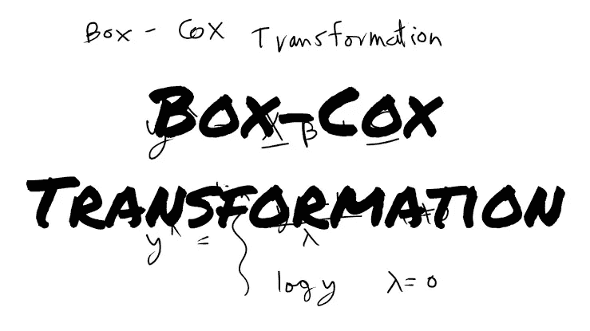
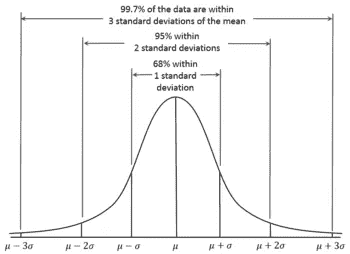
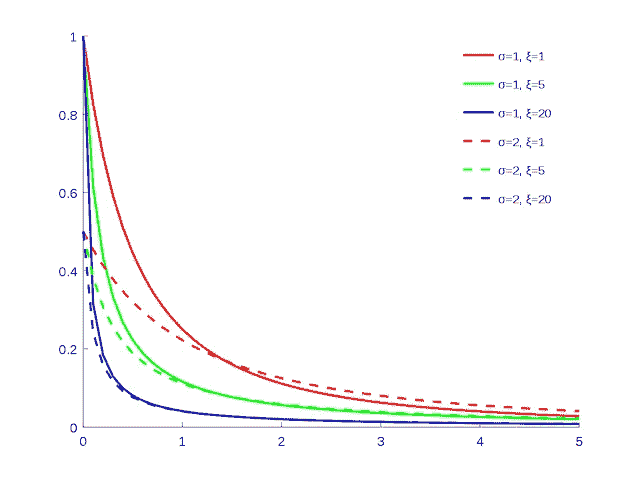
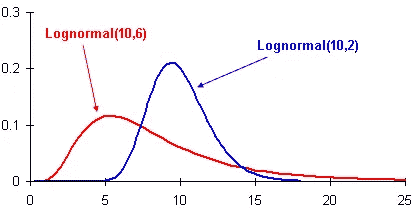
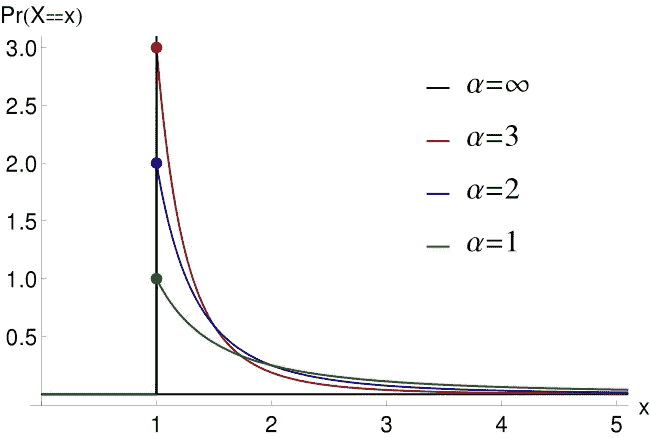
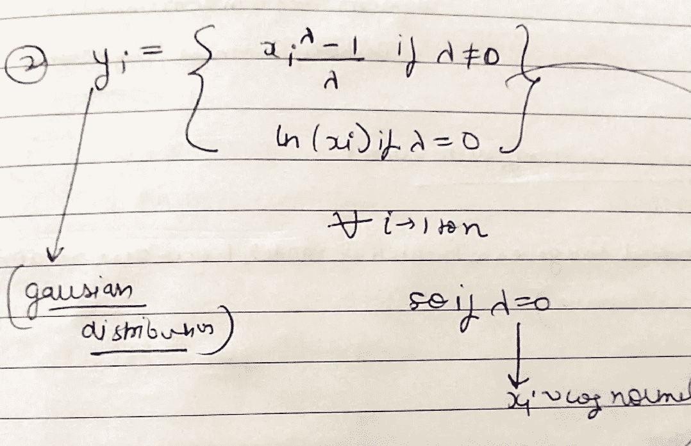

# 你知道 BOX COX 变换的深度吗？？？

> 原文：<https://medium.com/analytics-vidhya/do-you-know-the-depth-of-box-cox-transformation-47d02dcb4a42?source=collection_archive---------11----------------------->

在本文中，我们将了解一个美丽的数学技巧，它让数据科学家的生活变得轻松。

那就是 BOX COX 变换。

**在来到 Box Cox 之前，让我们来看看基础知识**

如你所知，有不同的分布，如**高斯分布**

像**帕累托分布，**

像**对数正态分布一样，**

这些是我们在周围数据中看到的分布，比如:-

**互联网上发布的评论长度遵循对数正态分布。**

**少数城市和许多村庄的人居规模遵循帕累托分布。**

现在我们应该明白一件事，已经有很多关于高斯分布的结论和研究，所以如果我们知道在解决一个最大似然问题时得到的数据分布是高斯的，我们就能得到尽可能多的认识。

高斯分布很简单，也是研究最多的分布之一，因此，如果我们能够以某种方式将原始数据分布转换为高斯分布，我们就可以让事情变得更简单。

**因此，装箱考克斯变换是将帕累托分布转换成高斯分布数学技巧。**

**现在让我们先了解什么是帕累托分布？**

帕累托分布遵循 80–20 规则，这意味着 80%的数据将出现在 20%的区域中，而 20%的数据将出现在 80%的区域中。

帕累托分布是一种[偏斜分布](https://www.statisticshowto.datasciencecentral.com/probability-and-statistics/skewed-distribution/)，尾部较重，或“缓慢衰减”(即大部分数据在尾部)。

随着阿尔法(也称为形状参数)的减少，尾部肥满度增加。

这是对帕累托分布的直觉，我们不需要进入数学，因为我们不需要它。

现在如果能把这种帕累托分布(也叫幂律分布)转换成高斯分布，事情就好办了。

这就是 BOX COX 变换出现的原因。

让我们了解一下博克斯·考克斯是如何工作的。

假设我们有一个帕累托分布(X ),它的数据点是 x1，x2，x3…xn

**第一步**

boxcox(X)= lamda

所以基本上你要给 box-cox 的 n 个观测值，它会给你 lamda。

现在，box cox 将如何给你 lamda，涉及到许多数学，没有必要进入数学。

所以让我们假设盒子 Cox 是一个盒子，n 个观察值在里面，lamda 在外面。

**第二步**

现在从上图中，我们可以清楚地理解，如果我们在步骤 1 中得到的 lamda 是“0 ”,那么只要取(xi)的对数就会得到高斯分布，否则我们必须使用上图中的公式。

**博克斯的代号**

`*scipy.stats.boxcox(X,lamda=* “ ”)`

字面上是一行代码，但却是理解数据的重要一步。

**现在一个问题还在，如何知道一个分布是帕累托分布？**

这个问题的答案是 [Q-Q 图](https://link.medium.com/1Yt2vlhHb3)

感谢阅读…