# 利用数据挖掘推荐好的读物

> 原文：<https://medium.com/analytics-vidhya/do-you-love-reading-lets-use-data-mining-and-find-some-good-reads-for-you-e5bf1b576316?source=collection_archive---------5----------------------->

## 使用 Kaggle 的 Goodreads-books 数据集推荐图书的数据挖掘方法

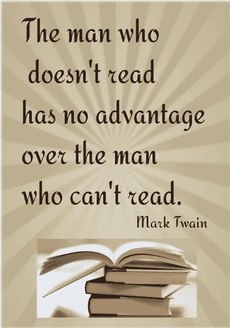

给讨厌书的人的一句话！

**简介**

在俄克拉荷马州塔尔萨附近的一个小镇上，作为一个受欢迎的咖啡店老板，约翰一直想寻找扩大业务的方法。上周，他去加州度假，看望他的表妹珍妮弗。当他们在约塞米蒂国家公园徒步旅行时，她有了这个好主意。“约翰，我知道这听起来可能有点跑题，但在我忘记之前，你认为你在俄克拉荷马州的咖啡店需要一个阅读区，让人们可以放松并享受安静的时间，一边享受咖啡一边阅读伟大的书籍？”，她说。"这不是愚蠢的妹妹，事实上，这是一个伟大的想法，我正在考虑这个假期后，与我的朋友回家探索"，约翰回答说。

所以，约翰开始考虑他的扩展咖啡店的计划。除了许多其他的财务和物流问题，还有一个主要的问题潜伏在他的脑海里，“在我的咖啡店里，我实际上提供给我的顾客什么书？”

他向他的朋友 Kyler 提出了这个问题，Kyler 是一名充满激情的软件开发人员，希望进入数据科学领域。Kyler 想，这是他解决数据挖掘问题的一个机会，阿罗哈！他在 Kaggle 网站上找到了一个名为 Goodreads-books 的数据集。然后，他决定进一步探索，以获得更多关于如今人们喜欢读的作家的见解。他意识到这个数据集对阅读领域也非常有用，因为 Goodreads 网站有很多孩子们喜欢读的书。对于父母来说，在他们的孩子享受夜宵和阅读的时候，顺便去咖啡店呆一段时间可能是一个不错的计划。如果他们在约翰的咖啡店买这些书，会进一步促进他的生意。

介绍到此为止。让我们回到正题，在约翰可以花他辛苦赚来的钱在他的咖啡店为他的顾客提供书籍之前，Kyler 和 John 用 Goodreads-books 数据集编制了一个他们想要回答的 5 个关键问题的列表。

> *“哪个作家写的书最多？”*
> 
> *“谁是评价最高的 10 位作者和评价最低的 5 位作者？”*
> 
> *“文字评论多的书，评分高吗？”*
> 
> 《哈利·波特》系列的收视率有趋势吗？”
> 
> *“书籍如何跨语言分布* ***？***

好吧，让我们看看如何最好的凯勒可以探索这个数据集，以帮助他最好的朋友约翰。

**了解数据集**

Kyler 知道，如果是任何与数据科学相关的话题，他都可以与我交谈。因此，他毫不犹豫地打电话给我，解释了他必须快速解决的关键业务需求，以帮助他最好的朋友。我想帮助 Kyler，并告诉他在回答关键问题之前，他需要获得更多关于数据本身的见解。

**Goodreads-books GitHub 回购的诞生**

我决定先自己探索这个 Kaggle 数据集，并与 Kyler 分享，这样我们就可以一起完成这个项目。起初，我想直接探索业务相关的查询，但意识到，“来吧，这是一个现实世界的问题，而不是一个课堂项目”。所以，我想出了三个步骤，并把每个步骤都记录在自己的 Python Jupyter 笔记本中。所有这些笔记本和对这些步骤的详细分析都可以在这里找到【https://github.com/kart-projects/Goodreads-books。

**第一步:数据探索**

在这一步中，Kyler 和我决定进一步探索数据，以获得关于我们想要用于数据分析的各种特性的更多见解。

加载数据集后，我们决定回答以下关于数据的查询。

1.  *Goodreads-books 数据集是什么形状？数据有 13714 行和 10 列*
2.  *检查数据集中的无效值* —数据中没有无效条目。已经干净了。
3.  *知道变量的数据类型*

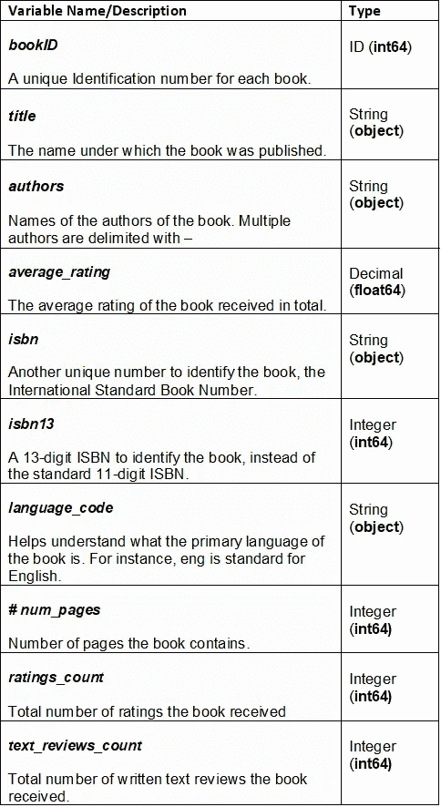

**1:Goodreads-books 数据集中的变量**

4.*描述数据*

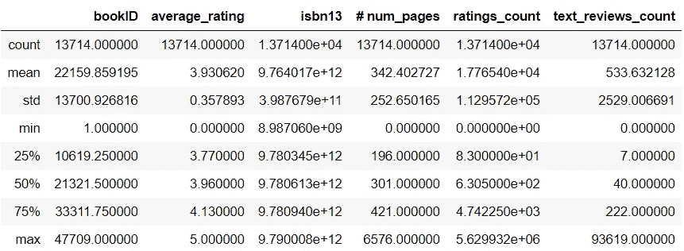

**2:Goodreads-books 数据集中连续变量的分解**

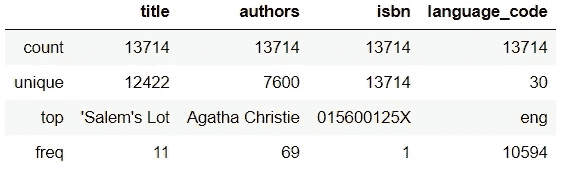

**3:Goodreads-books 数据集中分类变量的计数和频率**

5.制作直方图和箱线图，寻找异常值

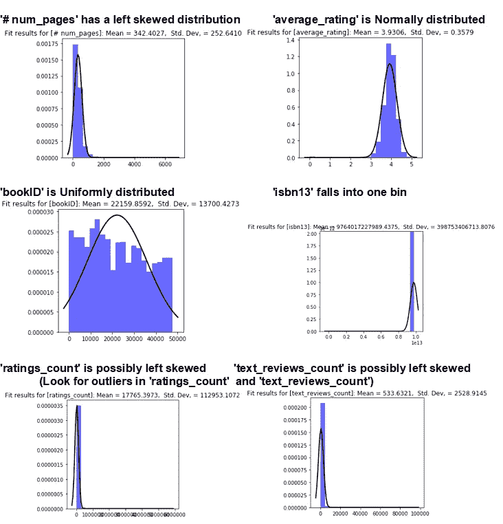

**4:Goodreads-books 数据集中连续变量的分布**

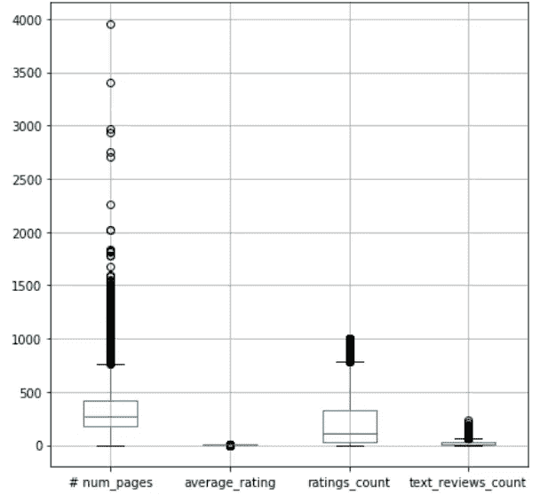

**5:Goodreads-books 数据集中的变量归一化后的连续变量的箱线图。它清楚地显示了异常值。**

**第二步:数据分析**

为了进一步分析该数据集，我们决定创建一个线性回归模型，并使用该模型预测新书的平均评分。

数据集在少数变量中有异常值。所以，我们决定将这个数据集分成两类。

1.  高评分书籍—包含评分计数≥100000 的书籍的样本
2.  其他书籍—包含带有< 100000 rating counts

Also, there were very few books written in many languages. So we first sampled out the books written in 4 major language codes i.e. ‘eng’,’en-US’, ‘spa’, ‘fre’. The Pie chart below shows the distribution of language codes across the Top 7 languages.

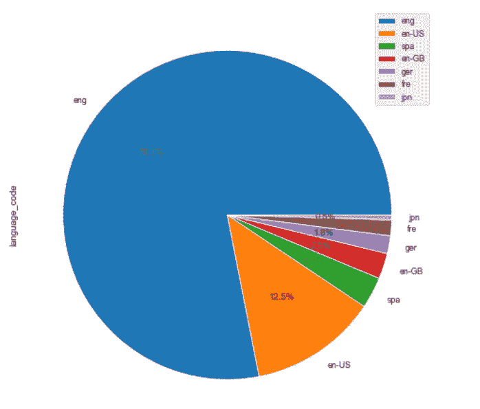

**6 的书籍的示例:Goodreads-books 数据集中前 7 种语言的饼图**

最后，我们建立了两个模型，一个用于高评价的书，另一个用于其他评价不是很高的书。模型表现相当好，MSE 分别为 0.05 和 0.125。

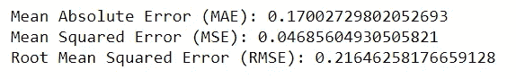

**7:用 Goodreads-books 数据集中的高评分书籍(≥ 100000 评分计数)构建的第一个模型的模型质量**

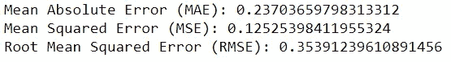

**8:Goodreads 图书数据集**中与其他图书一起构建的第二个模型的模型质量(< 100000 评级计数)

**第三步:解决业务相关查询**

完成数据分析后，我们最终决定回答与业务相关的问题。这是我们的发现。

> **“哪些作者写的书最多？”**

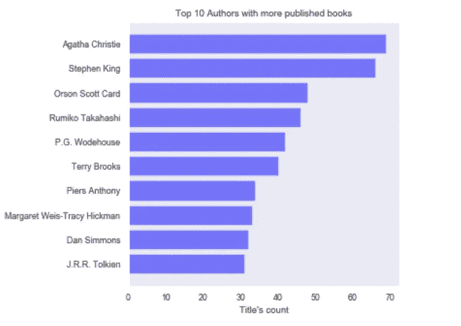

**9:Goodreads 图书数据集中出版图书最多的前 10 位作者**

> "排名前 10 的高评价作者和排名后 5 的低评价作者是谁？"

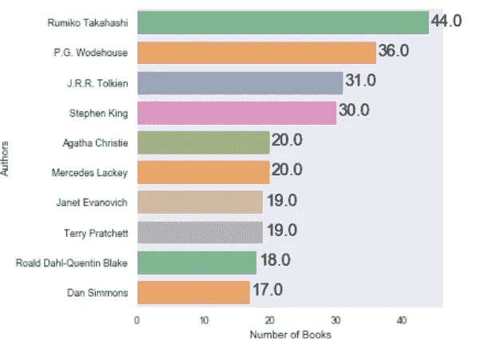

**10:获得评分的书籍数量≥ 4 的前 10 名作者**

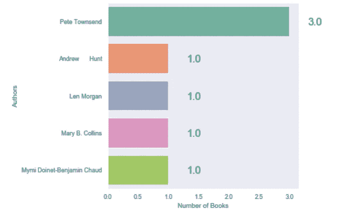

**11:图书接受评分数≤ 2 的后 5 名作者**

> "有更多文字评论的书会得到更高的评价吗？"

为了探究有更多文字评论的书籍是否会获得更高的评分，我们首先想在数据集中寻找任何相关的变量或模式

1.  评分计数和文本评论计数与相关系数 O.86 高度相关
2.  我们更想探究评级计数和文本评论计数是否对平均评级有影响

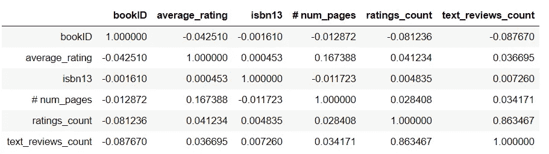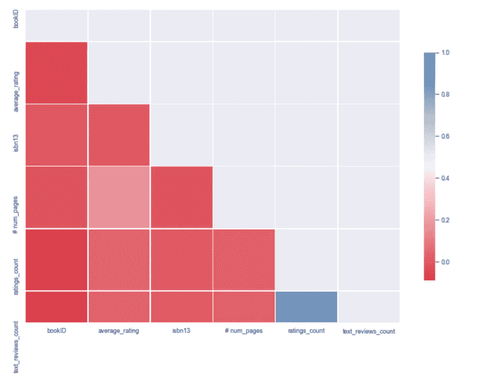

**12: ratings_count 和 text_reviews_count 高度相关，相关系数为 0.86**

***文字评论多的书是否获得了更高的评分？***

是的，下图清楚地显示了平均评分和文本评论数之间的模式。**文字评论多的书(>10000)获得了更好的评分(> 3.25)。**

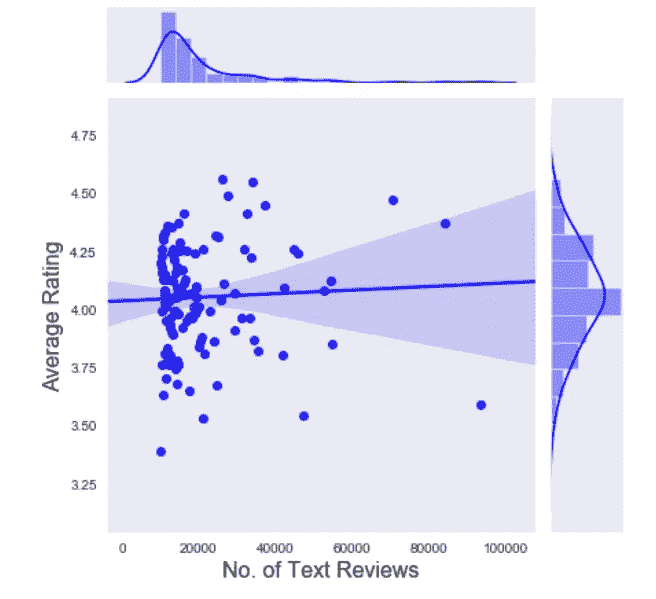

平均评分和文本评论计数有一个模式。文字评论多(>10000)的书获得了更好的评分(> 3.25)。

评级最高的书，或者说评级次数多的书，平均评级更高吗？

是的，下图清楚地显示了平均评分和评分计数之间的模式。具有更高评分计数(> 1，000，000)的书籍获得了更好的平均评分> 3.5。

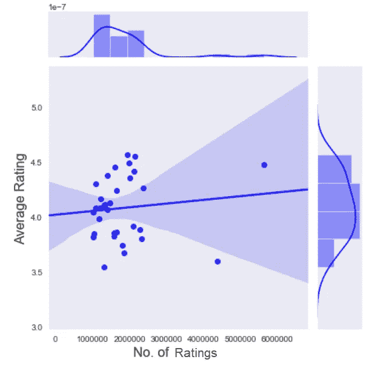

平均评分和评分计数有一个模式。具有更高评分计数(> 1，000，000)的书籍获得了更好的平均评分> 3.5。

> "哈利·波特系列的收视率有趋势吗？"

没有真正的上升或下降趋势，数据集中六本哈利波特的评分都在 4.4 以上，并停留在这个数字左右。

看起来所有的书都同样受到读者的喜爱。向 J.K .罗琳-玛丽·格兰普蕾致敬。

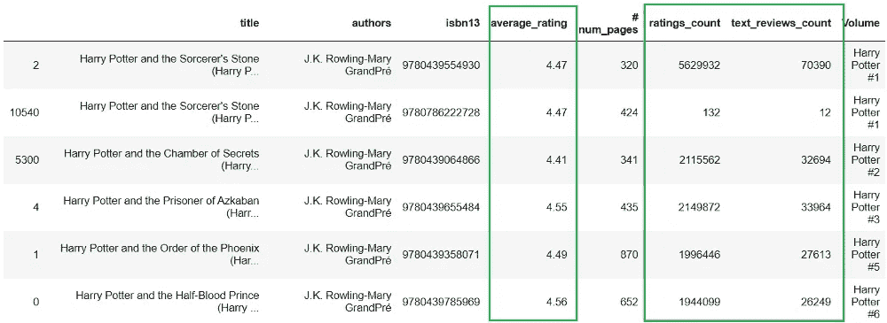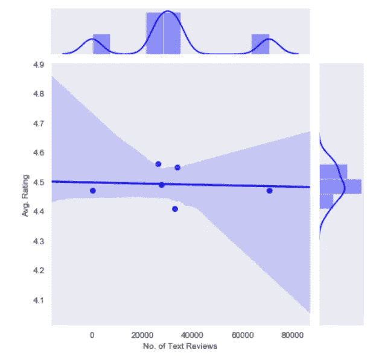

没有真正的上升或下降趋势，数据集中六部哈利波特的评分都在 4.4 以上，并停留在这个数字左右。

> "不同语言的书籍是如何分布的？"

在我们的数据分析步骤中，我们已经使用上面图 6 中的饼图回答了这个问题。总的来说，数据集中的英文书籍比其他的多。

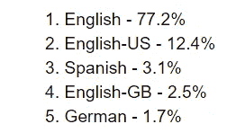

**16:Goodreads-books 数据集中可用书籍的前 5 种语言代码**

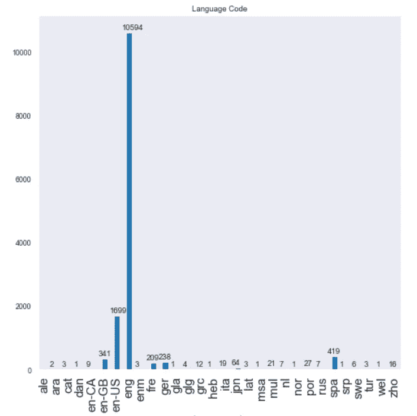

**17:Goodreads-books 数据集中所有书籍的语言分布**

**结论**

经过一天的工作，我和凯勒决定向约翰展示我们的发现。基于我们的分析，我们可以明确地向约翰推荐一份图书和作者的名单。希望我们的发现将有助于回答约翰的重要商业问题。我们还将与约翰分享我们的 GitHub 回购、[https://github.com/kart-projects/Goodreads-books](https://github.com/kart-projects/Goodreads-books)用于记录。很可能，他会带着更多的问题回来，使用相同或其他数据集进行探索。

一旦约翰的店扩大了，我打算更频繁地去他的店。也许一杯大杯拿铁咖啡、一个爱尔兰奶油咖啡蛋糕和约翰咖啡馆的《哈利·波特与混血王子》会成为我的一杯咖啡😉。

> 在约翰咖啡馆，你想喝什么样的咖啡，选什么样的书？