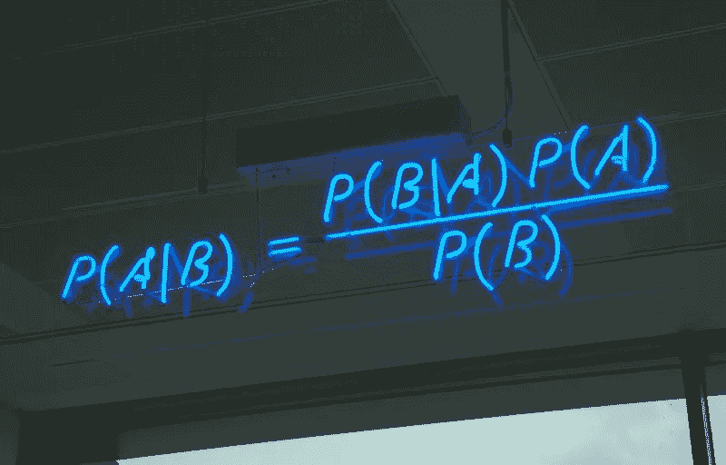
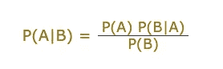
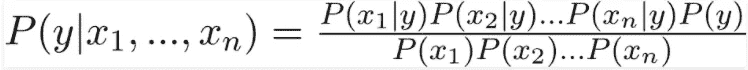
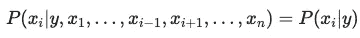
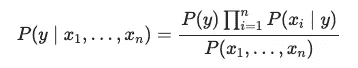
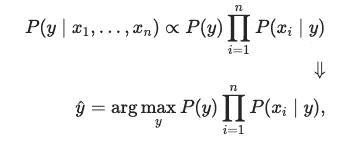
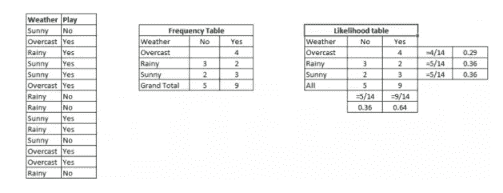
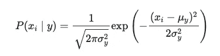
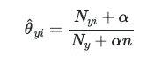
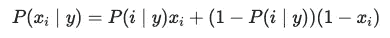

# 你真的了解朴素贝叶斯吗？

> 原文：<https://medium.com/analytics-vidhya/do-you-really-know-naive-bayes-6d5e07460aaf?source=collection_archive---------24----------------------->



来源: [KDnuggets](https://www.kdnuggets.com/2020/06/naive-bayes-algorithm-everything.html)

*我们下一个机器学习算法是朴素贝叶斯分类器。像我其他关于机器学习算法的文章一样，跟大家一起学习。*

# 这个贝叶斯定理是什么？

> 在概率论和统计中，以托马斯·贝叶斯牧师的名字命名的贝叶斯定理(或者是贝叶斯定律或贝叶斯法则)描述了一个事件发生的概率，它基于与该事件相关的条件的先验知识。

可能看起来很复杂，但事实上，很容易理解。我知道，听起来很垃圾，等我解释。有时候，来自其他网站的定义，比如上面这个来自维基百科的，可能很难消化。当你有一个例子来引用这个话题时，它会变得非常简单。这是我这篇文章的目标。让我们开始吧！

**想象一下，你有一些概率，你想用这些概率找到另一个概率的存在。那就是*贝叶斯定理*是什么。**

让我们继续研究这个公式:



来源:[马蒂斯芬](https://www.mathsisfun.com/data/bayes-theorem.html)

**P(A | B)**→A 与 B 的存在多久发生一次？

**P(B | A)**→B 与 A 的存在多久发生一次？

**P(A)**→A 多久发生一次？

**P(B)**→B 多久发生一次？

继续一个很好的例子:

**P(火|烟)** →有烟有火的频率？

**P(烟|火)** →有烟有火的存在多久？

**P(火)** →多久发生一次火灾？

**P(冒烟)** →多久冒烟一次？

我想我们差不多涵盖了这一部分。就像我之前说的，这真的很简单。现在是朴素贝叶斯算法的时候了！

## 朴素贝叶斯算法？

> 朴素贝叶斯方法是一组基于应用贝叶斯定理的监督学习算法，其“朴素”假设是在给定类变量的值的情况下，每对要素之间的条件独立性。

这个定义来自 Sklearn 的文档。这是一个伟大的解释，但让我们最后一次尝试。

朴素贝叶斯算法是最简单也是最有效的算法之一。这是一种根据贝叶斯定理工作的算法。它也是准确可靠的，这是我们对模型的全部要求。每个分类类别的值相互独立。

虽然它是一种可以用于许多不同目的的算法，但是它在 NLP 中表现得特别好。

> 朴素贝叶斯做出的假设在现实世界中通常是不正确的。

上面我给的公式是一个只能用一个特征 x 计算的公式，如果我们有多个 x 特征呢？让我们检查一下新公式。



没什么变化。

使用简单的条件独立性假设:



来源: [Sklearn](https://scikit-learn.org/stable/modules/naive_bayes.html)

对于所有的 *i* ，这种关系简化为:



由于 P( *x1，…，xn* )对于给定的输入是常数，我们可以使用以下分类规则:



这么多数学！我知道。确切的说，我不知道或者不完全理解上面所有的方程，除了贝叶斯定理。希望不会造成大问题。手指交叉，让我们继续！

*朴素贝叶斯分类器的优点之一是，与数值变量相比，它可以在较少的训练数据和分类变量的情况下表现良好。*

所以，也许我们应该看看实际情况。这个例子取自 [**这个环节**](https://www.analyticsvidhya.com/blog/2017/09/naive-bayes-explained/) 。



我们有一些关于“天气”和“游戏”功能的信息。表格根据天气告诉我们游戏是否进行。就像你在上面看到的，首先我们需要把这个表转换成一个频率表。现在，我们可以看清楚什么时候是什么了。我们可以用贝叶斯定理方程。

问题将会是:P(是|Sunny)？那是什么意思？试着理解一下。(提示:上面我刚给了你答案！)

## 如果天气晴朗，玩家会玩吗？

我很确定，你找到了答案！干得好！

现在，是时候把它变成一个贝叶斯定理方程了。

***P(是|晴)= P(晴|是)* P(是)/ P(晴)***

***P(Sunny|Yes)*** 的答案是 3/9 = 0.33。从可能性表中，你可以看到天气晴朗时从 9 个游戏玩到了 3 个游戏。

***P(是)*** 的答案是 9/14 = 0.64。9 是播放次数，14 是播放与否的总播放次数。

***P(晴)*** 的答案是 5/14 = 0.36。5 是天气晴朗时的播放次数，14 是天气好坏时的总播放次数。

我们得到了我们需要的一切。

***P(是|晴)*** = 0.33 * 0.64 / 0.36 = 0.60 哪个概率大。

是的，我们做到了。

> 这通常用于文本分类，如果你有多个类。

## 高斯朴素贝叶斯

> `[**GaussianNB**](https://scikit-learn.org/stable/modules/generated/sklearn.naive_bayes.GaussianNB.html#sklearn.naive_bayes.GaussianNB)`实现高斯朴素贝叶斯算法进行分类。假设特征的似然性是高斯的:



来源: [Sklearn](https://scikit-learn.org/stable/modules/naive_bayes.html)

```
**from** **sklearn.datasets** **import** load_iris
**from** **sklearn.model_selection** **import** train_test_split
**from** **sklearn.naive_bayes** **import** GaussianNB
X, y = load_iris(return_X_y=**True**)
X_train, X_test, y_train, y_test = train_test_split(X, y, test_size=0.5, random_state=0)
gnb = GaussianNB()
y_pred = gnb.fit(X_train, y_train).predict(X_test)
```

## 多项式朴素贝叶斯

> `[**MultinomialNB**](https://scikit-learn.org/stable/modules/generated/sklearn.naive_bayes.MultinomialNB.html#sklearn.naive_bayes.MultinomialNB)`为多项式分布数据实现朴素贝叶斯算法，是文本分类中使用的两种经典朴素贝叶斯算法之一(其中数据通常表示为词向量计数，尽管 tf-idf 向量在实践中也很有效)。该分布由每个类别 y 的向量θy=(θy1，…，θyn)来参数化，其中 n 是特征的数量(在文本分类中，词汇表的大小),θyi 是特征 I 出现在属于类别 y 的样本中的概率 P(xi∣y



来源: [Sklearn](https://scikit-learn.org/stable/modules/naive_bayes.html)

```
**import** **numpy** **as** **np**
rng = np.random.RandomState(1)
X = rng.randint(5, size=(6, 100))
y = np.array([1, 2, 3, 4, 5, 6])
**from** **sklearn.naive_bayes** **import** MultinomialNB
clf = MultinomialNB()
clf.fit(X, y)
```

## 伯努利朴素贝叶斯

> `[**BernoulliNB**](https://scikit-learn.org/stable/modules/generated/sklearn.naive_bayes.BernoulliNB.html#sklearn.naive_bayes.BernoulliNB)`为根据多元伯努利分布分布的数据实现朴素贝叶斯训练和分类算法；即，可能有多个特征，但每个特征都被假设为二进制值(伯努利、布尔)变量。因此，该类要求将样本表示为二进制值特征向量；如果传递任何其他类型的数据，`BernoulliNB`实例可能会将其输入二进制化(取决于`binarize`参数)。



来源: [Sklearn](https://scikit-learn.org/stable/modules/naive_bayes.html)

```
**import** **numpy** **as** **np**
rng = np.random.RandomState(1)
X = rng.randint(5, size=(6, 100))
Y = np.array([1, 2, 3, 4, 4, 5])
**from** **sklearn.naive_bayes** **import** BernoulliNB
clf = BernoulliNB()
clf.fit(X, Y)
```

*我从 Sklearn 上获取了定义和代码样本，因为我认为它们是解释性的。我找不到更好的词来形容他们。*

这就是我给你的全部。我希望对你理解朴素贝叶斯的基础知识有所帮助。你要做的就是练习，练习，再练习。

下一篇文章再见！快乐学习！

## 参考文献

[](https://en.wikipedia.org/wiki/Bayes%27_theorem) [## 贝叶斯定理

### 在概率论和数理统计中，以牧师命名的贝叶斯定理(或称贝叶斯定律或贝叶斯法则)

en.wikipedia.org](https://en.wikipedia.org/wiki/Bayes%27_theorem) [](https://www.kdnuggets.com/2020/06/naive-bayes-algorithm-everything.html) [## 朴素贝叶斯算法:你需要知道的一切

### 朴素贝叶斯是一种基于贝叶斯定理的概率机器学习算法，广泛用于各种…

www.kdnuggets.com](https://www.kdnuggets.com/2020/06/naive-bayes-algorithm-everything.html) 

[https://www . geeks forgeeks . org/Naive-Bayes-classifiers/#:~:text = Naive % 20 Bayes % 20 classifiers % 20 are % 20a，is % 20 independent % 20 of % 20 each % 20 other](https://www.geeksforgeeks.org/naive-bayes-classifiers/#:~:text=Naive%20Bayes%20classifiers%20are%20a,is%20independent%20of%20each%20other)。

[](https://scikit-learn.org/stable/modules/naive_bayes.html) [## 1.9.朴素贝叶斯-sci kit-学习 0.23.2 文档

### 朴素贝叶斯方法是一组监督学习算法，基于应用贝叶斯定理和“朴素”学习理论

scikit-learn.org](https://scikit-learn.org/stable/modules/naive_bayes.html) [](https://www.mathsisfun.com/data/bayes-theorem.html) [## 贝叶斯定理

### 想知道计算机是如何了解人的吗？在网上搜索“电影自动鞋带”会出现“回到…

www.mathsisfun.com](https://www.mathsisfun.com/data/bayes-theorem.html) [](https://www.analyticsvidhya.com/blog/2017/09/naive-bayes-explained/) [## 用 Python 和 R 语言学习朴素贝叶斯算法的 6 个简单步骤

### 注意:本文最初发布于 2015 年 9 月 13 日，更新于 2017 年 9 月 11 日概述了解其中一个…

www.analyticsvidhya.com](https://www.analyticsvidhya.com/blog/2017/09/naive-bayes-explained/)