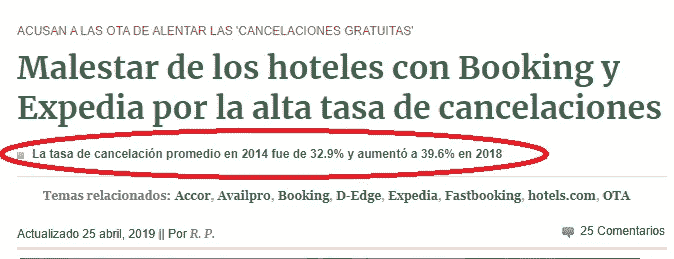
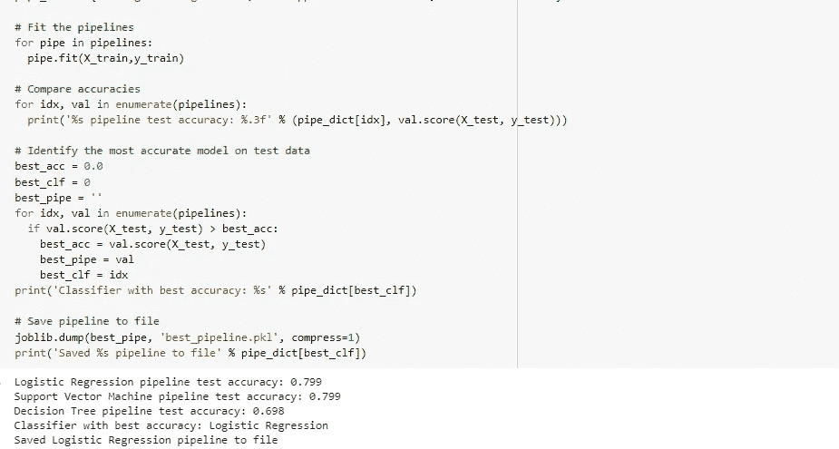

# 你的病人/客户会错过他们的预约吗？？有了人工智能，就是检测、预防、预测！

> 原文：<https://medium.com/analytics-vidhya/do-your-patients-clients-miss-their-shifts-cb989f40444d?source=collection_archive---------22----------------------->

我最近读了一篇文章，文章显示了错过预定医疗班次并感到震惊的人的比例。(我必须承认有几次我这样做了… …嗯，那很好……很多次我都这样做了)。
一项研究显示，在阿根廷，2019 年阿根廷布宜诺斯艾利斯省意大利医院医疗预约的缺勤率在 23%至 34%之间不等。这不仅对诊所，而且对那些使用轮班或预约系统的人，如美容院、运动场出租、酒店等，都是一笔巨大的资金损失。

210/5000

我们能预防它吗？是的，先生！是本文的目的。我将展示一个数据库，你可以预测这个问题，并相应地采取行动，以停止浪费时间，尤其是…银！！

我首先对错过医疗预约的患者数据库进行了探索性分析(EDA)。我进行的分析有图表，以便更容易发现被观察人的共同模式和特征。最后，我会应用一些人工智能算法来预测一个病人同意与否的可能性。让我们开始吧！！
该数据库有 110，527 人的医疗预约，它包含 14 个变量或每个人的特征(例如性别、年龄、学校教育等。).最后一个变量是名为“No-show”的结果，它表示患者是否赴约。我们来分析一下数据库的内容。

接下来，我使用 Tableau 工具对其进行图形化分析。让我们从变量“年龄”开始，看看这个特征是否影响了失踪的病人。

在第一幅和第三幅图像中，我们注意到，60 岁以下的患者人数最多，然后开始下降。也很少看到 0 年有大量的病人，所以我们假设它指的是婴儿的轮班。
值得注意的是，出席(蓝色)的患者百分比大于缺席(橙色)的患者百分比，然而，在两者之间的第一个图像中有类似的分布，因为当一个增加时，另一个也随之增加。总之，我没有注意到年龄是缺席的决定性因素。让我们看看以下“残疾”特征:

我们发现了 5 级残疾(从 0 到 4)。如上图所示，0 级(无残疾)患者占绝大多数。如果我们根据患者的缺勤水平将残疾划分为总百分比，我们会发现，随着患者残疾水平的增加，他们的缺勤率也会增加。听起来很合理。让我们看一个例子，1 级残疾的缺勤率为 17.84%，而 4 级残疾的缺勤率为 33%。

让我们一起来看 4 个变量(这样我就不会让你厌烦了):糖尿病、酒精中毒、高血压和受教育程度-
每个变量的上图显示，最多的患者接受过教育，不是酗酒者，没有糖尿病，也没有高血压。然而，没有糖尿病的患者比糖尿病患者错过的可能性高 2.36%，同样是失学(比其他人高出近 3%)和没有高血压的人(比高血压高出 3.6%)。现在让我们继续讨论 place 变量，看看它是否能告诉我们一些东西:

有些地方在给定的轮次数量和相对出勤率方面存在很大差异。我们有些城市有 15%的缺勤率，而有些城市有 29%(几乎是两倍！！)，显然，这是我们的目标变量的一个重要因素。让我们分析一下打电话安排约会的日期以及当天的情况

在这四个图表中，重要的结论是:
图 1:你的医疗预约天数是均匀分布的
图 2:预约是在四月到六月期间均匀进行的
图 3:我将一周分为几天，看看这个因素是否会影响结果，我注意到周二和周三有更多的班次，周五的人会少一些。

开发一个列，提供分配班次的时间和预约日期之间的天数差。
我们警告说，在第 0 天(下图)，他有 36，000 个预约，这显示了在那一天打电话和预约的医疗预约的数量，以及他们确实参加了！！！。橙色图表(关于缺勤的人)显示了前 30 天缺勤的最大分布水平。添加盒状图和须状图以查看它们的分布和四分位数(如果你不知道这个工具，我建议你在数据分析中学习它)让我们继续分析这个变量。

我们注意到，第一天提供的班次最多(图 1)，但是缺勤率最低。第 0 天是给出更多班次的时候，也是他们缺班最少的时候。如果我们计算平均值，它告诉我们，缺席的人的平均天数是 15.8 天，而参加的人只有 8.7 天。总之，轮班时间越紧，缺勤的可能性就越小。
为了总结这个假设，我把你的日子分成了 4 个四分位数(之前在方框图和须状图中画出的),以便更容易理解这个假设。在最后一张图中，他表示，实际上在前 27 天，缺勤率较低。然而，最后一天(84-162)的那一组是缺勤率最低的一组(24.86%)，其次是最后一组(30.07%)。为什么会这样？？？让我们分析我们的最后一个变量“发送短信”,看看它是否能告诉我们一些东西:

在这里，我们研究发送给记得他们的约会的病人的 sms 变量。蓝色部分是收到信息的部分，绿色部分是没有收到信息的部分。同时，我们将这些人分为 4 组，以及他们是否参加了约会(“是”、“否”)。最后一个单元格是总数，我们警告说，总数中有 32%的人只发送了短信，最后一组人收到短信的比例最高。在这里，我们找到了之前对图表的解释，因为远程组在他们的医疗预约中有更好的出席水平，他们只是被发送了更多的消息来参加他们的预约。现在如果要建模！

我不会描述数据工程的细节，因为它的大部分是从 Tableau 完成的，并以 csv 格式导出，以在 Jupyter 中完成其工程。我不想让你厌烦，因为大多数阅读这些文章的人都与数据科学无关(如果有人需要这些信息，他们可以私下问我)。现在我介绍这个模型及其结果。

通过不同的算法，我们获得了几乎 80%的精度来检测未来没有赴约的患者(值得澄清的是，这是一个不平衡的数据库)。
结论:
影响患者在场或缺席的特征是:残疾程度、学校教育、高血压、糖尿病、地点、一周中的哪一天、轮班是否结束以及最后，发送 SMS 是至关重要的。！
受这个问题困扰的专业人士可以使用更好的策略来提高轮班的出勤率，比如发送更多的短信或在更接近约会的时间轮班。您还可以预测(由于该算法)将参加或不参加预约的患者/客户的数量，并相应地采取行动，以便可以根据预测的缺勤水平来预防和分配当天的必要班次。
在本文中，优先呈现“探索性数据分析”阶段，这是机器学习项目的第一阶段之一。以一种空的或有限的方式，我展示了其他步骤，如数据工程、模型选择、参数、验证等。我认为，如果他们想攻击我让他们在隔离区看到这么多的数字和图表，如果我开始开发，例如，所选算法的结构，他们就会谋杀我！！
在我看来，本土企业家应该更清楚人工智能能给他们带来的好处。不做进一步的探讨，这就是我的目标，这篇文章是一个清晰的例子，说明了如何将它应用于这类企业的所有者或管理者的一个简单问题(同时也是非常重要的问题),成功终结了只有跨国公司才能应用人工智能的神话。
我想澄清的是，该分析仅在该诊所和特定国家有效。

 [## 葡萄牙银行营销数据集的 Bussines Analitycs 和 Logistic 回归

### 这是我在 Medium 上的第一篇文章,我希望它能为社区服务。

Medium.com](/@mauridurcak/bussines-analitycs-y-regresión-logística-para-dataset-de-marketing-de-banco-de-portugal-65380f4de28f)  [## Mauricio Durcak — 阿根廷 | Professional Profile | LinkedIn

### View Mauricio Durcak’s profile on LinkedIn, the world’s greatest professional community. 查看 Mauricio Durcak’s profile on LinkedIn, the world’s greatest professional community.毛里求斯有 5 jobs listed on...

www.linkedin.com](https://www.linkedin.com/in/mauricio-durcak-9b35b251/)