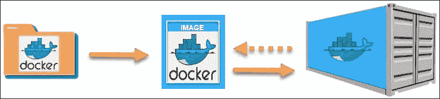
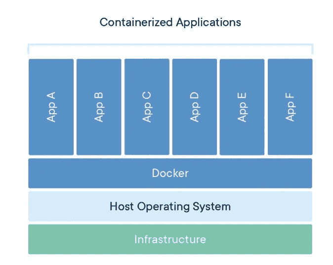
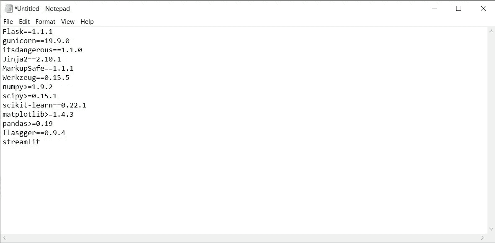
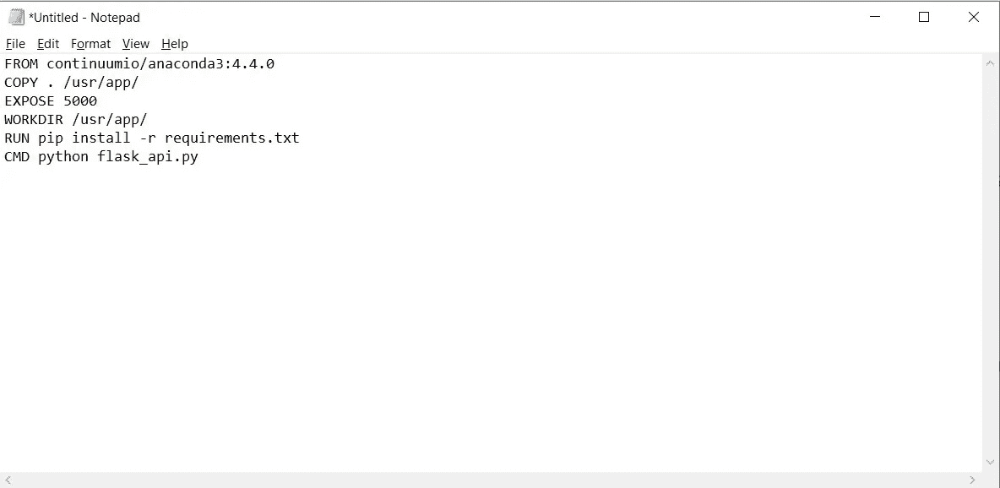
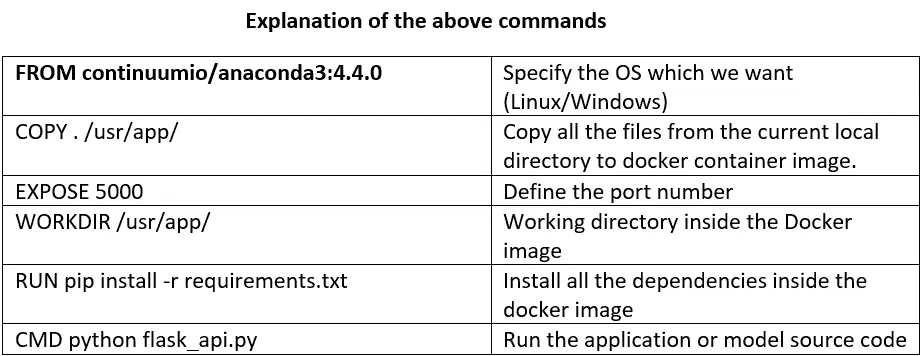
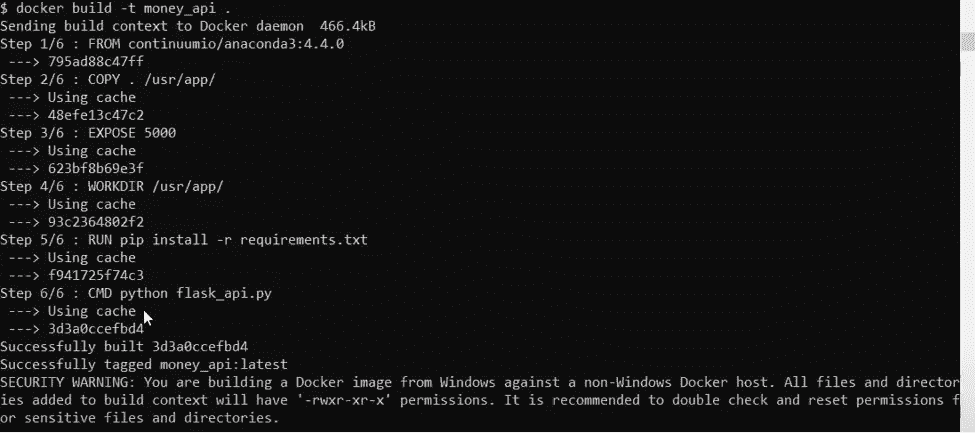

# DOCKER:在微软 Azure 上部署深度学习管道的 3 个简单步骤

> 原文：<https://medium.com/analytics-vidhya/docker-3-easy-steps-for-deploying-a-deep-learning-pipeline-on-azure-8a5d42e29684?source=collection_archive---------25----------------------->

## Docker 让与世界分享你的作品变得容易

# 介绍

> **Docker 是什么？**
> 它是一个工具，旨在通过使用容器来简化应用程序的创建、部署和运行。在某种程度上，Docker 有点像虚拟机
> 
> **Docker 文件:**它是一个指令脚本，定义了如何构建一个特定的 Docker 映像。
> 
> **Docker image:** 存储在一个容器中的最终映像，我们通过它将整个应用程序/模型共享给另一台机器，包括所有的依赖项。
> 
> **容器:**容器允许开发人员将应用程序与它需要的所有部分打包在一起，比如库和其他依赖项，并将它作为一个包进行部署。

# 先决条件/要求

*   Windows 上下载 Docker:[https://hub . Docker . com/editions/community/Docker-ce-desktop-Windows/](https://hub.docker.com/editions/community/docker-ce-desktop-windows/)
*   启用嵌套虚拟化
*   本地计算机上 5 Gb 的可用空间
*   PowerShell 5.0+版
*   注意:安装 Docker 时，一定要启用 Windows 容器配置。

# 创建 Docker 映像并在 Azure 中部署它的步骤

## 第一步:写文档

*   注意:创建一个文件夹，并将与此过程相关的所有文件存储在该文件夹中。
*   创建一个 requirement.txt 文件，其中包含库的所有依赖项。

*   创建一个 Dockerfile 并将其保存为“Dockerfile”

## 步骤 2:构建容器映像

*   **运行命令:** docker build -t model.api

*   **查看当前码头工人:**码头工人 ps
*   **运行 docker:**docker run-p 8000:80 model _ API
*   **检查运行中的集装箱:**码头集装箱
*   现在，在浏览器中导航到 [http://localhost:8080](http://localhost:8080) 以确认容器正在运行。

## 步骤 3:在 Azure 中注册一个容器

*   **Azure CLI:** 您必须在本地计算机上安装 Azure CLI 版本 2.0.29 或更高版本。运行 az — version 来查找版本。链接— [安装 Azure CLI](https://docs.microsoft.com/en-us/cli/azure/install-azure-cli)
*   在 Azure 内部创建容器的所有相关命令都在这个链接中提到—[https://docs . Microsoft . com/en-us/Azure/container-instances/container-instances-tutorial-prepare-ACR](https://docs.microsoft.com/en-us/azure/container-instances/container-instances-tutorial-prepare-acr)
*   部署应用程序/模型的命令—[https://docs . Microsoft . com/en-us/azure/container-instances/container-instances-tutorial-deploy-app](https://docs.microsoft.com/en-us/azure/container-instances/container-instances-tutorial-deploy-app)