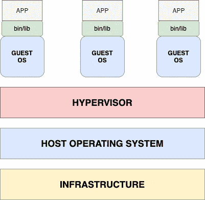
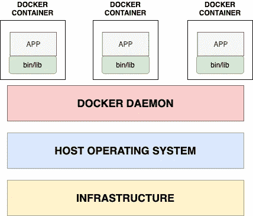

# Docker 初学者第 1 部分

> 原文：<https://medium.com/analytics-vidhya/docker-beginner-part-1-94a74adf1881?source=collection_archive---------26----------------------->

Docker 由美国公司 DotCloud 创建。为了理解什么是 docker？首先，我们需要了解 VM，即虚拟机。Docker 经常被拿来和虚拟机做比较。可能对你们中的一些人来说，这两者听起来几乎相似，但它们之间有很多差异，并且它们都是为不同的用例开发的。首先，我们将了解什么是虚拟机及其用途。

# **虚拟机**

虚拟机是一个拥有自己的 CPU、内存、网络接口和存储的虚拟计算机系统。它们基于计算机体系结构，提供类似于物理计算机的功能。虚拟机由四个主要组件组成，它们是:

*   基础设施
*   主机操作系统
*   管理程序
*   来宾操作系统

虚拟机架构

基础设施是计算机系统的底层物理硬件。主机操作系统可以是任何操作系统，如 windows、linux 或 mac。谈到虚拟机管理程序，有两种类型的虚拟机管理程序，类型 1 和类型 2。

第 1 类虚拟机管理程序与基础架构有直接联系，即底层物理硬件。例如:- Hyperkit(适用于 osx)和 HyperV(适用于 windos)。第 2 类虚拟机管理程序作为应用程序在操作系统上运行。它们与基础设施没有直接联系。示例:-虚拟框和窗口。

在虚拟机管理程序之上，我们有来宾操作系统，我们可以运行多个来宾操作系统。但是每个客户操作系统都需要自己的内存和 cpu 来运行。我们运行不同的客户操作系统，如 ubuntu、centos、windows 等。每个来宾操作系统都与二进制文件、库和应用程序捆绑在一起，相互隔离。虚拟机可用于在您的系统上运行不同或多个操作系统，并与它们一起玩。因此，我们已经讨论了一些关于虚拟机的事情，让我们回到 Docker，看看它与虚拟机有什么不同，为什么它如此有用。

# 码头工人

与虚拟机类似，docker 也有四个重要组件。他们是

*   基础设施
*   主机操作系统
*   Docker 守护进程
*   码头集装箱

基础架构和主机操作系统组件与虚拟机相同。Docker 守护进程是在主机操作系统的后台运行的服务，它管理运行的一切并与 docker 容器交互。Docker 容器是一个包，它包含了你的应用程序所需要的所有部分，比如库和其他依赖项，并把它们作为一个包发布。

**区别**:-Docker 容器共享底层主机操作系统，你不必为每个容器启动客户操作系统，因此节省了大量的 cpu、内存和时间。

*   Docker 隔离应用程序
*   虚拟机隔离系统

> 虚拟机用例:-如果你是一家虚拟主机公司，你想为你的每个客户隔离服务器系统。在这种情况下，您应该选择虚拟机，因为您希望为每个客户隔离整个系统。
> 
> Docker 用例:-如果您托管一个 web 应用程序，它是多个小型服务(即微服务)的组合。然后，您应该使用 docker，将这些服务放在单独的容器中

我只给出了这两个用例的一瞥，它们也用于多个其他用例。

# **简单来说:-**

我试着用简单的术语总结一下。把虚拟机想象成一个单独的房子，把 docker 想象成一个公寓。每栋房子都有自己的水、电连接等。但是公寓在同一栋楼里有多个街区，共用水电等设施。我希望现在你对此有了更好的了解。

就这样，你的博客结束了。在接下来的博客中，我将尝试更详细地解释 docker 及其技术概念和架构。

在那之前请继续关注！！！

> 如果你喜欢这个博客，给一些掌声和爱。

顺便说一下，如果你有任何疑问或澄清，请在评论中告诉我，我会尽快回复。

作者:穆尼克