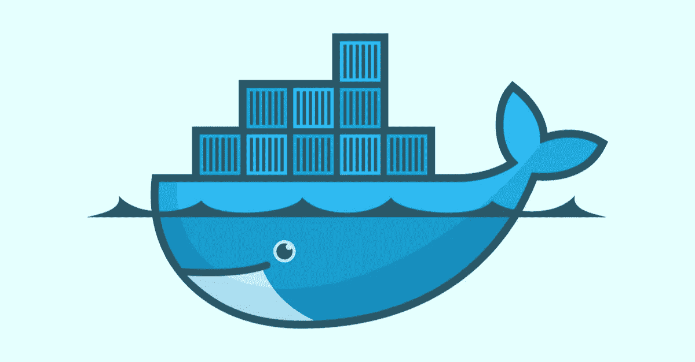

# Docker 命令

> 原文：<https://medium.com/analytics-vidhya/docker-commands-3fc5bbbc5b1?source=collection_archive---------34----------------------->

## Docker 是什么？

Docker 是一组平台即服务产品，使用操作系统级虚拟化来交付称为容器的软件包中的软件。容器是相互隔离的，捆绑了它们自己的软件、库和配置文件；他们可以通过明确定义的渠道相互交流。

## 码头集装箱

docker 容器允许开发人员将应用程序与它需要的所有部分打包在一起，比如库和其他依赖项，并将其作为一个包进行部署。

## Docker 图像

docker 映像是一个只读模板，包含一组用于创建可以在 Docker 平台上运行的容器的指令。它提供了一种打包应用程序和预配置服务器环境的便捷方式。

# 常见命令

## 检查状态

*   ***docker ps*** — ps(进程状态)显示所有正在运行的 docker 容器及其 id。
*   ***docker 容器 ls*** 或 ***docker 容器 ls -a*** —默认只显示正在运行的容器。第二个显示了所有运行和停止的容器的列表。
*   ***docker images*** 或***docker images-a***—第二个显示所有图像及其 id。images 是一个只读模板，它包含一组创建可以在 Docker 平台上运行的容器的指令。即你在 Jupyter 笔记本上保存的工作/容器用你保存的所有过程创建一个 Jupyter 笔记本。

## 运行容器

*   ***docker run -p 8888:8888【用户名/回购名称*** 或 ***图片 ID】***—允许更改端口 e.x. 8889:8888。此外，您的容器名应该是您想要使用的 docker 虚拟环境。此命令将为 Jupyter 笔记本打开一个 web 端口，请确保将其复制并粘贴到您的浏览器中。
*   ***docker run -it【用户名/回购名*** 或 ***镜像 ID***——这也可以用来运行容器。如您所见，您没有指定您的端口。

## 将您的工作保存到图像

*   ***docker commit[container ID][username/您选择的图像名(repo name)]:【可选标记名】*** —将您的容器保存到图像中，允许您重新访问您保存的工作，但每次运行它时，它将位于不同的容器中，因此请确保在关闭 web 端口/容器之前保存它。
*   **在使用 COMMIT 之前不要关闭容器，否则所有内容都会丢失**

## 推拉您保存的图像

*   ***docker 推送【用户名/存储库名称】*** —如果您的 docker hub 中尚未建立存储库，则此操作会在其中创建一个新的存储库。使用这也将推动你的工作到你的码头枢纽回购
*   ***docker pull【用户名/repo-名称】:【可选标签名称】*** —这从可能已经在 docker hub 上发生的工作中更新您的 docker(类似于 Git pull)。标签名称将下拉特定编辑。

## 停止运行容器

如果您希望清理(删除)您的容器和图像，您将无法这样做，除非您的所有容器都被停止。

*   ***【集装箱编号】*** —停止运行集装箱。如果你愿意，这允许你删除你的容器。

## 移除容器和图像

*   ***docker 系统修剪*** —删除所有停止的容器、悬挂图像和未使用的网络。悬挂图像是与任何标记图像都没有关系的层。它们不再有用途，并且消耗磁盘空间。可以通过向 docker images 命令添加值为 dangling=true 的过滤器标志-f 来定位它们。例如 ***docker images -f 悬空=真***
*   ***码头集装箱 rm【集装箱 ID】***—能够删除特定的集装箱
*   ***docker 容器清理*** —删除所有停止的容器
*   ***docker 图像清除*** —删除所有图像
*   ***【docker RMI【图像 ID】***—按 ID 删除图像