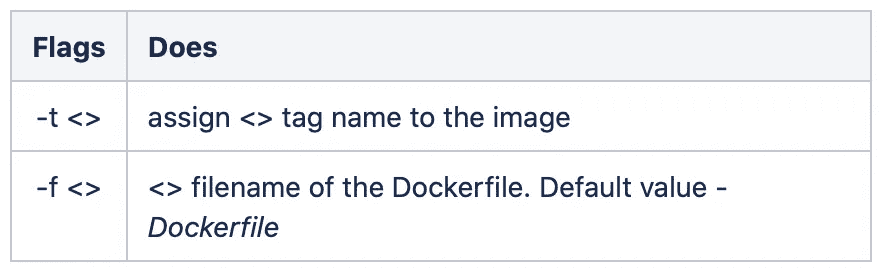
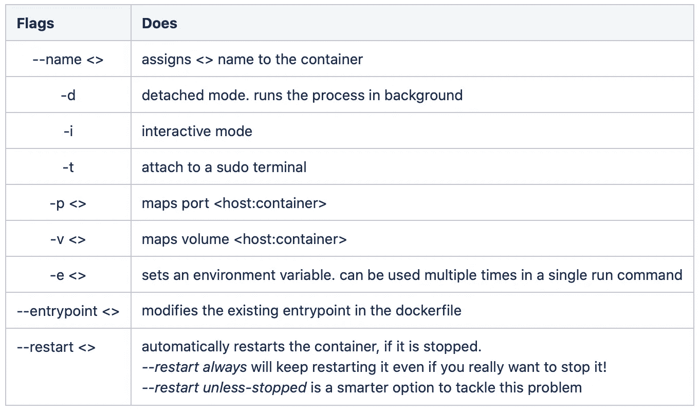
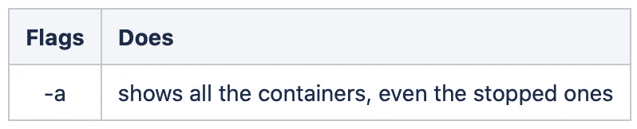

# Docker 命令

> 原文：<https://medium.com/analytics-vidhya/docker-commands-bbf02780b785?source=collection_archive---------20----------------------->


来源:https://www.docker.com/company/newsroom/media-resources

你可以免费下载并安装 Docker 社区版。你可以遵循 Docker 网站上的[说明](https://docs.docker.com/install/)，它们非常简单明了，而且总是最新的。

1.  [简介](/@gyani91/a-concise-guide-to-docker-f6b6d5fb56f4)
2.  [Docker 文件](/@gyani91/docker-file-179b5e3d9171)
3.  基本的 Docker 命令(你在这里！)
4.  [端口和卷映射](/@gyani91/port-and-volume-mapping-c8bb09221f82)
5.  [Docker 联网](/@gyani91/docker-networking-919461b7f498)
6.  [码头仓库](/@gyani91/docker-storage-598e385f4efe)
7.  [Docker 撰写](/@gyani91/docker-compose-44a8112c850a)
8.  [删除 Docker 实体](/@gyani91/deleting-docker-entities-2f90e4a0a765)

除了下面描述的命令之外，我还想向您推荐 docker 发布的 [cheatsheet](https://www.docker.com/sites/default/files/d8/2019-09/docker-cheat-sheet.pdf) 。他们现在正在精简他们的命令，因此你会发现几个命令做完全相同的事情，例如，删除图像可以通过 ***docker rmi*** 或***docker image RM***命令来完成。

**拉动命令**

该命令从 docker 公共注册表中提取图像。

```
docker pull docker/whalesay
```

**构建命令**

这个命令根据 Dockerfile 构建一个映像。

```
docker build [-t <name_of_image>] [-f <name_of_Dockerfile>] <path_to_Dockerfile>
```



**运行命令**

此命令运行映像的实例。

```
docker run --name nginx-container nginx:1.16
```



**ps 命令**

这个命令列出了 docker 容器。

```
docker ps
```



**停止命令**

此命令停止正在运行的容器。

```
docker stop nginx-container
```

**rm 命令**

此命令删除停止的容器。

```
docker rm nginx-container
```

**图像命令**

该命令列出了 docker 图像。

```
docker images
```

**rmi 命令**

此命令删除图像。

```
docker rmi nginx
```

**附加命令**

该命令将终端连接到在后台运行的容器(分离模式)。

```
docker attach <container id or name>
```

**检查命令**

这个命令以 JSON 格式返回容器的详细信息。

```
docker inspect <container id or name>
```

**日志命令**

该命令返回在后台运行的容器的日志(分离模式)。

```
docker logs <container id or name>
```

**按压命令**

该命令将图像推送到您在 docker 公共注册表(dockerhub)上的帐户。

```
docker push sumeet/mlflow-postgres
```

在下一节的[中，我们将了解端口和卷映射。](/@gyani91/port-and-volume-mapping-c8bb09221f82)