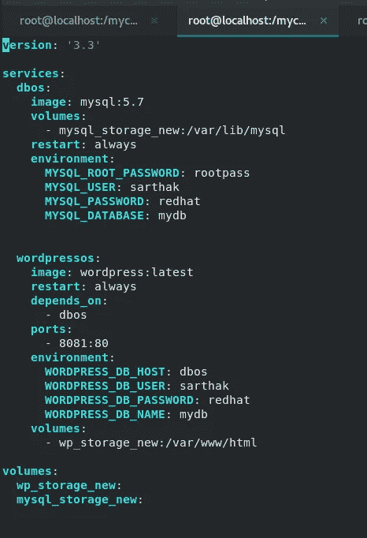
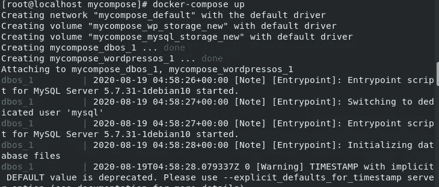
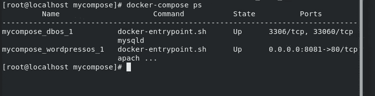
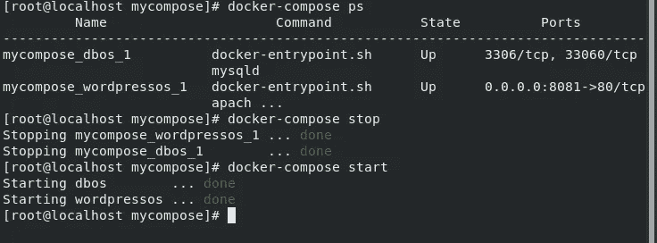
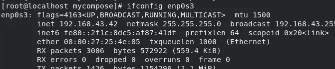
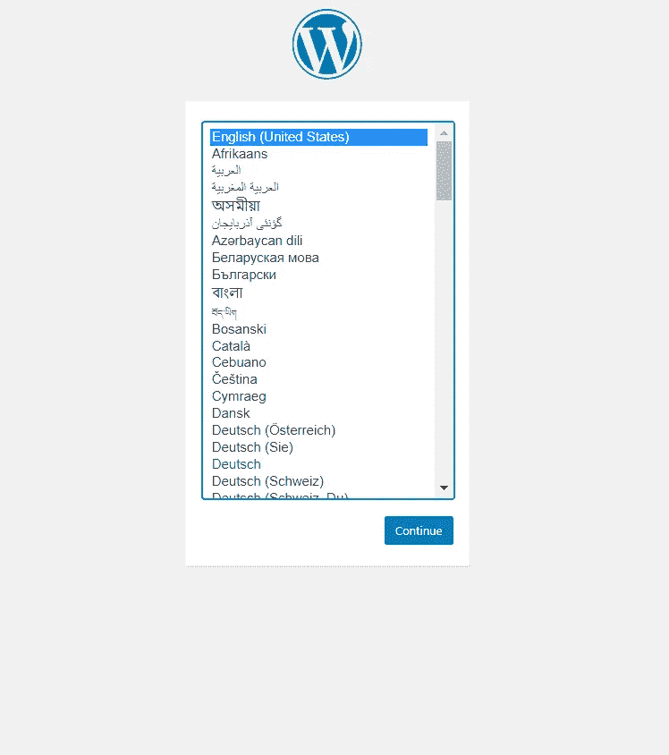
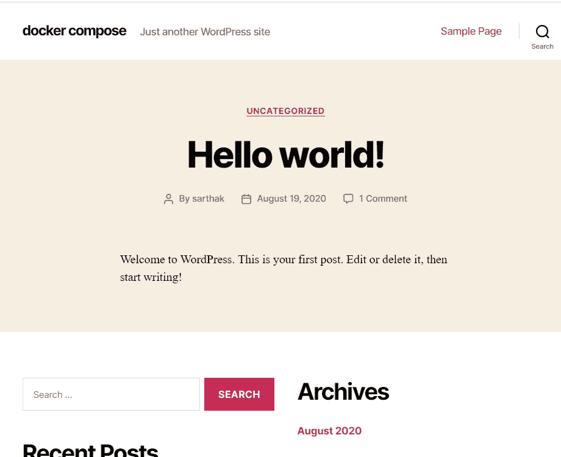

# Docker 撰写

> 原文：<https://medium.com/analytics-vidhya/docker-compose-afcfc9586dbd?source=collection_archive---------27----------------------->


我们可以创建一个容器并使用 Dockerfile 运行它。我们甚至可以在多个终端中使用两个 Dockefiles 在不同的端口运行多个容器。

但是当你想为你的应用程序创建多个容器时，你必须创建几个 Docker 文件。这增加了维护它们的负担，并且相当耗时。

这篇博客是我之前的 [**博客**](/@sarthak3398/how-to-install-wordpress-on-docker-using-mysql-backend-1611641d14ac) 的延续，在那里我展示了**如何使用 MySQL 后端**在 Docker 上安装 WordPress

这个问题由 **Docker Compose 解决。Docker compose 是一个用于单个主机中多容器应用程序的工具。**

例如，在我以前的博客中，我必须运行两个容器:第一个 wordpress 容器和第二个 mysql 容器作为后端。

借助于 **docker-compose.yaml** ，我们可以在单个主机中运行多个容器作为服务。

```
Docker Swarm extends the concept of manage multiple containers deployed across multiple node docker cluster.
```

# **安装**

1.  运行此命令下载 linux 中 Docker Compose 的当前稳定版本:

```
curl -L "https://github.com/docker/compose/releases/download/1.26.2/docker-compose-$(uname -s)-$(uname -m)" -o /usr/local/bin/docker-compose
```

2.对二进制文件应用可执行权限:

```
sudo chmod +x /usr/local/bin/docker-compose
```

3.使用检查版本

```
docker-compose version
```

# 创建您的第一个 Docker 合成文件

1.  创建名为 mycompose 的新文件夹
2.  所有 Docker 合成文件都是 YAML 文件。您可以使用 mycompose 文件夹中的 vim 编辑器创建一个

```
vim docker-compose.yaml
```

Docker 合成文件包含:服务、卷和网络，用于启动所有服务



3.使用 ESC 键关闭编辑器，然后:wq！命令

4.然后执行

```
docker-compose up
```



5.要启动和停止容器，请使用

```
docker-compose stop
docker-compose start
```



6.要在分离模式下运行 docker-compose，请使用

```
docker-compose up -d
```


7.使用 ifconfig 检查 ip，并转到浏览器，键入端口号为 8081 的 ip

```
192.168.43.42:8081
```



# 结论

因此，docker-compose 是运行多容器应用程序的一个很好的工具。这个例子只是用例之一。