# 码头集装箱！

> 原文：<https://medium.com/analytics-vidhya/docker-containers-56cafce40991?source=collection_archive---------21----------------------->

直到大约 7-8 周前(写这篇文章时)，我才知道码头工人。我接触码头工人只是因为学校的一个项目。所以为什么不记录下来……一个权利？呵呵 lesgo~！

> 什么是 Docker 容器？

容器映像是一个轻量级的、独立的、可执行的软件包，包含了运行它所需的一切:代码、运行时、系统工具、系统库、设置。容器是应用程序层的抽象，它将代码和依赖项打包在一起。你可以把它想象成一个虚拟机，但是要轻得多！您可以在同一台机器上运行多个容器，同时与容器共享操作系统内核！容器消耗的存储空间也比虚拟机少。

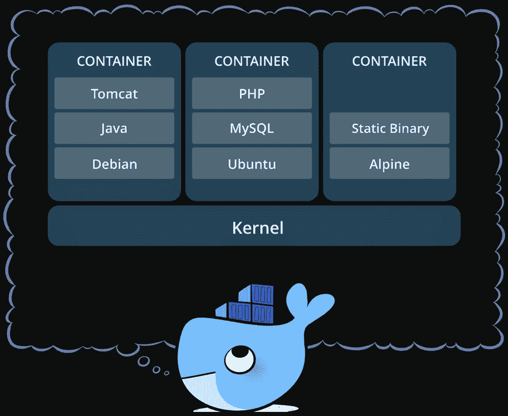

Docker 电子书可以在[这里找到](https://goto.docker.com/docker-virtualization-admin-ebook.html)

> 虚拟机与容器

容器和虚拟机具有相似的资源隔离和分配优势，但功能不同，因为容器虚拟化的是操作系统而不是硬件。集装箱更便携，效率更高。

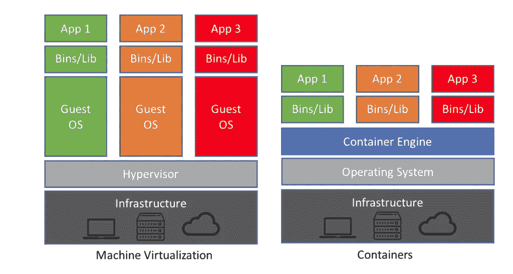

> 安装 Docker [Linux]

> 步骤 1 —准备我们的机器

我们必须确保系统是最新的！

```
root@kali:~# apt-get update
```

您的 Kali 安装中应该有以下软件包。如果没有，请运行以下命令来安装它们:

```
root@kali:~# apt-get install \apt-transport-https \ca-certificates \curl \gnupg-agent \software-properties-common
```

> 步骤 2—添加 Docker 存储库

配置 Docker apt 存储库:

```
root@kali:~# echo ‘deb [https://download.docker.com/linux/debian](https://download.docker.com/linux/debian) stretch stable’ > /etc/apt/sources.list(.d/docker.list)->optional
```

> 步骤 3—将 Docker 安装到机器上

执行安装的命令:

```
root@kali:~# apt-get install docker-ce docker-compose
```

现在我们已经成功地安装了 Docker，让我们来验证安装！

```
root@kali:~# docker --version
Docker version 19.03.8, build afacb8b7f0root@kali:~#
```

> Docker 搜索

我们有一堆 docker 提供的图片！让我们搜索一个可以用来创建容器的图像。对于这个演示，我要寻找一个我可以使用的树莓图像。

```
root@kali:~# docker search {image_name}
```

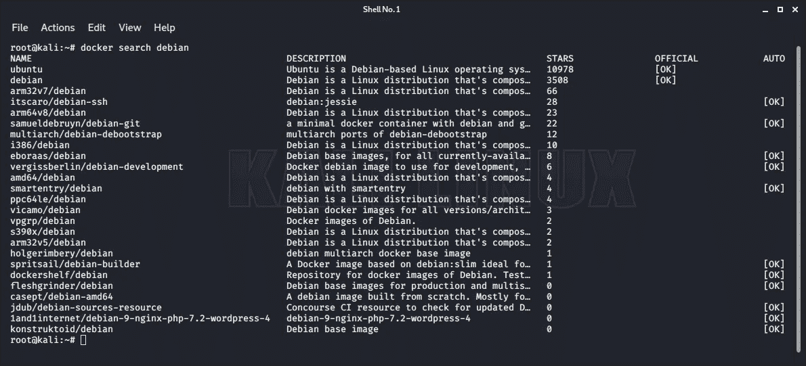

> 码头工人拉动

现在我们已经识别并验证了我们想要的图像是可用的，让我们把它下载到我们的机器上。

```
root@kali:~# docker pull {image_name}
```

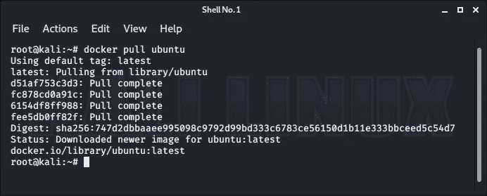

> Docker 图像

现在我们已经安装了映像，让我们来验证一下。

```
root@kali:~# docker images
```

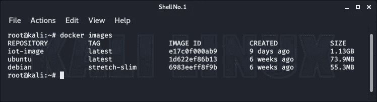

如上图所示，我们下载的 ubuntu 镜像出现了。

> 码头运行

现在让我们用刚刚下载的基本映像创建一个容器。

```
root@kali:~# docker run -it --rm --name {containername} {image} {application to launch on start} -it = Interactive mode (This allows u to interact with the shell as soon as it has launched)--rm = remove the container totally on exit (wont be able to re enter the container)--name = Gives the container a name 
```

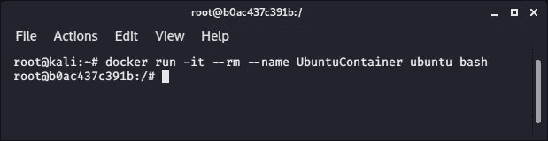

现在我们已经成功地启动了一个容器，让我们用下面的命令来验证它！

```
root@b0ac437c391b:/# uname -a^disclaimer:the container launches with a random name everytime its relaunched
```

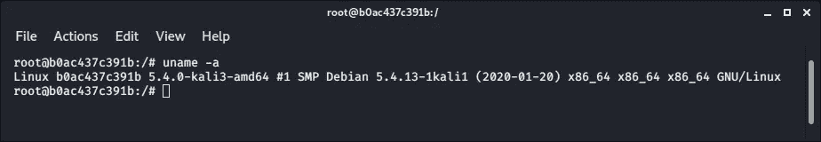

现在我们可以在容器上做任何我们想做的事情了:)

> Docker 提交

除非我们将特定容器的内容提交到映像中，否则容器会重新启动。我们需要做的第一件事是运行没有`--rm`的容器。这将确保我们能够在退出时将容器提交到映像中。

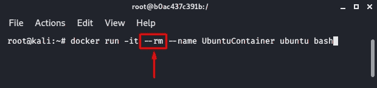

现在，对容器进行必要的修改，然后优雅地退出。

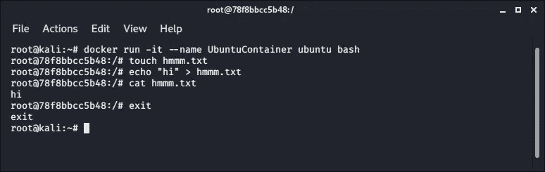

退出时，输入以下命令将该容器提交到另一个映像中。

```
root@kali:~# docker commit {container_name} {custom_image_name}^disclaimer: the custom image name cant have any caps
```

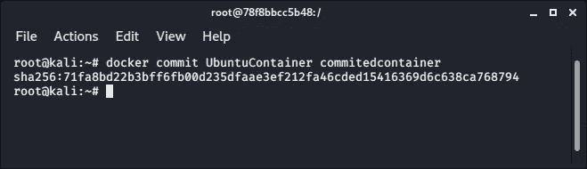

如果您收到如上所示的散列，我们已经成功地提交了 docker 容器。下次启动容器时，我们必须用{ commitedcontainer }替换{ubuntu}

```
root@kali:~# docker run -it --rm --name {containername} {image}
```

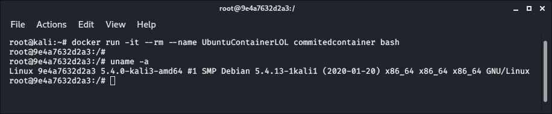

> 码头移除

现在，假设我们有一个容器正在运行，但我们不在其中退出它，因为我们启动它时没有使用`— -rm`标签来提交它。这就是我们如何优雅地关闭容器。

首先，我们需要找出我们想要关闭的内容。为此，我们需要用这个命令检查 docker 进程列表。

```
root@kali:~# docker ps -a
```

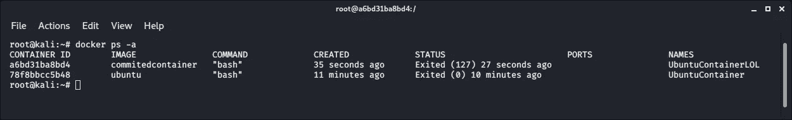

在上面的截图中，我有 2 个容器在运行。让我们关闭这两个容器。命令:

```
root@b0ac437c391b:/# docker rm {container NAME} --force
```

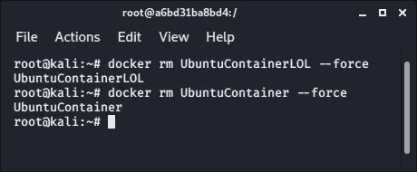

差不多就是这样！这就是开始使用 docker 所需要知道的全部内容！然而，你会在这个过程中学到更多。最棒的！

~Nee

