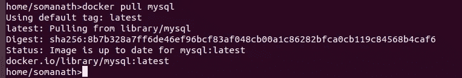

# 数据工程师 Docker

> 原文：<https://medium.com/analytics-vidhya/docker-for-data-engineers-i-c6ec41b2e7f4?source=collection_archive---------10----------------------->

这篇博客是面向数据工程师的 docker 系列的第一篇，这篇博客将让你开始使用 docker。

想象一下当你想测试一些软件或者像 spark 这样的框架时的情况。传统的方法是下载 zip 文件，然后执行一组命令。如果有一些兼容性问题，这是所有安装软件真的会很痛苦。相反，如果我说，我们只需运行一行命令就可以启动并运行任何软件。有意思吧！！！。

这正是 docker 所做的

让我们详细看看下面的事情。为了简化事情，我假设我有一个从 dockerfile 构建的图像

docker 是什么？

经营码头工人

Docker 卷的数据持久性

向外界展示码头工人

下一篇博客:从 Docker 文件构建自定义 Docker 图像。

# **什么是 docker？**

我想从我的理解中给出一个定义 docker 是一个类似于在 python 中运行虚拟 env 的虚拟环境，但不同的是 Docker 应用了相同的概念但在应用程序级别。

比方说，如果我们有一个应用程序，它是用我们当前环境中没有的某些包编写的，那么我们将创建一个虚拟环境权限。

> 同样，如果我们安装了 docker 应用程序，那么我们可以运行任何软件，例如我们有一个 ubuntu 16.04 版本，我们想在 Cent OS 上测试一些应用程序，我们可以从 docker 注册表中提取 CENT OS 映像(顾名思义)，然后我们现在可以在这个 OS 上进行测试。

类似地，我们可以在同一台机器上运行不同版本的 MYSQL

# **docker 给开发者带来了什么？**

1.  减少测试应用对基础设施的依赖
2.  易于部署不同版本的应用程序
3.  易于测试任何软件

# docker 给组织带来了什么？

1.  易于生产的应用
2.  运行独立的应用程序，而不是安装的版本有问题
3.  易于扩展
4.  比虚拟机便宜

# 安装 Docker:

它可以很容易地安装在 ubuntu 和非 Windows 0S 上

> [https://get.docker.com/](https://get.docker.com/)

注意:上面的方法是为了在本地开发应用。

如果您有 windows 或者您喜欢少安装，那么使用

> [https://labs.play-with-docker.com/](https://labs.play-with-docker.com/)

**docker 是如何工作的？**

Docker 围绕三件事

1.  码头引擎
2.  Docker 图像
3.  Docker 注册表

Docker 引擎:

> docker 的组件提供了 docker 运行的环境。它类似于 java 应用程序的 JVM

Docker 图像:

> 它是保存软件的组件。比方说，如果我们想运行一个 mysql 服务器，我们必须从 docker registry 下载 mysql 镜像。它是从 DockerFile 构建的

码头中心:

> 它是所有类似于 github repo 的图像的存储库

## 要运行的步骤

假设我们没有安装 MySQL，我们决定用 docker 探索 MySQL

docker 中的命令类似于 git

步骤 1:我们可以使用 pull 命令从 docker hub 中提取 docker 映像

Docker 第一次从 docker hub 中拉出 mysql

步骤 2:一旦我们发出 pull 命令，docker 将检查映像的本地副本，如果它可用，它会将映像的哈希值与 docker hub 的表单进行比较，以检查任何更新。如果有一些更新，它将从 docker 拉最近的图像

Docker 使用本地镜像，而不是像上面那样下载

## 步骤 3:使用 run 命令启动 docker 容器

> docker 容器运行—名称 C1-e MYSQL _ ROOT _ PASSWORD = my-secret-pw-d MYSQL

Docker 运行 mysql 容器

这里我们运行一个名为 c1 的容器，mysql password=my-secret-pwd (-e 用于设置 env 密码)，它是在后台从图像 mysql 构建的(使用-d)

## 步骤 4:在容器内工作

现在我们已经启动了容器，我们可以使用命令 **exec -it** 在容器内部进行交互

> docker 容器 exec -it c1 bash

所以在这里，我们使用 exec -it 进入容器 c1，并运行命令 bash。在执行命令时，我们将与容器交互，并进入容器内部，我们可以看到命令提示符从 home/somanath 更改为<container-id></container-id>

然后我们使用 mysql -u root 和我们之前给出的 root 密码，我们将使用 exit 退出容器

# 容器和图像之间的差异

图像是只读的，当我们运行图像时，我们创建一个容器。

容器就像物体，它没有持久的意义

现在，如果我们退出容器，关闭机器并重新创建一个容器，那么我们将丢失所有数据。检查这个

Docker 是基于层的概念。比方说，我们有一个 mysql 映像，当我们运行 mysql 映像时，我们将创建一个容器 C1，并在容器内创建一个数据库。现在我们将有原始图像，并在它的顶部添加一层变化，如下所示

容器顶部的容器层

现在，如果我们退出容器，关闭机器并重新创建一个容器，那么我们将丢失所有数据。

# **Docker 卷的数据持久性**

如果我们想保存数据以备将来使用，该怎么办？假设我们对 docker mysql 容器进行了大量分析，并创建了一个测试数据库，因此如果容器在关闭期间丢失，所有数据都将丢失。因此，为了避免这种情况，我们将使用 mount 挂载一个卷，这样容器内的数据更改就可以映射到我的机器上的某个物理位置

我们可以使用— mount 标志将本地系统中的卷附加到容器中的卷

> 为了找到我们想要附加卷的位置，我们必须检查 docker 文件中的卷关键字

 [## docker-library/mysql

### Permalink GitHub 是 5000 多万开发人员的家园，他们一起工作来托管和审查代码、管理项目以及…

github.com](https://github.com/docker-library/mysql/blob/bc6e37a2bed792b1c4fc6ab1ec3ce316e6a5f061/8.0/Dockerfile#L77) 

经过检查，我发现它在/var/lib/mysql 下

> docker 容器 run-name C2-mount source = MYSQL data，target =/var/lib/MYSQL/-e MYSQL _ ROOT _ PASSWORD = myscretpw-d MYSQL

上面的命令创建了一个卷 mysqldata，因此我们将登录容器并创建一个 db 测试

现在我们可以在下面看到测试数据库

/var/lib/docker/volumes

# 向外界展示码头工人

现在我们有了持久卷，但唯一的问题是我每次都必须进入 docker 容器来执行查询，从长远来看这是非常困难的。

有时我们可能会使用 workbench，所以我们可能需要用它连接 docker 容器中的 mysql。因此，我们必须将连接从 docker 端口(3306)转移到某个本地主机的可用端口(例如 33360)

因此，最后一步不是在 docker 中运行 mysql，而是使用端口转发将 docker 端口暴露给运行机器的 ip

> docker 容器运行—名称 c3 -p 33360:3306 —挂载 source=mysqldata，target =/var/lib/MYSQL/-e MYSQL _ ROOT _ PASSWORD = myscretpw-d MYSQL

一旦我们有一个 docker 暴露给一个特定的端口，我们将能够访问它在我的本地主机端口 33360。

为了测试这一点，我使用 spark 查询这个新的 mysql 数据库

> > > > jdbcDF = spark.read.format("jdbc ")。选项(" url "，" jdbc:mysql://localhost:33360 ")。选项(“用户”，“根”)。选项(" password "，" mysecretpw ")。选项(" dbtable "，" mysql.user ")。负载()

**结论**

一旦我们安装了 docker，我们将使用卷安装来存储持久数据，最后我们将使用端口转发向外界公开 docker

这将允许您使用 localhost:33360 访问 docker 中 3306 内部运行的 mysql(端口从 3306 转发到 33360)。

今天就到这里吧！！:)

Github 链接:[https://github . com/SomanathSankaran/spark _ medium/tree/master/spark _ CSV](https://github.com/SomanathSankaran/spark_medium/tree/master/spark_csv)