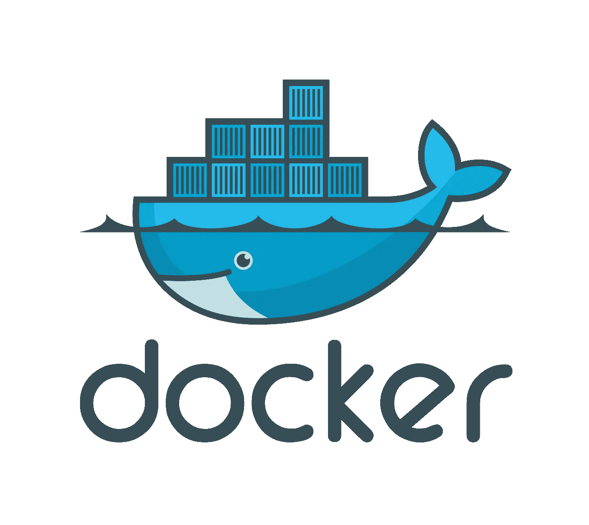
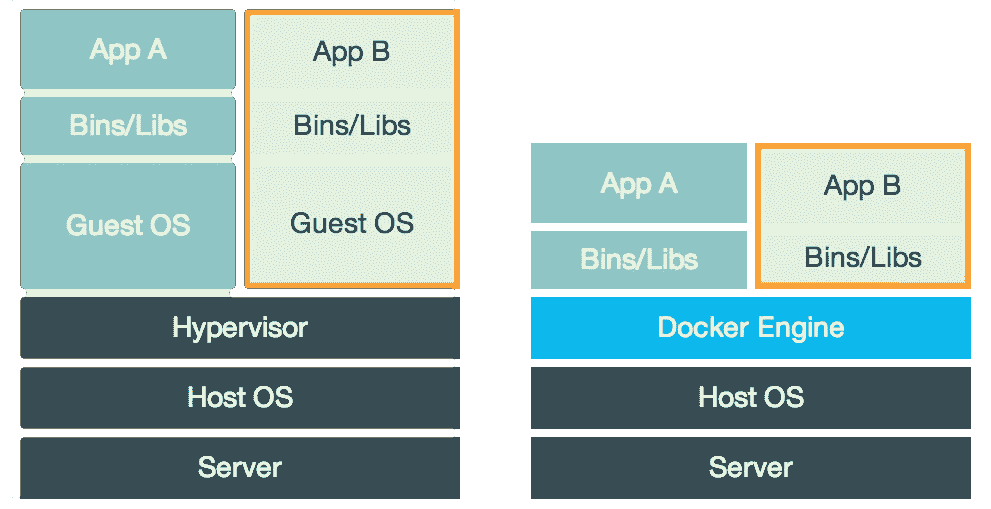
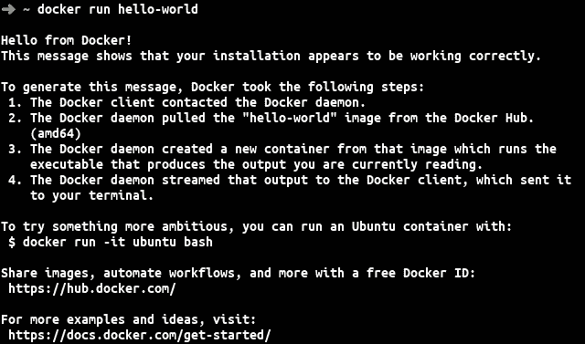
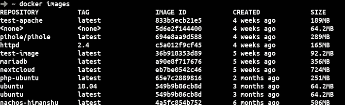
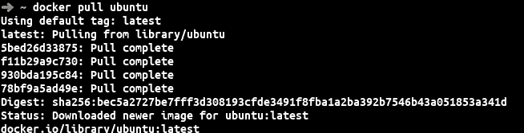
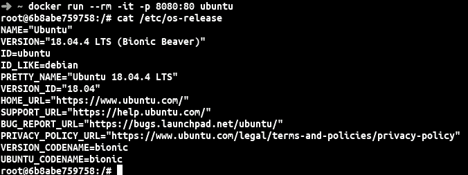
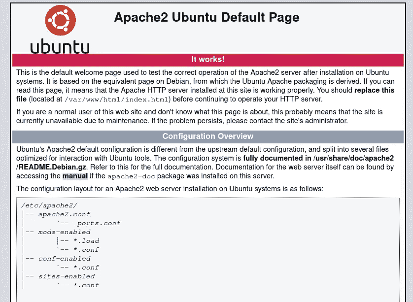

# Docker:实用指南

> 原文：<https://medium.com/analytics-vidhya/docker-practical-guide-421507289b13?source=collection_archive---------12----------------------->

你们大多数人可能听说过码头工人。Docker 在开发者中非常有名。Docker 为开发、运输和部署提供标准化单元的打包软件。



# **docker 是什么？**

答案很简单:Docker 是使用操作系统级虚拟化的容器化技术。这是一种不同于虚拟盒子所使用的技术。



**虚拟机箱:**虚拟机箱是在硬件级别提供隔离的虚拟机管理程序。基本上，每个虚拟机都有自己的操作系统，因此应用程序、必要的二进制文件和库占用了数十 GB。此外，虚拟机速度较慢。

Docker : Docker 在软件层面提供虚拟化。因此 docker 与主机操作系统共享一些进程。由于 docker 在软件级别提供虚拟化，所以它被称为容器化。Docker 消除了虚拟机管理程序和对客户操作系统的需求。因此，Docker 提供了高效的虚拟化，而且速度不慢。此外，Docker 容器是可移植的，因此它可以在任何主机上工作。

Docker 支持 Linux、MacOS 和 Windows。

# Docker 的优势:

1.  安全:Docker 在另一个层面上提供了安全性。使用容器部署的应用程序与其他应用程序是隔离的。
2.  轻量级:因为容器与主机系统共享内核，所以容器不需要包含操作系统，所以它将提高运输和部署的速度。

# **如何使用 Docker？**

Docker 可以从[官方指南](https://docs.docker.com/install/)中安装。本指南涵盖了所有平台 Windows、MacOS 和 Linux 的安装。

一旦安装了 docker，用户可以在终端中简单地运行`docker`命令。它将提供所有可以使用的命令类型。

在 VMBox 中，我们习惯于使用 ISO 文件运行操作系统。在 docker 的情况下，我们有一个图像。你可以在 [Docker Hub](https://hub.docker.com/search?q=&type=image) 简单浏览大量图片。这些映像是操作系统、数据库应用程序或任何其他应用程序的映像。我们将做几个任务来理解 docker 是如何工作的。

# 著名的 Hello World 使用 Docker

在终端中运行以下命令:

```
docker run hello-world
```

你会受到码头工人的热情欢迎！消息。如果你没有看到这条信息，那么 Docker 安装有问题。



Docker Hello World 消息

您可以使用下面给定的命令查看当前安装在系统中的映像列表。

```
docker images
```



显示系统中安装的所有图像的命令

# **使用 Ubuntu 镜像的 Apache web 服务器**

使用以下命令安装 Ubuntu:

```
docker pull ubuntu
```

首先，上面的命令会检查系统中是否已经存在 Ubuntu 镜像，如果没有安装，它会从 docker hub 中获取。你会注意到图像的大小会比实际的 Ubuntu ISO 文件小很多。怎么会？因为 Ubuntu 镜像不包含 OS /内核，因为 docker 使用主机的内核。



Docker 提取 Ubuntu 图像

现在，我们可以使用以下命令启动 Ubuntu 容器:

```
docker run -it --rm -p 8080:80 ubuntu
```

这里，run 属性将选择图像并创建容器。-它会给出一个和任何终端一样的交互外壳，-rm 会在你退出后移除容器，-p 会把容器的端口暴露给外部的主机，最后是镜像名称。

一旦你运行这个命令，你将会受到 Ubuntu 命令提示符的欢迎。现在，运行你最喜欢的命令，看看它有多棒。为了好玩，我将运行下面的命令。

```
cat /etc/os-release
```

你会看到很多关于图片名称和版本的信息。



显示发布名称的 docker ubuntu 实例

现在，更新 ubuntu 并安装 apache web 服务器。

```
apt update
apt install apache2
```

下一件事是使用这个命令启动 Apache web 服务器

```
apache2ctl start
```

一旦完成，你可以在浏览器中输入 [*http://localhost:8080、*](http://localhost:8080,) 和你将会看到 Apache Ubuntu 的默认页面。



你可以在 docker 中安装任何东西，就像在真正的操作系统中一样。

# **为什么要把所有东西都装在容器里？**

让我们什么都不做，只运行 Apache 服务器。在这里，您可以利用预先构建的映像。你可以在我之前提到的 [Docker Hub](https://hub.docker.com/) 中找到一堆图片。你可以找到你最喜欢的语言、工具或软件的精彩图片。您还可以在 Docker Hub 的 Explore 中找到顶级预构建图像。

让我们毫不费力地安装 Apache 服务器。

运行下面的命令来运行 Apache 映像，它是正式的映像。

```
docker run --rm -it -p 8080:80 httpd:2.4
```

在你的网络浏览器中输入`localhost:8080`，然后嘣！您已经准备好运行 Apache 服务器，您将很高兴在 web 浏览器中看到“它工作了”。

这还不是全部，你还可以用 Docker 做更多的事情。假设您想安装自己选择的软件，并且不想每次都运行命令，那么您就有救了。

有 Dockerfile 可以为你配置图像。让我们从在 Ubuntu 中安装相同的 Apache web 服务器开始。

我们创建一个空目录，将以下内容放入`Dockerfile`。

```
FROM ubuntu:latest
RUN apt update
RUN apt install apache2 -y
```

FROM 描述了您想要使用的映像，然后 RUN 命令将执行命令来根据您的喜好进行配置。这个命令将更新 ubuntu 实例，并安装 apache2 服务器。

现在，在同一个目录中使用下面的命令构建映像。

```
docker build -t test-apache 
```

现在，使用下面的命令创建一个容器。

```
docker run --rm -it -p 8080:80 test-apache:latest bash
```

在这里，你必须使用你自己的图像名`test-apache`,这几乎和之前使用的命令一样。

现在，您将打开 bash，并使用以下命令启动 web 服务器:

```
service apache2 start.
```

完成后，您现在可以打开 [http://localhost:8080](http://localhost:8080) 来查看是否一切正常。

在上面的步骤中，您可以看到 apache 服务器的默认页面。现在我将展示如何在您自己的网站上运行 web 服务器。

我将使用 GitHub 上的示例网站:[https://github.com/himanshu188/Website_Design](https://github.com/himanshu188/Website_Design)

您可以下载或克隆 GitHub 存储库。

打开项目，在同一个目录下打开终端。您将使用该卷将主机目录内容绑定到 docker。

运行以下命令，通过在 docker 容器中装入卷来启动容器。

```
docker run --rm -it -p 8080:80 -v “$PWD”/Consultancy_Website:/var/www/html test-apache:latest bash
```

现在，使用下面的命令启动 web 服务器。

```
service apache2 start
```

你去 [http://localhost:8080](http://localhost:8080) 就能看到网页

此外，您还可以将您的图像分享给朋友或发布到 hub。

如果你想在不安装 docker 的情况下和 docker 互动玩，可以去[和 Docker](https://training.play-with-docker.com/) 玩。

关于 Docker 有很多东西要学。Docker 已经成为开发人员的一项强大的首选技术。因为不同的机器或操作系统而无法工作的日子已经一去不复返了。Docker 消除了本地机器和生产服务器之间的差异。现在，不用在新机器上安装所有东西，就可以很容易地开始开发。

Docker 在组织招聘新开发人员时非常受欢迎。通常，本地环境的设置要花费很多时间，但是有了 Docker，使用 Docker Compose 只需点击一下。Docker Compose 是一个定义和运行多容器 Docker 应用程序的工具。举个例子，如果有一个 Spring 框架应用程序，那么你就会有数据库、Tomcat Web 服务器和 Redis 服务器的 docker 映像。因此，Docker Compose 将自动启动所有 Docker 实例。通过这种方式，公司可以加快新开发人员的入职速度，并改善他们的基础设施。

如有任何问题，请通过(联系)himanshuptl DOT me 联系我或通过 LinkedIn 联系我。