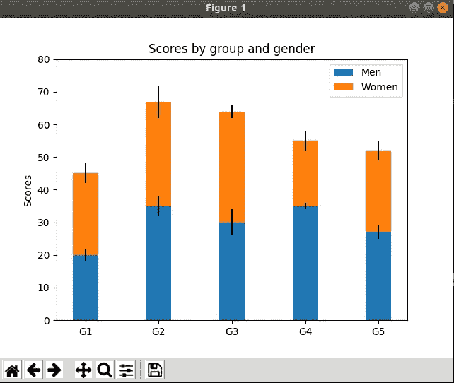

# Docker，Tensorflow，GUI，matplotlib

> 原文：<https://medium.com/analytics-vidhya/docker-tensorflow-gui-matplotlib-6cdd327d4a0f?source=collection_archive---------4----------------------->


在之前的文章中，我们讨论了在 dockerized 容器上使用 tensorflow。有了它，我们可以在张量流环境下工作。但是，我们如何实现结果的可视化呢？将数据复制到本地计算机并单独查看？我们可以做到..但是，有没有更好的办法呢？是的。我们可以为 docker 提供 GUI 功能，并显示 docker 本身的内容。

首先使 docker 能够使用显示器。我们将通过如下的“xhost”命令来完成

```
xhost +
```

接下来，我们需要运行带有显示设置的 docker。

```
docker run -it --gpus=all --name <name> -v <algo folder>:/algo -v <data folder>:/data --net=host --env="DISPLAY" --volume="$HOME/.Xauthority:/root/.Xauthority:rw" tensorflow/tensorflow:1.15.2-gpu-py3 /bin/bash
```

在 docker 容器中，安装 python3-tk。

```
apt install -y python3-tk
```

使用 pip 安装 matplotlib

```
pip install matplotlib
```

为了便于在 python 中编辑，我们可以使用 ipython。安装 ipython 可以按如下方式完成

```
pip install ipython
```

以下代码摘自 [matplotlib](https://matplotlib.org/gallery/lines_bars_and_markers/bar_stacked.html#sphx-glr-gallery-lines-bars-and-markers-bar-stacked-py) 网站。

```
**import** **numpy** **as** **np**
**import** **matplotlib.pyplot** **as** **plt**

[N](https://docs.python.org/3/library/functions.html#int) = 5
[menMeans](https://docs.python.org/3/library/stdtypes.html#tuple) = (20, 35, 30, 35, 27)
[womenMeans](https://docs.python.org/3/library/stdtypes.html#tuple) = (25, 32, 34, 20, 25)
[menStd](https://docs.python.org/3/library/stdtypes.html#tuple) = (2, 3, 4, 1, 2)
[womenStd](https://docs.python.org/3/library/stdtypes.html#tuple) = (3, 5, 2, 3, 3)
[ind](https://docs.scipy.org/doc/numpy/reference/generated/numpy.ndarray.html#numpy.ndarray) = [np.arange](https://docs.scipy.org/doc/numpy/reference/generated/numpy.arange.html#numpy.arange)([N](https://docs.python.org/3/library/functions.html#int))    *# the x locations for the groups*
[width](https://docs.python.org/3/library/functions.html#float) = 0.35       *# the width of the bars: can also be len(x) sequence*

[p1](https://matplotlib.org/api/container_api.html#matplotlib.container.BarContainer) = [plt.bar](https://matplotlib.org/api/_as_gen/matplotlib.pyplot.bar.html#matplotlib.pyplot.bar)([ind](https://docs.scipy.org/doc/numpy/reference/generated/numpy.ndarray.html#numpy.ndarray), [menMeans](https://docs.python.org/3/library/stdtypes.html#tuple), [width](https://docs.python.org/3/library/functions.html#float), yerr=[menStd](https://docs.python.org/3/library/stdtypes.html#tuple))
[p2](https://matplotlib.org/api/container_api.html#matplotlib.container.BarContainer) = [plt.bar](https://matplotlib.org/api/_as_gen/matplotlib.pyplot.bar.html#matplotlib.pyplot.bar)([ind](https://docs.scipy.org/doc/numpy/reference/generated/numpy.ndarray.html#numpy.ndarray), [womenMeans](https://docs.python.org/3/library/stdtypes.html#tuple), [width](https://docs.python.org/3/library/functions.html#float),
             bottom=[menMeans](https://docs.python.org/3/library/stdtypes.html#tuple), yerr=[womenStd](https://docs.python.org/3/library/stdtypes.html#tuple))

[plt.ylabel](https://matplotlib.org/api/_as_gen/matplotlib.pyplot.ylabel.html#matplotlib.pyplot.ylabel)('Scores')
[plt.title](https://matplotlib.org/api/_as_gen/matplotlib.pyplot.title.html#matplotlib.pyplot.title)('Scores by group and gender')
[plt.xticks](https://matplotlib.org/api/_as_gen/matplotlib.pyplot.xticks.html#matplotlib.pyplot.xticks)([ind](https://docs.scipy.org/doc/numpy/reference/generated/numpy.ndarray.html#numpy.ndarray), ('G1', 'G2', 'G3', 'G4', 'G5'))
[plt.yticks](https://matplotlib.org/api/_as_gen/matplotlib.pyplot.yticks.html#matplotlib.pyplot.yticks)([np.arange](https://docs.scipy.org/doc/numpy/reference/generated/numpy.arange.html#numpy.arange)(0, 81, 10))
[plt.legend](https://matplotlib.org/api/_as_gen/matplotlib.pyplot.legend.html#matplotlib.pyplot.legend)(([p1](https://matplotlib.org/api/container_api.html#matplotlib.container.BarContainer)[0], [p2](https://matplotlib.org/api/container_api.html#matplotlib.container.BarContainer)[0]), ('Men', 'Women'))

[plt.show](https://matplotlib.org/api/_as_gen/matplotlib.pyplot.show.html#matplotlib.pyplot.show)()
```

复制上面的代码，粘贴到 ipython 环境中运行。您将能够在您的主机上看到显示。

