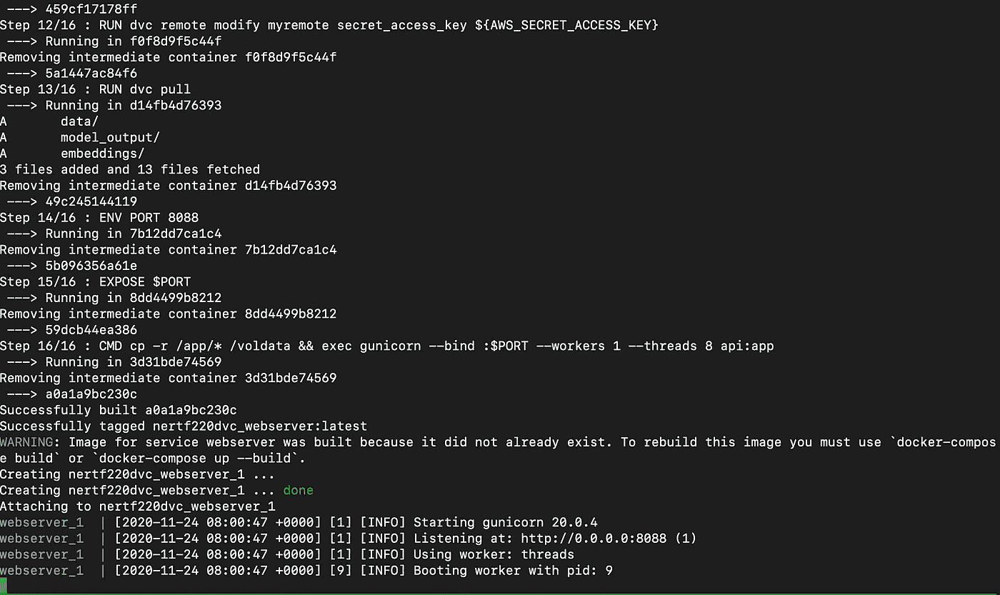
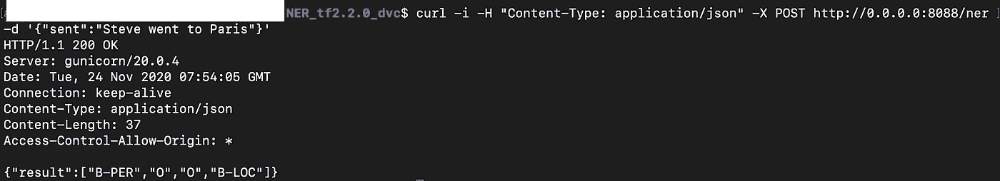

# Docker(volumes)与 DVC 一起用于 ML 项目的版本控制数据和模型

> 原文：<https://medium.com/analytics-vidhya/docker-volumes-with-dvc-for-versioning-data-and-models-for-ml-projects-4885935db3ec?source=collection_archive---------2----------------------->

这篇博客详细解释了如何将 DVC 用于版本数据和模型，以及如何将应用程序文档化。如果你有兴趣学习如何使用 DVC 进行版本控制，你可以在这里阅读博客。

在之前的博客[中，我们详细讨论了使用 DVC 和 AWS S3](https://bhuvana-kundumani.medium.com/versioning-data-and-models-in-ml-projects-using-dvc-and-aws-s3-286e664a7209) 在 ML 项目中对数据和模型进行版本控制。我们将把这个应用程序转换成一个 docker 容器。在这个应用程序中，我们将使用单个容器。然而，在实时应用程序中，我们将有多个容器在运行，我们可能还必须与其他容器共享数据和模型。有了 docker 中的 [Volumes](https://docs.docker.com/storage/volumes/) ，我们可以保存数据并跨容器共享数据。

此博客的代码可从[这里](https://github.com/bhuvanakundumani/NER_tf_docker_dvc)获得

## 中的 AWS 凭据。环境文件

我们的数据和模型存储在 AWS s3 存储桶中。我们已经使用`dvc push`命令推送数据。如果你需要更多细节，请浏览[博客](https://bhuvana-kundumani.medium.com/versioning-data-and-models-in-ml-projects-using-dvc-and-aws-s3-286e664a7209)。我们需要提供我们的 AWS 凭证(访问密钥 id 和秘密访问密钥)。我们将使用`.env`文件传递凭证。`vim .env`创造一个。env 文件并存储凭据，如下所示。(注意:用您的访问密钥 id 替换 access_key_id，用您的秘密访问密钥替换 secret_access_key)

```
AWS_ACCESS_KEY_ID=access_key_id
AWS_SECRET_ACCESS_KEY=secret_access_key
```

## docker-撰写文件

Docker Compose 构建了一个应用程序栈来运行一个完整的服务。使用 pip 安装 docker-compose。

```
pip install docker-compose
```

使用 vim 创建一个`docker-compose.yml`文件，并将下面的代码复制到`docker-compose.yml`文件中。

```
version: '3'
services:
  webserver:
    build:
      dockerfile: Dockerfile
      context: ./
      args:
        AWS_ACCESS_KEY_ID: ${AWS_ACCESS_KEY_ID} # from .env
        AWS_SECRET_ACCESS_KEY: ${AWS_SECRET_ACCESS_KEY} #from .env volumes:
      - app-vol:/voldata
    ports:
      - "8088:8088"volumes:
  app-vol:
```

`[build](https://docs.docker.com/compose/compose-file/#build)` [键](https://docs.docker.com/compose/compose-file/#build)告诉 docker-compose 在哪里可以找到构建指令。构建指令是通过一个`Dockerfile.` `context`提供的，它或者有一个包含 Dockerfile 的目录的路径。在本例中，它是当前目录。

`args`下的`AWS_ACCESS_KEY_ID`和`AWS_SECRET_ACCESS_KEY`从`.env`文件中获取数值。

在`volumes`下的`app-vol:/voldata`创建一个名为`app-vol`的卷，驻留在`/voldata`中。我们将使用在`ports.`中提到的端口 8088

## Dockerfile 文件

使用 vim 创建一个名为`Dockerfile`的文件，并将下面的代码复制到`Dockerfile`

```
FROM python:3.7-slim
RUN apt update
RUN apt install -y git
ARG AWS_ACCESS_KEY_ID
ARG AWS_SECRET_ACCESS_KEYADD requirements.txt /
RUN pip install -r /requirements.txtADD . /app
VOLUME /voldata
WORKDIR /appRUN dvc remote modify myremote access_key_id ${AWS_ACCESS_KEY_ID}
RUN dvc remote modify myremote secret_access_key ${AWS_SECRET_ACCESS_KEY}
RUN dvc pullENV PORT 8088
EXPOSE $PORTCMD cp -r /app/* /voldata && exec gunicorn --bind :$PORT --workers 1 --threads 8 api:app
```

`FROM`指令，告诉 docker compose 使用`python:3.7-slim`作为我们的基础图像。`RUN`命令更新`apt`并安装`git`。`ARG`指令定义了我们在`.env`文件中的两个变量。

`ADD`命令将文件/目录复制到文件系统的指定容器中。这里它将当前目录复制到/ `app`容器中。`VOLUME`命令告诉 docker`/appdata`是一个卷。

`WORKDIR`命令用于定义 Docker 容器的工作目录。这里`/app`是容器的工作目录。

DVC 的 AWS S3 凭据应该设置在`.dvc/config`中。这两个`RUN`命令会处理这些。

```
RUN dvc remote modify myremote access_key_id ${AWS_ACCESS_KEY_ID}
RUN dvc remote modify myremote secret_access_key ${AWS_SECRET_ACCESS_KEY}
RUN dvc pull
```

`dvc pull`命令从在`.dvc/config`文件中配置的 S3 桶 s3://dvcexample/ner 中提取数据。

端口 8088 用于我们的容器。

```
ENV PORT 8088
EXPOSE $PORT
```

命令`CMD cp -r /app/* /voldata`将当前目录的所有内容复制到`/voldata`文件夹，该文件夹是我们在`docker-compose.yml`文件中声明的一个卷，其中包括使用 DVC 提取的数据和模型。`/voldata`中的数据可以跨容器共享。

```
CMD cp -r /app/* /voldata && exec gunicorn --bind :$PORT --workers 1 --threads 8 api:app
```

`exec --bind :$PORT --workers 1 --threads 8 api:app`在为`api.py`中的应用服务的 8088 端口运行`gunicorn`

## 启动和停止容器

`docker-compose up`该命令将获取本地目录中的 **docker-compose.yml** 文件，并开始构建容器。构建完成后，当我们的容器准备就绪时，它将拥有所有的数据和模型。容器启动并运行，如下所示。



现在，您可以在另一个终端中使用 curl 命令来获取句子的 NER。



`docker-compose down` 将停止容器。

## 参考资料:

[](https://vsupalov.com/docker-arg-env-variable-guide/) [## Docker 参数、环境和。env -完整指南

### 错误:Docker 映像构建失败。构建 Docker 映像和配置您的 Docker 化应用程序并不一定是一件…

vsupalov.com](https://vsupalov.com/docker-arg-env-variable-guide/) [](https://twg.io/blog/things-i-wish-i-knew-about-docker-before-i-started-using-it/) [## 我希望在开始使用 Docker 之前就了解它——TWG

### 在这篇博文中，TWG 软件工程师 Nicole Chung 解释了她对 Docker 的印象，Docker 是一个开发人员用来…

twg.io](https://twg.io/blog/things-i-wish-i-knew-about-docker-before-i-started-using-it/)