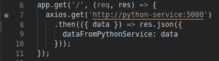

# 为地方发展规划项目

> 原文：<https://medium.com/analytics-vidhya/dockerize-projects-for-local-development-517d99bc4157?source=collection_archive---------7----------------------->


如果一个项目从一开始就包含在内，那么你就有更大的信心，相信它可以在任何环境中运行。如果它在本地有效，那么它在任何地方都有效。

实现本地 docker 开发需要几个元素:
- **Docker** *构建&运行项目映像&容器*
-**Docker-Compose***连接所有容器并将端口暴露给本地主机并在容器和主机之间共享文件*
- **Nodemon** *查看文件更改并重启应用程序进程(用于开发)*

我已经创建了一个回购作为示例，因此我将使用它来逐步完成这个过程。repo 有一个 nodejs 和 python 服务。每个都将使用 nodemon 为本地开发进行设置(是的，nodemon 也可以为 python 工作！).

[https://github.com/sebjwallace/dockerize-boilerplate](https://github.com/sebjwallace/dockerize-boilerplate)

**第一步:Dockerfiles**

```
FROM node:10
WORKDIR /usr/src/app
COPY package*.json ./
RUN npm install
RUN npm install -g nodemon
```

这是一个 **nodejs** 应用程序的示例 docker 文件。这是一个非常简单的样板。我不会详细介绍这些层，但它所做的一切都是从 node:10 映像中提取，然后将项目依赖文件复制到容器中，然后安装依赖项。

```
FROM nikolaik/python-nodejs
WORKDIR /usr/src/app
COPY requirements.txt ./
RUN npm install -g nodemon
RUN apt-get update
RUN pip install -r requirements.txt
```

这个 **python** Dockerfile 与上面的 nodejs 例子非常相似。我们不是从 python:3 映像中提取，而是从同时具有 python 和 nodejs 的映像中提取。我们需要 nodejs 的原因是我们可以使用 nodemon 来观察 python 文件的变化。我们将使用 npm 在全球范围内安装 nodemon。

**第二步:docker-compose**

现在我们将使用 docker-compose 连接服务:

```
version: '3'services: nodejs-service:
    depends_on:
      - python-service
    links:
      - python-service
    container_name: nodejs-service
    build: ./services/nodejs
    ports:
      - 3000:3000
      - 9229:9229
    volumes:
      - ./services/nodejs/src:/usr/src/app/src
    working_dir: /usr/src/app/src
    command: nodemon --inspect=0.0.0.0 app.js python-service:
    container_name: python-service
    build: ./services/python
    ports:
      - 5000:5000
    volumes:
      - ./services/python/src:/usr/src/app/src
    working_dir: /usr/src/app/src
    command: nodemon app.py
```

对于每一个服务，我们都指示 docker-compose 使用“build”指令从它们各自的目录中构建它们的映像。“volumes”指令将服务的主机“src”目录映射到容器的“src”目录。“端口”的设置很简单，这样容器化的应用程序端口映射到主机端口，这样您就可以测试应用程序(使用 Postman 或其他 HTTP 客户端)。在 nodejs 服务中，有一个额外的端口(9229) —这是调试端口，我将在接下来介绍它。最后要提到的是“command”指令——因为这个 docker-compose 文件仅针对开发进行配置(还可以针对本地和生产环境变量进行进一步配置),所以应用程序进程由 nodemon 处理。同样，nodejs 服务有点不同，因为使用了'— inspect=0.0.0.0 '进行调试。

如果您对为 nodejs 设置调试不感兴趣，那么您应该已经准备好了。 **做个‘docker-compose’得到发展**。

**第三步:调试节点**

此时此刻，我还没有一个简单的方法来设置 Python 的调试，所以我只能使用 nodejs。如果任何人有任何建议，请留下评论。

在项目 repo 的根目录下创建一个名为'的文件夹。“vscode”然后创建一个名为“launch.json”的文件，然后添加以下代码:

```
{
  "version": "0.2.0",
  "configurations": [
    {
      "name": "Attach: Nodejs",
      "type": "node",
      "request": "attach",
      "port": 9229,
      "address": "localhost",
      "localRoot": "${workspaceFolder}/services/nodejs",
      "remoteRoot": "/usr/src/app",
      "protocol": "inspector",
      "restart": true
     }
  ]
}
```



在代码中的某个地方设置断点


从调试下拉菜单中选择“Attach: nodejs ”,然后单击绿色的播放按钮


然后点击 Postman(或任何 HTTP 客户端)中的“发送”按钮


那么你应该处于调试模式！

我希望这有所帮助。如果任何人有任何改进或建议，请在评论中告诉我:)

感谢参考:
-[https://dev . to/Alex _ barashkov/how-to-debug-nodejs-in-a-docker-container-bhi](https://dev.to/alex_barashkov/how-to-debug-nodejs-in-a-docker-container-bhi)