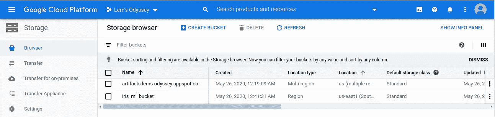

# 将你的机器学习模型在 GCP 上训练！

> 原文：<https://medium.com/analytics-vidhya/dockerize-your-machine-learning-model-to-train-it-on-gcp-3957e018faaa?source=collection_archive---------8----------------------->


*相关代码可以在* [*我的 GitHub repo*](https://github.com/aminelemaizi/docker-gcp-ml) *这里找到，你可以随心所欲的使用。*

# 用例是什么？

你刚刚制作了一个需要训练的机器学习模型，但不幸的是，你没有进行计算所需的资源，所以你的第一个想法可能是转向现有的云解决方案，如 GCP，它将为你提供“廉价”的计算能力…但是…我们如何轻松优雅地使用它来训练和收集我们的模型，做一些预测，并获得结果作为一个甜蜜的 csv、excel 或任何东西？我知道大多数数据科学家都有点害怕这个名为“云”的毛茸茸的大怪物，所以我将向您展示如何进行操作，并尽可能简单明了地进行操作。

# 大意？

下图简要描述了我们将如何进行，以及实现我们目标的主要支柱是什么。


*   Index 1 :基于 Ubuntu 的 Docker 镜像，我们将向其中添加所需的依赖项，以使 Python 能够满足所有必要的需求。用于学习和与我们的云存储桶通信的主要脚本将包含在这个映像中。在本地创建图像后，我们将把它推送到 Google 容器注册表，这样它就可以是私有的，可以从内部调用。
*   **索引 2** :一个 GCP 计算实例，我们称之为 VM(虚拟机)，这是我们的“计算机”或“服务器”。
*   **索引 3** :我们将把我们的 VM 实例链接到创建的 Docker 映像(位于 Google 容器注册表中)，这样当实例启动时，它将加载 Docker 化应用程序的容器。
*   **索引 4** :我们的训练数据集在云存储桶里。当加载 Docker 图像我们的脚本(`main.py`)时，我们将使用 Python 中使用的 GCP API 加载训练数据集。
*   **索引 5** :在使用我们的 VM 实例的资源完成我们的训练之后，我们将把我们训练好的模型保存在云存储桶中。

您可以根据自己的需求和用例调整这种架构和代码，这里得到的是关于如何对流程进行 dockerize，然后从存储桶中放入或取出数据的一般想法。

# 创建主脚本

我们在这里展示的脚本只是一个虚拟脚本，我们将在鸢尾物种数据集上使用决策树进行学习，但总体思路是相同的，可以根据您的情况进行扩展或调整。它由三部分组成:

1.  从存储桶加载训练数据集。
2.  进行训练并将模型保存为容器中的泡菜。
3.  把腌好的模型写到你的桶里。

我们感兴趣的两部分是第一和第三部分。

## 如何从存储桶加载数据

`storage.Client()`是连接到我们的云存储的东西，不需要给它凭证，因为它将从我们的 GCP 生态系统中运行。我们唯一需要的是在特权模式下运行容器(我们将在后面看到)。

`storage_client.download_blob_to_file`将训练数据集保存在我们的 docker 容器中，它需要两个参数，第一个是`gs://iris_ml_bucket/iris.csv`,表示包含在桶中的训练数据集路径，在您的情况下，它必须具有下面的形式`gs://<name-of-your-bucket>/path/to/file`，第二个是文件对象，这里命名为`train_file`，用于在容器内部本地写入数据集。

## 如何将保存的模型从我们的容器转移到存储桶中

这里`storage.Client()`再次连接到我们的云存储。然后我们使用`bucket = storage_client.get_bucket('iris_ml_bucket')`来选择特定的存储桶，`iris_ml_bucket`是存储桶的名称。为您自己的**现有的**铲斗取相应的正确名称。

`blob = bucket.blob("trained_model.pkl")`定义了“结束点”，换句话说，我们对我们的代码说“*我们计划在名为* `*trained_model.pkl*`的桶内创建一个文件”。

既然我们已经计划好了未来保存模型的位置和名称，现在是时候使用`blob.upload_from_filename`上传它了，它采用的参数是保存模型的容器本地文件路径。

除了 Python 脚本，我们还需要它在包方面的需求。我们将把这两个文件放在名为`app`的文件夹中。

```
app
├── main.py
└── requirements.txt
```

# 创建 Docker 图像并将其推送到 Google 容器注册中心

## 创建 Docker 图像

*如果你需要 Docker 参考资料，这里有一份我做的备忘单:*[*https://github . com/aminelemaizi/Cheat-sheets/blob/master/Docker-Cheat-sheet . MD*](https://github.com/aminelemaizi/cheat-sheets/blob/master/Docker-Cheat-Sheet.md)*。*

我们需要对我们的流程进行文档化，为此，主要步骤是创建我们的`Dockerfile`。这里用注释`Dockerfile`来解释每个步骤:

接下来是这个图像的构建，命名为`ml-iris`:

```
docker build -t ml-iris .
```

确保文件夹`app`与我们的`Dockerfile`在同一层。

```
.
├── app
│   ├── main.py
│   └── requirements.txt
└── Dockerfile
```

## 将 Docker 图像推送到 Google 容器注册表

确保你的机器上安装了 GCP 客户端，这样你就可以使用`gcloud`命令了。这个环节我们将向你展示如何进行:[https://cloud.google.com/sdk/docs/quickstarts](https://cloud.google.com/sdk/docs/quickstarts)。

为了保证我们的图像是私人的，我们现在将尝试把它推到我们的谷歌容器注册表，但首先我们必须确保这项服务被激活。


现在让我们准备带有正确标记的 Docker 图像，为此您必须执行以下命令:

```
docker tag ml-iris gcr.io/<gcp-project-id>/ml-iris
```

你的标签必须尊重某个布局是`grc.io/<gcp-project-id>/<image-name>`，首先`grc.io`表示谷歌容器注册表，然后你必须把你使用的 GCP 项目 id，最后你的 Docker 图像名称。

既然图像已经有了正确的标签，我们必须确保通过运行以下命令从我们自己的计算机到我们的 GCP 帐户进行身份验证:

```
gcloud auth login
```

剩下的工作就是使用以下代码将 Docker 映像推送到 Google 容器注册中心:

```
gcloud docker -- push gcr.io/lems-odyssey/ml-iris
```

如果一切正常，你会看到你的 Docker 图像出现在你的云注册表上，正如你所注意到的，可见性是“私人的”，意味着没有人可以访问我们的绝密机器学习脚本。


# 创建云存储桶

为了在 GCP 下创建一个新的存储桶，您需要在左侧菜单中选择**存储**部分下的**存储**选项。


为您的存储桶选择一个唯一的名称，出于演示的目的，没有必要更改其他选项，因此如果您有一些特定的使用情形，请相应地更改存储选项(例如，确保将您所有的 GCP 产品放在同一个区域以减少延迟)。本演示唯一需要更改的选项是**访问控制**，它必须设置为“统一”(在我们的演示中不需要创建特殊的访问列表)。


确保在您的 Docker Python 脚本(`main.py`)中提到了所选择的 bucket 名称。正如您在这里看到的，显示了我为存储 iris 机器学习数据集而创建的存储桶(`iris_ml_bucket`)。



不要忘记将您的训练数据集上传到这个新创建的桶中(与 Python 脚本中提到的名称相同)。


# 创建一个链接到 Docker 映像的虚拟机实例

现在是“核心部分”，创建实例本身就是运行学习，保存生成的经过训练的机器学习模型。怎么会？基于 Docker 映像选择 VM 实例的事实将在启动 VM(即启动容器)时执行我们的`main.py`脚本。因此，在创建 Docker VM 实例之后，我们只需稍作等待，就可以在链接的 bucket 上找到保存为 pickle 的训练模型。

要创建一个实例，您必须在**计算**部分选择名为**计算引擎**的选项。


然后选择创建一个新的 VM 实例，给它一个有意义的名称。为了我们的演示，我们只对修改两个重要的主要选项感兴趣。

首先，在 **Container** 部分下，选中***Deploy a Container image to this VM instance***选项，并在***Container image***字段中指明用于 Google 容器注册表的 Docker image 标记(在我的例子中是`gcr.io/lems-odyssey/ml-iris`)。之后点击 ***高级容器选项*** 并勾选 ***以特权身份运行*** 选项，这样容器就可以与存储器进行通信而不会出现问题，并对其进行写入。


其次，除了以特权身份运行我们的容器之外，我们还需要为我们的 VM 实例提供对云存储的读写访问权。为此，在虚拟机实例创建的 ***身份和 API 访问*** 部分下，为 ***访问范围*** 子部分选择 ***为每个 API*** 设置访问选项。


下去，直到你找到**存储**的选项，然后选择*读写*而不是*只读*。


现在剩下的工作就是创建实例并等待一段时间(即使是一个虚拟的例子，您也需要等待 3 到 4 分钟)，然后检查 bucket。这样，我们会发现我们的训练模型保存为一个泡菜文件在我们的桶里，正如你在这里看到的(`trained_model.pkl`)。


# 难道我们只能在没有图形用户界面的 shell 中完成所有这些工作吗？

答案是肯定的！我们可以在我们的 shell 中轻松地重做所有这些操作，我们将一起看到实现相同结果的命令。

首先，确保您的布局与此相同:

```
.
├── app
│   ├── main.py
│   └── requirements.txt
├── Dockerfile
└── iris.csv
```

下面是要使用的 shell 脚本:

如果这个脚本中有你不理解的选项，最好谷歌一下！

这都是乡亲们！

您可以在 [Twitter](https://twitter.com/ALemaizi) 、[脸书](https://www.facebook.com/lemsodyssey/)、 [LinkedIn](https://www.linkedin.com/company/lemsodyssey/) 或 [Medium](/@amine.lemaizi) 上关注我，有新帖子发布时会通知您！

登月小艇出去！！！