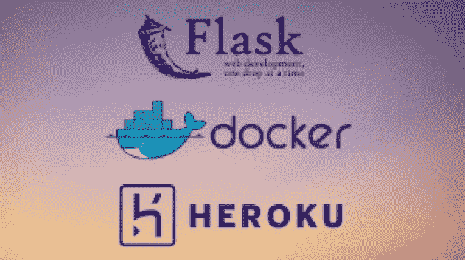

# 将您的 Python Flask 应用程序打包并部署到 Heroku 上

> 原文：<https://medium.com/analytics-vidhya/dockerize-your-python-flask-application-and-deploy-it-onto-heroku-650b7a605cc9?source=collection_archive---------2----------------------->



在这篇博客中，我们可以看到如何将一个简单的 python flask 应用程序 dockerize 并将其部署到 Heroku 上。这篇博客假设你已经在你的电脑上安装了 Docker 和 Heroku。如果不是这样，可以从 [***这里***](https://docs.docker.com/get-docker/) 和 [***这里***](https://devcenter.heroku.com/articles/heroku-cli#download-and-install) 轻松安装。

首先，创建一个新目录`my-dir`并在目录中移动。

创建一个名为`app.py`的 python 文件，其中包含以下内容

```
**from flask import Flask, render_template
import os****app = Flask(__name__)****@app.route('/')
def fun():
    return render_template('index.html')****if __name__ == '__main__':
    port = int(os.environ.get('PORT', 5000))
    app.run(host='0.0.0.0', port=port, debug=True)**
```

创建一个名为`**templates**`的新目录(在`**my-dir**` 目录内)，并在其中创建一个名为`**index.html**` 的 HTML 文件，内容如下。

```
**<!DOCTYPE html>
<html lang="en">
    <head>
        <title>Document</title>
    </head>
    <body>
        <h1>Successfully dockerized your python app</h1>
    </body>
</html>**
```

现在用下面的内容创建一个`**requirements.txt**`。

```
**Flask==1.1.1**
```

因此，我们创建了一个基本的 flask 应用程序设置。现在，我们需要对应用程序进行归档。

# 创建 Dockerfile 文件

为了对我们的 python Flask 应用程序进行 docker 化，我们需要一个**Docker 文件**，其中包含构建 **Docker 映像**所需的指令，该映像包含创建一个可以在 Docker 平台上运行的 **docker 容器**的指令集。

用以下内容创建一个名为`**Dockerfile**`(注意:没有任何扩展名)的文件。

```
**FROM python:3.6-buster
WORKDIR /app
COPY requirements.txt .
RUN pip install -r requirements.txt
COPY . .
CMD ["python", "app.py"]**
```

对于 Docker 文件中的每个指令/命令，Docker 图像生成器生成一个图像层，并将其堆叠在前面的图像层上，因此每一层仅包含来自其前面的层的变化。因此，如此获得的 Docker 图像是组成层的只读堆栈。

## **逐行解释:**

```
**1\. FROM python:3.6-buster**
```

> 通过，我们可以在基础映像上构建所需的映像。这里我们选择的基础映像是 buster，它是一个 [Docker 自己的“官方”python 映像](https://github.com/docker-library/python/blob/12d6c5c56a2d39defa4431cfaeed2b5581e05f19/3.6/buster/Dockerfile)。这个映像本身很大，但这些包是通过其他官方 Docker 映像将使用的公共映像层安装的，因此总体磁盘使用率会很低。

```
**2\. WORKDIR /app**
```

> 设置当前工作目录。

```
**3\. COPY requirements.txt .**
```

> 将依赖关系文件从您的主机复制到当前工作目录。

```
**4\. RUN pip install -r requirements.txt**
```

> 安装所有依赖项或 pip 包。

```
**5\. COPY . .**
```

> 将您的应用程序的其余源代码从您的机器复制到容器的当前工作目录中。

```
**6\. CMD ["python", "app.py"]**
```

> CMD 是在容器启动时运行的命令。它指定了映像中的一些元数据，这些元数据描述了如何运行基于该映像的容器。在这种情况下，它表示该映像要支持的容器化进程是 python app.py。每个 Dockerfile 只能有一个 CMD 命令，如果有更多，则最后一个 CMD 命令将生效。

现在，我们已经完成了所有需要的源代码。目前，目录结构如下:

```
**my-dir** ----**app.py
     ** ----**templates** ----**index.html** ----**Dockerfile** ----**requirements.txt** 
```

# 让我们创建 Docker 图像

让我们在本地构建 Docker 映像，并运行以确保服务在本地运行。在终端中运行以下命令，从 my-dir 目录创建 docker 映像。`-**t**`标志用于给新创建的图像命名。

```
**$ docker image build -t my-app .**
```

以上命令可能需要 16 分钟才能运行完毕，这取决于您的网速。

运行以下命令，验证您是否成功构建了 docker 映像。如果你看到你的图片(`**my-app**`)列在那里，那意味着你成功了。

```
**$ docker image ls**
```

# 运行 docker 容器

```
**$ docker run -p 5000:5000 -d my-app**
```

在上面的命令中,`-**p**`标志用于向主机发布容器的端口。在这里，我们将 docker 容器中的端口 5000 映射到主机上的端口 5000，这样我们就可以访问位于 [localhost:5000](http://localhost:5000/) 的应用程序，`-**d**`标志在后台运行容器，并打印 ***容器 ID*** *。*

检查 [localhost:5000](http://localhost:5000/) ，如果您看到标题“**成功对接您的 python 应用程序”，**那么我们成功对接了应用程序。

## 停止并移除 docker 容器

下面的命令停止并从 localhost:5000 中删除 dockerized 容器。**集装箱 id** 预先打印在终端上。

```
**$ docker container stop <container id>
$ docker system prune**
```

# 部署到 Heroku

首先，您需要登录 Heroku CLI。

```
**$ heroku container:login**
```

它将打开浏览器，并提示您使用 Heroku 凭证登录，如果您尚未登录，或者如果您已经在浏览器中登录了 Heroku 帐户，只需在新的浏览器选项卡上单击登录即可。

如果登录成功，您将会收到“登录成功*”消息。*

运行下面的命令在 Heroku 中创建一个应用程序，让 Heroku 准备好接收您的源代码。为您的应用程序输入任意名称。Heroku 不允许使用已经被使用的名字。

```
**$ heroku create <name-for-your-app>**
```

现在，你会收到一个链接，

*https://* ***<为你的应用命名>****. heroku app . com/*

现在，运行下面的命令将容器推入 Heroku(下面的命令可能需要几个小时，这取决于您的网速)。

```
**$ heroku container:push web --app <name-for-your-app>**
```

。此时，docker 容器被推送到 Heroku，但没有部署或释放。以下命令将部署容器。

```
**$ heroku container:release web --app <name-for-your-app>**
```

现在，这款应用已经发布并在 Heroku 上运行，你可以在下面的网站上看到它

*https://* <为你的应用命名> *.herokuapp.com/*

因此，我们成功地将 Python Flask 应用程序对接并部署到 Heroku 上。