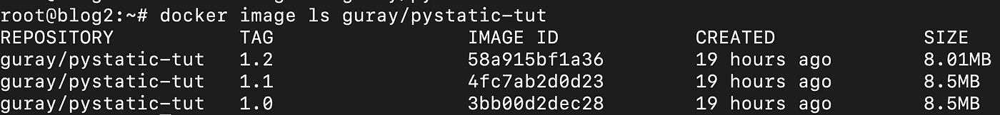
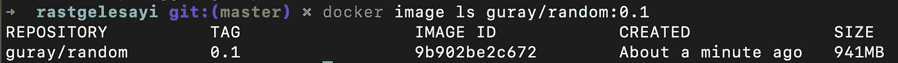
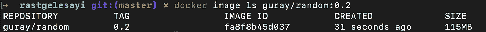
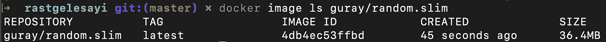

# 用 Python 编写不到 9 MB 的基于暂存映像的 REST API

> 原文：<https://medium.com/analytics-vidhya/dockerizing-a-rest-api-in-python-less-than-9-mb-and-based-on-scratch-image-ef0ee3ad3f0a?source=collection_archive---------3----------------------->



作为容器图像的包装应用多年来已经相当普遍。在创建容器图像时，例如使用 Docker，图像大小在许多情况下变得很重要；由于网络使用，(可能)增加了攻击面、磁盘使用、推拉时间、更长的构建时间……等等。最终图像经常包括许多未使用的组件；比如外壳、操作系统配置文件、库、构建时依赖项。在像 Go 这样的语言中，很容易创建一个静态链接的可执行文件，并将其包含在一个空映像中，如果可能的话，甚至可以不使用 OS。但是当使用 Python 和在运行时需要虚拟机的语言时，使用一种方法来实现相同的结果并不常见。在本帖中，我们将介绍一种为 Python 应用程序创建 Docker 映像的方法，这种方法将小于 9 MB，并且基于暂存映像。


会有更多的优化可能，毋庸置疑。我们正在通过使用一个工具集(我们认为)来达到小于 9MB 的目标。

# 用 Python 和 Flask 为 API 创建 Docker 映像

首先，让我们基于 Docker Hub 中的 Python 映像创建一个 Docker 映像。我们将在上面安装 Falcon 框架，以及作为应用服务器的 Gunicorn。随后，我们将检查图像大小。我们将使用一个带有基本随机整数生成器的回购作为示例。源代码可以从这里获得

[](https://github.com/gurayyildirim/rastgelesayi) [## gurayyildirim/rastgeleSayi

### 试用 Docker 的演示应用程序。通过在…上创建帐户，为 gurayyildirim/rastgeleSayi 的发展做出贡献

github.com](https://github.com/gurayyildirim/rastgelesayi) 

例如，我们将构建的 docker 文件是(与 repo 中的版本略有不同):

```
FROM python:3CMD gunicorn -b 0.0.0.0:80 rastgele:apiWORKDIR /codeADD requirements.txt requirements.txtRUN pip install -r requirements.txtADD . /code
```

让我们构建并查看图像的大小:

```
$ git clone [https://github.com/gurayyildirim/rastgelesayi](https://github.com/gurayyildirim/rastgelesayi) && cd rastgelesayi**# edit Dockerfile as above**$ docker build -t guray/random:0.1 .
... build output is truncated ...$ docker image ls guray/random:0.1
```



Docker 中 Python 容器图像大小的输出

它几乎是 1GB，这意味着对于一个小的 API，我们有一个成本为 1GB 的映像，其中包含许多我们甚至一次都没有打开过的文件。

这张图片有很多用途。但是对于一个小的 API 或者很多其他的应用程序；我们希望在不损失功能的情况下缩小图像。

# 使用 Alpine Linux 映像

优化映像大小的第一步是用基于 Alpine Linux 的映像更改基础映像。这样，我们应该得到更低的图像尺寸。的 docker 文件在 FROM 行中有唯一的区别:

```
FROM python:3-alpineCMD gunicorn -b 0.0.0.0:80 rastgele:apiWORKDIR /codeADD requirements.txt requirements.txtRUN pip install -r requirements.txtADD . /code
```

让我们再次构建并检查最终的图像大小:

```
$ docker build -t guray/random:0.2 .
... build output is truncated ...$ docker image ls guray/random:0.2
```



基于 Alpine Linux 的 Python Docker 图像示例

人数如预期的那样减少了。现在有用了。但是有一点要记住:Alpine Linux 附带的是 musl，而不是 glibc，后者在许多发行版中都很常见。它有时会导致预构建的二进制文件出现问题，以及其他情况。

尽管如此，它现在已经可以运行了，而且尺寸减小了。我们的应用程序也能够毫无问题地运行，因为 Falcon 本身是基于纯 Python 依赖的。

# 进一步优化

对我们来说，很明显，沉迷于这种优化可能会导致黑洞，我们很容易发现自己试图获得更多的位。但是，对于我们的应用来说，115MB 仍然是一个巨大的数字是可以理解的。

Docker Slim 是一个伟大的项目，可以自动查找缩小 Docker 图像，并试图使其更加安全。让我们在最后一张图片上试试:

```
$ docker-slim build --http-probe --expose 80 guray/random:0.2$ docker image ls guray/random.slim
```



带有用 Falcon 编写的 Python API 的精简 Docker 图像

通过 Docker Slim 的一些魔法，大小已经减少到 36MB。这是一个很好的工具，它可以帮你做很多繁重的工作。如果你好奇的话，[这里](https://github.com/docker-slim/docker-slim#design)是细节。

# 进一步优化

当用户的计算机上可能没有安装 Python 或任何依赖项时，您可能需要将应用程序分发给用户。在这些时候，我们不能期望每个人都手动安装 Python 和依赖项，这种情况并不少见。在这些情况下，我们试图为我们的应用程序创建一个包，一个包含 Python 和其他依赖项的包。

Python 中有一些工具可以帮助您为应用程序创建可分发的包。本质上，它们将 Python 二进制文件和依赖项与您的应用程序打包在一起。 **Pyinstaller** 和 Cx_freeze 就是其中的两个工具，它们会让我们的生活变得更加轻松。

在本文中，我们将坚持使用 Pyinstaller。没有什么重要的原因，除了我们发现它比我们经历过的其他东西更容易和直观(我们接受建议)。基本上，你只需向它提供你的应用程序，它就会生成一个目录，其中包含所有需要分发的文件。

在幕后，它扫描您的应用程序，找到导入的库(从 import 语句中)并将它们添加到包中，将 py 文件转换为 pyc，等等。它还附带了一些描述特定模块隐式导入的方法(称为*钩子*),以免在运行时抛出 ImportError 错误。还可以创建新的钩子来明确定义应用程序的依赖关系。

在这种情况下，Pyinstaller 应该为我们的应用程序提供一个更精简的打包版本，因为它没有包含所有的文件/模块，而是只包含过滤/显式使用的文件/模块。关于过程的更多细节，项目的[文档写得很精彩。](https://pyinstaller.readthedocs.io/en/stable/advanced-topics.html)

## 创建第一个包

让我们安装 Pyinstaller 并为我们的示例 API 创建一个包。因为 Pyinstaller 从我们的系统中收集模块，所以也应该安装需求(这只是为了戳一下，您应该在最后在一个容器中运行这些):

```
$ pip3 install pyinstaller
... install output is truncated ...$ pip3 install -r requirements.txt
... install output is truncated ...$ pyinstaller rastgele.py
... a lot of output describing the process here ...
```

这个过程完成后， **dist** 目录将包含我们的文件作为一个目录。我们可以将这个目录包含在一个映像中，然后就可以开始了。让我们看看这个目录的大小:

```
$ du -sh dist/rastgele/15M dist/rastgele/
```

所以我们的文件要花 15MB。如果需要，我们可以压缩这个目录，使用 tar 归档并使用 gzip 进行压缩，结果是 66m:

```
$ tar czf rastgele.tar.gz dist/rastgele/
$ ls -lh rastgele.tar.gz-rw-r--r-- 1 x x 6.6M May 15 11:07 **rastgele.tar.gz**
```

然而，这种方法需要在目标计算机/容器映像上安装 tar 和 gzip，并且我们应该在开始时定义一种清晰的方法来提取它。

## 运行应用程序—哎呀！😬修好它。

让我们试着运行我们的应用程序，看看发生了什么。有一个与我们的 Python 文件同名的可执行二进制文件，我们将直接运行它:

```
$ cd dist/rastgele/$ ./rastgele
$
```

什么都没发生。这里的问题不止一个。首先，Pyinstaller 只运行 Python 文件，我们的文件不包含在直接执行时自己运行的结构。换句话说，当我们使用 gunicorn 时，我们正在用它启动我们的 API 服务器。但是现在，Pyinstaller 不知道它，只是尝试*‘python rastgele . py’*。

Gunicorn 文档中解释了这个问题的解决方案，即添加一个标准的“if _ _ name _ _ = =”_ _ main _ _“条件块，并在应用程序内直接启动 guni corn[。我们正在像 Gunicorn 的例子一样实现它。让我们看看它是如何发生的:](https://docs.gunicorn.org/en/latest/custom.html)

我们应该导入 Gunicorn BaseApplication 类。所以在程序的导入部分插入这个代码(**最后的完整代码被添加到**下面):

```
from gunicorn.app.base import BaseApplication
```

然后，如果程序直接运行，我们可以定义相同的类并初始化它:

```
class StandaloneRandomNumberAPI(BaseApplication):def __init__(self, app, options=None):
        self.options = options or {}
        self.application = app
        super().__init__()def load_config(self):
        config = {key: value for key, value in self.options.items()
                  if key in self.cfg.settings and value is not None}
        for key, value in config.items():
            self.cfg.set(key.lower(), value)def load(self):
        return self.applicationif __name__ == "__main__":

    options = {
        'bind': '%s:%s' % ('0.0.0.0', '80'),
        'workers': 4,
    }
    StandaloneRandomNumberAPI(api, options).run()
```

程序应该是这样的:

[https://gist . github . com/gurayyildirim/ff 2d 8 e 12a 3d 0 faaa 29 ba 802393 e 23806](https://gist.github.com/gurayyildirim/ff2d8e12a3d0faaa29ba802393e23806)

现在尝试运行最后的代码:

```
$ python3 rastgele.py 
[2020-05-15 11:54:47 +0000] [1239] [INFO] Starting gunicorn 19.7.1
[2020-05-15 11:54:47 +0000] [1239] [INFO] Listening at: [http://0.0.0.0:80](http://0.0.0.0:80) (1239)
[2020-05-15 11:54:47 +0000] [1239] [INFO] Using worker: sync
[2020-05-15 11:54:47 +0000] [1243] [INFO] Booting worker with pid: 1243
[2020-05-15 11:54:47 +0000] [1244] [INFO] Booting worker with pid: 1244
[2020-05-15 11:54:47 +0000] [1245] [INFO] Booting worker with pid: 1245
[2020-05-15 11:54:47 +0000] [1246] [INFO] Booting worker with pid: 1246
```

我们的应用程序现在正在运行。这意味着我们可以重新包装它:

```
$ pyinstaller rastgele.py
... output removed ...$ du -sh dist/rastgele/
15M dist/rastgele/
```

现在让我们试着运行我们的应用程序:

```
$ ./dist/rastgele/rastgeleError: class uri 'gunicorn.glogging.Logger' invalid or not found:[Traceback (most recent call last):
  File "gunicorn/util.py", line 134, in load_class
  File "importlib/__init__.py", line 126, in import_module
  File "<frozen importlib._bootstrap>", line 994, in _gcd_import
  File "<frozen importlib._bootstrap>", line 971, in _find_and_load
  File "<frozen importlib._bootstrap>", line 953, in _find_and_load_unlocked
ModuleNotFoundError: No module named 'gunicorn.glogging'
]
```

又出错了！我们检查这个错误的原因是，根据您的堆栈，它可能是频繁的或罕见的。但是它们帮助我们理解整个机制是如何工作的。

解决方案是表达隐式依赖(称为**隐藏导入**)。有几种方法可以解决这个问题。我们将坚持通过 CLI 将它们传递给 Pyinstaller。从这里我们可以看到**guni corn . gloging**是一个缺失的依赖项。而在尝试之前，我还想分享另一个: **gunicorn.workers.sync** 。为了让 Pyinstaller 知道它们，只需传递它们的名称(这只是方法之一):

```
$ pyinstaller rastgele.py --hidden-import "gunicorn.glogging" --hidden-import "gunicorn.workers.sync"
...
*8811 INFO: Analyzing hidden import 'gunicorn.glogging'
9187 INFO: Analyzing hidden import 'gunicorn.workers.sync'*
...
```

现在尝试运行我们的应用程序。它应该没有任何错误:

```
$ ./dist/rastgele/rastgele 
[2020-05-15 12:26:59 +0000] [1897] [INFO] Starting gunicorn 19.7.1
[2020-05-15 12:26:59 +0000] [1897] [INFO] Listening at: [http://0.0.0.0:80](http://0.0.0.0:80) (1897)
[2020-05-15 12:26:59 +0000] [1897] [INFO] Using worker: sync
[2020-05-15 12:26:59 +0000] [1901] [INFO] Booting worker with pid: 1901
[2020-05-15 12:26:59 +0000] [1902] [INFO] Booting worker with pid: 1902
[2020-05-15 12:26:59 +0000] [1903] [INFO] Booting worker with pid: 1903
[2020-05-15 12:26:59 +0000] [1904] [INFO] Booting worker with pid: 1904
```

大小会稍微增加，但不会太多(在我们的例子中，使用-h 参数甚至不会明显地增加):

```
$ du -sh dist/rastgele/
15M dist/rastgele/
```

## 使它成为一个文件

最后一部分是将我们的应用程序打包成一个二进制可执行文件。Pyinstaller 有一个 **-F** 参数来完成这项工作。它包括一个引导程序，可以从文件中提取你的文件，然后运行它们。这种打包也负责压缩，因此二进制文件的大小将类似于我们之前压缩的文件:

```
$ ls -lh ./dist/rastgele
-rwxr-xr-x 1 root root 7.0M May 15 12:32 ./dist/rastgele
```

现在我们有了一个大小为 7.0MB 的二进制文件，我们可以直接运行它:

```
$ ./dist/rastgele 
[2020-05-15 12:33:57 +0000] [2229] [INFO] Starting gunicorn 19.7.1
[2020-05-15 12:33:57 +0000] [2229] [INFO] Listening at: [http://0.0.0.0:80](http://0.0.0.0:80) (2229)
[2020-05-15 12:33:57 +0000] [2229] [INFO] Using worker: sync
[2020-05-15 12:33:57 +0000] [2233] [INFO] Booting worker with pid: 2233
[2020-05-15 12:33:57 +0000] [2234] [INFO] Booting worker with pid: 2234
[2020-05-15 12:33:57 +0000] [2235] [INFO] Booting worker with pid: 2235
[2020-05-15 12:33:57 +0000] [2236] [INFO] Booting worker with pid: 2236
```

成功。现在，我们可以将该文件复制到 CentOS、Debian、Ubuntu 等的映像中，例如在 Docker 多阶段构建中的一个阶段中生成之后。但不是**阿尔卑斯☹️** 如果你以前在一个案例中遭遇过，那就不是用 glibc，而是 musl。它会导致运行时的链接错误，这对于很多人来说甚至不是一个容易理解的错误。这也是为什么阿尔卑斯山的图像尺寸很小的原因之一，所以不是一件坏事。如果您很好奇，可以尝试在 Alpine Linux 容器中运行这个二进制文件。

## 与 Glibc 和其他库打包—静态链接

最后一步是打包我们的应用程序，使其包含所有相关的库。这有点像静态链接，你可能听过或用过。为了创建包含所有库的包，我们将使用 **StaticX** 。它需要系统上的 ldd(可能已经安装了)、binutils、gcc 和 patchelf(应该从存储库中构建)包作为依赖项。

对于基于 CentOS 的构建系统，下面列出了命令。您可能更喜欢逐个安装，而不是使用“成组安装”来实现相同的功能:

```
$ yum install binutils wget -y
$ yum group install "Development Tools" -y
```

下载、编译并安装 [**patchelf**](https://github.com/NixOS/patchelf) (为简洁起见，输出被删除):

```
$ cd / && wget [https://github.com/NixOS/patchelf/archive/0.10.tar.gz](https://github.com/NixOS/patchelf/archive/0.10.tar.gz)
$ tar xzf 0.10.tar.gz
$ cd patchelf-0.10/
$ ./bootstrap.sh
$ ./configure
$ make
$ make install
```

之后，我们准备安装 StaticX:

```
$ pip3 install staticx
```

现在我们准备创建包含所有依赖库的二进制文件。转到项目目录，进入其中的 *dist* 目录:

```
$ cd dist/
```

对其运行 StaticX:

```
$ staticx rastgele rastgele_app
```

这将需要一段时间，然后我们的最终文件将准备好:

```
$ ls -lh
total 16M
-rwxr-xr-x 1 root root 7.0M May 15 12:32 rastgele
-rwxr-xr-x 1 root root 8.2M May 15 16:36 rastgele_app
```

现在我们有了一个 8.2M 的文件，其中包含了 API 应用程序所需的所有对象。我们甚至可以在临时映像中使用该二进制文件。

如果您尝试运行它，staticX 会将打包的文件提取到一个临时目录中的 **/tmp** ，该目录的名称以 **staticx-** 开头。而且；pyinstaller 也将在 **/tmp** 中创建一个临时目录，像我们在本文开始时使用的目录打包模式一样提取你的应用程序文件。pyinstaller 创建的目录名以 **_MEI** 开头，后面是一些随机字符。当您的应用程序正常关闭时，这些临时目录也会自动删除。

# 带有最小图像的示例 Dockerfile 文件

为应用程序创建静态文件后，现在我们准备将它打包成 Docker 映像。我们将使用 **scratch** 图像作为基础图像，因此它不会包含除我们的应用程序之外的任何文件。您还应该在二进制文件所在的目录中创建一个名为 **tmp** 的目录，因为 scratch image 没有/tmp，也没有 *mkdir* 命令。

```
$ mkdir tmp
```

以下是一个 docker 文件示例:

```
FROM scratch
ENTRYPOINT ["/rastgele_app"]COPY tmp /tmp
COPY rastgele_app /
```

保存 Dockerfile 文件并开始构建:

```
$ docker build -t guray/pystatic-tut:1.0 .
...
Successfully tagged guray/pystatic-tut:1.0
```

现在我们准备尝试一下:

```
$ docker run -it --rm guray/pystatic-tut:1.0
[2020-05-15 16:48:29 +0000] [7] [INFO] Starting gunicorn 19.7.1
[2020-05-15 16:48:29 +0000] [7] [INFO] Listening at: [http://0.0.0.0:80](http://0.0.0.0:80) (7)
[2020-05-15 16:48:29 +0000] [7] [INFO] Using worker: sync
[2020-05-15 16:48:29 +0000] [13] [INFO] Booting worker with pid: 13
[2020-05-15 16:48:29 +0000] [14] [INFO] Booting worker with pid: 14
[2020-05-15 16:48:29 +0000] [15] [INFO] Booting worker with pid: 15
[2020-05-15 16:48:29 +0000] [16] [INFO] Booting worker with pid: 16
```

# 提高安全性—将用户改为无用户

最后一步，我们将把我们的用户改为 nobody。因为有很多环境不允许使用 **root** 或 **id 0** 用户运行容器，所以在我们正在帮助的环境中，这经常是必要的。为此，只需将端口更改为大于 1024 的数字(由于 unix 系统的特性，即使端口≤1024 也需要 root 访问权限，即使它在容器内部)。因此，编辑代码中的选项行，如下所示:

```
options = {
        'bind': '%s:%s' % ('0.0.0.0', '8000'),
        'workers': 4,
    }
```

并再次打包:

```
$ pyinstaller -F rastgele.py --hidden-import "gunicorn.glogging" --hidden-import "gunicorn.workers.sync"
$ cd dist/
$ staticx rastgele rastgele_app
```

现在，它可以再次打包了，但同时带有一个更新的 docker 文件:

```
FROM scratchENTRYPOINT ["/rastgele_app"]
USER 65535COPY --chown=65535:65535 tmp /tmp
COPY --chown=65535:65535 rastgele_app /
```

之后，我们可以构建映像并运行从它创建的容器:

```
$ docker run -it --rm guray/pystatic-tut:1.1
[2020-05-15 16:58:29 +0000] [8] [INFO] Starting gunicorn 19.7.1
[2020-05-15 16:58:29 +0000] [8] [INFO] Listening at: [http://0.0.0.0:8000](http://0.0.0.0:8000) (8)
[2020-05-15 16:58:29 +0000] [8] [INFO] Using worker: sync
[2020-05-15 16:58:29 +0000] [14] [INFO] Booting worker with pid: 14
[2020-05-15 16:58:29 +0000] [15] [INFO] Booting worker with pid: 15
[2020-05-15 16:58:29 +0000] [16] [INFO] Booting worker with pid: 16
[2020-05-15 16:58:29 +0000] [17] [INFO] Booting worker with pid: 17
```

现在检查图像大小:

```
$ docker image ls guray/pystatic-tut:1.1
REPOSITORY           TAG                 IMAGE ID            CREATED             SIZE
guray/pystatic-tut   1.1                 4fc7ab2d0d23        41 seconds ago      8.5MB
```

# 进一步优化

如果您很好奇，在运行 pyinstaller 时将-OO 传递给 Python 也将帮助您获得几个字节。就这样跑:

```
$ python3 -OO -m PyInstaller -F rastgele.py --hidden-import "gunicorn.glogging" --hidden-import "gunicorn.workers.sync"
```

这将删除文档字符串和其他一些东西。更多细节可以在 Python 手册和 PyInstaller 手册中找到。

我们还可以在使用 StaticX 时 [**剥离**](https://en.wikipedia.org/wiki/Strip_(Unix)) 二进制文件。它的参数是:

```
$ cd dist/
$ staticx --strip rastgele rastgele_app
```

如果您将以前的版本复制为/r1，将当前版本复制为/r2，您可以看到大小差异:

```
$ ls -l /r1 /r2
-rwxr-xr-x 1 root root 8499512 May 15 17:03 /r1
-rwxr-xr-x 1 root root 8005856 May 15 17:04 /r2
```

这就像 0.5MB 现在在我们这边，(希望)不会失去任何功能。让我们构建并运行它:

```
$ docker build -t guray/pystatic-tut:1.2 .
$ docker run -it --rm guray/pystatic-tut:1.2
[2020-05-15 17:06:36 +0000] [7] [INFO] Starting gunicorn 19.7.1
[2020-05-15 17:06:36 +0000] [7] [INFO] Listening at: [http://0.0.0.0:8000](http://0.0.0.0:8000) (7)
[2020-05-15 17:06:36 +0000] [7] [INFO] Using worker: sync
[2020-05-15 17:06:36 +0000] [13] [INFO] Booting worker with pid: 13
[2020-05-15 17:06:36 +0000] [14] [INFO] Booting worker with pid: 14
[2020-05-15 17:06:36 +0000] [15] [INFO] Booting worker with pid: 15
[2020-05-15 17:06:37 +0000] [16] [INFO] Booting worker with pid: 16
```

而现在的图像是 **8.01MB** :

```
docker image ls guray/pystatic-tut
REPOSITORY           TAG                 IMAGE ID            CREATED             SIZE
guray/pystatic-tut   1.2                 58a915bf1a36        40 seconds ago      8.01MB
guray/pystatic-tut   1.1                 4fc7ab2d0d23        8 minutes ago       8.5MB
```

如果需要进一步优化，可以安装[**upx**](https://upx.github.io/)；然后，如果它在路径中或者提供了它的路径，pyinstaller 将使用它来进一步压缩您的包。对于我们的例子，使用它没有任何好处，因为我们的包由编译的二进制文件组成。但仍然值得一试。

# 结论

同样，它就像一个黑洞。很明显，有很多其他的可能性，将减少图像的大小。如果你对它们有想法，请在评论中分享。我们将很乐意尝试它们，并根据结果更新故事。