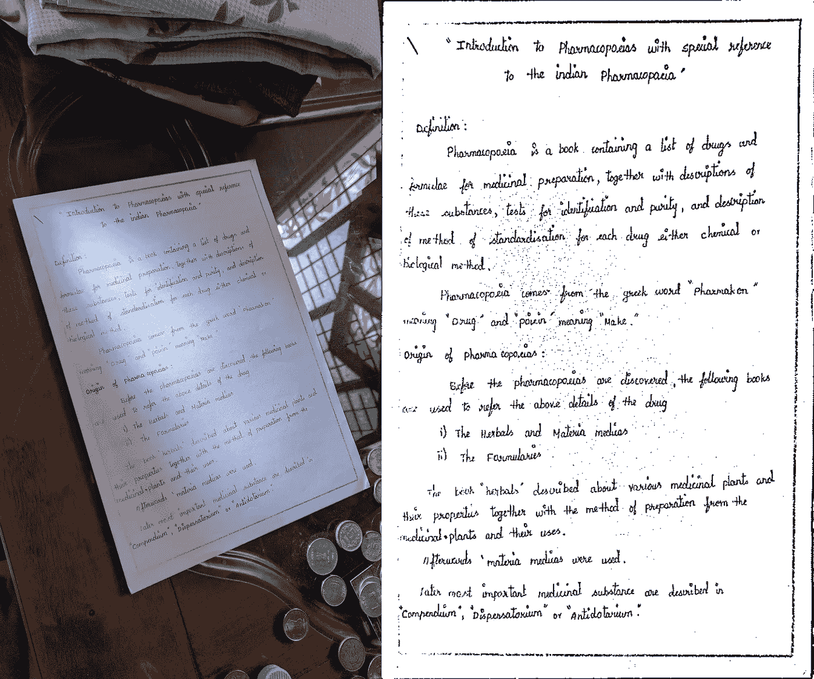
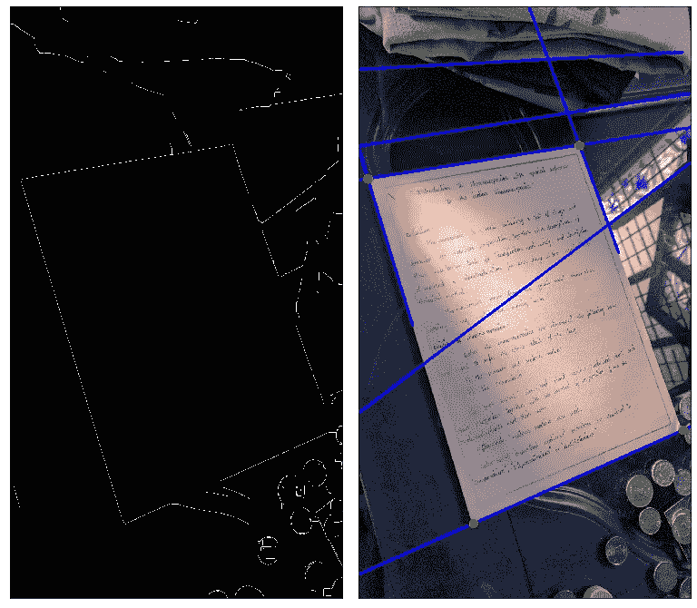
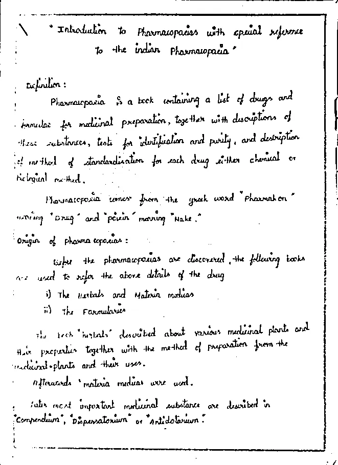

# 使用 OpenCV 的文档扫描仪(HoughLines 方法)

> 原文：<https://medium.com/analytics-vidhya/document-scanner-using-opencv-houghlines-approach-eb276dd4a0a?source=collection_archive---------4----------------------->



原始图像(左)，扫描图像(右)

在这篇文章中，解释了使用 python 和 OpenCV 从头开始制作文档扫描仪的步骤。这篇文章的一个有趣的特点是 Houghlines 已经被用于边界检测。流行的轮廓方法在处理光线不佳、边界嘈杂的图片时存在性能问题，因此这是一种可供选择的方法。

整个过程将在下面逐步解释。

1.  **导入所有需要的库**

```
from skimage.filters import threshold_local
import numpy as np
import cv2 as cv
```

**2。读取图像并处理图像进行边缘检测**

图像被转换为灰度级，并进行模糊处理以平滑图像。形态学膨胀和腐蚀被用来移除不需要的特征(有助于边缘检测)。然后使用 canny 边缘检测来寻找图像中的边缘。

```
img=cv.imread("document.png")
gray=cv.cvtColor(img,cv.COLOR_BGR2GRAY)kernel = np.ones((5,5),np.uint8)
dilation = cv.dilate(gray,kernel,iterations =5)
blur =cv.GaussianBlur(dilation,(3,3),0)
blur= cv.erode(blur,kernel,iterations =5)edge=cv.Canny(blur,100,200)
```

**3。在 canny 边缘检测后使用 Houghlines 寻找图像中的文档边缘**

在 canny 边缘检测之后，Houghlines 被用来从图像中找到前 n 条*(这里是 8)* 线。最初，已经选择了高阈值*(这里是 300)* ，并且阈值被迭代地降低，以获得所需数量的 Houghlines。多余的线(具有相似的 *rho* 和*θ*值的线)被移除，并且顶部四条线(对应于四条边)被选择。

```
t=300;j=0while(j<8 and t>0):     
    try:linesP=cv.HoughLines(edge,1,np.pi/180,t);j=linesP.shape[0]
    except:j=0
    t=t-10lines=linesP.reshape(linesP.shape[0],2)
t=0;c=0;lu=[]
for l in lines:
    c=c+1;rho,theta=l
    for lt in lines[c:]:
        t=0
        if(lt[0]!=l[0]):
            rhot,thetat=lt;k=abs(lt-l)<[50,0.5] 
            if(k[0] and k[1]):
                t=-1;break                
    lu.append(l)lr=np.asarray(lu[:4]);j=np.reshape(lr,[lr.shape[0],1,2])
```

**4。找到四条最可能的边的交点，以获得文档的角点**

找到对应于边界的垂直边的边的交点，这些交点将是矩形的四个角。

```
def l_inter(line1, line2):
    r1, t1 = line1;r2,t2 = line2
    A= np.array([[np.cos(t1),np.sin(t1)],[np.cos(t2),np.sin(t2)]])
    b= np.array([[r1],[r2]]);x0,y0=(0,0)
    if(abs(t1-t2)>1.3):
        return [[np.round(np.linalg.solve(A, b))]]def points_inter(lines):
    intersections = []
    for i, g in enumerate(lines[:-1]):
        for g2 in lines[i+1:]:
            for line1 in g:
                for line2 in g2:
                    if(l_inter(line1, line2)):
                        intersections.append(l_inter(line1, line2)) 
    return intersectionsp=np.asarray(points_inter(j)).reshape(4,2)
```



预处理图像上的 Canny 边缘检测(左)，原始图像上绘制的 Houghlines 和拐角(右)

**5。为了展平文档，我们使用透视变换和扭曲透视函数的方法**

点坐标的最大和最小和分别对应于右下角和左上角。同样的麦克斯。和 min。差异给出右上角和左下角。然后，这些用于为转换矩阵找到扫描文档的宽度和高度。

```
r= np.zeros((4,2), dtype="float32")
s = np.sum(p, axis=1);r[0] = p[np.argmin(s)];r[2] = p[np.argmax(s)]
d = np.diff(p, axis=1);r[1] = p[np.argmin(d)];r[3] = p[np.argmax(d)]
(tl, tr, br, bl) =rwA = np.sqrt((tl[0]-tr[0])**2 + (tl[1]-tr[1])**2 )
wB = np.sqrt((bl[0]-br[0])**2 + (bl[1]-br[1])**2 )
maxW = max(int(wA), int(wB))hA = np.sqrt((tl[0]-bl[0])**2 + (tl[1]-bl[1])**2 )
hB = np.sqrt((tr[0]-br[0])**2 + (tr[1]-br[1])**2 )
maxH = max(int(hA), int(hB))ds= np.array([[0,0],[maxW-1, 0],[maxW-1, maxH-1],[0, maxH-1]], dtype="float32")transformMatrix = cv.getPerspectiveTransform(r,ds)
scan = cv.warpPerspective(gray, transformMatrix, (maxW, maxH))
```

**6。图像被转换为 B & W 并保存在系统中**

进行二值化是为了将扫描的文档转换为黑白。这是通过阈值处理实现的。可以根据您的要求设置阈值和偏移值。

```
T = threshold_local(scan,21, offset=10, method="gaussian")
scanBW = (scan > T).astype("uint8")* 255
cv.imwrite("Scan.png",scanBW)
```



**注:**

给定示例中使用的各种参数是根据它们在这种情况下的性能选择的。您可能需要针对您的情况尝试不同的参数集。

**你可以在**[**https://github.com/Joel1712/Document_scanner**](https://github.com/Joel1712/Document_scanner)上看到完整的源代码