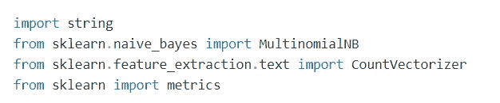

# 基于朴素贝叶斯的文档情感分析

> 原文：<https://medium.com/analytics-vidhya/document-sentiment-analysis-using-naive-bayes-8911f25f7c95?source=collection_archive---------11----------------------->

信用:吉诺·克雷斯科利——皮克斯拜

**引言**

T 每一行文字背后的情感可以广泛地概括为积极、消极或中立。该“*文档情绪分析*项目能够分析给定输入并预测其情绪。换句话说，训练后的模型将数据分类为*正*、*负*或*中性*。

**什么是情绪分析？**

*情绪分析*可以被定义为分析数据的自动化过程。我们基本上是确定/提取文本背后的情绪。这可用于确定和概括关于给定数据的人群的情绪、想法和感觉。

**为什么要进行情绪分析？**

在当今这个互联网蓬勃发展的时代，情绪分析的概念有许多应用:

*   它使我们能够全面了解广大公众的意见
*   社交媒体上的情绪变化已被证明与股市的变化有关
*   帮助企业检索有关其客户群对特定产品或服务的反应的信息
*   情绪分析帮助企业处理大量数据。这可以以一种有效和具有成本效益的方式来实现
*   实时分析情绪分析可以实时识别关键问题

**实现情绪分析的方法**

有 3 种方法可以实现情绪分析:

*   *基于规则的方法*:该方法涉及基于规则的系统，该系统基于一组手动制定的规则执行情感分析。这些规则决定了输出情绪，
*   *自动方法*:该方法涉及依赖机器学习技术从数据中学习的自动系统。使用数据集创建模型。分类器在训练后进行输出预测。
*   *混合方法*:该方法涉及将基于规则的方法和自动方法相结合的混合系统。

**工作**

对于这个项目，我们使用了*朴素贝叶斯*分类器。该分类器基于*贝叶斯定理*的原理工作。

**算法**

*   *第 1 步* : **开始**
*   *第 2 步*:计算各类别标签( *pos* 、 *neg* 、*中性*的概率。
*   *步骤 3* :计算每个标签的每个特征的条件概率。
*   *步骤 4* :将每个标签的条件概率相乘。
*   *第 5 步*:将标签概率乘以*第 4 步*。
*   *第六步*:用特征概率划分*第五步*。
*   *第七步*:概率最高的标签作为情感。
*   *第八步* : **停止**

工作中涉及的各种步骤

**依赖关系**

**样本输入**

考虑以下输入。我们将对这篇文章进行情感分析。

输入文本

输入文本被转换成用于分类的矢量化格式。在此之后，模型会对输入进行分析。

基于这种分析，模型预测每条线是正的、负的还是中性的。

**输出**

精确度和输出预测

正如我们所看到的，朴素贝叶斯分类器预测了文本的每一行所属的类别。此外，预测的准确度也显示为 92.61%。

**可视化**

使用 *matplotlib* 可以可视化输出预测。我们可以绘制出*阳性*、*阴性*和*中性*文本的百分比图。

预测的可视化

**结论**

文档情感分析确实是一种很好的方法，可以提取关于输入的情感和观点的本质。这可以在推广中发挥很大的作用，从而有助于各个领域的发展。

**参考文献**

*   名词（noun 的缩写）Anitha，B. Anitha 和 S. Pradeepa,《情感分类方法——综述》,第 3 卷第 1 期。印度，2013 年

 [## 情绪分析:它是如何工作的？为什么要用？

### 本质上，它是确定一系列词语背后的情感基调的过程，用来获得一种理解…

www.brandwatch.com](https://www.brandwatch.com/blog/understanding-sentiment-analysis/)  [## 1.9.朴素贝叶斯-sci kit-学习 0.23.2 文档

### 朴素贝叶斯方法是一组监督学习算法，基于应用贝叶斯定理和“朴素”学习理论

scikit-learn.org](https://scikit-learn.org/stable/modules/naive_bayes.html)