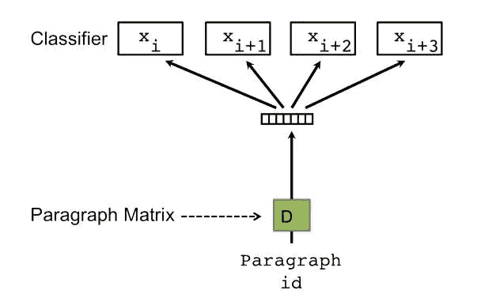
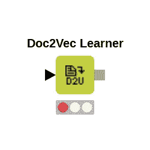

# 文档矢量化

> 原文：<https://medium.com/analytics-vidhya/document-vectorization-301b06a041?source=collection_archive---------2----------------------->



在我以前的博客文章中，我写了关于单词矢量化的实现和用例。你可以在这里阅读[。但是很多时候我们需要挖掘短语之间的关系，而不是句子之间的关系。举个例子](http://techscouter.blogspot.com/2017/10/word-vectorization.html)

*   约翰今年休了很多次假
*   树叶正在从树上落下

在这两个句子中，一个常见的单词“leaves”根据其所在的句子有不同的含义。这个意思只有在我们理解完整短语的上下文时才能理解。或者我们想测量短语的相似性，并将它们归入一个名称下。

这更多的是关于 python 中 doc2vec 的实现，而不是算法的细节。该算法使用分级 softmax 或负采样；参见 [**托马斯·米科洛夫、程凯、格雷格·科拉多和杰弗里·迪恩:“向量空间中单词表示的有效估计，2013 年 ICLR 研讨会论文集”**](https://arxiv.org/pdf/1301.3781.pdf) 和 [**托马斯·米科洛夫、伊利亚·苏茨基弗、程凯、格雷格·科拉多和杰弗里·迪恩:“单词和短语的分布式表示及其组成性。在 NIPS 会议录，2013"**](https://papers.nips.cc/paper/5021-distributed-representations-of-words-and-phrases-and-their-compositionality.pdf) 。

# 要求:

我将使用 python 包 gensim 在一组新闻上实现 doc2vec，然后使用 Kmeans 集群将类似的文档绑定在一起。此实施需要以下包

*   gensim( [安装细节](https://radimrehurek.com/gensim/install.html))
*   sklearn( [安装细节](http://scikit-learn.org/stable/install.html))
*   nltk( [安装细节](https://www.nltk.org/install.html)
*   熊猫

# 准备数据

我在这个博客中使用了 60 个新闻文章标题，数据集可以在这里找到。

以原始格式使用的数据很少能产生好的结果。记住**的原理*“垃圾进垃圾出*** ”

我们将执行一些清理步骤来规范和清除新闻标题。为此，首先让我们加载文件到内存中。

```
#import the libraries
import pandas as pd
df=pd.read_csv('path_to_dir/s_news.csv')
#drop the Nan rows
df.dropna(inplace=True)
```

现在，我们已经将文件加载到内存中，让我们执行清理工作

```
#import the libraries
import re
from nltk.corpus import stopwords
from nltk.stem.wordnet import WordNetLemmatizer
import gensim
lemma = WordNetLemmatizer()
stopword_set = set(stopwords.words('english')+['a','of','at','s','for','share','stock'])def process(string):
    string=' '+string+' '
    string=' '.join([word if word not in stopword_set else '' for word in string.split()])
    string=re.sub('\@\w*',' ',string)
    string=re.sub('\.',' ',string)
    string=re.sub("[,#'-\(\):$;\?%]",' ',string)
    string=re.sub("\d",' ',string)
    string=string.lower()
    string=re.sub("nyse",' ',string)
    string=re.sub("inc",' ',string)
    string=re.sub(r'[^\x00-\x7F]+',' ', string)
    string=re.sub(' for ',' ', string)
    string=re.sub(' s ',' ', string)
    string=re.sub(' the ',' ', string)
    string=re.sub(' a ',' ', string)
    string=re.sub(' with ',' ', string)
    string=re.sub(' is ',' ', string)
    string=re.sub(' at ',' ', string)
    string=re.sub(' to ',' ', string)
    string=re.sub(' by ',' ', string)
    string=re.sub(' & ',' ', string)
    string=re.sub(' of ',' ', string)
    string=re.sub(' are ',' ', string)
    string=re.sub(' co ',' ', string)
    string=re.sub(' stock ',' ', string)
    string=re.sub(' share ',' ', string)
    string=re.sub(' stake ',' ', string)
    string=re.sub(' corporation ',' ', string)
    string=" ".join(lemma.lemmatize(word) for word in string.split())
    string=re.sub('( [\w]{1,2} )',' ', string)
    string=re.sub("\s+",' ',string)

    return string.split()#drop the duplicate values of news 
df.drop_duplicates(subset=['raw.title'],keep='last',inplace=True)#reindex the data frame
df.index=range(0,len(df))#apply the process function to the news titles
df['title_l']=df['raw.title'].apply(process)
df_new=df
```



# 创建 doc2vec 模型

现在，当我们有了干净的数据，让我们把这些数据转换成向量。Gensim 对 doc2vec 的实现需要 gensim 的 TaggedDocuments 类的对象。

```
#import the modules
from gensim.models.doc2vec import Doc2Vec, TaggedDocumentdocuments = [TaggedDocument(doc, [i]) for i, doc in enumerate(list(df_new['title_l']))]
```

我们已经成功地清理了文档，让我们创建模型

```
model = Doc2Vec(documents, size=25, window=2, min_count=1, workers=4)
```

到目前为止，我们已经有了一个完全加载的 doc2vec 模型，它包含了数据框架中的所有文档向量

打印所有的向量

```
#appending all the vectors in a list for training
X=[]
for i in range(40):
    X.append(model.docvecs[i])
    print mdoel.docvecs[i]
```

这些向量现在包含文档的嵌入和文档的语义。我们可以使用模型中的方法来查找相似的新闻文章。

```
#to create a new vector
vector = model.infer_vector(process("Merger news with verizon"))# to find the siilarity with vector
model.similar_by_vector(vector)# to find the most similar word to words in 2 document
model.wv.most_similar(documents[1][0])#find similar documents to document 1
model.docvecs.most_similar(1)
```

# 聚类文档

我们将使用上一节中创建的向量，通过 K-means 聚类算法来生成聚类。sklearn 中提供了 K-means 的实现，所以我将使用该实现。

```
#import the modules
from sklearn.cluster import KMeans
import numpy as np
#create the kmeans object withe vectors created previously
kmeans = KMeans(n_clusters=4, random_state=0).fit(X)#print all the labels
print kmeans.labels_#craete a dictionary to get cluster data
clusters={0:[],1:[],2:[],3:[]}
for i in range(40):
    clusters[kmeans.labels_[i]].append(' '.join(df_new.ix[i,'title_l']))
print clusters
```

这给了我们 4 个聚类，其中一个聚类中的所有新闻条目都在字典**“cluster”**的相应关键字中。

这里我取了 4 个集群，你可以根据你的数据集取不同的数字。

我希望这个博客是有帮助的。随意评论。