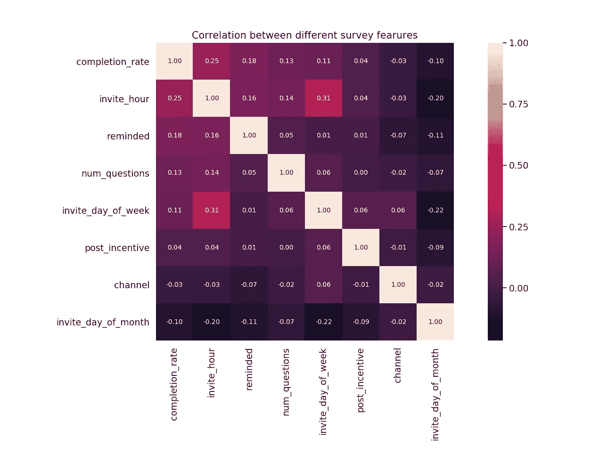
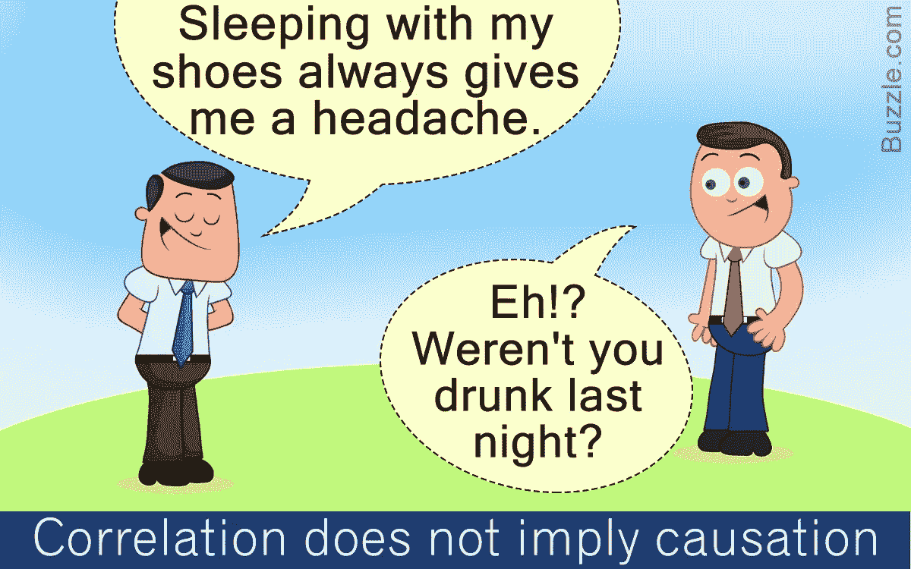

# 相关性是否意味着因果关系？

> 原文：<https://medium.com/analytics-vidhya/does-correlation-imply-causation-39a7cb1bc1e2?source=collection_archive---------2----------------------->

# 介绍

我们经常听到“相关性”和“因果关系”这两个术语，但它们实际上是什么意思呢？

相关性定义了两个变量在变化时如何相互关联。当一个变量增加时，另一个变量可能会增加、减少或保持不变。例如，当下雨更多的时候，人们倾向于买更多的雨伞。

因果关系意味着一个变量**导致另一个变量**发生变化。例如，我们可以自信地得出结论，更多的雨水会导致更多的人购买雨伞。

在这篇文章中，我将探究这些术语的含义，并尝试解释一种确定它们之间关系的方法。我将用一个真实的例子来做探索和解释。

## 调查完成率；现实世界的例子

[Echo mobile](https://www.echomobile.org/) 帮助组织开展调查。他们使用[回声平台](https://www.echomobile.org/public/platform)来设计、发送和分析调查结果。可以通过不同的渠道发送调查问卷。这些是；短信，USSD，IVR，安卓应用和网络。然而，短信是使用最多的渠道。

我们的主要目标是为客户提供一个平台，让他们更好地了解自己的客户，从而让他们开心。我们真正想做的一件事是找出导致更多人完成调查的因素。这将使我们的客户能够从他们的客户那里听到更多。

我们做的第一项任务是找出各种因素与完成率的关系。调查的完成率是被邀请参加调查后完成调查的人的百分比。我们提出了我们认为可能影响调查完成率的不同因素。以下是其特点:

*   完成调查后提供的奖励(少量的钱或播放时间)
*   *invite_day_of_month* :回答者被邀请参加调查的月份的日期
*   *invite_day_of_the_week* :回答者被要求参加调查的一周中的某一天
*   *invite_hour* :回答者被邀请参加调查的时间
*   *num_questions* :调查中的问题数量
*   *提醒*:是否提醒受访者完成调查
*   *渠道*:调查完成的方式。这些要么是通过使用短信，USSD，IVR，网络，或 Android 应用程序。短信是最受欢迎的渠道，占调查的 90%以上
*   完成率:完成率，被邀请参加调查的人完成的百分比

我们利用 2017 年初至 2017 年 8 月的调查，寻找上述样本因素之间的相关性。下表显示了这些因素之间的相互关系。由于重点更多地放在 completion_rate 与其他因素的关系上，所以我将更多地关注这些关系。

不同调查因素之间的相关性。完成率与邀请时间的相关性最强

表格中的行是按照完成率和其他因素之间的相关性降序排列的。看表，与 0.25 正相关的 invite_hour 是与完成率相关性最强的因子。然后是提醒，而邀请日期与完成率负相关最大。任何其他因素之间的相关性也可以从表中获得，例如问题数量和提醒之间的相关性是 0.05。

相关幅度越大，相关关系越强。正相关表示当一个因素增加时，另一个因素也应该增加。对于负相关值，关系是相反的。一个增加，另一个减少。

如果不小心的话，上述发现会导致错误的结论。例如，可以得出结论，相关性为 0.25 的邀请时间对调查的完成率具有最高影响。因此，你可能会开始寻找合适的时间发送调查，希望能完成更多的调查。

有了这种想法，就可以得出结论，某个邀请时间是发出调查的最佳时间。但那将是坚持相关性意味着因果关系的(不正确)观点。高相关性可能意味着一个因素导致另一个因素，这些因素共同导致另一个因素，这些因素是由单独的第三个因素导致的，甚至这种相关性是巧合的结果。这可以在下图中简单地观察到

因此，我们可以看到，相关性并不总是意味着因果关系。然而，通过仔细的调查，确定一个特定的相关性是否真的意味着一个变量导致了另一个变量是可能的。

## 我们如何验证相关性意味着因果关系？

1.  使用统计学上合理的技术来确定这种关系。

确保使用统计上合法的方法来寻找相关性。其中包括:

*   使用正确量化关系的变量
*   确保没有异常值
*   确保样本是总体的适当代表
*   基于关系度量的尺度，使用适当的[相关系数](https://statswithcats.files.wordpress.com/2010/11/types-of-correlations.jpg)

2.*解释发现的关系*

*   暴露总是先于结果，如果 A 被认为是导致 B 的原因，检查 A 是否总是发生在 B 之前
*   检查这种关系是否与其他现有理论相吻合
*   检查提议的关系是否与相关领域中的其他关系相似。
*   检查是否没有任何其他关系可以解释这种关系。在上面的案例中，对头痛的一个合理解释可能是喝酒，而不是穿着鞋子睡觉

3.*验证关系*

*   应该对上面的解释进行检验，以确定它们是对还是错。测试的常用方法是实验和检查关系的一致性。一个实验通常需要一个关系模型，一个基于该模型的可测试的假设，方差控制措施的结合，关系的合适度量的收集，以及适当的分析。多次实验应该会得出一致的结论。

我们还没有对我们的回复率相关性进行这些测试。所以我们还不知道，例如，特定的邀请时间**是否会导致**更高的回复率。

# 结论

在断定一种特定的关系意味着因果关系之前，我们需要小心谨慎。总的来说，没有结论总比得出错误的结论要好，因为错误的结论可能会导致错误的行动。