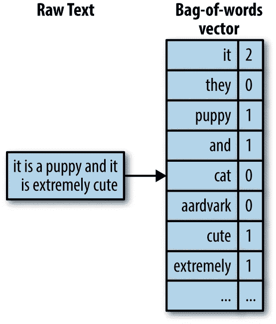
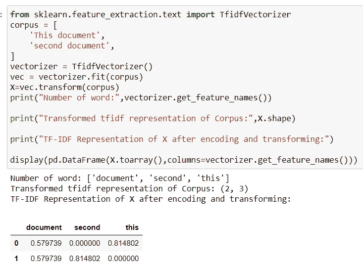
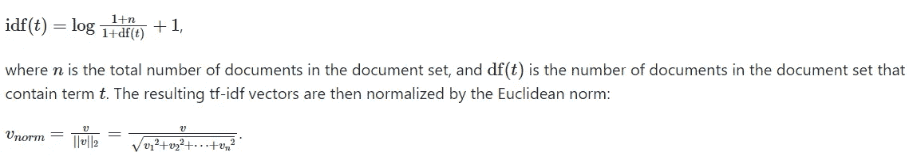
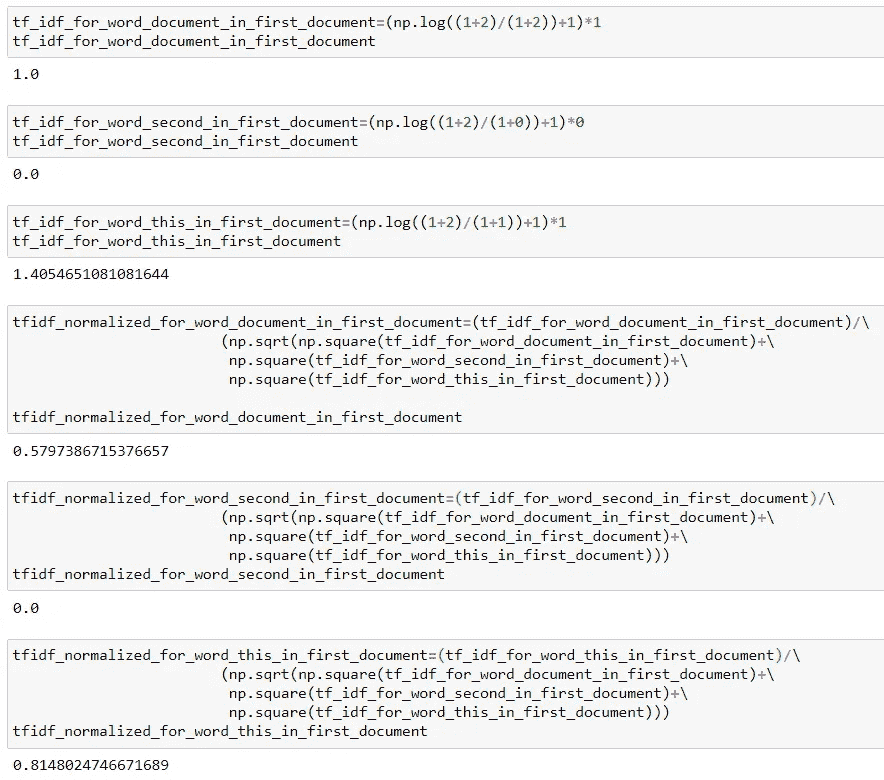
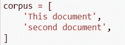
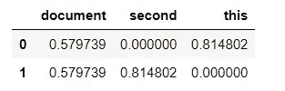

# TF-IDF 在教材和 sklearn 套路中的作用有区别吗？

> 原文：<https://medium.com/analytics-vidhya/does-tf-idf-work-differently-in-textbooks-and-sklearn-routine-cc7a7d1b580d?source=collection_archive---------17----------------------->

TF-IDF 是单词包方法中的一个简单转变。单词包只是表示( **#次单词 w 出现在一个文档 d** )。

TF-IDF 代表**术语频率乘以逆文档频率。**

下图讨论了在机器学习环境中对文本数据进行数字编码的单词包方法。

在下面的例子中，单词“puppy”在文本中只出现一次，所以在单词包中，向量 puppy 的值为 1，它基本上表示该文档中 puppy 的单词数为 1，而在真实世界中有许多文档，因此该向量看起来像一个矩阵，其中每行是一个文档，矩阵是一个文档集合，其中列表示特定的单词数。

**我们已经有了文字的单词包表示，为什么还需要 tf-idf？**

单词包是文本数据的简单表示，但远非完美。如果我们平等地计算所有单词，那么一些单词最终会比其他单词更被强调。

例如，考虑客户在购买产品时给出的评论。在这里，“和”，“这个”，“一个”比“快乐”，“质量”出现得更多，从而在向量空间中占主导地位。如果我们要创建一个给定客户评论的情感分析模型，我们会想知道一个特定的词对文档有多重要，如“快乐”和“质量”，我们会给这些词更多的权重以获得一个更好的模型。TF-IDF 在单词包失败时做了完全相同的事情。

tf-idf 不是在数据集中查找文档中单词的原始计数，而是查找标准化计数，其中每个单词的计数除以该单词出现的文档数。

**课本公式:**

**bow(w，d)** = #次单词 w 出现在文档 d 中

**idf(w，d)**= N/(# word w 出现的文档)。

**tf-idf(w，d)** =bow(w，d)* N/ (#出现 w 字的文档)。

其中 N 是文档总数。

如果一个词出现在许多文档中，那么它的逆文档频率接近 1。如果一个单词只出现在几个文档中，那么它的逆文档频率要高得多。

我们还可以进行对数变换，而不仅仅是使用原始的逆文档频率。对数变换会将 1 变为 0，并使较大的值(大于 1)变小。
现在上面的公式可以改写为:

**tf-idf(w，d)** = bow(w，d) * Log(N/ #个出现 w 的文档)

这是关于 tf-idf 的教科书式描述。现在让我们深入到 tf-idf 的 sklearn 实现中，它与教科书中的表示略有不同。

**sk learn 中的 TF-IDF:**

我将使用带有默认参数的 TfidfVectorizer:
*类* `sklearn.feature_extraction.text.**TfidfVectorizer**` ( *** ， *input='content'* ， *encoding='utf-8'* ， *decode_error='strict'* ， *strip_accents=None* ， ***小写*** *=True* ，*预处理器=Noneu)\b\w\w+\b'* ， *ngram_range=(1* ， *1)* ， *max_df=1.0* ， *min_df=1* ， *max_features=None* ， *vocabulary=None* ， *binary=False* ，*dtype =<class ' num*

sklearn 设置中的 tf-idf 示例。

上面我举了一个例子，数据集只有两个文档“这个文档”和“第二个文档”。

数据集中的总字数是三个。

您还可以在上面的数据帧中看到数据集的转换后的 tf-idf 表示，它对特定文档的单词进行了加权。

我们可以在上面观察到，单词“second”被赋予了零值，因为该单词没有在第一个文档中出现，类似地，它在第二个文档中也具有零值。而像“文档”这样的其他单词对于第一个文档具有 0.579739。

**现在让我们从头开始计算 tfidfVectorizer()是如何给出这些值的:**

tfidf 矢量器的默认设置有 **smooth_idf** =True 和 **norm** ="l2 "

对于这些参数，下面是计算上述转换值的公式:

sklearn tf-idf 公式

下面我手工计算了上面例子的值(从头开始)

文集

从 sklearn 的 tf-idf 矢量器()转换而来的 tf-idf

**就拿第一份文件“这份文件”来说吧:**

**tfi df _ of _ Word _ document**=(NP . log((1+(文档数))/(1+(该单词出现的文档数)))* Word _ count _ of _ Word _ document _ in _ first _ document
=(NP . log((1+2)/(1+2))+1)* 1 = 1

类似地，对其他值进行计算，并使用下面的归一化技术，从零开始获得 sklearn 方面的精确输出。

**tfidf _ normalized _ for _ word _ document _ in _ first _ document =** (tfidf _ of _ word _ document)/
(NP . sqrt(NP . square(TF _ IDF _ for _ word _ document _ in _ first _ document)+\
NP . square(TF _ IDF _ for _ word _ second _ in _ first _ document)+\
NP . square(TF _ IDF _ for _ word _ this _ in _ first _ document))

=1/np.sqrt(1 +0 +1.405 )=0.579738

希望这篇文章对那些对 sklearn 的 tf-idf 实现感到困惑的人有所帮助。这显然不同于教科书符号。

我等不及让你为你的下一个自然语言处理或机器学习任务实现 tf-idf 来对你的语料库进行分类或聚类。

如果你觉得这篇文章有帮助，请鼓掌并发表评论。关注我了解更多机器学习和数据科学内容。

**参考:**
[https://scikit-learn . org/stable/modules/generated/sk learn . feature _ extraction . text . tfidfvectorizer . html](https://scikit-learn.org/stable/modules/generated/sklearn.feature_extraction.text.TfidfVectorizer.html)

[https://sci kit-learn . org/stable/modules/feature _ extraction . html # text-feature-extraction](https://scikit-learn.org/stable/modules/feature_extraction.html#text-feature-extraction)

[https://sci kit-learn . org/stable/modules/feature _ extraction . html # text-feature-extraction](https://scikit-learn.org/stable/modules/feature_extraction.html#text-feature-extraction)