# 转换数据对聚类有不同的影响吗？

> 原文：<https://medium.com/analytics-vidhya/does-transforming-data-differently-affect-clustering-9ace230f54b?source=collection_archive---------3----------------------->

我们可能会偶然发现各种机器学习模型，这些模型无法对数据集进行有意义的洞察。或者，我们可能会发现自己在参加在线 ML 挑战时，RMSE(均方根误差)不能再下降了。然后专家来了，分析数据并建议转换数据。(嗯…大部分时间:)。

在深入探讨我希望您采取的措施之前，让我们先来看看转型的重要性。

> "变化是不可避免的，但是转变是通过有意识的选择."
> 
> **—希瑟·阿什·阿马拉**

变压器

# 为什么要转换数据？

转型并不能保证提高绩效，但通常会有所帮助。

让我问你这个…假设你有只有两个特征的房子的数据，即房间数量和房价。增加一个单元房会使房子贵 1 美元吗？还是反过来？不。因为他们有不同的规模和单位。机器学习模型往往偏向于具有更大幅度和方差的特征，即房价。因此，模型不能像预期的那样正确地学习其他特征。

此外，高幅度值需要大存储和高计算能力，导致训练周期长。

对测试数据缺乏洞察力和准确性低是它的一些常见后果。所以我们必须把它们降低到一个共同的规模或者**改变它。**

通常，当您处理欧几里得距离时，如在 K-最近邻中或在 KMeans 中计算质心，甚至在 PCA(主成分分析)中，数据转换是必要的。其中一些转换技术是标准化和规范化。

因为我已经做了概述。让我们挖到一个更窄的路径，在这里我们将处理一个聚类问题，并看看不同的转换技术将如何影响我们的聚类结果。我将使用 sklearn.preprocessing 包中的 StandardScaler 和 MinMaxScaler。

# 资料组

我使用了航空业客户的数据集，其中包括他们的飞行模式、常旅客奖励的赚取和使用以及航空公司信用卡的使用等。任务是通过聚类识别客户群。以下是描述性元数据和数据集头。

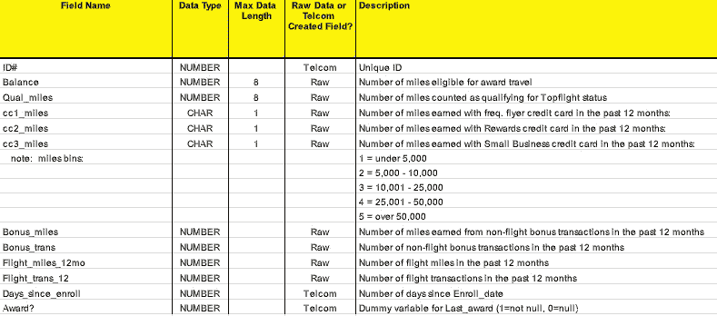

元数据

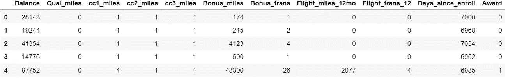

数据集(注意:由于我只取了前 5 行，Qual_miles、cc2_miles 和 cc3_miles 数据不一致)

现在让我们开始分析…

# 执行标准缩放

标准缩放的作用是变换每个要素(不是每个样本),使平均值变为 0，标准差变为 1。结果值也称为 Z 分数。据统计，大约 68%的数据位于[-1，1]的 Z 值范围内。这是数据转换后的样子。

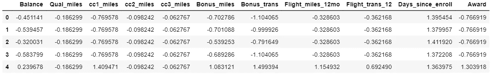

我将在这里使用 KMeans 聚类算法。由于手动决定 k 值(即聚类数)是 KMeans 的缺点，因此最好使用肘方法，然后决定 k 值。

**选择正确的 k 值**

肘形法绘制不同 k 值的 WCSS(聚类平方和内)。WCSS 被定义为集群的每个成员与其质心之间的平方距离之和。“WCSS”，简单的东西，沉重的名字。

再来看剧情。

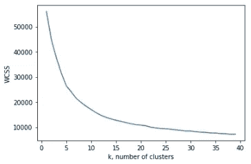

标准缩放的弯管法曲线

从图上看，WCSS 没有大幅下降的点是 5。然而，也有其他次优的 k 值。此外，我们还通过使用 K++手段摆脱了随机初始化陷阱。以下是我在应用算法后发现的每个聚类的推论。

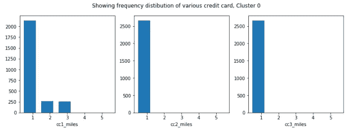

**聚类 0:** 这是拥有 cc1_miles 的人的最大聚类，cc2_miles 和 cc3_miles 最低。普通的新客户，也许这就是为什么他们的信用里程低。

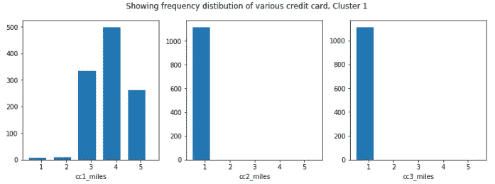

**聚类 1:** 大约 26%的客户使用飞行信用卡进行了平均最高交易，即 cc1_miles

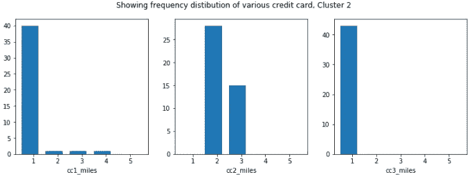

**集群 2:** 这是一小群人，他们喜欢用奖励信用卡(即 cc2_miles)付款，不使用飞行信用卡或小型企业信用卡。

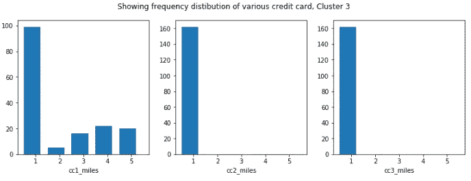

**集群 3:** 这些是 4%的客户。他们中的大多数都有 3 英里的信用额度，但都是老客户。也许是因为糟糕的旅行经历。

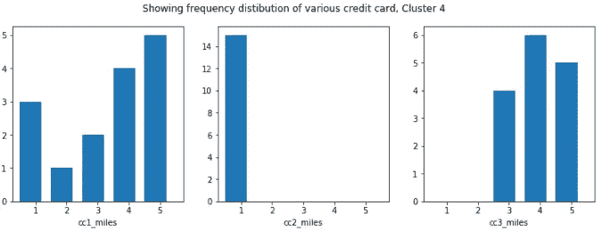

**聚类 4:** 这 4000 人中的 15 人在小企业(cc3_miles)信用卡中具有最高信用评分，并且还在所有等级中具有 Flyer 信用卡评分。

我们还可以根据客户对不同信用卡的消费以及他们自注册以来的天数来标记客户。

让我们试试 MinMaxScaler。

# 执行最小-最大缩放

最小-最大缩放将数据集范围缩小到指定的比例，而不影响其分布形状。通过减去相应的最小值，然后除以其相应的范围，计算出每个特征的**。**

让我们来看看[0，1]范围的变换数据集。

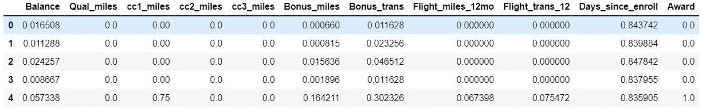

尽管如前所述，我们已经知道了 k 值，但仍然建议使用 Elbow 方法。

**选择正确的 k 值**

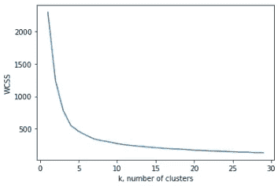

最小-最大缩放的弯头方法曲线

哇哦。没出事吗？。什么事？。仔细看，在同一个数据集上，曲线只是通过采用与以前不同的变换技术而发生变化。这一次，它建议我用 k=4。因为在这一点上，WCSS 值的下降率不再是实质性的。对集群好奇？？。在这里，有克迈恩斯。

只是为了更好的可视化，我做了一个额外的特性“cc_sum”(这是 cc1_miles、cc2_miles 和 cc3_miles 的横列总和)。

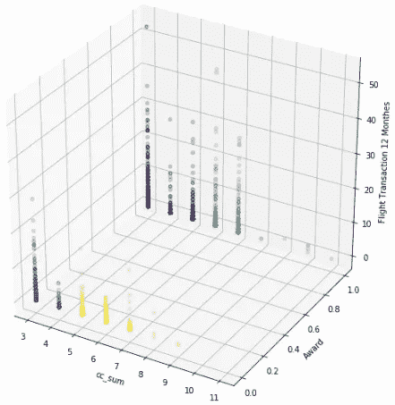

聚类可视化(注意:“航班交易 12 个月”与列名“航班 _ 交易 _12”相同)

这一次，聚类结果的关键取决于 Award 和 cc_sum 特性。我想用下面的方式来解释这个集群的特征。

大约 13%的平均年龄最大的顾客获得了奖励(奖励=1)，可能是因为他们主要通过飞行信用卡进行了最高的非航班交易。(粉丝)

**Violet:** 大约 24%获得奖励，不是因为非航班交易，而是因为在过去 12 个月中比粉丝稍高的航班交易。(支持者)

**黄色:**总客户中约有一半是平均新客户，未授予(奖励=0)，平均成交率低。(不满意)

在过去的 12 个月里，未获得奖励的剩余人员的非航班交易量远远高于那些不满意但不是常客的人。(漫游者)

# 那么，哪个更好呢？

> “我真的很喜欢在一旁观看，因为我真的可以从不同的角度看比赛。”
> 
> 凯文·诺克斯

假设我是这家航空公司的营销主管，我会发现最小-最大扩展集群更有指导意义。他们帮助我跟踪我的忠实客户，维护来自不满意的人的反馈&甚至我可以通过分别给漫游者和支持者折扣和更好的服务来进行有针对性的广告。

但是，对于附属于该航空公司的信用卡公司的营销主管来说，标准的扩展集群更有吸引力。因为这些聚类在不同信用卡在新顾客、老顾客或普通顾客中的受欢迎程度方面更有指导意义。

然而，不同的转换技术通常有一定的局限性。并非每个数据集都适合每种缩放技术。这就是你必须做出决定的时候。

# 什么时候用什么

MinMaxScaler 不会改变分布的形状，它只是将值缩小到指定的范围。因此，数据集包含的信息的性质保持不变。

当每个特征或多或少遵循标准正态分布时，标准定标器通常可能表现得更好。数据信息。可能会改变，因为整个分布会自动调整均值为零，方差为一。

然而，如果您希望您的异常值保持其重要性，MinMaxScaler 会比 StandardScaler 更有帮助。

我希望这篇文章对你有所帮助。谢谢你。

[领英。](https://www.linkedin.com/in/tauheed-ahmad/)