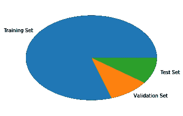
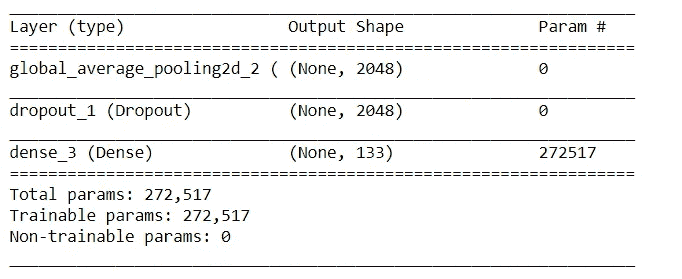
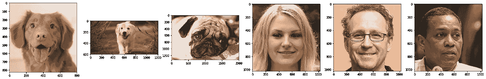

# 犬种分类器 10 分钟挑战

> 原文：<https://medium.com/analytics-vidhya/dog-breed-classifier-10-minute-challenge-6a78413ea2a2?source=collection_archive---------44----------------------->


[乔·凯恩](https://unsplash.com/@joeyc?utm_source=medium&utm_medium=referral)在 [Unsplash](https://unsplash.com?utm_source=medium&utm_medium=referral) 上的照片

狗品种检测一直是基本的视觉挑战之一。但是，我能多容易地构建一个性能相当好的轻型犬种分类器呢？

为了有点乐趣，我还会添加一个功能，将人脸分类到最接近的狗品种中:)

**第一步:导入数据集**

对于人脸，我将使用野生(LFW)数据集中的标记人脸。

加载 LFW 数据集

接下来，我将加载狗数据集。

导入狗数据集

让我们设想一下数据集的分区。



培训、验证和测试集的比较

**第二步:区分人和狗**

为了区分狗和人的脸，我将建立一个人脸检测器和一个狗检测器。

为了构建一个人脸检测器，我使用了 OpenCV 的 HaarCascadeClassifier。

使用 OpenCV 中的 HaarCascadeClassifier 检测人脸

一旦我们有了人脸检测器，就该构建狗检测器了，为此我将使用在 ImageNet 数据集上预训练的 ResNet50 模型

**第三步:检测犬种**

现在我们可以区分狗和人脸，让我们继续检测狗的品种。

我们将使用迁移学习来创建一个使用预训练(ImageNet) ResNet50 模型的 CNN。首先，我们将使用模型获取数据集的瓶颈特征。

我们将提取的特征保存为`DogResnet50Data.npz`

现在，我们加载特征并创建我们的模型。我们添加了一个 GlobalAveragePooling 层，然后是一个 Dropout 层和一个 Dense 层。

负载特征和模型



模型摘要

现在，我们将在狗数据集上训练我们的模型。

快速训练在测试集上给了我们一个`80.7416%`的准确度。现在，让我们用这个模型来预测一些品种！我们将使用下面的函数`detect`。

**步骤 4:测试**

是时候尝试一下了！



看到我们的结果

我得到了这些图像的以下结果(从左到右):

```
This is not a dog, but if it were, it would be a: Nova_scotia_duck_tolling_retrieverThis dog seems to be a: KuvaszThis dog seems to be a: MastiffThis is not a dog, but if it were, it would be a: Cavalier_king_charles_spanielThis is not a dog, but if it were, it would be a: French_bulldogThis is not a dog, but if it were, it would be a: Beagle
```

注意:使用的人脸是用[https://www.thispersondoesnotexist.com/](https://www.thispersondoesnotexist.com/)生成的

所以，这就是我如何在大约 10 分钟内建立一个狗品种分类器。希望你喜欢阅读这篇文章！