# 狗品种分类器:如何利用 CNN 和迁移学习构建人脸检测器、狗检测器&品种分类器？

> 原文：<https://medium.com/analytics-vidhya/dog-breed-classifier-how-to-build-a-dog-detector-breed-classifier-using-cnn-from-scratch-and-ee97696d2073?source=collection_archive---------10----------------------->

本文概述了 *Kaggle 的* ***犬种分类器*** 项目，恰好是著名的视觉项目之一！

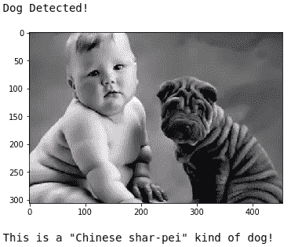

此处已建内容概述！

## 概述:

人类在视觉方面非常优秀，我们的大脑在视觉识别方面非常强大。给一只狗，你可以很容易地发现它的品种，唯一的条件是你必须知道这个星球上所有的狗品种！现在这对于一个正常人来说是一个相当具有挑战性的任务。假设你喜欢一个特定的狗品种(比如说拉布拉多)，想收养一只同一品种的狗，你去商店把你可爱的新朋友带回家。你怎么知道这是不是你得到的正确的狗品种？很多时候，人类很难识别狗的品种。例如，如何对下面给出的两只狗的图片进行分类。

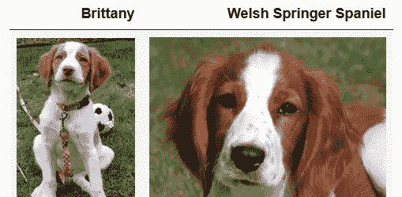

注意两张图片的品种名称！

现在，这两个怎么样？

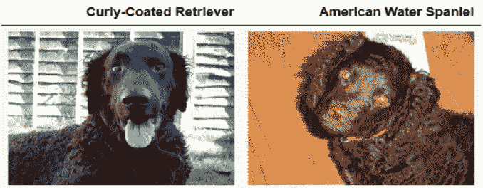

两只狗都有卷毛，很难辨认，对吧？！

现在，这张图片上的品种是什么？？

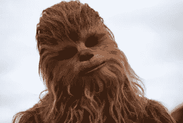

这算是狗的形象吗？是啊！人变狗:p

上面给出的图像不是一只狗，而是一张化了妆的人脸(《星球大战》的虚构人物丘巴卡)。这个项目还将带你通过人脸检测和识别与给定人脸最相似的狗品种！听起来很有趣，对吧？！😄

所以，这成了一项艰难的工作。这就是机器学习/深度学习的需求出现的时候。计算机视觉帮助你建立机器学习模型，你训练一个模型来识别狗的品种！这让你的工作变得简单！ [*CNN*](https://cs231n.github.io/convolutional-networks/) 是深度学习领域的一项巨大发明，这推动了视觉识别领域的大量应用。我将带您了解如何使用 Pytorch 从头开始构建 CNN，并利用一些流行的 CNN 架构来完成我们的图像分类任务！

该项目分为不同的阶段，如加载和预处理数据，人脸检测，狗检测，品种分类。你可以在我的 [*GitHub*](https://github.com/s-nilesh) 上找到代码。

## 数据集和输入

*   输入:该项目的输入类型必须是图像。

*数据集:*

*   ***人形图像*** :人形图像分布在 **5749 个文件夹**中，以类似“朱丽安 _ 摩尔”、“丹 _ 阿克罗伊德”等人形名称命名。总共有 **13233 张**人脸图像。图像在文件夹中分布不均匀。链接到数据集的超链接是 [*这里的*](https://s3-us-west-1.amazonaws.com/udacity-aind/dog-project/lfw.zip) 。
*   ***狗图像*** :狗图像分布在三个主文件夹中，分别命名为“train”、“T16”、“test”和“valid”，用于训练、测试和验证。此外，所有这些文件夹再次被分配到代表狗品种的 **133 个文件夹**中。因此，我们的狗数据集有 133 类，即品种(“獒”，“比熊犬 _ 弗里斯”，等等)。链接到数据集的超链接是 [*这里的*](https://s3-us-west-1.amazonaws.com/udacity-aind/dog-project/dogImages.zip) 。

*关于数据的信息:*

```
Total number of **human face images: 13233**
Total number of **human face folders: 5749**
Total numner of folders in 'dog_images:' 3
Folders in 'dog_images': train,test,valid
**Total folders(breed classes)** in 'train, test, valid' **133**
Total images in /dog_images/**train : 6680**
Total images in /dog_images/**test : 836**
Total images in /dog_images/**valid : 835**
```

*训练数据集中狗品种的分布(平均每类 50.22 个样本):*类别名称不可见，但我们可以看到每类的平均样本，由平行于类别轴的黑线表示。

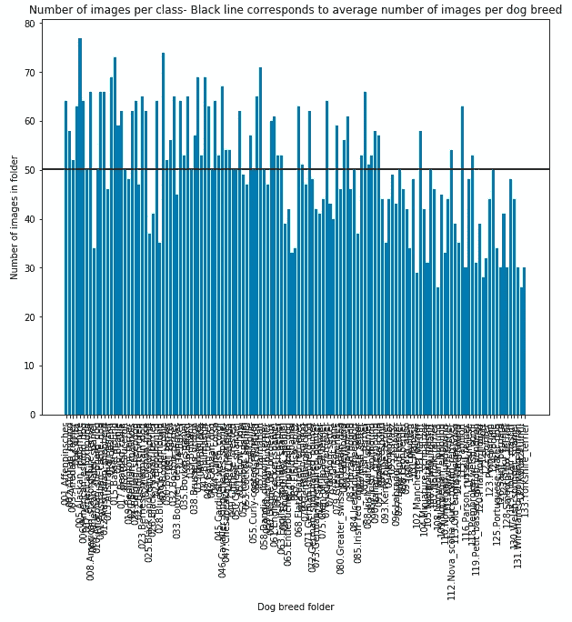

显示训练数据集中**图像分布的柱状图，每个柱状图代表一个犬种。**

## 人脸检测

我用了 [**OpenCV 的 Haar 级联分类器**](https://opencv-python-tutroals.readthedocs.io/en/latest/py_tutorials/py_objdetect/py_face_detection/py_face_detection.html) 来检测人脸。这个 OpenCV 的分类器在许多带有正点(有脸)和负点(没有脸)标签的图像上被训练。detectMultiScale 返回同一图像中所有检测到的面的 4 个边界框坐标值的列表。对于所有人脸检测算法，将 RGB 图像转换为灰度图像是一种标准做法，因此请确保转换您的图像。

```
import cv2
face_cascade = cv2.CascadeClassifier('haarcascade_frontalface.xml')def face_detector(img_path):
    img = cv2.imread(img_path)
    gray = cv2.cvtColor(img, cv2.COLOR_BGR2GRAY)
    faces = face_cascade.detectMultiScale(gray)
    return len(faces) > 0  #returns bool
```

> **模型性能** : Haar 级联分类器在数据上有很好的性能

```
Percentage of *human faces detected in human images* data: **98.74** Percentage of *human faces detected in dog images* data(incorrect detections): **10.83**
```

哈尔级联分类器给出的样本结果:

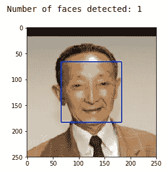

用左上角的坐标和边界框的高度、宽度来检测一个面

## 狗检测

我们现在需要设计一个狗探测器。我使用迁移学习来完成这项任务。我尝试使用了 *VGG16 和 ResNet50* 预训练模型，分别在 1000 类 ImageNet 数据的 *10M 图像上进行训练。我已经从*火炬接力*下载了这个模型。VGG16 **模型**在我们的狗数据集上表现更好。我们需要加载和转换所需格式的图像(例如，图像大小，转换为 RGB，标准化数据)。*这个“load_transform_image”函数也在测试一幅图像的最终工作流程中使用*。还制作了一个狗检测器，如果在传递给该函数的图像中检测到狗，则返回*“真”。以下是代码:**

```
**import** **torch
from** **PIL** **import** **Image**
**import** **torchvision.transforms** **as** **transforms
import** **torchvision.models** **as** **models***# define VGG16 model*
VGG16 = models.vgg16(pretrained=**True**)*# check if CUDA is available*
use_cuda = torch.cuda.is_available()*# move model to GPU if CUDA is available*
**if** use_cuda:
    VGG16 = VGG16.cuda()**def** load_transform_image(img_path):
    '''
    Used load & transform image for prediction on single image
    '''img = Image.open(img_path).convert('RGB')
    normalize = transforms.Normalize(
                        mean=[0.485, 0.456, 0.406],
                        std=[0.229, 0.224, 0.225])  
    img_transform = transforms.Compose([
                        transforms.Resize(size=(224, 224)),    
                        transforms.ToTensor(),
                        normalize])
    img = img_transform(img)[:3,:,:].unsqueeze(0)
    **return** img**def** VGG16_predict(img_path):
    *'''*
 *Use pre-trained VGG-16 model to obtain index corresponding to* 
 *predicted ImageNet class for image at specified path*

 *Args:*
 *img_path: path to an image*

 *Returns:*
 *Index corresponding to VGG-16 model's prediction*
 *'''* image = load_transform_image(img_path)
    **if** use_cuda:
        image = image.cuda()
    output = VGG16(image)
    **return** torch.max(output,1)[1].item()**def** dog_detector(img_path):
    prediction = VGG16_predict(img_path)
    **return** (prediction>=151 **and** prediction<=268)
```

*自定义图像上 dog_detector 的结果:*

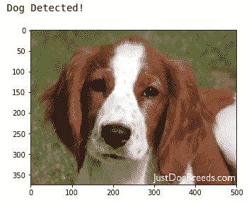

dog_detector 的正确预测

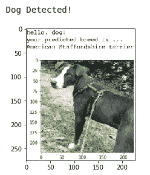

dog_detector 的正确预测

> **模型性能**:为了节省时间，我们可以对两个数据集中的前 100 幅图像进行检测。

```
Percentage of *dogs detected in human image data*(incorrect detections): 1.0%
Percentage of *dogs detected in dog image data*: 100.0%
```

你可以尝试不同的架构，比如 Inception-v3、ResNets、GoogleNet 等等

## 数据加载器

我们需要为训练模型准备数据。我已经按照训练和测试我们的模型所需的格式执行了数据规范化、拆分和排列！在训练你的神经网络时，数据扩充是一个重要的因素，这为你的模型增加了更多的鲁棒性，并使它从我们数据的不同变化中学习。基本上，数据扩充有助于增加数据的变化。给出了生成数据加载器的代码。

```
**import** **os**
**from** **torchvision** **import** **datasets**
**import** **torchvision.transforms** **as** **transforms***data_dir* = '/data/dog_images/'
*train_dir* = os.path.join(data_dir, 'train/')
*valid_dir* = os.path.join(data_dir, 'valid/')
*test_dir* = os.path.join(data_dir, 'test/')*normalize* = transforms.Normalize(mean=[0.485, 0.456, 0.406],
                                 std=[0.229, 0.224, 0.225])*preprocess_data* = {'train': transforms.Compose([
                                 transforms.RandomResizedCrop(224),
                                 transforms.RandomHorizontalFlip(),
                                 transforms.ToTensor(),
                                 normalize]),
                   'valid': transforms.Compose([
                                 transforms.Resize(256),
                                 transforms.CenterCrop(224),
                                 transforms.ToTensor(),
                                 normalize]),
                   'test': transforms.Compose([
                                 transforms.Resize(size=(224,224)),
                                 transforms.ToTensor(), 
                                 normalize])}*train_data* = datasets.ImageFolder(
                          train_dir, 
                          transform=preprocess_data['train'])
*valid_data* = datasets.ImageFolder(
                          valid_dir,
                          transform=preprocess_data['valid'])
*test_data* = datasets.ImageFolder(
                          test_dir, 
                          transform=preprocess_data['test'])***batch_size*** = 20
*num_workers* = 0
***train_loader*** = torch.utils.data.DataLoader(train_data,
                                           batch_size=batch_size, 
                                           num_workers=num_workers,
                                           shuffle=**True**)
***valid_loader*** = torch.utils.data.DataLoader(valid_data,
                                           batch_size=batch_size, 
                                           num_workers=num_workers,
                                           shuffle=**False**)
***test_loader*** = torch.utils.data.DataLoader(test_data,
                                           batch_size=batch_size, 
                                           num_workers=num_workers,
                                           shuffle=**False**)
***loaders_scratch*** = {
    'train': train_loader,
    'valid': valid_loader,
    'test': test_loader
}
```

这样现在我们就有了 ***【训练 _ 加载器】******有效 _ 加载器*** 和 ***测试 _ 加载器*** ，数据按照定义的*预处理*和*数据扩充*步骤批量存储。数据准备中执行的步骤说明:

*   我对*训练数据*使用了***randomresizedcrop***，它将所有训练图像的大小调整为(224，224)，它还对原始图像进行了随机裁剪，以便我们的模型能够学习数据中的复杂变化。我已经使用***RandomHorizontalFlip***(p = . 5)水平翻转了数据，这将水平翻转一半图像，以给原始训练数据添加更多变化。train 文件夹中几乎所有的图像都是直的(狗以直的方式排列),所以使用水平翻转而不是垂直翻转更明智。我还使用 ***标准归一化*** 归一化了图像中的所有通道。
*   使用大小为(224，224)的 ***中心裁剪*** 用于*验证数据*，因为大多数图像的中心都有一张狗脸，因此这将有助于提高验证的准确性！
*   ***调整大小*** *测试图像*到(224，224)*这里没有做其他变换*，因为我们将在原始数据上测试我们的模型

## 犬种分类

为了这个任务，让我们在 *Pytorch* 中从头开始构建我们自己的*CNN*。在这里，我创建了一个 Relu 激活的 3 层 CNN。对每一层使用不同的内核大小、步幅、填充和最大池，原始图像的大小(224，224)已减少到(7，7)，原始深度 3 已转换为 128: (224，224，3) **- >** (7，7，128)。这样我们就从给定的图像中提取出了空间特征！我们增加深度或添加更多过滤器，以便网络可以学习图像中更重要的特征，并更好地进行归纳。

> 模型架构:

```
**import** **torch.nn** **as** **nn**
**import** **torch.nn.functional** **as** **F***# define the CNN architecture*
**class** **Net**(nn.Module):
    **def** __init__(self):
        super(Net, self).__init__()
        *# Conv Layers*
        self.conv1 = nn.Conv2d(3, 32, 3, stride=2, padding=1)
        self.conv2 = nn.Conv2d(32, 64, 3, stride=2, padding=1)
        self.conv3 = nn.Conv2d(64, 128, 3, padding=1)
        *# maxpool*
        self.pool = nn.MaxPool2d(2, 2)
        *# fc layers*
        self.fc4 = nn.Linear(7*7*128, 2048)
        self.fc5 = nn.Linear(2048, 512)
        self.fc6 = nn.Linear(512, 133)    *#number of classes = 133*
        *# dropout* 
        self.dropout = nn.Dropout(0.25)    *#dropout of 0.25*
        *# batchNorm layers*
        self.batch_norm = nn.BatchNorm1d(512)

    **def** forward(self, x):
        *## Define forward behavior*
        x = F.relu(self.conv1(x))
        x = self.pool(x)
        x = F.relu(self.conv2(x))
        x = self.pool(x)
        x = F.relu(self.conv3(x))
        x = self.pool(x)

        *# flatten*
        x = x.view(-1, 7*7*128)
        x = self.dropout(x)
        x = F.relu(self.fc4(x))
        x = self.dropout(x)
        x = F.relu(self.batch_norm(self.fc5(x)))
        x = self.dropout(x)
        x = self.fc6(x)
        **return** x*# instantiate the CNN*
model_scratch = Net()*# move tensors to GPU if CUDA is available*
**if** use_cuda:
    model_scratch.cuda()
```

使用了 ***交叉熵损失*** 作为一个 ***代价函数*** 和 ***亚当*** 作为 ***优化器*** ，你可以在 **PyTorch** [*这里*](https://pytorch.org/docs/stable/nn.html#loss-functions) 和各种优化器中阅读更多关于交叉熵损失的实现

在位于狗图像数据集中的训练数据上以批量大小 20 训练了 50 个时期之后，我得到了` ***训练损失****:****4.1504***和` ***验证损失****:****3.7211***

> **该车型(model_scratch)在测试数据上的表现**:

```
Test Loss: 3.820199
Test Accuracy: 10% (89/836)
```

接下来，为了节省时间并获得更好的性能，我选择使用*转移学习*和 ***微调*** 我们训练数据上转移的模型权重。 ***ResNet-101*** 被选为本次*分类任务*的。

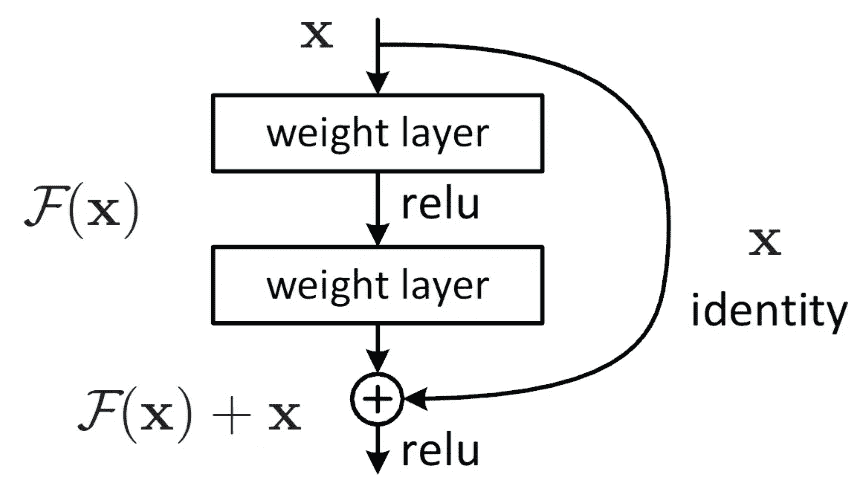

**剩余块，显示跳过连接！**

*选择 ResNet* 的理由:

*   众所周知，ResNets 在图像分类中表现突出。ResNet 是用“ ***”剩余块*** 构建的，基本上就是层间的*跳过连接*。这在初始层和最终层之间创建了一个*身份连接*，降低了*消失和爆发梯度问题*的风险，这也有助于降低训练数据上*欠拟合和过拟合*的风险！Resnet101 是一个 101 层深度神经网络，因此从图像中捕获*粒度空间信息*。CNN 为每幅输入图像提供了更好的特征表示，残差块产生的身份连接使得梯度流变得容易，因此 ResNet 有助于提高分类任务
*   我还将*预训练 Resnet* 的 ***移除了******最后一个全连接层*** ，并在最后添加了我们的**自定义** *全连接*，这是为了输出***133******大小的矢量*** 。

> 模型架构:

```
**import** **torchvision.models** **as** **models**
**import** **torch.nn** **as** **nn***model_transfer* = models.resnet101(pretrained=**True**)**for** param **in** model_transfer.parameters():
    param.requires_grad = **False***#replacing last fc with custom fully-connected layer which should output 133 sized vector*
***model_transfer.fc*** *= nn.Linear(2048, 133, bias=****True****)**#extracting fc parameters*
fc_parameters = model_transfer.fc.parameters()         
**for** param **in** fc_parameters:
    param.requires_grad = **True**
```

在训练了仅仅 20 个历元之后，批量大小为 20 的训练数据位于狗图像数据集中，其`*训练损失=****1.4732***和`*验证损失=****0.9333***`。如果训练更多的纪元，损失将减少，模型将从数据中学习尽可能多的东西！

> **模型性能**测试数据:我选择了**精度**和**召回**数作为评价指标。这是因为我们的数据有不平衡，精确回忆总是给我们一个很好的模型性能概述！

```
from **sklearn.metrics** import **confusion_matrix**, **precision_recall_fscore_support***cm* = **confusion_matrix**(ground_truths, predictions)***precision*** = np.mean(**precision_recall_fscore_support**(ground_truths, predictions)[0])***recall*** = np.mean(**precision_recall_fscore_support**(ground_truths, predictions)[1])
```

> 品种分类器精度数: *0.8039343488*
> 
> 品种分类器召回编号: *0.78137904284*

下面给出了所有测试数据预测的混淆矩阵，不容易阅读/可视化，但您可以集中在一些暗点上，在那里您可以分析在其他类中被错误分类的类。

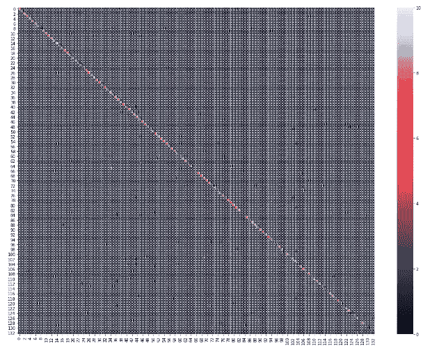

混淆矩阵

## 结果

现在是测试我们的工作流程(迷你管道)的时候了！下面是我们的工作流程产生的一些有趣的结果！之前模型看不到任何图像(真实世界用户提供的图像)。

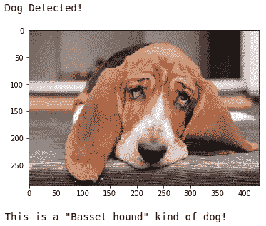

**完全识别的狗，具有正确的品种分类**

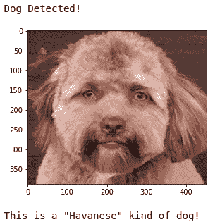

**狗狗品种分类的搞笑编辑狗形象！**


**完全识别的狗，具有正确的品种分类**

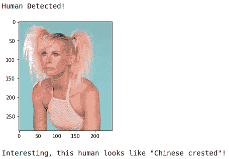

**完美的人脸识别，产生最像狗的品种！**

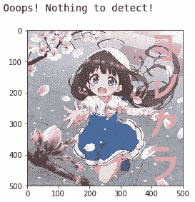

没有检测到任何东西！错误检测，人类存在。

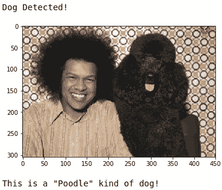

**完全识别的狗，品种分类正确**

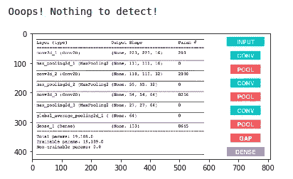

**没有检测到任何东西！太棒了！**

## 丰富

*   在这种情况下，对更多数据进行培训会有所帮助，而且数据的*增加*可能会有所帮助，例如裁剪图像以纠正区域可能会有所帮助。
*   在 dog_images/train 中拥有完美的标签和更多的数据肯定会有所帮助。还手动添加一些*变化* ( *噪声*)到数据中，例如添加虚假图像或在人类数据集中看起来像狗的人类图像。
*   *超参数调整*总是有帮助的！:)
*   使用一个更强大的预先训练过的模型可能也会有所帮助！

## **结论**

我要探索大范围的数据。摆弄数据和从零开始创建模型非常有趣！CNN 是机器学习领域的重要发明。需要注意的一个要点是，现代深度学习框架如何使我们的工作变得简单，我们可以用少量(非常少)行代码来训练我们的模型。用过 PyTorch，这是一个很棒的编程框架！必须了解迁移学习如何在我们的应用中帮助我们。

另一个值得注意的有趣的事情是，一个训练有素的模型(机器)有时在概括特征方面甚至比人做得更好。

如果你觉得我的[代码](https://github.com/s-nilesh/Dog-Breed-Classifier)有用并提出改进建议，请随意使用。请鼓掌，谢谢！