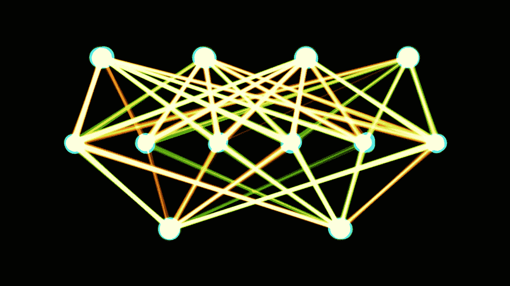
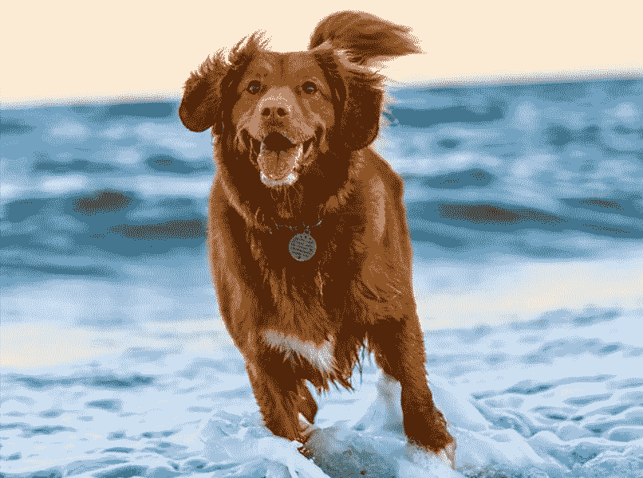
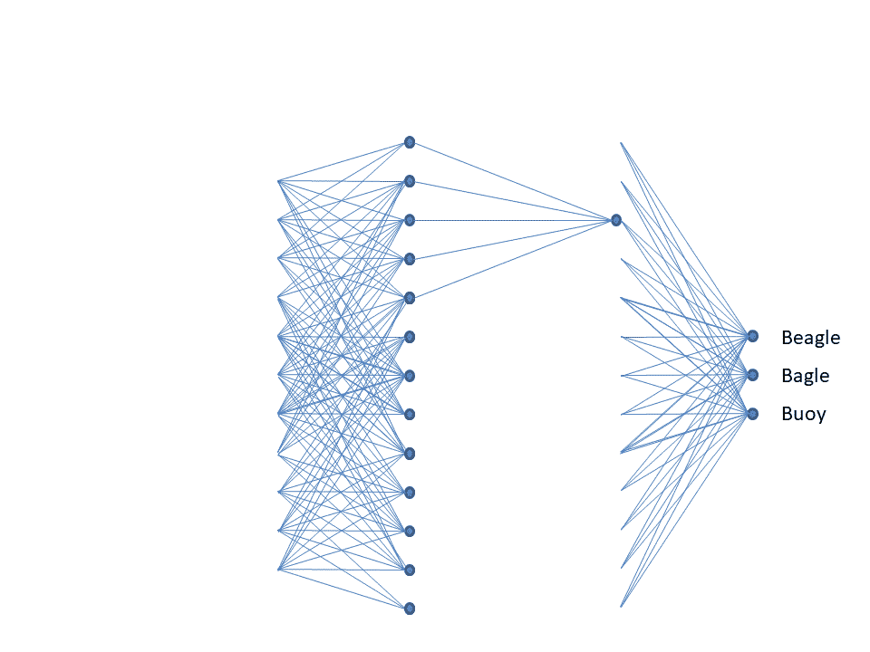
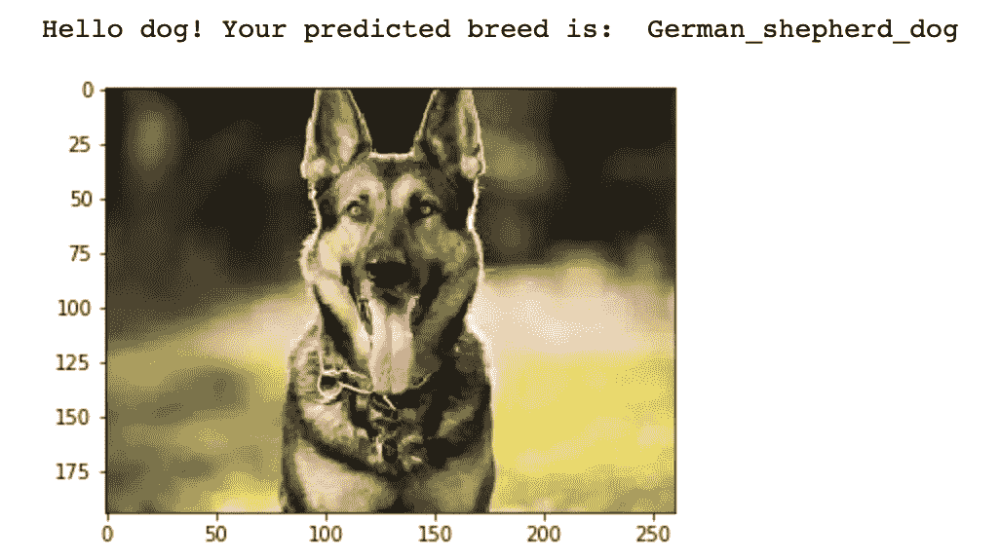
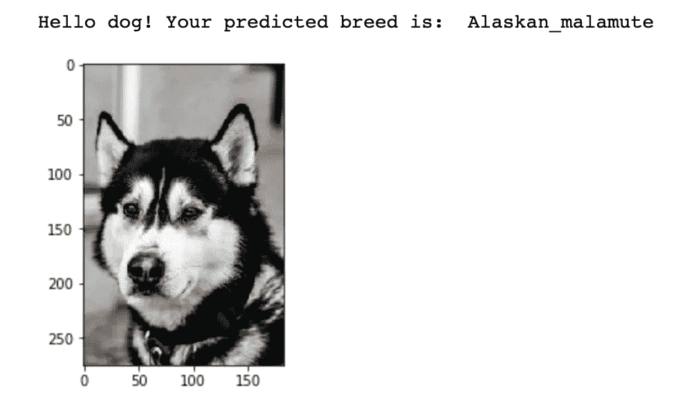
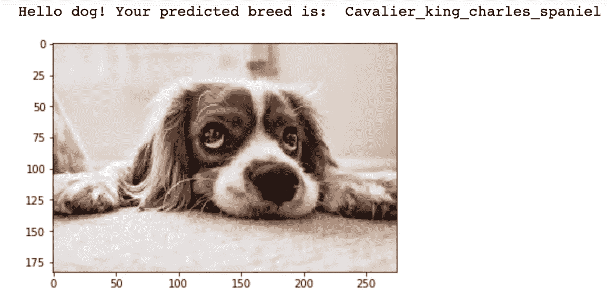
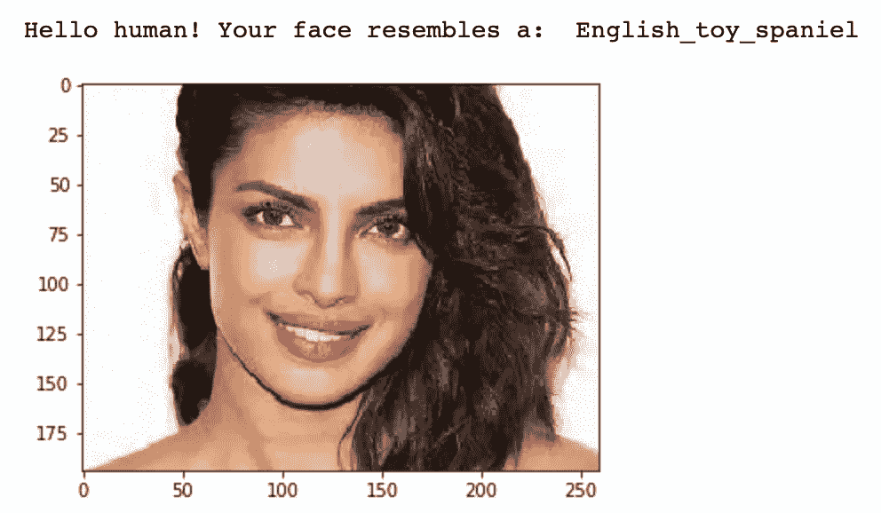
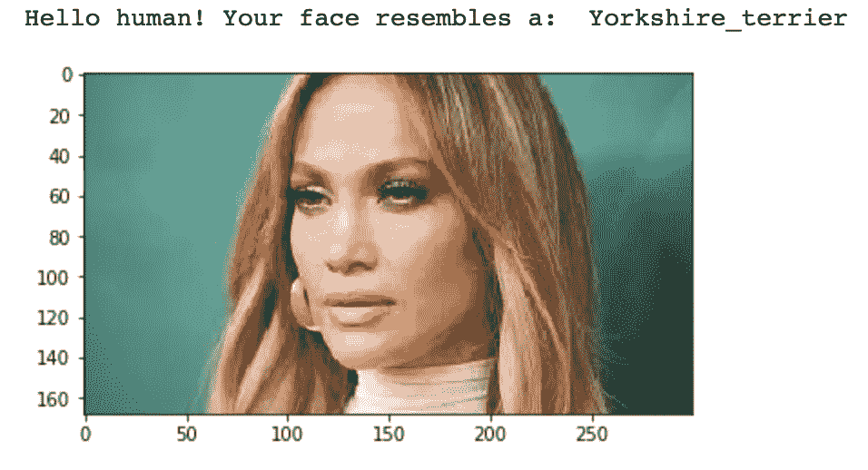
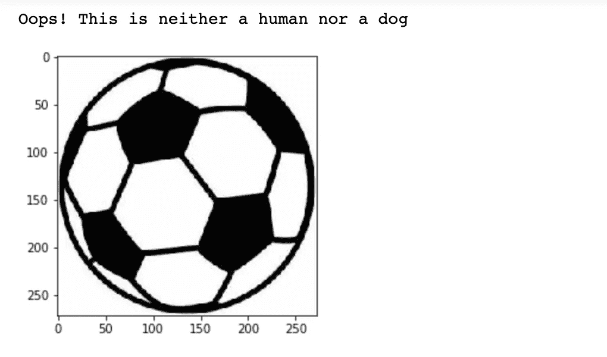

# 犬种分类器——神经网络的力量

> 原文：<https://medium.com/analytics-vidhya/dog-breed-classifier-power-of-neural-networks-a277f4ad91be?source=collection_archive---------16----------------------->

不仅把狗，而且把人的形象也归类为狗的品种，这是多么有趣啊！



人工神经网络[来源](https://commons.wikimedia.org/wiki/File:Single-layer_feedforward_artificial_neural_network.png)

令人难以置信的是，上面显示的边和节点创造了一套强大的算法，能够漂亮地识别模式。这些都是在人脑的基础上建立的，人脑可以通过一种机器感知分类来解释感官数据。它拍摄图像、声音、文本、时间序列等。所有真实世界的数据，并将其转换为数字向量以识别模式。

在这篇文章中，我们将更多地关注**卷积神经网络** (ConvNets 或 CNN)，它是**深度神经网络**的一个类别，已被证明在分析视觉图像尤其是图像识别和分类领域非常有效。为了进一步理解这一点，我们将通过一个卷积神经网络来处理现实世界中用户提供的图像。



[来源](https://unsplash.com/photos/yihlaRCCvd4)

给定一张狗的图像，该算法将识别潜在的狗品种。如果提供一个人的形象，代码将识别相似的狗品种。

听起来很有趣不是吗？让我们潜入更深的地方…

这是一个非常简单的 7 步流程**,不同于在幕后运行的复杂的神经网络流程:**

****

**卷积神经网络[来源](https://commons.wikimedia.org/wiki/File:Convolutional_Neural_Network.gif)**

*****第一步:*** *导入数据集* ***第二步*** *:检测人类* ***第三步:*** *检测狗* ***第四步:*** *创建 CNN 对狗的品种进行分类* ***第五步:)* ***第六步:*** *写一个算法绑定上面的步骤* ***第七步:*** *测试算法*****

# ****第一步:**导入数据集**

**我们从从 [Udacity](https://s3-us-west-1.amazonaws.com/udacity-aind/dog-project/dogImages.zip) 导入所需的库和数据集开始。数据集有**~ 8500 张狗的图片，横跨 133 个狗品种**。导入后，我们将数据分为训练、验证和测试数据集，分布分别为 80%、10%和 10%，并存储每个数据集的特性和目标。**

```
from sklearn.datasets import load_files       
from keras.utils import np_utils
import numpy as np
from glob import glob# define function to load train, test, and validation datasets
def load_dataset(path):
    data = load_files(path)
    dog_files = np.array(data['filenames'])
    dog_targets = np_utils.to_categorical(np.array(data['target']), 133)
    return dog_files, dog_targets# load train, test, and validation datasets
train_files, train_targets = load_dataset('../../../data/dog_images/train')
valid_files, valid_targets = load_dataset('../../../data/dog_images/valid')
test_files, test_targets = load_dataset('../../../data/dog_images/test')# load list of dog names
dog_names = [item[20:-1] for item in sorted(glob("../../../data/dog_images/train/*/"))]
```

# **第二步:探测人类**

**在这一步，我们将编写一个函数来检测图像是否有人脸。为了能够设计这个函数，我们首先从 [Udacity](https://s3-us-west-1.amazonaws.com/udacity-aind/dog-project/lfw.zip) 导入一个人类图像数据集。**

```
import random
random.seed(8675309)# load filenames in shuffled human dataset
human_files = np.array(glob("../../../data/lfw/*/*"))
random.shuffle(human_files)# print statistics about the dataset
print('There are %d total human images.' % len(human_files))
```

**现在，为了检测人脸，我们使用 OpenCV 的 [Haar 基于特征的级联分类器](https://docs.opencv.org/trunk/db/d28/tutorial_cascade_classifier.html)的实现。OpenCV 提供了许多预先训练的人脸检测器，作为 XML 文件存储在 [Github](https://github.com/opencv/opencv/tree/master/data/haarcascades) 上，我们下载了其中一个检测器。正如我们在下面看到的，在检测到人脸之前，算法还需要一些额外的图像转换步骤。下面的`face_detector`函数将图像路径作为参数，如果检测到人脸，则返回`True`，否则返回`False`。**

```
import cv2                
import matplotlib.pyplot as plt                        
%matplotlib inline# extract pre-trained face detector
face_cascade = cv2.CascadeClassifier('haarcascades/haarcascade_frontalface_alt.xml')# returns "True" if face is detected in image stored at img_path
def face_detector(img_path):
    img = cv2.imread(img_path)
    gray = cv2.cvtColor(img, cv2.COLOR_BGR2GRAY)
    faces = face_cascade.detectMultiScale(gray)
    return len(faces) > 0
```

**接下来，我们从之前下载的人和狗的数据中抽取 100 个图像样本，并通过函数运行它们。我们的模型能够在 **100%** 的人图像和 **11%** 的狗图像中检测出人脸。很好，但这足够了吗？**

# **第三步:探测狗**

**在这一步中，我们使用一个预先训练好的 [ResNet-50](http://ethereon.github.io/netscope/#/gist/db945b393d40bfa26006) 模型来检测图像中的狗。我们首先下载 ResNet-50 模型以及已经在 [ImageNet](http://www.image-net.org/) 上训练过的权重，这是一个非常大的流行数据集，用于图像分类和其他视觉任务。**

```
from keras.applications.resnet50 import ResNet50# define ResNet50 model
ResNet50_model = ResNet50(weights='imagenet')
```

**考虑到真实世界的图像可能有多混乱，通常需要在输入模型之前进行一些预处理。下面的`path_to_tensor`函数首先将所有图像的大小调整为 224×224 像素的正方形*(关键步骤之一)*。接下来，图像被转换成 4D 数组*(又名 4D 张量)*，因为 Keras CNN 在这里使用 TensorFlow 作为后端。*张量是矩阵到 N 维空间的推广*。*更多详情请看这篇伟大的* [*帖子*](https://www.kdnuggets.com/2018/05/wtf-tensor.html) *by* [*马修梅奥*](https://medium.com/u/a0bc63d95eb0?source=post_page-----a277f4ad91be--------------------------------) *。***

**输入形状: **(nb_samples，rows，columns，channels)** 其中，
`nb_samples`为图像(或样本)总数，
`rows`，`columns`，`channels`分别对应每幅图像的高度，长度，深度。我们的 4D 张量是(1，224，224，3)。**

```
from keras.preprocessing import image                  
from tqdm import tqdmdef path_to_tensor(img_path):
    # loads RGB image as PIL.Image.Image type
    img = image.load_img(img_path, target_size=(224, 224))
    # convert PIL.Image.Image type to 3D tensor with shape (224, 224, 3)
    x = image.img_to_array(img)
    # convert 3D tensor to 4D tensor with shape (1, 224, 224, 3) and return 4D tensor
    return np.expand_dims(x, axis=0)def paths_to_tensor(img_paths):
    list_of_tensors = [path_to_tensor(img_path) for img_path in tqdm(img_paths)]
    return np.vstack(list_of_tensors)
```

**在模型可用于预测之前，需要一些额外的预处理步骤，如将 RGB 图像转换为 BGR，通过从每个图像的每个像素中减去平均像素来归一化模型等。这都由`preprocess_input`功能负责。要了解更多信息，请点击查看代码[。](https://github.com/fchollet/keras/blob/master/keras/applications/imagenet_utils.py)**

**现在我们的图像已经格式化了，我们准备把它提供给 ResNet-50 并进行预测。下面的`predict`函数返回图像属于特定 ImageNet 类别的预测概率。为了将返回的整数映射到模型的预测对象类，请使用这个[字典](https://gist.github.com/yrevar/942d3a0ac09ec9e5eb3a)。**

```
from keras.applications.resnet50 import preprocess_input, decode_predictionsdef ResNet50_predict_labels(img_path):
    # returns prediction vector for image located at img_path
    img = preprocess_input(path_to_tensor(img_path))
    return np.argmax(ResNet50_model.predict(img))
```

**字典中所有的狗类别都对应于 151-268 键。因此，要检测一张狗脸，我们需要检查下面的`ResNet50_predict_labels`函数是否返回一个介于 151 和 268(含)之间的值。如果检测到狗脸，该函数返回`True`，否则返回`False`。**

**类似于步骤 2，我们通过这个函数运行 100 个图像的样本。我们的模型能够在狗图像的 **100%** 和人图像的 **0%** 中检测到狗脸。**

# **第四步:创建一个 CNN 来分类狗的品种**

**既然我们能够在图像中检测出人和狗的脸，我们的下一个目标是对狗的品种进行分类。我们创建了一个 CNN 模型来帮助这些分类预测。在我们开始建立模型之前，我们通过将每个图像中的每个像素除以 255 来重新缩放图像。**

```
# pre-process the data for Keras
train_tensors = paths_to_tensor(train_files).astype('float32')/255
valid_tensors = paths_to_tensor(valid_files).astype('float32')/255
test_tensors = paths_to_tensor(test_files).astype('float32')/255
```

**下面是来自我们分类模型的 **CNN 架构**。CNN 的设计目标通常是使输入阵列比其长度或宽度更深。在下面使用的 3 个**卷积层**中，我增加了过滤器的数量，以增加特征的堆叠，从而增加其深度。每个卷积层之后是一个**最大池层**，以减少图像的空间维度。然后，我们将矩阵展平成一个向量，然后将它送入一个完全连接的**密集层**，因为这些不接受多维数组。该层使用 softmax 激活函数来获得每个类别的分类概率，以及 133 个输出节点，在我们的训练数据中，每个狗类别 1 个。*要详细了解每个参数，以及这些参数是如何计算的，请参见本* [*帖子*](https://towardsdatascience.com/understanding-and-calculating-the-number-of-parameters-in-convolution-neural-networks-cnns-fc88790d530d)*by*[*Rakshith Vasudev*](https://medium.com/u/4ed456ddae20?source=post_page-----a277f4ad91be--------------------------------)*。***

```
from keras.layers import Conv2D, MaxPooling2D, GlobalAveragePooling2D
from keras.layers import Dropout, Flatten, Dense
from keras.models import Sequential# Define your architecture.model = Sequential()
# Convolutional layers and maxpooling layers, note: all images are 224*224 pixel
model.add(Conv2D(filters=16, kernel_size=2, strides=1, padding='same',activation='relu', input_shape=[224,224,3]))
model.add(MaxPooling2D(pool_size=2, strides=1, padding='same'))model.add(Conv2D(filters=32, kernel_size=2, strides=2, padding='same',activation='relu'))
model.add(MaxPooling2D(pool_size=2, strides=1, padding='same'))model.add(Conv2D(filters=64, kernel_size=2, strides=2, padding='same',activation='relu'))
model.add(MaxPooling2D(pool_size=2, strides=1, padding='same'))
#model.add(GlobalAveragePooling2D())# Flatten the array into a vector and feed to a dense layer
model.add(Flatten())
model.add(Dense(133, activation='softmax'))model.summary()
```

**接下来，我们**编译**，而**训练**我们的模型。ModelCheckpoint 用于保存获得最佳验证损失的模型。**

```
from keras.callbacks import ModelCheckpointmodel.compile(optimizer='rmsprop', loss='categorical_crossentropy', metrics=['accuracy'])checkpointer = ModelCheckpoint(filepath='saved_models/weights.best.from_scratch.hdf5', 
                               verbose=1, save_best_only=True)model.fit(train_tensors, train_targets, 
          validation_data=(valid_tensors, valid_targets),
          epochs=epochs, batch_size=20, callbacks=[checkpointer], verbose=1)
```

**一旦我们的模型被训练，我们加载之前保存的权重，并使用它在我们的**测试**数据上运行模型，以评估我们的模型的准确性。**

```
model.load_weights('saved_models/weights.best.from_scratch.hdf5')# get index of predicted dog breed for each image in test set
dog_breed_predictions = [np.argmax(model.predict(np.expand_dims(tensor, axis=0))) for tensor in test_tensors]# report test accuracy
test_accuracy = 100*np.sum(np.array(dog_breed_predictions)==np.argmax(test_targets, axis=1))/len(dog_breed_predictions)
print('Test accuracy: %.4f%%' % test_accuracy)
```

**这个模型工作正常，并且会给出 **~7%** 的精度。你一定在想，这么多才能得到这么低的精度？请记住，这是没有任何参数微调和数据增强。这是接下来的步骤将有助于提高准确性的地方。**

# **第五步:使用预先构建的 Keras CNN 模型，并修改这些模型来对狗的品种进行分类(使用迁移学习)**

**Keras 中有一些突破性的预建 CNN 架构，可以通过迁移学习来使用。VGG16、VGG19、ResNet50、Xception、InceptionV3。这些模型有助于在不牺牲准确性的情况下减少训练时间。这里使用了预先训练的 VGG-16 模型，并将其输入到我们的模型中。我们只添加了一个全局平均池层*(减少维度)*和一个具有 softmax 激活函数的全连接层*(为每个狗类别获得一个节点)*。**

```
bottleneck_features = np.load('bottleneck_features/DogVGG16Data.npz')
train_VGG16 = bottleneck_features['train']
valid_VGG16 = bottleneck_features['valid']
test_VGG16 = bottleneck_features['test']# CNN architecture using Transfer Learning
VGG16_model = Sequential()
VGG16_model.add(GlobalAveragePooling2D(input_shape=train_VGG16.shape[1:]))
VGG16_model.add(Dense(133, activation='softmax'))VGG16_model.summary()
```

**当我们通过这个新训练的模型和预先计算的特征运行我们的测试数据时，我们的准确性在更短的时间内增加到了 **~45%** ，这是一个显著的改进。这是因为现在网络中只有 2 层正在处理。使用 ResNet50 模型，准确率进一步跃升至 **~82%** ，这是我最终在代码中使用的。**

# **第六步:写一个算法来绑定上面的步骤**

**这是我们把所有不同的部分放在一起的步骤。我们编写了一个简单的算法，它接受一个图像路径，并首先确定它是否包含人脸、狗脸，或者两者都不包含。然后，**

*   **如果在图像中检测到一只**狗**，返回预测的品种。**
*   **如果在图像中检测到一个**人**，返回相似的狗品种。**
*   **如果在图像中没有检测到**或**，则提供指示错误的输出。**

```
def display_detect_image(img_path):
    detect_breed(img_path)
    # load color (BGR) image
    img = cv2.imread(img_path)
    # convert BGR image to RGB for plotting
    cv_rgb = cv2.cvtColor(img, cv2.COLOR_BGR2RGB)
    # display the image
    plt.imshow(cv_rgb)
    return plt.show()def detect_breed(img_path):
    # check if image is human face
    if face_detector(img_path) == True:
        return print("Hello human! Your face resembles a: ",Resnet50_predict_breed(img_path).str.split(".")[-1])
    # check if image is dog face
    elif dog_detector(img_path) == True:
        return print("Hello dog! Your predicted breed is: ",Resnet50_predict_breed(img_path).str.split(".")[-1])
    # else print an error message
    else:
        return print("Oops! This is neither a human nor a dog")
```

# **步骤 7:测试我们的算法**

**在这一部分，我们将看到我们算法的强大之处，并尝试一下！我随机提供了一些狗和人的图像，瞧！算法预测品种。现在，如果你喜欢街上或公园里的一只狗，你想知道它的品种，不需要问主人，只需点击一张图片，并通过模型运行它😄**

***要访问完整的代码，请点击* *查看我的 GitHub 的链接。***

************************

> ****参考文献:****
> 
> **[https://pathmind.com/wiki/neural-network](https://pathmind.com/wiki/neural-network)**
> 
> **[https://analyticsindiamag . com/tensor flow-vs-keras-你应该选择哪一个/](https://analyticsindiamag.com/tensorflow-vs-keras-which-one-should-you-choose/)**