# 使用 CNN 的犬种分类器。

> 原文：<https://medium.com/analytics-vidhya/dog-breed-classifier-using-cnns-9971a0481b2a?source=collection_archive---------28----------------------->

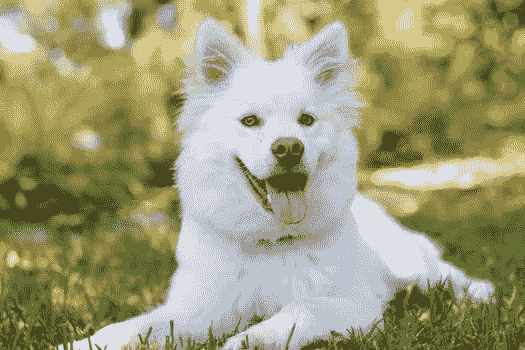

# **概述:**

该项目的目的是创建一个狗的品种分类器，它可以识别给定的狗的图片狗的品种。它还可以判断照片中是否有一个人而不是狗，还可以判断这个人是什么品种的狗，这真是一个有趣的部分。数据集来自 sklearn，包含 133 个类别的 8351 张狗的图片。

对于这个分类问题，我使用了四个卷积神经网络。一个是白手起家。另外两个是被称为 Res-Net50、VGG-16 和 Xception 的预训练模型。

# **指标:**

评估这些模型标准是准确性。我得到了异常模型的最高精度。对于这样一个简单的分类任务，一个精度度量就足够了。还有其他指标，如精确度、召回率或 F1。对于准确性不是主要问题的情况，如医疗保健行业，它们更为重要。但是在这种情况下，准确性服务于目的，因此我使用准确性。

# **要求:**

分类是在 Python 3 中完成的。使用的 python 包是-

1.  numpy
2.  熊猫
3.  cv2
4.  一团
5.  克拉斯
6.  matplotlib
7.  PIL
8.  随意
9.  sklearn
10.  tqdm

所有这些软件包都可以通过 pip 安装获得。

# **流程:**

起初，数据集是从 sklearn 加载的。然后，该数据集被可用的 133 个狗品种查看。

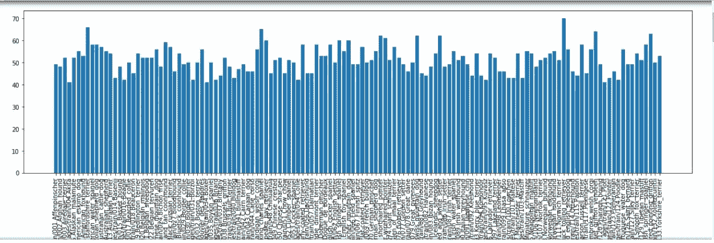

从图中可以清楚地看到，平均每类犬种有大约 50 张图片，数据非常平衡。

为了检测人脸并找出与狗的有趣相似之处，使用了 13233 张人脸图像。使用 cv2 包中的 face_cascade 进行人脸检测。cv2 或 openCV 是这种类型分析的一个很好的包。

然后创建了人脸检测器功能。该功能在所有人类图像中检测到 100%的人脸，而在狗图像中奇怪地检测到 11%的人脸。

然后使用 Res-Net50 模型来检测照片中的狗。然后利用 keras 中的预处理方法对图像进行预处理。当使用 TensorFlow 作为后端时，Keras CNNs 需要一个 4D 数组(我们也称之为 4D 张量)作为输入，带有形状

**(nb _ 样本，行，列，通道)**

其中 **nb_samples** 对应于图像(或样本)的总数，而**行、列、通道**分别对应于每个图像的行、列和通道的数量。

**path_to_tensor** 函数将彩色图像的字符串值文件路径作为输入，并返回适合提供给 Keras CNN 的 4D 张量。该函数首先加载图像，并将其调整为 224×224 像素的正方形图像。接下来，图像被转换成数组，然后数组被调整大小为 4D 张量。在这种情况下，由于我们正在处理彩色图像，每个图像有三个通道。同样，由于我们处理的是单个图像(或样本)，返回的张量总是有形状的

(1,224,224,3).

**path_to_tensor** 函数将字符串值图像路径的 numpy 数组作为输入，并返回带有形状的 4D 张量

(nb_samples，224，224，3)。

然后观看三幅预处理后的图像。

然后利用 Res-Net 模型构建了一个狗检测器。这个狗检测器在狗图像中检测到 100%的狗，在人图像中检测到 0%的狗。

然后一个 CNN 就从零开始建起来了。为此，对图像进行了预处理。对于预处理，使用最常见的图像预处理技术。将图像数组除以 255 得到了归一化的图像。这种规范化是深度神经网络的任何预处理的关键部分，因为神经网络往往更好地处理规范化的数据。

CNN 的架构如下:

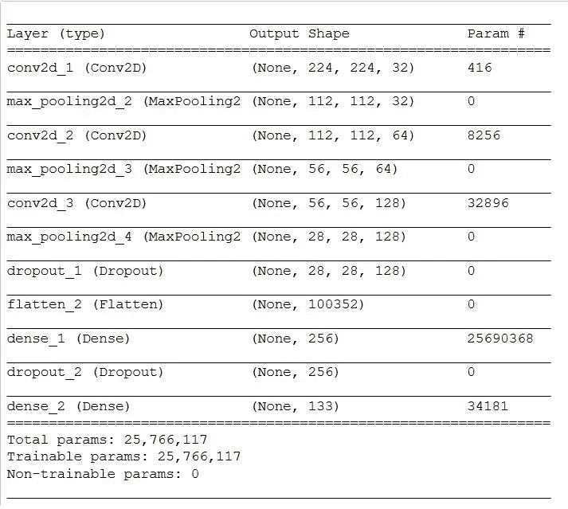

该体系结构中使用的层如下:

*   Conv2D
*   最大池化
*   拒绝传统社会的人
*   变平
*   稠密的

使用 10 个时期来训练模型。该模型使用 rmsprop 优化器编译，损失函数是分类交叉熵，度量是准确性。

获得的测试精度为 8.1340%，这是非常低的。

然后我们使用迁移学习在不牺牲准确性的情况下减少训练时间。首先，我们使用了一个 VGG-16 模型。出于迁移学习的目的，我们首先获得瓶颈特征。然后，该模型使用预训练的 VGG-16 模型作为固定特征提取器，其中 VGG-16 的最后卷积输出作为输入被馈送到我们的模型。我们只添加了一个全局平均池层和一个全连接层，其中后者包含每个狗类别的一个节点，并配备了一个 softmax。

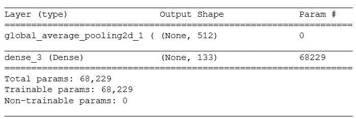

使用相同的编译配置之前，我们得到了更好的结果在我们的分类器。在 20 个时期之后，我能够在测试集上获得 42.4641%的准确度。

对于进一步的迁移学习，有许多选择。我用了例外。模型架构如下:

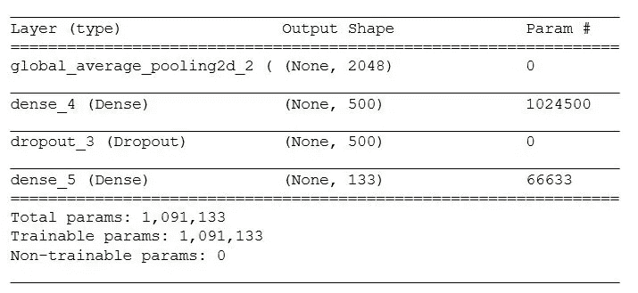

我再次使用相同的编译配置，但是我使用了 100 个历元，结果比我预期的要好。我得到了 85.4067%的准确率。我使用了 7 张图片来测试我的分类器。我用了四张狗的图片，一张头像和两张人的图片。该模型可以正确地对这七幅图像中的六幅进行分类。它不能对戴太阳镜的狗的图像进行分类。

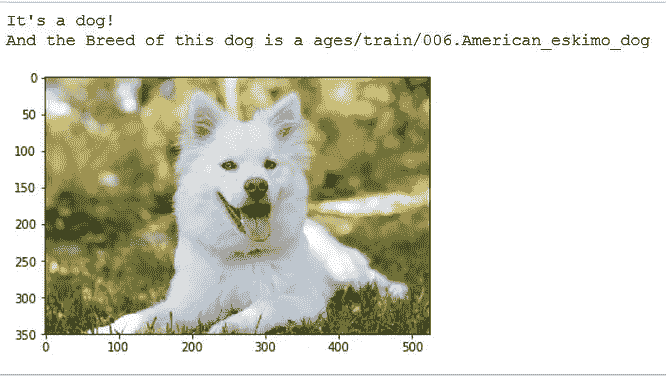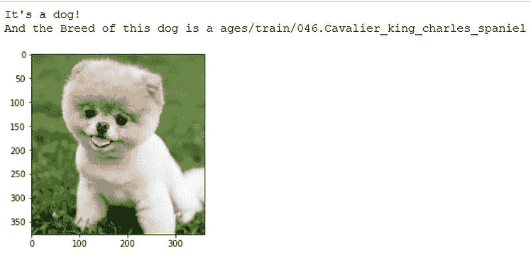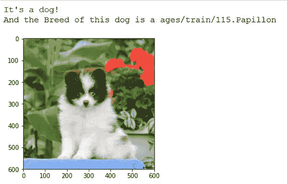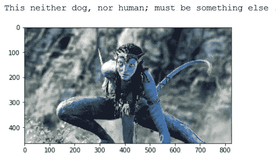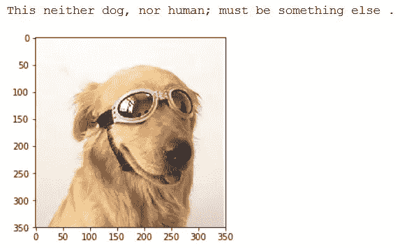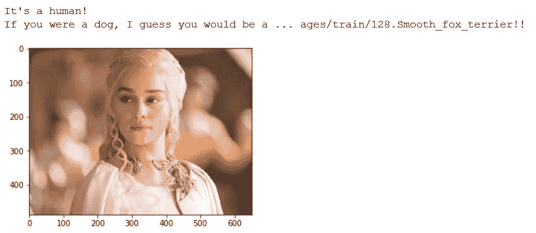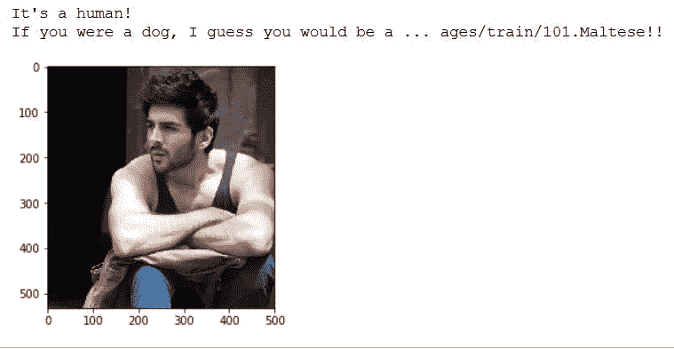

# **增强:**

对于从头开始制作的 CNN，首先我使用了一个没有池的更简单的模型。这导致了一个严重的问题，因为我无法在测试集上获得 1%的准确率。但是在添加了 maxpooling 层之后，精确度提高了。这是因为池用于降维。这使得 CNN 运行得更快，但也减少了过度拟合。在这种情况下，共用是安全的，因为相邻像素很可能是相似的，所以减少采样不会降低分类器检测图像的能力。

我尝试向 Xception 模型添加多个层，但它在全局平均池中表现最佳。这种方法降低了每个特征图的维数，但保留了最重要的信息，这使它成为一种高效而整洁的体系结构。模型的最后一层用于预测类别。此外，增加周期数会产生更好的结果。

# **结果:**

获得的结果是迷人的。最初的模型是一个从头开始的 CNN，它的表现不够好，只有 8.1340%的准确率。但是通过迁移学习，结果有了显著的提高。当使用 VGG-16 时，测试集上的正确率提高到 42.4641%。但更令人惊讶的是，当使用 Xception 模型时，模型的准确性超出了我的预期，达到了 85.4067%。

对于 Xception 的最终模型，我添加了一个全局平均池层。我还使用了 100 个历元来训练模型。使用的损失函数是 categorical _ crossentropy，优化器是 rmsprop。这些配置工作得非常好。由于多类问题，使用了 Categorical _ crossentropy。尽管还有其他可用的优化器，但 rmsprop 给出了令人满意的结果。

更有说服力的情况是，对于随机挑选的七幅图像，它正确地分类了六幅图像。

# **结论:**

构建的预训练模型的性能远远超过手工制作的 CNN 模型。Xception 模型的准确率(达到了 85%左右，而我的 CNN 是 7%左右。).这是因为预训练模型是使用更大的数据集训练的。

这个项目令人印象深刻。处理图像是进行深度学习的一个好方法。可以学到很多东西，像数据规范化，数据扩充等等。整个项目遵循学习图像分类的平稳路径，从零开始构建卷积神经网络，以使用迁移学习。最让我着迷的是预训练模型的使用。准确度的提高是惊人的。同样，最困难的部分是从头开始构建一个具有良好准确性的 CNN。我试了很多，但真的走不远。这就是为什么迁移学习的进步让我印象深刻。

虽然获得了很高的精度，但并不完美。这个结果可以通过扩充数据集来进一步改进。

你可以在这里找到我的 Jupyter 笔记本:[https://github.com/Asif1405/Dog-Breed-Classifier](https://github.com/Asif1405/Dog-Breed-Classifier)