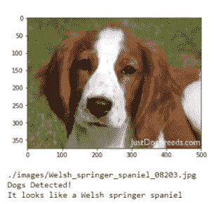
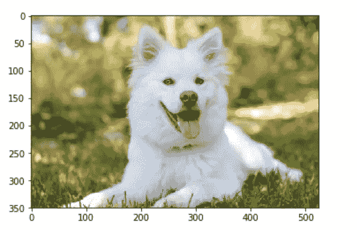
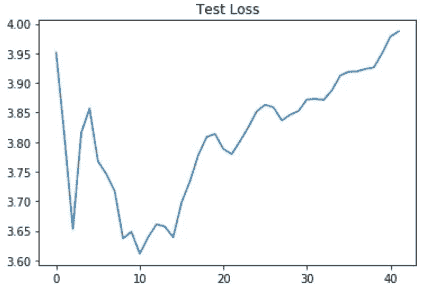
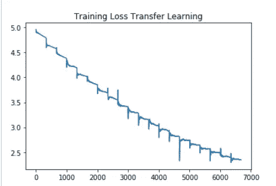
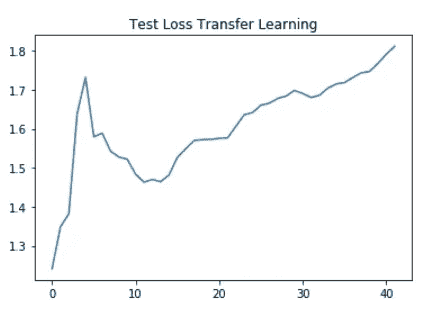
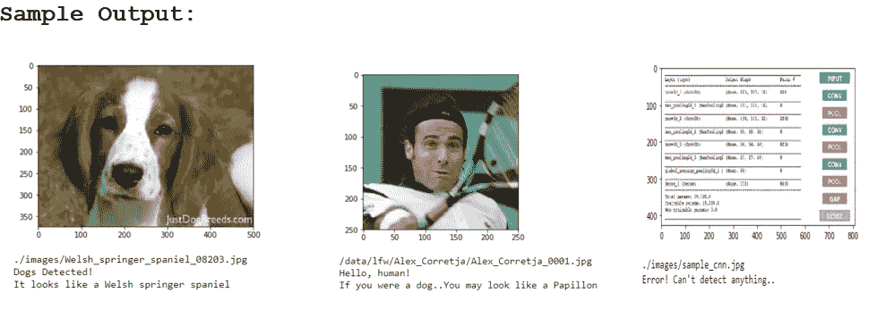

# 使用卷积神经网络(CNN)的狗品种分类器

> 原文：<https://medium.com/analytics-vidhya/dog-breed-classifier-using-convolution-neural-networks-cnns-507d126a9185?source=collection_archive---------36----------------------->



**概述:**

对现实世界中物体的分类通常是为了使它们作为一个组的一部分更有意义。我们在日常生活中做的一个非常常见的分类是，当我们看着一个人时，立即将他们归类为男性或女性。在这个应用程序中，有一个[分类问题](https://brilliant.org/wiki/classification/)被解决，但是在另一个不同的问题**上，根据一张图片将一只狗分类到它可能的品种。**

在本文中，我们将按照我所遵循的步骤来实现解决方案和结果。我们还将研究模型预测的准确性以及进一步改进它们的方法。

**问题陈述:**

在这一节中，我们将研究实际的问题陈述。

犬种分类器问题是分类问题中的一个常见问题。这里的目标是从作为机器学习模型的输入而提供的图像中获得狗的正确品种。为了让应用程序更具挑战性，如果人类图像通过，模型必须**返回相似的品种**。例如，看看顶部的图像。该模型还必须拒绝没有狗的图像。

**数据探索:**

这个项目的数据由 **Udacity** 提供，作为他们[数据科学家纳米学位项目](https://www.udacity.com/course/ud025-preview)的一部分。请使用以下链接获取数据。请注意，两个链接中的数据总计约 2 GB！

*   [狗图像数据集](https://s3-us-west-1.amazonaws.com/udacity-aind/dog-project/dogImages.zip):用于训练模型。内容和结构解释如下。
*   [人脸数据集](https://s3-us-west-1.amazonaws.com/udacity-aind/dog-project/lfw.zip):用于检测/预测。

狗图像数据集总共有 **8351 张图像**。这分为**训练** ( **6680 张图像**)、**测试(836 张图像)、验证(835 张图像)目录。**这些目录中的每一个都有 **133 个子目录**对应 133 种不同品种的狗。不同的品种有不同数量的图像。有些品种有多达 8 种不同的图像，而有些只有 4 种。所以数据是不平衡的。下面是示例图像



**人体图像数据集**在 5750 个文件夹下总共有**13233 张图像。所有图像的尺寸都是( **250 X 250** )。在狗的数据集中，数据是不平衡的，有些人只有一个图像，而有些人有多个图像。样本人类图像，**


作为图像预处理数据的一部分，所有图像的尺寸都调整为 **240 X 240。**然后将 [**归一化**](https://ieeexplore.ieee.org/stamp/stamp.jsp?arnumber=8022860) 应用于所有数据集(训练、测试、验证)。

现在数据的最重要部分——图像的预处理， [**图像增强**](https://towardsdatascience.com/image-augmentation-using-python-numpy-opencv-and-skimage-ef027e9898da?gi=a750faef656) 是对训练数据进行的。随机旋转图像，并应用水平翻转。需要图像增强来**防止模型的过度拟合**。最后，图像被转换成张量并输入到模型中。

**指标:**

整个数据被分成训练、测试和验证数据集。通过测试数据集的标准精度测试来评估该模型。

```
accuracy = correct_predictions/total_number_of_inputs
```

对于狗品种分类器来说，准确度是足够的度量，因为所有品种都具有几乎相似数量的图像。

从零开始创建的模型必须具有至少 10%的精度。当模型的训练完成并且绘制了损失时，获得了下面的图。



使用迁移学习创建的模型预期具有至少 60%的准确度。获得的准确率为 72%,训练和测试损失较低



**实施:**

本节简要说明了实施过程:

*   与所有数据科学和机器学习项目一样，这个项目也是从数据预处理开始的。
*   数据被分成训练、测试和验证数据集。下面的代码执行这项任务。

```
train_data = datasets.ImageFolder(train_dir, transform=data_transforms['train'])
valid_data = datasets.ImageFolder(valid_dir, transform=data_transforms['valid'])
test_data = datasets.ImageFolder(test_dir, transform=data_transforms['test'])training_loader = torch.utils.data.DataLoader(train_data,
                                           batch_size=batch_size, 
                                           num_workers=num_workers,
                                           shuffle=True)
validation_loader = torch.utils.data.DataLoader(valid_data,
                                           batch_size=batch_size, 
                                           num_workers=num_workers,
                                           shuffle=False)
testing_loader = torch.utils.data.DataLoader(test_data,
                                           batch_size=batch_size, 
                                           num_workers=num_workers,
                                           shuffle=False)
```

*   然后是主要的过程，图像增强。这样做是为了得到图像的变化。这有助于预测图像中的狗相对于帧处于不同角度的情况。简而言之，为了防止过度拟合

图像增强在下面的代码片段中执行。

```
 'train': transforms.Compose([transforms.RandomResizedCrop(224),
                    transforms.RandomHorizontalFlip(),
                    transforms.ToTensor(),
                    transforms.Normalize(mean=[0.485, 0.456, 0.406],
                                      std=[0.229, 0.224, 0.225])]),
'valid': transforms.Compose([transforms.Resize(256),
                            transforms.CenterCrop(224),
                            transforms.ToTensor(),
                   transforms.Normalize(mean=[0.485, 0.456, 0.406],
                                       std=[0.229, 0.224, 0.225])]),
'test': transforms.Compose([transforms.Resize(size=(224,224)), 
                            transforms.CenterCrop(224),
                            transforms.ToTensor(),
                    transforms.Normalize(mean=[0.485, 0.456, 0.406],
                                       std=[0.229, 0.224, 0.225])])
```

*   使用分类器的 OpenCV 实现检测人脸。
*   VGG16 模型用于创建狗检测器。

下面是 VGG16 模型的代码片段

```
import torch
import torchvision.models as models# define VGG16 model
VGG16 = models.vgg16(pretrained=True)
```

*   CNN 模型是从零开始创建的。这包括模型的训练、测试和验证。这里有 3 个卷积层，每层的核大小为 3，步长为 1。
*   下面是从头开始创建的模型的架构

```
----------------------------------------------------------------
        Layer (type)               Output Shape         Param #
================================================================
            Conv2d-1         [-1, 32, 112, 112]             896
         MaxPool2d-2           [-1, 32, 56, 56]               0
            Conv2d-3           [-1, 64, 28, 28]          18,496
         MaxPool2d-4           [-1, 64, 14, 14]               0
            Conv2d-5          [-1, 128, 14, 14]          73,856
         MaxPool2d-6            [-1, 128, 7, 7]               0
           Dropout-7                 [-1, 6272]               0
            Linear-8                  [-1, 500]       3,136,500
           Dropout-9                  [-1, 500]               0
           Linear-10                  [-1, 133]          66,633
================================================================
Total params: 3,296,381
Trainable params: 3,296,381
Non-trainable params: 0
----------------------------------------------------------------
Input size (MB): 0.57
Forward/backward pass size (MB): 4.60
Params size (MB): 12.57
Estimated Total Size (MB): 17.75
----------------------------------------------------------------
```

*   具有 Resnet101 架构的 CNN 模型用于使用迁移学习过程来创建模型。

这是迁移学习模型的模型架构:

```
---------------------------------------------------------------
        Layer (type)               Output Shape         Param #
================================================================
            Conv2d-1         [-1, 64, 112, 112]           9,408
       BatchNorm2d-2         [-1, 64, 112, 112]             128
              ReLU-3         [-1, 64, 112, 112]               0
         MaxPool2d-4           [-1, 64, 56, 56]               0
            Conv2d-5           [-1, 64, 56, 56]           4,096
       BatchNorm2d-6           [-1, 64, 56, 56]             128
              ReLU-7           [-1, 64, 56, 56]               0
            Conv2d-8           [-1, 64, 56, 56]          36,864
       BatchNorm2d-9           [-1, 64, 56, 56]             128
             ReLU-10           [-1, 64, 56, 56]               0
           Conv2d-11          [-1, 256, 56, 56]          16,384
      BatchNorm2d-12          [-1, 256, 56, 56]             512
           Conv2d-13          [-1, 256, 56, 56]          16,384
      BatchNorm2d-14          [-1, 256, 56, 56]             512
             ReLU-15          [-1, 256, 56, 56]               0
       Bottleneck-16          [-1, 256, 56, 56]               0
           Conv2d-17           [-1, 64, 56, 56]          16,384
      BatchNorm2d-18           [-1, 64, 56, 56]             128
             ReLU-19           [-1, 64, 56, 56]               0
           Conv2d-20           [-1, 64, 56, 56]          36,864
      BatchNorm2d-21           [-1, 64, 56, 56]             128
             ReLU-22           [-1, 64, 56, 56]               0
           Conv2d-23          [-1, 256, 56, 56]          16,384
      BatchNorm2d-24          [-1, 256, 56, 56]             512
             ReLU-25          [-1, 256, 56, 56]               0
       Bottleneck-26          [-1, 256, 56, 56]               0
           Conv2d-27           [-1, 64, 56, 56]          16,384
      BatchNorm2d-28           [-1, 64, 56, 56]             128
             ReLU-29           [-1, 64, 56, 56]               0
           Conv2d-30           [-1, 64, 56, 56]          36,864
      BatchNorm2d-31           [-1, 64, 56, 56]             128
             ReLU-32           [-1, 64, 56, 56]               0
           Conv2d-33          [-1, 256, 56, 56]          16,384
      BatchNorm2d-34          [-1, 256, 56, 56]             512
             ReLU-35          [-1, 256, 56, 56]               0
       Bottleneck-36          [-1, 256, 56, 56]               0
           Conv2d-37          [-1, 128, 56, 56]          32,768
      BatchNorm2d-38          [-1, 128, 56, 56]             256
             ReLU-39          [-1, 128, 56, 56]               0
           Conv2d-40          [-1, 128, 28, 28]         147,456
      BatchNorm2d-41          [-1, 128, 28, 28]             256
             ReLU-42          [-1, 128, 28, 28]               0
           Conv2d-43          [-1, 512, 28, 28]          65,536
      BatchNorm2d-44          [-1, 512, 28, 28]           1,024
           Conv2d-45          [-1, 512, 28, 28]         131,072
      BatchNorm2d-46          [-1, 512, 28, 28]           1,024
             ReLU-47          [-1, 512, 28, 28]               0
       Bottleneck-48          [-1, 512, 28, 28]               0
           Conv2d-49          [-1, 128, 28, 28]          65,536
      BatchNorm2d-50          [-1, 128, 28, 28]             256
             ReLU-51          [-1, 128, 28, 28]               0
           Conv2d-52          [-1, 128, 28, 28]         147,456
      BatchNorm2d-53          [-1, 128, 28, 28]             256
             ReLU-54          [-1, 128, 28, 28]               0
           Conv2d-55          [-1, 512, 28, 28]          65,536
      BatchNorm2d-56          [-1, 512, 28, 28]           1,024
             ReLU-57          [-1, 512, 28, 28]               0
       Bottleneck-58          [-1, 512, 28, 28]               0
           Conv2d-59          [-1, 128, 28, 28]          65,536
      BatchNorm2d-60          [-1, 128, 28, 28]             256
             ReLU-61          [-1, 128, 28, 28]               0
           Conv2d-62          [-1, 128, 28, 28]         147,456
      BatchNorm2d-63          [-1, 128, 28, 28]             256
             ReLU-64          [-1, 128, 28, 28]               0
           Conv2d-65          [-1, 512, 28, 28]          65,536
      BatchNorm2d-66          [-1, 512, 28, 28]           1,024
             ReLU-67          [-1, 512, 28, 28]               0
       Bottleneck-68          [-1, 512, 28, 28]               0
           Conv2d-69          [-1, 128, 28, 28]          65,536
      BatchNorm2d-70          [-1, 128, 28, 28]             256
             ReLU-71          [-1, 128, 28, 28]               0
           Conv2d-72          [-1, 128, 28, 28]         147,456
      BatchNorm2d-73          [-1, 128, 28, 28]             256
             ReLU-74          [-1, 128, 28, 28]               0
           Conv2d-75          [-1, 512, 28, 28]          65,536
      BatchNorm2d-76          [-1, 512, 28, 28]           1,024
             ReLU-77          [-1, 512, 28, 28]               0
       Bottleneck-78          [-1, 512, 28, 28]               0
           Conv2d-79          [-1, 256, 28, 28]         131,072
      BatchNorm2d-80          [-1, 256, 28, 28]             512
             ReLU-81          [-1, 256, 28, 28]               0
           Conv2d-82          [-1, 256, 14, 14]         589,824
      BatchNorm2d-83          [-1, 256, 14, 14]             512
             ReLU-84          [-1, 256, 14, 14]               0
           Conv2d-85         [-1, 1024, 14, 14]         262,144
      BatchNorm2d-86         [-1, 1024, 14, 14]           2,048
           Conv2d-87         [-1, 1024, 14, 14]         524,288
      BatchNorm2d-88         [-1, 1024, 14, 14]           2,048
             ReLU-89         [-1, 1024, 14, 14]               0
       Bottleneck-90         [-1, 1024, 14, 14]               0
           Conv2d-91          [-1, 256, 14, 14]         262,144
      BatchNorm2d-92          [-1, 256, 14, 14]             512
             ReLU-93          [-1, 256, 14, 14]               0
           Conv2d-94          [-1, 256, 14, 14]         589,824
      BatchNorm2d-95          [-1, 256, 14, 14]             512
             ReLU-96          [-1, 256, 14, 14]               0
           Conv2d-97         [-1, 1024, 14, 14]         262,144
      BatchNorm2d-98         [-1, 1024, 14, 14]           2,048
             ReLU-99         [-1, 1024, 14, 14]               0
      Bottleneck-100         [-1, 1024, 14, 14]               0
          Conv2d-101          [-1, 256, 14, 14]         262,144
     BatchNorm2d-102          [-1, 256, 14, 14]             512
            ReLU-103          [-1, 256, 14, 14]               0
          Conv2d-104          [-1, 256, 14, 14]         589,824
     BatchNorm2d-105          [-1, 256, 14, 14]             512
            ReLU-106          [-1, 256, 14, 14]               0
          Conv2d-107         [-1, 1024, 14, 14]         262,144
     BatchNorm2d-108         [-1, 1024, 14, 14]           2,048
            ReLU-109         [-1, 1024, 14, 14]               0
      Bottleneck-110         [-1, 1024, 14, 14]               0
          Conv2d-111          [-1, 256, 14, 14]         262,144
     BatchNorm2d-112          [-1, 256, 14, 14]             512
            ReLU-113          [-1, 256, 14, 14]               0
          Conv2d-114          [-1, 256, 14, 14]         589,824
     BatchNorm2d-115          [-1, 256, 14, 14]             512
            ReLU-116          [-1, 256, 14, 14]               0
          Conv2d-117         [-1, 1024, 14, 14]         262,144
     BatchNorm2d-118         [-1, 1024, 14, 14]           2,048
            ReLU-119         [-1, 1024, 14, 14]               0
      Bottleneck-120         [-1, 1024, 14, 14]               0
          Conv2d-121          [-1, 256, 14, 14]         262,144
     BatchNorm2d-122          [-1, 256, 14, 14]             512
            ReLU-123          [-1, 256, 14, 14]               0
          Conv2d-124          [-1, 256, 14, 14]         589,824
     BatchNorm2d-125          [-1, 256, 14, 14]             512
            ReLU-126          [-1, 256, 14, 14]               0
          Conv2d-127         [-1, 1024, 14, 14]         262,144
     BatchNorm2d-128         [-1, 1024, 14, 14]           2,048
            ReLU-129         [-1, 1024, 14, 14]               0
      Bottleneck-130         [-1, 1024, 14, 14]               0
          Conv2d-131          [-1, 256, 14, 14]         262,144
     BatchNorm2d-132          [-1, 256, 14, 14]             512
            ReLU-133          [-1, 256, 14, 14]               0
          Conv2d-134          [-1, 256, 14, 14]         589,824
     BatchNorm2d-135          [-1, 256, 14, 14]             512
            ReLU-136          [-1, 256, 14, 14]               0
          Conv2d-137         [-1, 1024, 14, 14]         262,144
     BatchNorm2d-138         [-1, 1024, 14, 14]           2,048
            ReLU-139         [-1, 1024, 14, 14]               0
      Bottleneck-140         [-1, 1024, 14, 14]               0
          Conv2d-141          [-1, 512, 14, 14]         524,288
     BatchNorm2d-142          [-1, 512, 14, 14]           1,024
            ReLU-143          [-1, 512, 14, 14]               0
          Conv2d-144            [-1, 512, 7, 7]       2,359,296
     BatchNorm2d-145            [-1, 512, 7, 7]           1,024
            ReLU-146            [-1, 512, 7, 7]               0
          Conv2d-147           [-1, 2048, 7, 7]       1,048,576
     BatchNorm2d-148           [-1, 2048, 7, 7]           4,096
          Conv2d-149           [-1, 2048, 7, 7]       2,097,152
     BatchNorm2d-150           [-1, 2048, 7, 7]           4,096
            ReLU-151           [-1, 2048, 7, 7]               0
      Bottleneck-152           [-1, 2048, 7, 7]               0
          Conv2d-153            [-1, 512, 7, 7]       1,048,576
     BatchNorm2d-154            [-1, 512, 7, 7]           1,024
            ReLU-155            [-1, 512, 7, 7]               0
          Conv2d-156            [-1, 512, 7, 7]       2,359,296
     BatchNorm2d-157            [-1, 512, 7, 7]           1,024
            ReLU-158            [-1, 512, 7, 7]               0
          Conv2d-159           [-1, 2048, 7, 7]       1,048,576
     BatchNorm2d-160           [-1, 2048, 7, 7]           4,096
            ReLU-161           [-1, 2048, 7, 7]               0
      Bottleneck-162           [-1, 2048, 7, 7]               0
          Conv2d-163            [-1, 512, 7, 7]       1,048,576
     BatchNorm2d-164            [-1, 512, 7, 7]           1,024
            ReLU-165            [-1, 512, 7, 7]               0
          Conv2d-166            [-1, 512, 7, 7]       2,359,296
     BatchNorm2d-167            [-1, 512, 7, 7]           1,024
            ReLU-168            [-1, 512, 7, 7]               0
          Conv2d-169           [-1, 2048, 7, 7]       1,048,576
     BatchNorm2d-170           [-1, 2048, 7, 7]           4,096
            ReLU-171           [-1, 2048, 7, 7]               0
      Bottleneck-172           [-1, 2048, 7, 7]               0
       AvgPool2d-173           [-1, 2048, 1, 1]               0
          Linear-174                  [-1, 133]         272,517
================================================================
Total params: 23,780,549
Trainable params: 272,517
Non-trainable params: 23,508,032
----------------------------------------------------------------
Input size (MB): 0.57
Forward/backward pass size (MB): 286.55
Params size (MB): 90.72
Estimated Total Size (MB): 377.84
----------------------------------------------------------------
```

*   最后，编写这个 app 的主要代码。这里把狗检测器和人检测器结合起来，处理下面的情况。
*   如果检测到狗，则输出该品种。
*   如果人类被检测到，则输出与人类相似的品种，以及人类被检测到的消息。
*   如果两者都不是，则输出指示相同的适当消息。

**模型评估和验证:**

[卷积神经网络](https://en.wikipedia.org/wiki/Convolutional_neural_network)(CNN)用于创建模型。最初**车型是从零开始创造的**。这个模型的目标是至少有 10 %的精确度。设定这个目标的原因是为了确保模型比随机猜测做得更好( **1%的准确性**)。

现在使用 [**迁移学习**](https://en.wikipedia.org/wiki/Transfer_learning) 创建了一个新的 CNN 模型，目标是准确率超过 **60%。该模型被训练 20 个时期。应用中的模型超过预期，准确率为 72%。在总共 836 幅图像中，它正确预测了 619 幅。**

**测试准确率:72% (610/836)**

**输出:**

下图描述了我的应用程序的输出。



所有情况下的应用程序输出示例(狗图像、人图像、无)

**总结**:

与从零开始创建的模型(10%的准确率)相比，使用迁移学习创建的模型要好得多(74%的准确率)。因此，我们通过选择迁移学习做得更好。这为迁移学习解决这类问题开辟了广阔的空间。

**改进:**

下面的步骤可能会产生一个更好的模型，在精度上有很大的提高。

*   我们可以使用除 **ResNet101** 之外的架构，这可能会提高性能。
*   可以增加图像放大以防止更多的**过度拟合**并提高精确度。
*   每种狗的更多图像导致更好的预测。

**项目链接:**

如果你已经做到这一步，那么我很高兴分享我的项目代码。下面是我的项目目录的 github 链接。根目录下的 **Readme.md** 文件中给出了项目的使用说明。

链接:[https://github.com/KIRANVASISHTA/Dog-Breed-Classifier](https://github.com/KIRANVASISHTA/Dog-Breed-Classifier)

**参考文献:**

除了上面提到的链接，下面的链接对我完成这个项目帮助很大。

1.Udacity 犬种分类器[https://github . com/uda city/deep-learning-v2-py torch/tree/master/project-dog-classification](https://github.com/udacity/deep-learning-v2-pytorch/tree/master/project-dog-classification)

2.来自卡格尔的 resnet 101:[https://www.kaggle.com/pytorch/resnet101](https://www.kaggle.com/pytorch/resnet101)

3.Pytorch 教程:[https://pytorch.org/](https://pytorch.org/)

4.jupyter 项目文件中给出了更多的参考资料。

除此之外，我还要感谢 Udacity 为我提供了这个学习和完成这个项目的机会。