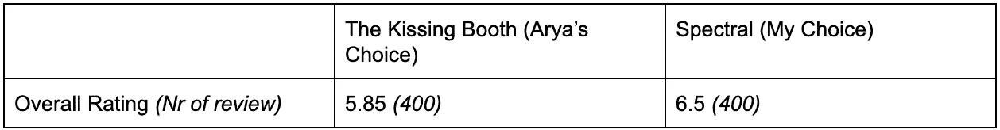
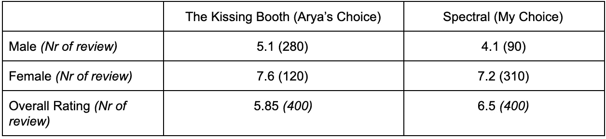
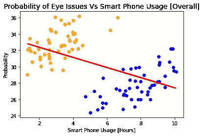
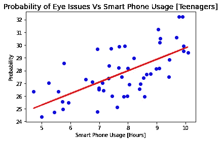
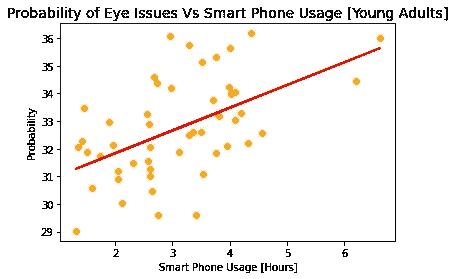
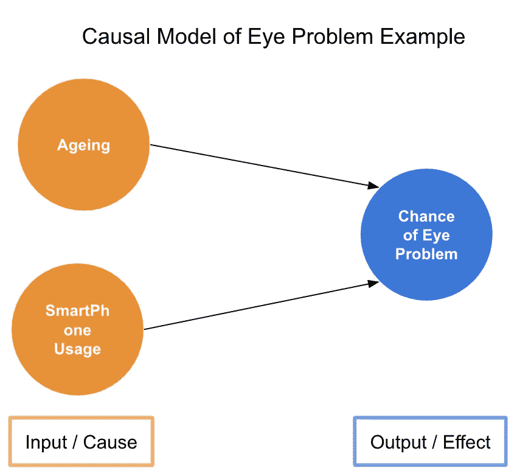
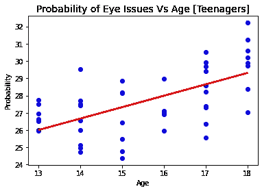
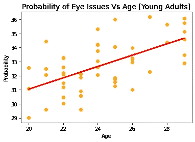
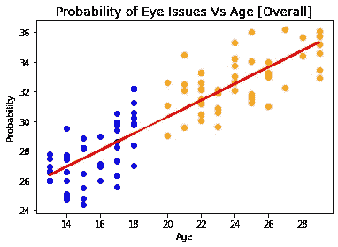

# 哦，辛普森悖论

> 原文：<https://medium.com/analytics-vidhya/doh-simpson-s-paradox-7084f39d6806?source=collection_archive---------14----------------------->

真正的爱情是花些时间独处，对吗？赞同这个理论，艾莉亚和我决定翻翻。现在，启发性的启示来了。艾莉亚喜欢看歇斯底里的东西，而我更喜欢深思熟虑的主题。现在怎么办！我们都冲向 [**flibo**](https://flibo.ai/search) 去寻找我们喜欢的最好的电影。她想出了电影*《接吻亭》*，我想出了电影*《灵异》*。现在如何言归于好？听起来很合理，但我让她比较他们的总体评分。

电影分级的比较

明摆着胜利者就在这里，*光谱*！。我们刚要开始看电影，艾莉亚就想到了我的快乐，并把数据按类别进行了分类，男性和女性的个人评分，显示出在每个类别中，人们都给了《接吻亭》更高的评分。我沮丧地看着这些数据，想知道这怎么可能。

组内电影分级的比较

我们刚刚目睹的是[辛普森悖论](https://en.wikipedia.org/wiki/Simpson%27s_paradox)，一个趋势出现在几组不同的数据中，但当这些组组合在一起时就消失或逆转了。在这种情况下，如果我们查看每个数据类别中的评论数据，男性和女性，那么*接吻亭*具有更好的评论，但是当我们组合数据*时，光谱*具有更好的评论。

在上面的例子中发生了两件事:第一，更多的男性评论了《接吻亭》*而不是女性，第二，男性通常倾向于给电影更少的评价。结合在一起，它创造了这个场景。*

回到“哪部电影更好”这个问题上，我们应该看组合数据还是每个类别内的单个数据？这在很大程度上与理解测量结果和收集/观察到的数据点之间的因果关系有关。我知道这很令人困惑，坚持下去，和我一起深入下去。一边寻找答案(是啊，我已经把她的心情惯坏了！！但是，在甜蜜的死亡袭击我之前，我必须解开它)，我遇到了一个现象，我想把它称为“幽灵相关性”，以了解更多。

## 幽灵关联

让我们做一个思维实验:眼睛问题应该随着一个人使用智能手机而增加吗？从逻辑上讲，一个人患眼疾的概率应该与他/她花在智能手机上的时间成正相关。对吗？看下面的图表

*你可以在这个* [***Jupyter 笔记本***](https://github.com/rpsuman/Analytics/blob/master/Simpsons.ipynb) 里摆弄这些数据

这是反直觉的，这里的数据清楚地表明，随着一个人使用智能手机的增加，其患眼部问题的概率下降。但是等等，让我们来看看青少年和年轻人之间的这种相关性趋势。

**趋势逆转**，这可能一开始会觉得很奇怪，但其实不然。问题不在于数据，而在于我们如何试图解读数据，我们忘记了数据解读的一个关键部分，即理解输入和结果数据的因果关系。

## 思考因果模型

因此，问问自己哪些因素会影响结果，即一个人有眼睛问题的可能性。凭直觉，你应该意识到，它不仅取决于智能手机的使用，还取决于其他因素，如吸烟、饮酒、饮食和衰老。如果我们要创建一个因果模型，什么输入会导致结果？在我们特殊的眼睛问题的例子中，它应该看起来像下面这样。

但在我们的例子中，我们所做的是忽略其他因素，只解释眼睛问题与智能手机使用的概率。如果我们绘制概率与年龄的关系图，我们将会意识到眼睛问题的几率与一个人在某一部分和整体中的年龄正相关。

那么，对此的正确解读是什么呢？因为，在我们的例子中，我们有两个因素影响我们的结果，一个简单的简化方法是每次只解释一个因素与结果的关系，保持另一个因素不变。举个例子，比较所有 18 岁青少年使用智能手机和眼睛问题的概率，会给出正确的解释。但是我们没有那么多特定年龄的数据点，所以一个实用的方法是把他们放在相似的年龄组中，比如青少年和年轻人，这正是我们所做的。

此时，你可能想知道辛普森悖论是否值得了解，但这可能只是一个边缘案例，永远不会在现实生活中发生。但这正是它的美妙之处。在日复一日的数据工作中，你甚至不会意识到，你会成为辛普森悖论的牺牲品。为了满足你的好奇心，你可以阅读这些现实世界中辛普森悖论的例子

# 结论

总有比看上去更多的东西。尤其是在数据分析中，问自己这些数据是否有意义以及为什么有意义是很重要的。在做出任何解释之前，一定要通过探索数据来建立一个因果模型。无论是整体数据的趋势，还是单独类别的趋势，都完全取决于具体情况，使用你的因果模型作为指路明灯。

哦，等等，我们忘记了最初的例子“哪部电影更好”，我想现在你们已经有足够的知识来解决这个例子中的辛普森悖论，并从中找到合理的答案。等你们想通了，我和艾莉亚就要去看*接吻亭*(因为，当然！！)享受我们在一起的惬意时光。安静点。

> 你的直觉是你对辛普森悖论的最大防御。

参考资料:

1.  https://en.wikipedia.org/wiki/Simpson%27s_paradox
2.  【https://brilliant.org/wiki/simpsons-paradox/ 
3.  [https://www.youtube.com/watch?v=ebEkn-BiW5k](https://www.youtube.com/watch?v=ebEkn-BiW5k)
4.  [https://en.wikipedia.org/wiki/Causal_model](https://en.wikipedia.org/wiki/Causal_model)