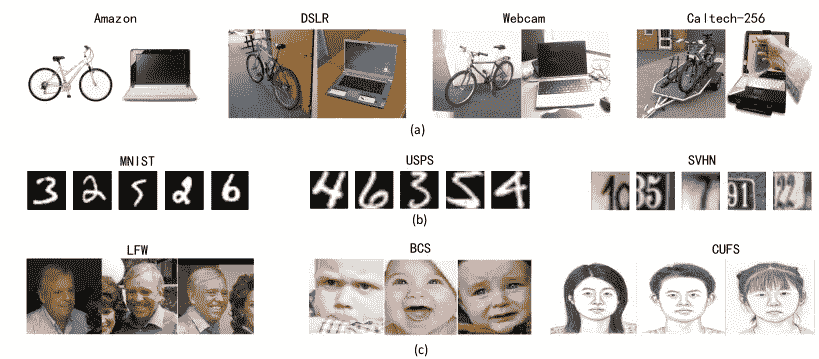
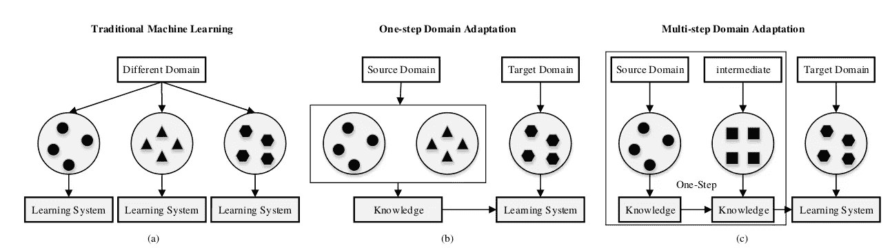
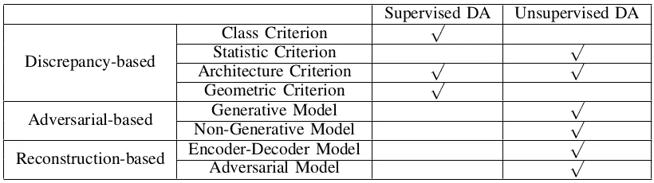
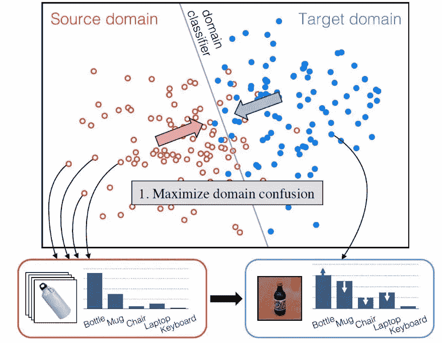

# 领域适应:简要概述

> 原文：<https://medium.com/analytics-vidhya/domain-adaptation-an-in-depth-survey-analysis-part-i-17c8b4d7f9c8?source=collection_archive---------11----------------------->

在这个新时代，深度学习实践者面临的最严峻的问题之一是数据集的大小。为每个新任务收集和注释数据集是一个昂贵且耗时的过程。😐🕗经过这一过程后，不确定是否会有足够的训练数据可用。此外，在深度学习的情况下，数据依赖性在特定领域仍然是一个严重的问题。

训练数据不足是一个无法回避的问题。迁移学习放宽了训练数据必须与测试数据同分布的假设。但是，有一个条件。数据集的域分布可能非常不同。例如，您可以在下图中看到数据集之间的域变化。

数据集之间的域差异

由于跨两个领域的分布变化或领域转移，直接迁移学习通常会降低性能。👎在这一点上，领域适应来拯救你。在这篇文章中，我们将介绍几种用于领域适应的深度学习技术及其在图像分类、人脸识别和分割领域的应用。

## 记号

首先，需要添加一些符号。这些符号将在整个博客中使用。所以，从域名开始。一个域 D 由特征空间 X 和边缘概率分布 p(X)组成。现在，给定特定的域，D = {X，p(X)}，任务 T 由被视为目标函数的特征空间 Y 组成。一般情况下，我们需要以监督的方式学习条件概率分布 P(Y/X)。

## 域自适应(DA)的不同设置

在这篇博客中，我们考虑的是源和目标相同的情况下的任务，只是源和目标的域不同。根据目标领域的标记数据，我们可以进一步将 DA 分为监督、半监督和非监督 DA。

1.  **齐次 DA:** 特征空间在具有相同维度的源和目标之间是相同的。区别仅在于数据分布- > P(X_source)不等于 P(X_target)。在这种情况下，有三种设置:标记目标域数据的监督设置、存在冗余未标记数据的半监督设置以及不存在标签的非监督设置。
2.  **异质 DA:** 特征空间不等价，维度也可能不同。

在这个系列中，我将主要讨论一步式域适应。在多步 DA 中，有一个与源域和目标域更相关的中间域。多步 DA 的关键是如何选择和利用这些中间域。它们通常分为三类，即:手工制作的、基于实例的和基于表示的。

a)传统的机器学习，b)一步 DA，c)多步 DA

# DA 的分类

深层方法可以归纳为三个主要类别，再细分如下:

*   **基于差异:**它假设用标记或未标记的数据对模型进行微调可以减少域之间的转移。它进一步分为四类:

1.  **类别标准:**使用类别标签信息在不同领域之间传递知识。
2.  **统计标准:**对齐源域和目标域之间的统计分布偏移。
3.  **架构标准:**通过调整深度网的架构，提高学习更多可转移特征的能力。
4.  **几何标准:**根据几何属性桥接源域和目标域。

*   **基于对抗:**使用领域鉴别器，通过对抗目标鼓励领域混淆。分为两类:

1.  **生成模型:**将判别模型与 GANs 相结合。生成与目标领域相似的样本并保留源领域的注释信息。
2.  **非生成模型:**特征提取器使用源域中的标签学习区别性表示，并通过域混淆损失将目标域映射到相同的空间。

*   **基于重建:**使用数据重建作为辅助任务，保证特征不变性。它既保证了域内表示的特殊性，又保证了域间表示的不可区分性。

1.  **编码器-解码器重构:**将用于表示学习的编码器网络与用于数据重构的解码器网络相结合。
2.  **对抗重建:**通过使用 GANs 获得的循环映射生成图像。

在不同的域适应设置中使用不同的方法

我认为从现在开始，领域适应可以改变你看待新数据集的方式。对我来说是的。只是一个关于领域适应的提示和介绍。

如果你觉得有用，请留下你的评论和建议！