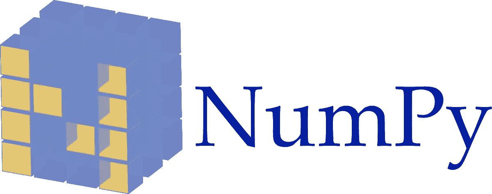
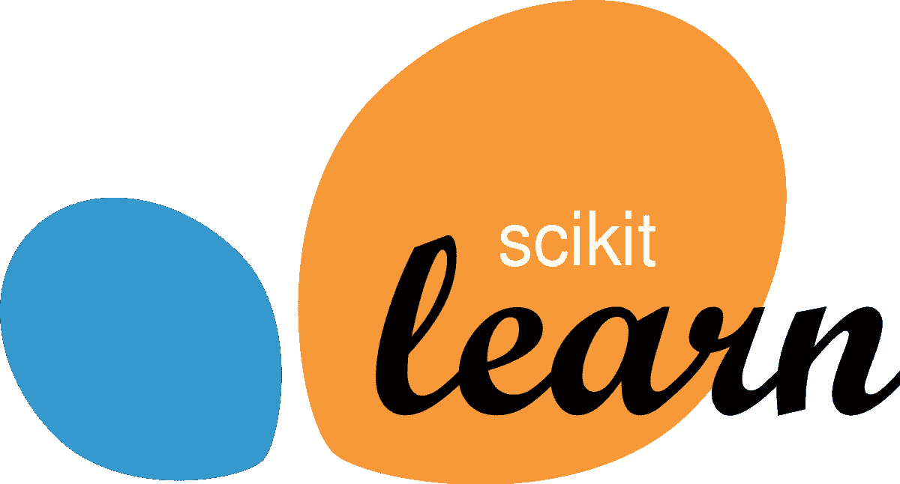

# 不要错过这 24 个令人惊叹的数据科学 Python 库

> 原文：<https://medium.com/analytics-vidhya/dont-miss-out-on-these-24-amazing-python-libraries-for-data-science-44aa66469a60?source=collection_archive---------2----------------------->

# 概观

*   查看我们为数据科学挑选的 24 个顶级 Python 库
*   我们将这些库划分为不同的数据科学功能，例如数据收集、数据清理、数据探索、建模等等
*   你觉得我们应该包括哪些 Python 库？让我们知道！

# 介绍

我是 Python 语言的忠实粉丝。这是我为[数据科学](https://courses.analyticsvidhya.com/courses/introduction-to-data-science-2?utm_source=blog&utm_medium=dont-miss-out-24-amazing-python-libraries-data-science)学习的第一门编程语言，从那以后，它一直是我的忠实伙伴。对我来说，Python 有三个特点:

*   它的易用性和灵活性
*   全行业接受:它是业内最流行的数据科学语言
*   用于数据科学的大量 Python 库

事实上，有如此多的 Python 库，以至于要跟上那里的发展会变得令人不知所措。这就是为什么我决定消除这种痛苦，并编制这份涵盖端到端数据科学生命周期的 24 个精彩 Python 库的列表。


没错——我已经根据它们在数据科学中各自的角色对这些库进行了分类。所以我提到了用于数据清理、数据操作、可视化、构建模型甚至模型部署的库(等等)。这是一个非常全面的列表，可以帮助你[开始使用 Python](https://courses.analyticsvidhya.com/courses/introduction-to-data-science-2?utm_source=blog&utm_medium=dont-miss-out-24-amazing-python-libraries-data-science) 进行数据科学之旅。

# 用于不同数据科学任务的 Python 库:

用于数据收集的 Python 库

*   美味的汤
*   Scrapy
*   硒

用于数据清理和操作的 Python 库

*   熊猫
*   热电偶
*   NumPy
*   空间

用于数据可视化的 Python 库

*   Matplotlib
*   海生的
*   散景

用于建模的 Python 库

*   sci kit-学习
*   张量流
*   PyTorch

用于模型可解释性的 Python 库

*   石灰
*   H2O

用于音频处理的 Python 库

*   利布罗萨
*   疯妈妈
*   py 音频分析

用于图像处理的 Python 库

*   OpenCV-Python
*   sci kit-图像
*   枕头

数据库的 Python 库

*   心理战
*   SQLAlchemy

用于部署的 Python 库

*   瓶

# 用于数据收集的 Python 库

你有没有遇到过这样的情况，你没有足够的数据来解决你想解决的问题？这是数据科学中一个永恒的话题。这就是为什么学习如何提取和收集数据对于数据科学家来说是一项非常重要的技能。它开辟了以前不可能的道路。

这里有三个用于提取和收集数据的有用的 Python 库。

# [美汤](https://www.crummy.com/software/BeautifulSoup/bs4/doc/)

收集数据的最好方法之一是浏览网站(当然是道德上和法律上的！).手动操作会耗费太多的人力和时间。美丽的汤是你的救星。

Beautiful Soup 是一个 HTML 和 XML 解析器，它为解析过的页面创建解析树，用于从网页中提取数据。这个从网页中提取数据的过程叫做**网页抓取**。

使用以下代码安装 BeautifulSoup:

```
pip install beautifulsoup4
```

下面是一个简单的代码，它实现了从 HTML 中提取所有锚标签的漂亮汤:

我推荐阅读下面的文章，学习如何在 Python 中使用漂亮的汤:

*   [**Python 中使用 BeautifulSoup 的网页抓取入门**](https://www.analyticsvidhya.com/blog/2015/10/beginner-guide-web-scraping-beautiful-soup-python/)

# [刺儿头](https://docs.scrapy.org/en/latest/intro/tutorial.html)

Scrapy 是另一个非常有用的用于网络抓取的 Python 库。它是一个开源的协作框架，用于从网站中提取您需要的数据。它使用起来既快又简单。

下面是安装 Scrapy 的代码:

```
pip install scrapy
```


这是一个大规模网络抓取的框架。它为您提供了高效地从网站中 ***提取*** 数据、 ***处理*** 所需的所有工具，并以您喜欢的 ***结构*** 和格式存储它们。

下面是实现 Scrapy 的简单代码:

下面是学习 Scrapy 并用 Python 实现它的完美教程:

*   [**Web Scrapy 在 Python 中的使用(附多个例子)**](https://www.analyticsvidhya.com/blog/2017/07/web-scraping-in-python-using-scrapy/)

# [硒](https://www.seleniumhq.org/)

Selenium 是自动化浏览器的流行工具。它主要用于行业内的测试，但对于网页抓取也非常方便。Selenium 实际上在 IT 领域变得非常流行，所以我相信你们中的很多人至少听说过它。


我们可以使用 Selenium 轻松编写 Python 脚本来自动化 web 浏览器。它给了我们高效提取数据并以我们喜欢的格式存储以备将来使用所需的自由。

我最近写了一篇关于使用 Python 和 Selenium 抓取 YouTube 视频数据的文章:

*   [**数据科学项目:使用 Python 和 Selenium 抓取 YouTube 数据，对视频进行分类**](https://www.analyticsvidhya.com/blog/2019/05/scraping-classifying-youtube-video-data-python-selenium/)

# 用于数据清理和操作的 Python 库

好了——你已经收集了数据，准备开始工作了。现在是时候清理我们可能面临的任何混乱的数据，并学习如何操作它，以便我们的数据为建模做好准备。

这里有四个 Python 库可以帮助你做到这一点。请记住，我们将在现实世界中处理结构化(数字)和文本数据(非结构化)——这个库列表涵盖了所有内容。

# 熊猫

说到数据处理和分析，没有什么能打败熊猫。这是*最流行的 Python 库，句号。Pandas 是用 Python 语言编写的，专门用于操作和分析任务。*

> *这个名字来源于术语“面板数据”，这是一个计量经济学术语，指的是包含同一个人在多个时间段的观察结果的数据集。—维基百科*

熊猫预装了 Python 或 Anaconda，但如果需要的话，下面是代码:

```
pip install pandas
```


熊猫提供的功能包括:

*   数据集连接和合并
*   数据结构列删除和插入
*   数据过滤
*   重塑数据集
*   DataFrame 对象来操作数据，等等！

这里有一篇文章和一份很棒的小抄，可以让你的熊猫技能达到标准:

*   [**Python 中用于数据操作的 12 个有用的熊猫技巧**](https://www.analyticsvidhya.com/blog/2016/01/12-pandas-techniques-python-data-manipulation/)
*   [**备忘单:使用 Python 中的 Pandas 进行数据探索**](https://www.analyticsvidhya.com/blog/2015/07/11-steps-perform-data-analysis-pandas-python/)

# [PyOD](https://pyod.readthedocs.io/en/latest/)

纠结于检测异常值？你并不孤单。这是有抱负的(甚至是公认的)数据科学家的普遍问题。首先，您如何定义离群值？

别担心，PyOD 图书馆会帮助你的。

PyOD 是一个全面的、可扩展的 Python 工具包，用于检测外围对象。异常值检测基本上是识别与大多数数据显著不同的罕见项目或观察值。

您可以使用以下代码下载 pyOD:

```
pip install pyod
```

PyOD 是如何工作的，如何自己实现它？下面的指南会回答你所有的问题:

*   [**使用 PyOD 库学习 Python 异常检测的精彩教程**](https://www.analyticsvidhya.com/blog/2019/02/outlier-detection-python-pyod/)

# NumPy

像熊猫一样，NumPy 是一个非常受欢迎的 Python 库。NumPy 引入了支持大型多维数组和矩阵的函数。它还引入了高级数学函数来处理这些数组和矩阵。

NumPy 是一个开源库，有多个贡献者。它预装了 Anaconda 和 Python，但以下是安装它的代码，以备不时之需:

```
$ pip install numpy
```



以下是您可以使用 NumPy 执行的一些基本功能:

## 数组创建

```
output - [1 2 3] [0 1 2 3 4 5 6 7 8 9]
```

## 基本操作

```
output - [1\. 1.33333333 1.66666667 4\. ] [ 1 4 9 36]
```

还有更多！

# [空间](https://spacy.io/)

到目前为止，我们已经讨论了如何清理和操作数字数据。但是如果您正在处理文本数据呢？到目前为止，我们看到的库可能还不够。

站出来，史帕西。这是一个非常有用和灵活的自然语言处理(NLP)库和框架，用于清理文本文档以创建模型。与用于类似任务的其他库相比，SpaCy 速度更快。

要在 Linux 中安装 Spacy:

```
pip install -U spacy 
python -m spacy download en
```

要将其安装在其他操作系统上，需要通过[这个链接](https://spacy.io/usage)。


当然，我们为你提供学习空间:

*   [**自然语言处理变得简单—使用 SpaCy(在 Python 中)**](https://www.analyticsvidhya.com/blog/2017/04/natural-language-processing-made-easy-using-spacy-%e2%80%8bin-python/)

# 用于数据可视化的 Python 库

那么下一步是什么？整个数据科学管道中我最喜欢的方面——数据可视化！这是检验我们的假设、发掘隐藏的见解和发现模式的地方。

这里有三个非常棒的数据可视化 Python 库。

# [Matplotlib](https://matplotlib.org/)

Matplotlib 是 Python 中最流行的数据可视化库。它允许我们生成和构建各种各样的地块。这是我和 Seaborn 一起可视化探索数据的首选库。

您可以通过下面的代码安装 *matplotlib* :

```
$ pip install matplotlib
```


下面是一些我们可以使用 matplotlib 构建的不同类型的图的例子:

## 柱状图


## 三维图形


既然我们已经介绍了 Pandas、NumPy 和现在的 matplotlib，请查看下面的教程，将这三个 Python 库结合起来:

*   [使用 NumPy、Matplotlib 和 Pandas 进行 Python 数据探索的终极指南](https://www.analyticsvidhya.com/blog/2015/04/comprehensive-guide-data-exploration-sas-using-python-numpy-scipy-matplotlib-pandas/)

# [Seaborn](https://seaborn.pydata.org/)

Seaborn 是另一个基于 matplotlib 的绘图库。这是一个 python 库，为绘制吸引人的图形提供了高级接口。matplotlib 能做的，Seaborn 只是以一种更具视觉吸引力的方式来做。

Seaborn 的一些特征是:

*   一个面向数据集的 API，用于检查多个变量之间的关系
*   方便地查看复杂数据集的整体结构
*   用于选择显示数据中模式的调色板的工具

您可以使用一行代码安装 Seaborn:

```
pip install seaborn
```


让我们通过一些很酷的图表来看看 seaborn 能做什么:


这是另一个例子:


爱死 Seaborn 了！

# [散景](https://bokeh.pydata.org/en/latest/)

Bokeh 是一个交互式可视化库，面向现代 web 浏览器进行演示。它为大量数据集提供了通用图形的优雅构造。

散景可用于创建交互式绘图、仪表盘和数据应用程序。现在，您对安装过程已经相当熟悉了:

```
pip install bokeh
```


请随意阅读以下文章，了解更多关于散景的信息，并观看它的实际应用:

*   [使用散景的交互式数据可视化(Python 语言)](https://www.analyticsvidhya.com/blog/2015/08/interactive-data-visualization-library-python-bokeh/)

# 用于建模的 Python 库

我们已经到达了本文最令人期待的部分——构建模型！这是我们大多数人最初进入数据科学的原因，不是吗？

让我们通过这三个 Python 库来探索模型构建。

# [Scikit-learn](https://scikit-learn.org/stable/)

就像数据操作的 Pandas 和可视化的 matplotlib 一样，scikit-learn 是构建模型的 Python 领导者。没有别的东西可以与之相比。

实际上，scikit-learn 是建立在 NumPy、SciPy 和 matplotlib 之上的。它是开源的，每个人都可以访问，并且可以在各种环境中重用。



以下是安装方法:

```
pip install scikit-learn
```

Scikit-learn 支持机器学习中执行的不同操作，如分类、回归、聚类、模型选择等。只要你能说出它的名字，scikit-learn 就有一个专门的模块。

我还建议通过以下链接了解更多关于 scikit-learn 的信息:

*   sci kit-用 Python 学习——这是我去年学到的最重要的机器学习工具！

# [张量流](https://www.tensorflow.org/)

TensorFlow 由谷歌开发，是一个受欢迎的深度学习库，可以帮助你建立和训练不同的模型。它是一个开源的端到端平台。TensorFlow 提供了简单的模型构建、强大的机器学习产品以及强大的实验工具和库。

> *一个完整的生态系统，帮助你用机器学习解决具有挑战性的现实世界问题——谷歌*


TensorFlow 提供了多个抽象层次供您根据需要进行选择。它通过使用高级 Keras API 用于构建和训练模型，这使得 TensorFlow 和机器学习的入门变得容易。

通过[此链接](https://www.tensorflow.org/install)查看安装过程。使用以下文章开始使用 TensorFlow:

*   [张量流 101:理解张量和图形，让你开始深度学习](https://www.analyticsvidhya.com/blog/2017/03/tensorflow-understanding-tensors-and-graphs/)
*   [R 中使用 Keras 和 TensorFlow 开始深度学习](https://www.analyticsvidhya.com/blog/2017/06/getting-started-with-deep-learning-using-keras-in-r/)

# [PyTorch](https://pytorch.org/)

PyTorch 是什么？这是一个基于 Python 的科学计算包，可以用作:

*   代替 NumPy 使用 GPU 的能力
*   提供最大灵活性和速度的深度学习研究平台

[点击此处](https://pytorch.org/get-started/locally/)查看不同操作系统的安装过程。


PyTorch 提供以下功能:

*   **混合动力前端**
*   **工具和库:**一个活跃的研究人员和开发人员社区构建了一个丰富的工具和库生态系统，用于扩展 PyTorch 并支持从计算机视觉到强化学习等领域的开发
*   **云支持:** PyTorch 在主要的云平台上得到了很好的支持，通过预构建的映像、GPU 上的大规模培训、在生产规模环境中运行模型的能力等等，提供了无摩擦开发和轻松扩展

这里有两篇关于 PyTorch 的非常详细且简单易懂的文章:

*   [py torch 简介——一个简单而强大的深度学习库](https://www.analyticsvidhya.com/blog/2018/02/pytorch-tutorial/)
*   【PyTorch 入门—了解如何构建快速&精确的神经网络(包含 4 个案例研究！)

# 用于数据可解释性的 Python 库

你真的了解你的模型是如何工作的吗？你能解释为什么你的模型会得出这样的结果吗？这些是每个数据科学家都应该能够回答的问题。建立一个黑盒模型在行业内没有任何用处。

因此，我提到了两个 Python 库，它们将帮助您解释模型的性能。

# [石灰](https://github.com/marcotcr/lime)

LIME 是一种算法(和库)，可以解释任何分类器或回归器的预测。LIME 是如何做到这一点的？通过用一个可解释的模型来近似它。灵感来自论文[“我为什么要相信你？”:解释任何分类器"](https://arxiv.org/abs/1602.04938)的预测，这个模型解释器可以用来生成任何分类算法的解释。


安装石灰非常简单:

```
pip install lime
```

这篇文章将有助于建立石灰和模型可解释性背后的直觉:

*   [在机器学习模型中建立信任(在 Python 中使用 LIME)](https://www.analyticsvidhya.com/blog/2017/06/building-trust-in-machine-learning-models/)

# [H2O](https://github.com/h2oai/mli-resources)

我相信你们很多人都听说过 H2O.ai。他们是自动化机器学习的市场领导者。但是你知道他们也有 Python 的模型可解释性库吗？

H2O 的无人驾驶人工智能提供了简单的数据可视化技术，用于表示高度的特征交互和非线性模型行为。它通过可视化来阐明建模结果和模型中特征的影响，从而提供机器学习可解释性(MLI)。


通过下面的链接，阅读更多关于 H2O 的无人驾驶人工智能表演 MLI。

*   [机器学习可解释性](https://www.h2o.ai/wp-content/uploads/2018/01/Machine-Learning-Interpretability-MLI_datasheet_v4-1.pdf)

# 用于音频处理的 Python 库

音频处理或音频分析是指从音频信号中提取信息和含义，用于分析或分类或任何其他任务。它正在成为深度学习中的一个流行功能，所以请密切关注。

# [LibROSA](https://librosa.github.io/librosa/)

LibROSA 是一个用于音乐和音频分析的 Python 库。它为创建音乐信息检索系统提供了必要的构件。

点击[此链接](https://librosa.github.io/librosa/install.html)查看安装详情。


这里有一篇关于音频处理及其工作原理的深入文章:

*   [**深度学习音频数据分析入门(附案例分析)**](https://www.analyticsvidhya.com/blog/2017/08/audio-voice-processing-deep-learning/)

# [老妈](https://github.com/CPJKU/madmom)

这个名字听起来可能很有趣，但是 Madmom 是一个非常漂亮的音频数据分析 Python 库。这是一个用 Python 编写的音频信号处理库，主要关注音乐信息检索(MIR)任务。

安装 Madmom 需要以下先决条件:

*   NumPy
*   SciPy
*   Cython
*   米多

您需要以下软件包来测试安装:

*   PyTest
*   PyAudio
*   PyFftw

安装 Madmom 的代码:

```
pip install madmom
```


我们甚至有一篇文章来了解 Madmom 是如何进行音乐信息检索的:

*   [**学习音乐信息检索的音频节拍跟踪(附 Python 代码)**](https://www.analyticsvidhya.com/blog/2018/02/audio-beat-tracking-for-music-information-retrieval/)

# [pyAudioAnalysis](https://github.com/tyiannak/pyAudioAnalysis)

pyAudioAnalysis 是一个用于音频特征提取、分类和分段的 Python 库。它涵盖了广泛的音频分析任务，例如:

*   *对未知声音进行分类*
*   *检测*音频事件并从长录音中排除静默期
*   执行*监督和非监督分割*
*   提取音频*缩略图和更多*

您可以使用以下代码安装它:

```
pip install pyAudioAnalysis
```


# 用于图像处理的 Python 库

如果你想在数据科学行业谋得一个职位，你必须学会如何处理图像数据。随着组织能够收集越来越多的数据(这主要归功于计算资源的进步)，图像处理变得无处不在。

因此，请确保您熟悉以下三个 Python 库中的至少一个。

# [OpenCV-Python](https://opencv-python-tutroals.readthedocs.io/en/latest/py_tutorials/py_setup/py_intro/py_intro.html)

说到图像处理，第一个想到的名字就是 OpenCV。OpenCV-Python 是用于图像处理的 Python API，结合了 OpenCV C++ API 和 Python 语言的最佳品质。

它主要用于解决计算机视觉问题。

OpenCV-Python 利用了 NumPy，我们在上面已经看到了。所有 OpenCV 数组结构都与 NumPy 数组相互转换。这也使得与使用 NumPy 的其他库(如 SciPy 和 Matplotlib)的集成更加容易。


在您的系统中安装 OpenCV-Python:

```
pip3 install opencv-python
```

这里有两个关于如何在 Python 中使用 OpenCV 的流行教程:

*   [使用深度学习从视频构建人脸检测模型(Python 实现)](https://www.analyticsvidhya.com/blog/2018/12/introduction-face-detection-video-deep-learning-python/)
*   [16 个 OpenCV 函数开启你的计算机视觉之旅(附 Python 代码)](https://www.analyticsvidhya.com/blog/2019/03/opencv-functions-computer-vision-python/)

# [Scikit-image](https://scikit-image.org/)

图像处理的另一个 python 依赖项是 Scikit-image。它是用于执行多种多样的图像处理任务的算法集合。

您可以使用它来执行图像分割、几何变换、色彩空间处理、分析、过滤、形态学、特征检测等等。

在安装 scikit-image 之前，我们需要以下软件包:

*   Python (>= 3.5)
*   数字(> = 1.11.0)
*   SciPy (>= 0.17.0)
*   joblib (>= 0.11)

这就是你在你的机器上安装 scikit-image 的方法:

```
pip install -U scikit-learn
```


# [枕头](https://pillow.readthedocs.io/en/stable/)

Pillow 是 PIL (Python 图像库)的新版本。它是从 PIL 派生出来的，在一些 Linux 发行版如 Ubuntu 中，它被用来替代最初的 PIL。

Pillow 提供了几个执行图像处理的标准程序:

*   每像素操作
*   遮罩和透明处理
*   图像过滤，如模糊、轮廓、平滑或边缘查找
*   图像增强，如锐化、调整亮度、对比度或颜色
*   给图像添加文本，等等！

怎么装枕头？就是这么简单:

```
pip install Pillow
```


看看下面这幅人工智能漫画，它展示了枕头在计算机视觉中的应用:

*   [**人工智能漫画:Z.A.I.N —问题#2:使用计算机视觉的面部识别**](https://www.analyticsvidhya.com/blog/2019/06/ai-comic-zain-issue-2-facial-recognition-computer-vision/)

# 数据库的 Python 库

学习如何存储、访问和检索数据库中的数据是任何数据科学家的必备技能。你无法逃避这个角色的这个方面。构建模型很好，但是如果不首先检索数据，您将如何做呢？

我挑选了两个与 SQL 相关的 Python 库，您可能会觉得有用。

# [心理战](http://initd.org/psycopg/)

Psycopg 是 Python 编程语言最流行的 PostgreSQL(一种高级开源关系数据库)适配器。在其核心，Psycopg 完全实现了 Python DB API 2.0 规范。


当前的 psycopg2 实现支持:

*   Python 版本 2.7
*   Python 3 版本从 3.4 到 3.7
*   PostgreSQL server 版本从 7.4 到 11
*   PostgreSQL 客户端库 9.1 版本

以下是安装 psycopg2 的方法:

```
pip install psycopg2
```

# [SQLAlchemy](https://www.sqlalchemy.org/)

啊，SQL。最流行的数据库语言。SQLAlchemy 是一个 Python SQL 工具包和对象关系映射器，它为应用程序开发人员提供了 SQL 的全部功能和灵活性。


它是为高效和高性能的数据库访问而设计的。SQLAlchemy 认为数据库是一个关系代数引擎，而不仅仅是表的集合。

要安装 SQLAlchemy，可以使用下面一行代码:

```
pip install SQLAlchemy
```

# 用于部署的 Python 库

你知道什么是模型部署吗？如果没有，你应该尽快学会。部署模型意味着将您的最终模型放到最终的应用程序中(或者技术上称为生产环境)。

# [烧瓶](http://flask.pocoo.org/docs/1.0/)

Flask 是一个用 Python 编写的 web 框架，广泛用于部署数据科学模型。烧瓶有两个组件:

*   **Werkzeug** :这是一个 Python 编程语言的实用程序库
*   Jinja :这是一个 Python 的模板引擎


查看以下打印“Hello world”的示例:

下面这篇文章是学习 Flask 的一个很好的起点:

*   [**教程将生产中的机器学习模型部署为 API(使用 Flask)**](https://www.analyticsvidhya.com/blog/2017/09/machine-learning-models-as-apis-using-flask/)

# 结束注释

在本文中，我们看到了在进行数据科学项目时经常使用的大量 python 库。还有很多库，但这些是每个数据科学家都应该知道的核心库。

我错过了什么 Python 库吗？或者我们列表中你觉得特别有用的库？请在下面的评论区告诉我！

你也可以在分析 Vidhya 的 Android 应用上阅读这篇文章


相关文章

*原载于 2019 年 7 月 5 日*[*https://www.analyticsvidhya.com*](https://www.analyticsvidhya.com/blog/2019/07/dont-miss-out-24-amazing-python-libraries-data-science/)*。*