# 不要吃太多

> 原文：<https://medium.com/analytics-vidhya/dont-overfit-645e3957f30b?source=collection_archive---------19----------------------->

**业务问题:**

过度拟合是机器学习模型的一个常见问题，尤其是当我们只有几个训练数据点时。训练数据点的数量越少，我们的模型就越不能对看不见的或测试数据点进行归纳。

因此，我们需要在训练过程中小心谨慎，看看我们的模型表现如何。通过在训练数据上获得大约 90%的准确率，我们不能假设我们的模型将在看不见的数据集上表现相同。

这是我们今天要处理的问题。我们还将看到如何使用简单的机器学习模型，如***KNeighborsClassifier***和***LogisticRegression***，我们可以减少过度拟合，并帮助我们的模型在看不见的数据上更好地推广，即使我们有少量的训练数据。

**数据来源:**

为了解决过度拟合问题，我们今天将使用 Kaggle 数据集。Kaggle 发起了一个竞赛[不要过度拟合 2](https://www.kaggle.com/c/dont-overfit-ii) 。在这个问题中，我们提供了一个 250 点的训练数据集和 19750 点的测试数据集。

差别很大，对吧？因此，使用这个数据集，我们将训练简单的机器学习模型，并看看我们如何才能使我们的模型在看不见的数据点上更好地正则化。

您可以在我的 github 资源库中找到完整的代码，包括 EDA 和模型部署。但是我建议，在深入研究代码之前，让我们一步一步地看看这些数据中发生了什么，以及我们解决这个问题的方法。

**现有解决方案&思路:**

嗯，我们不是唯一一个遇到过度拟合问题的人。有许多人面临着同样的问题。所以，继续让我们看看他们解决问题的想法:

1.  [https://www . ka ggle . com/feature blind/robust-lasso-patches-with-rfe-GS](https://www.kaggle.com/featureblind/robust-lasso-patches-with-rfe-gs)

这个解决方案内核可以在 Kaggle 上获得，并提供 87%的 auc 分数。这里使用 RFE(递归特征提取器)来帮助选择最佳特征。通过选择顶级特征并对其进行训练，我们可以在相当大的程度上消除过度拟合。

这个内核的一个问题是，在标准化的同时，它也使用了公共数据集，这可能适用于 Kaggle 竞赛，但不适用于真实世界。从这里我们可以得到的主要东西是结合使用 RFE 和 GridSearchCV 以及健壮的 auc_score。

1.  [https://www.researchgate.net/post/How_to_Avoid_Overfitting](https://www.researchgate.net/post/How_to_Avoid_Overfitting)

这里我们得到了一个很好的答案来减少过度拟合，我们可以尝试选择一些特征，使它们少于或等于可用数据点的一半。

1.  [https://www . ka ggle . com/RAF jaa/处理非常小的数据集](https://www.kaggle.com/rafjaa/dealing-with-very-small-datasets)

从这个内核中，我们获得了许多洞见。这里不仅建议重要的特征，还建议进行过采样，以增加数据点的数量。这里，作者还使用了使用多个模型并组合结果的集成技术，以避免过度拟合。

1.  [https://www . ka ggle . com/ILO vey yp/logistic-regression-with-RF ecv](https://www.kaggle.com/iloveyyp/logistic-regression-with-rfecv)

这里，作者使用了一个简单的逻辑回归模型，通过 GridSearchCV 寻找最佳参数。建议使用 RFE 来选择最佳特征。数据标准化和规范化是在对数据进行训练模型之前完成的。

1.  【https://www.kaggle.com/plasticgrammer/don-t-overfit-i-try 

在这个内核中，作者还重点研究了特征工程中的最佳特征选择。这里不使用 Kfold 验证，而是使用 RepeatedStratifiedKfold，这将有助于我们处理可用数据集较少的情况。

**我们的方法来自现有的解决方案:**

因此，结合现有的解决方案并添加我们的改进因子，我们将执行良好的功能选择，并查看我们的模型如何执行。我们还将尝试许多机器学习模型，并选择我们的模型表现最好的一个。

在这里，特征选择是一个重要的方面。因此，我们将尝试一些特征选择技术，并观察它们对我们模型的影响。

所以，让我们停止理论，开始工作。是时候让我们的手变脏了。

**我们的训练数据集:**

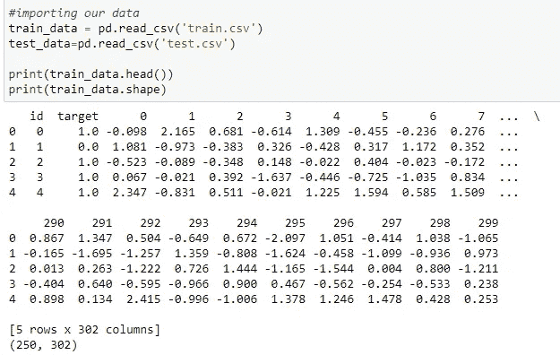

打印出几行我们的训练数据集

我们有 250 个数据点和 302 列，包括标签和 id 列。我们的训练数据集将只包含从 0 到 299 的特征。因此，我们将从这些数据中取出标签并训练数据集。

现在，我们有了数据，让我们开始 EDA。

**平衡还是不平衡？**

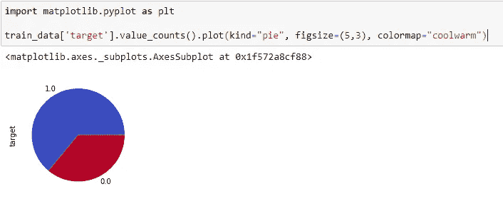

我们训练数据中标签计数的饼图

我们的数据集不平衡。因此，计算 ***auc 分数*** 比计算准确度更好。此外，在训练我们的模型时平衡分类标签可能会有所帮助。

**数据集中特征的均值分布:**

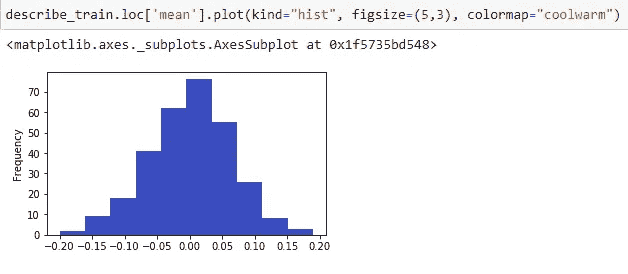

所有特征的平均值直方图

这些特征的平均值分别在-0.20 到 0.18 之间。此外，我们看到大多数点在-0.05 到 0.10 的范围内。因此，数据集要素的平均分布看起来像正态分布，有点偏向正值。

让我们对数据集中的标准差、最小值和最大值进行同样的尝试。

**数据集中特征的标准偏差分布:**

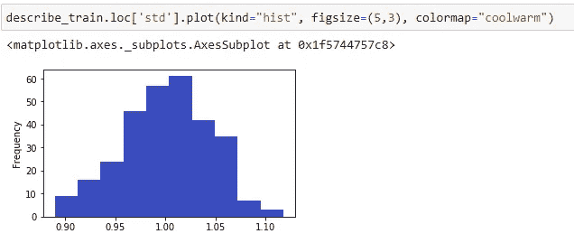

所有特征的标准差直方图

从上面的直方图中我们可以看出，数据集中要素的标准偏差介于 0.92 和 1.10 之间，大多数要素的标准偏差值为 1。因此，这进一步给了我们一个更好的想法，即我们的数据集的特征来自一个平均值约等于 0 且标准差为 1 的正态分布。

**数据集中特征的最小值分布:**

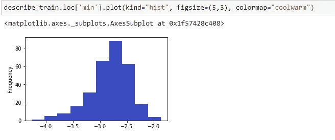

所有特征的最小值直方图

最小值在-4.0 到-2.0 之间，大部分在-3.0 到-2.5 之间。这让我们对数据集有了更多的了解，如果数据集小于-4.0，它就没有任何价值。我们只能从直方图中看到一些值，这些值可能是异常值。

**数据集中特征的最大值分布:**

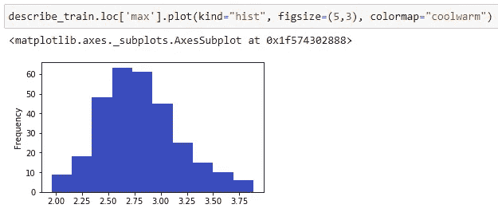

所有特征的最大值直方图

最大值范围从 2.00 到 3.75。因此，在某种程度上，我们的最小值是对称的。

***从 EDA 中我们了解到我们的特征是来自正态分布。我们的数据集不平衡，正数据点(类标签 1)的数量大约是负数据点(类标签 0)的两倍。***

***由于我们的数据集是随机的，因此我们没有关于特征的任何特定信息。***

**建筑模型:**

现在，是时候建立我们的模型了。首先，我们将尝试使用 KNeighborsClassifier。这是一种简单的算法，它根据相邻数据点来决定数据点的类别。

**用 KNN 进行重复分层折叠，选择最佳超参数:**

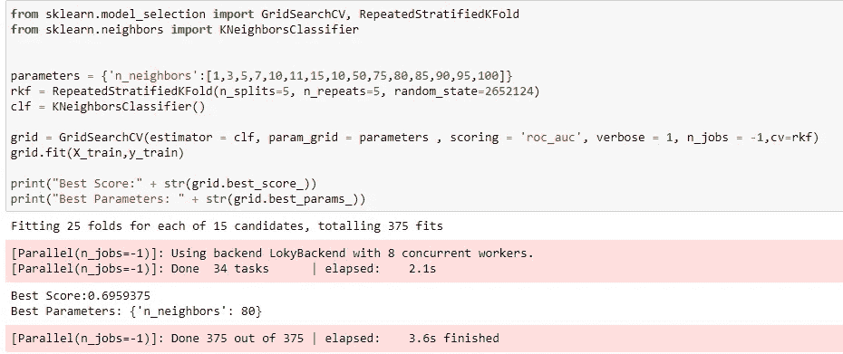

使用 KNN 对重复分层文件夹进行代码剪切

我们得到了 n_neighbors 值为 80 的最佳超参数。当我们用这个参数训练我们的模型并在 Kaggle 上提交结果时，我们得到的 auc 分数是 0.686。

虽然不是很好，但看起来还是不错的。但是，是的，我们可以做得更好，所以我们会尝试其他模式。

**带逻辑回归的重复分层折叠**

另一个简单的分类模型是逻辑回归。所以，让我们用这个来执行 RepeatedStratifiedKFold，看看我们的模型如何执行:

Kaggle 提交分数

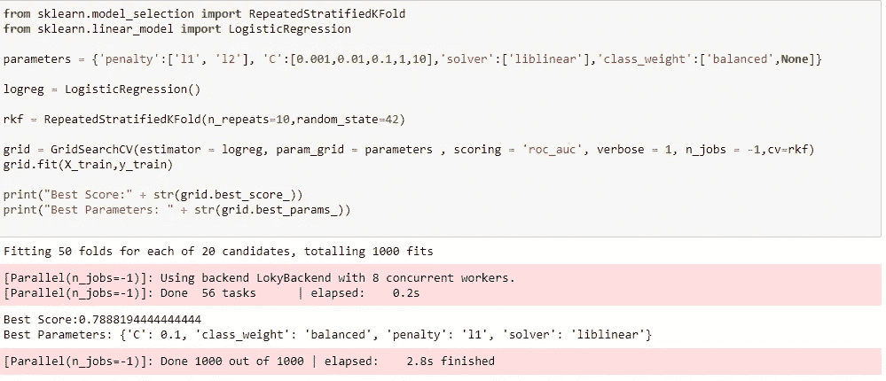

带有逻辑回归的重复分层文件夹的代码段

当我们提交用逻辑回归调整的参数得到的分数时，我们得到以下 Kaggle 分数:

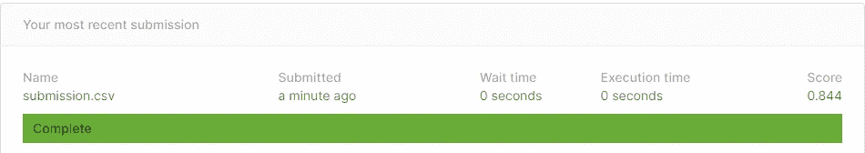

卡格尔分数逻辑回归

哇，跳得真好。但是这是否意味着逻辑回归比 KNeighborsClassifier 更好呢？嗯，看情况。在我们的案例中，逻辑回归比 KNN 表现得更好，不仅仅是因为它概括得更好，而是因为它没有使用所有的特征。

嗯，我们可以看到它使用 L1 正则化，我们都知道 L1 正则化执行特征选择，创建稀疏性或使不太重要的特征为零。

为了证明这一点，我们要做一个小实验。我们将通过结合最佳特征选择技术在 KNN 上执行特征选择，然后看看我们的模型如何执行..

那么，让我们开始吧:

**特征选择策略:**

我们将通过组合几种方法来执行特征选择。您可以从 github 资源库获得它的完整代码。下面将简要介绍其中的每一个:

1.  **使用 EDA 的特征选择:**

当我们绘制散点图时，我们可以确定特征的重要性，看看特定的特征是否能够区分类别标签。例如:

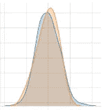

功能-1

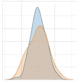

功能-2

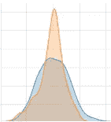

功能-3

从上面的图像中，我们可以看到两个类的特征 1 的 PDF 重叠。在特征-2 中，重叠非常少，而在特征-3 中，高于某个值时，所有点都属于特定的类。

因此，我们可以说特性 1 是最不重要的特性，而特性 3 是最重要的特性。这是我们通过查看数据分布来选择特征的特征选择方法之一。

**2。皮尔逊相关法:**

我们使用的第二种特征选择方法是人物相关方法。在我们的数据集中，我们经常会发现相互依赖的特征。

例如:

设 x，y，z，a，b，c 为我们数据集中的尺寸特征。如果两个特征之间存在直接关系，那么我们可以很容易地使用其中一个，而不是两个都用。

如果从上述特征我们有这样的关系:

x=2y

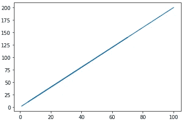

x=2y 的图形

这里，我们看到 x 和 y 之间的直接关系。这意味着这两个特征是强相关的。因此，我们只能在数据集中使用其中一个。

**3。递归特征消除:**

RFE 是另一种常见的方法，它在给定的模型上训练我们的数据集，并根据该模型选择最佳特征。在每次迭代中，它会消除一组特征，直到获得所需的特征数。

这可以直接使用 sklearn 库来实现。

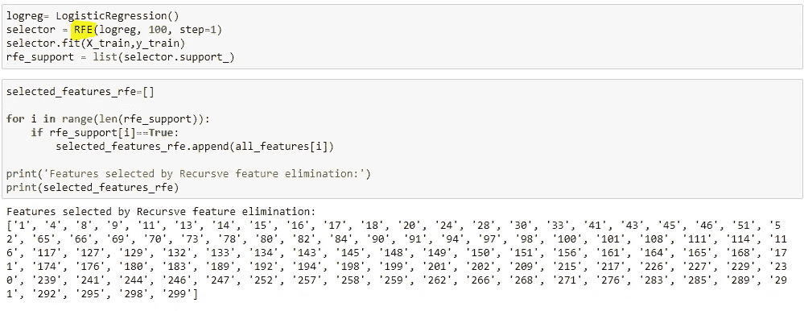

特征选择-使用 RFE 最好的模型

**4。a)基于模型的特征选择(Lasso 回归):**

我们在 sklearn 中的模型很少提供 feature _ importances，使用它我们可以找出最好的特性。类似地，在逻辑回归的情况下，特征重要性由特征的权重系数确定。

Lasso 回归是指 L1 正则化的逻辑回归。我们将使用 sklearn 的 **SelectFromModel** 方法使用相同的方法来找到我们模型中的最佳特性。

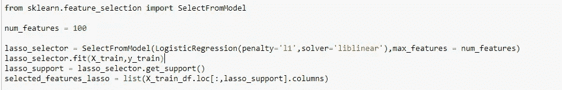

套索选择器的代码段

**4.b)基于模型的特征选择(决策树):**

就像逻辑回归一样，我们也从分类器外得到特征重要性。所以，让我们使用相同的，并找出最好的功能:

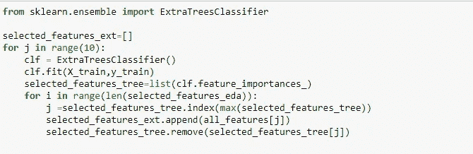

树方法的代码段

**综合所有特征:**

现在，我们已经得到了所有的特征，我们将挑选所有方法中的共同特征，并将结果分离在一起。

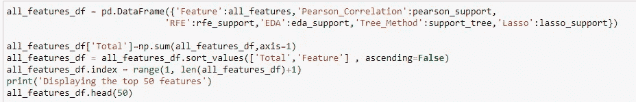

组合最佳功能的代码片段

所以，现在我们有了我们最好的特性，让我们用很少的特性来执行我们的 KNN，看看性能。

**具有前 50 个特征的重复分层文件夹 KNN:**

我们将再次使用前 50 个特征在 KNeighborsClassifier 上超调优我们的模型，获得最佳超参数并找出我们的分数:

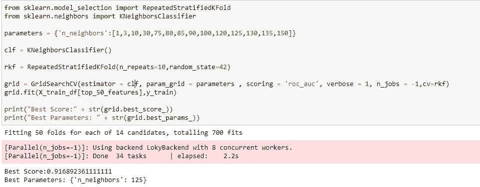

KNN-具有 50 个特征的重复分层折叠

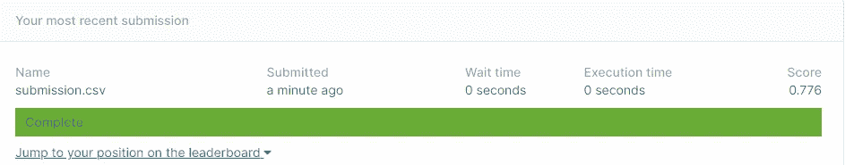

有 50 个特征的 KNN 的卡格尔分数

万岁！我们确实是对的。通过减少特征的数量，我们的 KNN 比以前表现得更好。因此，减少了过度拟合。这意味着 LogisticRegression 表现非常好的原因之一是它能够在 L1 正则化的帮助下使用重要的特征进行概括。

**所有型号结果:**

好了，我们用 KNN 和 LR 的不同数量的特征玩了一会儿，下面是我们得到的结果:

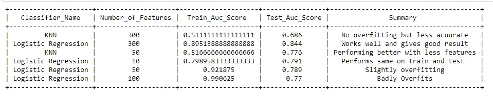

我们所有型号的总结

因此，L1 正则化的 LogisticRegression 给了我们最好的结果，auc 分数为 0.844

**未来工作:**

嗯，我们取得了不错的成绩，战胜了过度拟合，但这仅仅是开始。我们可以尝试更多的调整，进一步改善我们的结果。我们可以尝试进一步减少过度拟合的一些方法包括:

1.  ***特征创建*** :在这段代码中，我们看到了特征选择是如何影响我们的模型的。因此，除了选择最佳要素外，您还可以尝试使用平均值、最大值、标准偏差值等创建少量要素。
2.  ***加权方法:*** 嗯，你也可以尝试使用加权求和法合并多个模型的结果。你可以给表现更好的模型更多的权重，反之亦然。
3.  ***堆叠分类器*** :这里我们只用到了简单的模型。您也可以尝试堆叠分类器。这也可能有助于改善结果。

**GitHub 库:**

[https://github.com/mansi2596/Kaggle-Don-t-Overfit-2](https://github.com/mansi2596/Kaggle-Don-t-Overfit-2)

**参考文献:**

1.  [https://www . ka ggle . com/feature blind/robust-lasso-patches-with-rfe-GS](https://www.kaggle.com/featureblind/robust-lasso-patches-with-rfe-gs)
2.  [https://www.researchgate.net/post/How_to_Avoid_Overfitting](https://www.researchgate.net/post/How_to_Avoid_Overfitting)
3.  [https://www . ka ggle . com/RAF jaa/处理非常小的数据集](https://www.kaggle.com/rafjaa/dealing-with-very-small-datasets)
4.  [https://www . ka ggle . com/ILO vey yp/logistic-regression-with-RF ecv](https://www.kaggle.com/iloveyyp/logistic-regression-with-rfecv)