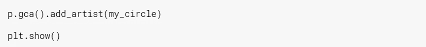
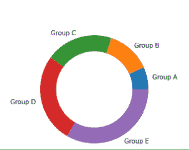

# 使用 Matplotlib 的圆环饼图

> 原文：<https://medium.com/analytics-vidhya/donut-pie-chart-using-matplotlib-dc60f6606359?source=collection_archive---------13----------------------->

大多数数据分析师和数据科学家使用不同种类的可视化技术进行数据分析和 EDA。但是在浏览了许多 Kaggle 笔记本和项目之后，我找不到以饼状图形式可视化的数据。尽管我知道，比起饼图，人们更喜欢直方图和条形图，因为它们在一个视图中表现出的重要性。但是如果饼状图按照他们的要求精确地使用，它会比大多数条形图和直方图更有意义。

因此，我们将把饼图游戏提升到一个新的水平，并创建一个自定义的甜甜圈饼图。听起来很有趣？好吧，去查一查！

我们将导入 matplotlib.pyplot，因为这是生成我们的环形饼图所需的唯一库。

在第一个单元格中运行“import matplotlib.pyplot as plt”。

现在我们将定义两个列表，即:list_headings 和 list_data。我们将使用自定义数据进行可视化。

之后，我们将使用 plt 创建一个实心圆。具有自定义尺寸的圆形将在我们的饼图内部创建一个中空的空间，使其成为一个类似甜甜圈的形状。

接下来，我们将使用 plt.pie()创建一个简单的饼图。我们将添加 list_data 和 list_headings 作为数据可视化的初始参数。

之后，我们将创建一个 plt.gcf()对象。 **matplotlib** 库的 **pyplot** 模块中的该函数用于获取当前图形上匹配给定关键字 args 的当前轴实例或创建一个实例。

现在。我们将使用 gca()函数的 add_artist 方法将实心圆添加到 pyplot 中。

最后，我们将编写这个非常棒的单词组合— plt.show()

结果将类似于此:

完整代码:

但这不是我们文章的结尾。我们需要定制这个甜甜圈饼图，使其更具吸引力和视觉吸引力。

我们将在甜甜圈饼图的每个部分之间添加一个空白空间，简称为楔形落差。

我们将在 plt.pie()中再添加一个参数，以获得所需的输出，即 wedgedrops。

您的输出将与此完全相似:

完整代码:

您也可以将自定义颜色添加到圆环饼图中。定义要用于可视化的颜色列表。将颜色作为参数添加到 plt.pie()中以实现。完整代码:

这一代人对黑色的痴迷完全令人难以置信。每个人都想穿黑色，在黑暗模式下编码，拥有黑色的配饰。所以这是特别为他们准备的。我们将为我们的甜甜圈饼图添加一个黑色背景，这样它看起来比以前的可视化效果更吸引人，可读性更好。我们将使用 fig.patch.set_facecolor()为我们的圆环饼图添加自定义颜色背景。此外，我们将把标签的文本颜色转换为白色，以便在黑色背景下也可以阅读。

您的最终结果将如下所示:

完整代码:

是的，就是这个。现在，您可以为可视化创建自己定制的圆环饼图。

您可以查看这个 Kaggle 笔记本，了解如何在多行和多列中绘制多个饼图，并向饼图添加图例。

祝你学习愉快！

 [## 印度的网络犯罪(2018 年和 2019 年)- EDA

### 使用 Kaggle 笔记本探索和运行机器学习代码|使用来自印度城市网络犯罪的数据(2018 &…

www.kaggle.com](https://www.kaggle.com/dhruvanurag20/cyber-crime-in-india-2018-2019-eda)