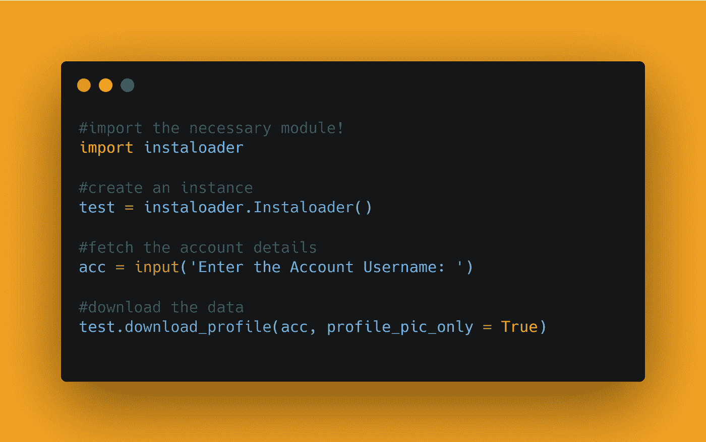
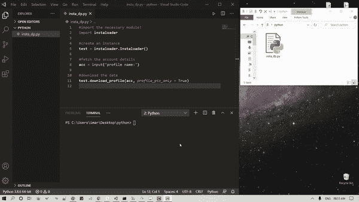

# 使用 Python 下载 Instagram 帐户的显示图片

> 原文：<https://medium.com/analytics-vidhya/download-display-picture-of-an-instagram-account-using-python-530f66cf85f1?source=collection_archive---------10----------------------->

你好世界！


你听说过 Instagram 吗？你用 Instagram 吗？在这篇博客文章中，我们将学习如何下载 Instagram 帐户的显示图片。我们将看到 Python 中的实现。

[查看 python](https://github.com/ayushi7rawat/Ultimate-Python-Resource-Hub) 的终极资源库。发现有用就掉颗星！有什么要补充的吗？开个 PR 就一样了！

你可以参考我的 YouTube 视频教程，看一个工作教程来更好的理解和一步一步的指导。

# 这个博客将会涵盖什么

```
1\. Instagram Introduction
2\. Instaloader Introduction
3\. How to Download Display Picture of an Instagram Account
```

# Instagram 简介:

我不认为 Instagram 需要介绍，但对于那些不知道的人来说，Instagram 是脸书拥有的一个照片和视频分享社交网络平台。如果你想了解更多关于 Instagram 的信息，可以参考[它的维基百科页面](https://en.wikipedia.org/wiki/Instagram)。

Instagram 链接:[instagram.com](https://www.instagram.com/)

# `Instaloader`简介:

*Instaloader* 模块是一个 python 包，具有强大的功能来废弃 instagram，它的功能可以作为命令行工具使用。它可以用于从 Instagram 下载图片(或视频)及其说明和其他元数据。

# Instaloader 的主要特性:

*   下载公共和私人档案，标签，用户故事，饲料和保存的媒体，
*   下载每个帖子的评论、地理标签和标题，
*   自动检测配置文件名的更改，并相应地重命名目标目录，
*   允许精细定制过滤器和存储下载媒体的位置，
*   自动恢复先前中断的下载迭代。

如果你想了解更多，你可以参考 [Instaloader 文档](https://instaloader.github.io/)。使用此链接导航到文档。

现在，您已经了解了 Instaloader 的基础知识，我们可以继续学习编码部分了。我们开始吧！

# 该编码了！

你可以在我的 [GitHub 库](https://github.com/ayushi7rawat/Youtube-Projects/tree/master/Download%20Insta%20DP)找到所有代码。发现有用就掉颗星。



为了访问 Python 库，您需要将它安装到您的 Python 环境中，使用以下命令安装 Instaloader

```
pip install instaloader
```

现在，让我们在 Python 脚本中导入包并创建一个实例`test`

```
import instaloadertest = instaloader.Instaloader()
```

完成后，让我们接受用户输入，以获得您希望下载个人资料图片的帐户的用户名！我把它存放在`acc`

```
acc = input('Enter the Account Username: ')#acc = 'leomessi'
```

所以在这里，假设你一定听说过莱昂内尔·梅西的名字，我们已经输入了用户名为 T0。

最后，是下载数据的时候了。

这里我们将使用`download_profile`方法，并传入两个参数:

*   `acc`:用户名
*   `profile_pic_only`:我们将它设置为`True`。

```
test.download_profile(acc, profile_pic_only = True)
```

将使用帐户用户名创建一个新文件夹，在我们的例子中是`leomessi`，它将包含显示图片。


让我们来看看输出。它看起来会像这样:



这就是如何使用 python 脚本下载 Instagram 帐户的显示图片。就是这样！

很简单，不是吗？希望这篇教程有所帮助。我强烈推荐你去看看同样的 [YouTube 视频](https://www.youtube.com/watch?v=7C-6pCsw8gM)，别忘了订阅我的频道。

您可以使用 Instaloader 库，甚至探索更多功能。您甚至可以使用 Tkinter 来利用 Python GUI。

你可以在我的 [GitHub 库](https://github.com/ayushi7rawat/Youtube-Projects/tree/master/Download%20Insta%20DP)找到所有代码。发现有用就掉颗星。

感谢您的阅读，我很乐意通过[Twitter](https://twitter.com/ayushi7rawat)|[LinkedIn](https://www.linkedin.com/in/ayushi7rawat/)与您联系。

请分享您的宝贵建议，感谢您的真诚反馈！

你绝对应该看看我的其他博客:

*   [Python 3.9:你需要知道的一切](https://ayushirawat.com/python-39-all-you-need-to-know)
*   [终极 Python 资源枢纽](https://ayushirawat.com/the-ultimate-python-resource-hub)
*   GitHub CLI 1.0:你需要知道的一切
*   [成为更好的程序员](https://ayushirawat.com/become-a-better-programmer)
*   [如何制作自己的谷歌 Chrome 扩展](https://ayushirawat.com/how-to-make-your-own-google-chrome-extension-1)
*   [使用 Python 从任何 pdf 创建您自己的有声读物](https://ayushirawat.com/create-your-own-audiobook-from-any-pdf-with-python)
*   [你很重要&你的心理健康也很重要！](https://ayushirawat.com/you-are-important-and-so-is-your-mental-health)

# 资源:

*   【pypi.org/project/instaloader 
*   [instaloader.github.io](https://instaloader.github.io/)
*   [github.com/instaloader/instaloader](https://github.com/instaloader/instaloader)

在我的下一篇博客文章中再见，保重！！