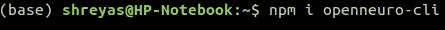
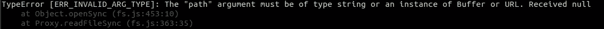
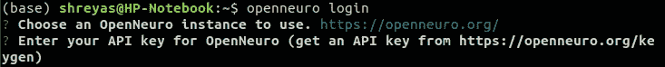
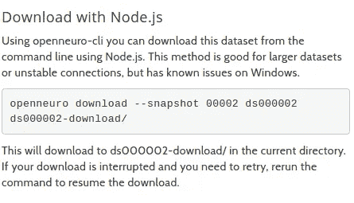
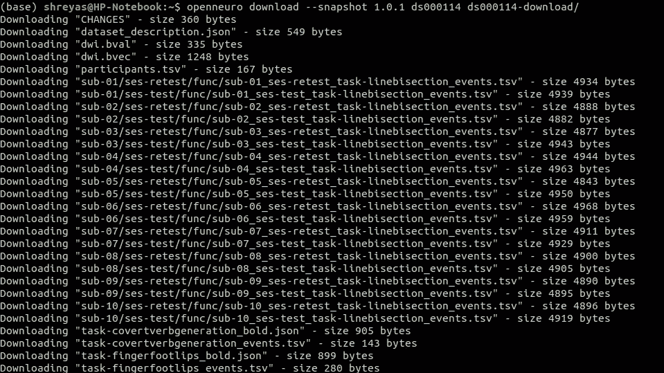
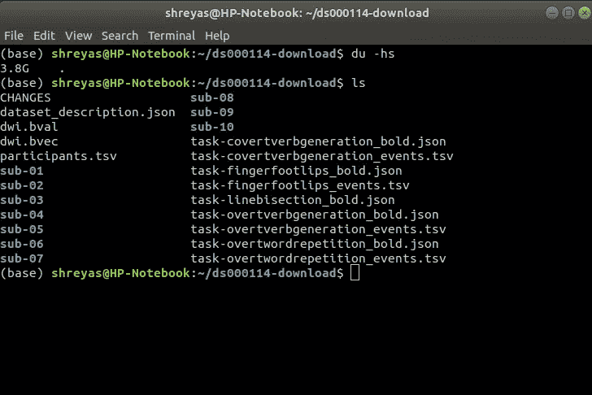

# 用 Node.js 下载巨大的 fMRI 数据集

> 原文：<https://medium.com/analytics-vidhya/downloading-huge-huge-fmri-datasets-with-slow-internet-using-node-js-ce8629bdcd9f?source=collection_archive---------34----------------------->

在这次疫情期间，除了不能在我最喜欢的小吃店吃饭之外，最大的挑战之一就是要跟上我这学期次要项目的进度。嗯，不是因为病毒，而是我需要使用的 fMRI 数据集的大小。毫无疑问，应用云服务是最好的选择。但是，对于无法资助此类操作的学生( [AWS 自由层限制](https://docs.aws.amazon.com/awsaccountbilling/latest/aboutv2/free-tier-limits.html))来说，将会有许多限制。

我正试图创建大脑中与技能发展功能相关的映射。

首先，数据集很奇怪(？)和足够惊人的提出一个下载它们的真正任务。一个正常的数据集的大小在 5gb 以内，甚至上百个。因为，正如冒险分子所希望的那样，这些数据点有四个维度。小尺寸的非常有助于在最小水平上观察假设的作用。也很有见地，真的没什么好抱怨的。

> [***了解更多 fMRI 数据集。***](https://psychcentral.com/lib/what-is-functional-magnetic-resonance-imaging-fmri/)

但是，作为一个与医学领域相关的项目，在使用 fMRI 的同时，尽可能多的分析对象通常是有成效的。但是，这也有它自己的缺点。只有 10 个主题，你在处理一个*巨大的*数据集。

变化和异常越多，你的方法就越多。这就是我在赞美这些大型数据集之后，对它们感到沮丧的地方。它们的大小。现在，在我们开始之前，重要的是要检查是否存在用于下载这些大型数据集的源的现有 CLI。否则这篇文章毫无用处。

**注意:**如果不存在，检查[这个方法](https://webkid.io/blog/handling-large-datasets-nodejs-etl-pipeline/)。幸运的是，神经成像最流行的数据源是 open neuro——它在 **npm** 中有一个 CLI 包。

[node . js 的 OpenNeuro CLI 文档](https://www.npmjs.com/package/openneuro-cli)

# 步骤 0:如果还没有安装 npm 和 Node.js，请安装它们

JavaScript 的开源运行时环境

对于 npm 和 Node.js: [点击这些文字](https://www.npmjs.com/get-npm)并在完成安装后返回这里。

# 步骤 1:安装 OpenNeuro 命令行界面

我使用的是 Ubuntu 操作系统，这意味着我使用基于 Linux 的环境来完成给出的步骤。这些在你的操作系统上应该也能正常工作，但是你输入的命令会有一些变化。另一个需要考虑的重要事项是，这里显示的方法在 Windows 上存在一些问题。

[参见:Windows 转 Linux](https://in.pcmag.com/adobe-photoshop-cc-2014/134514/how-to-make-the-switch-from-windows-to-linux) 。

回到我们的步骤，安装 CLI:

这应该够了。如果你有任何错误，请检查拼写错误。

# 步骤 1.1:登录

我没有做 1.1 就做了第 2 步，结果是这样的:

您将无法下载这些文件，因为您尚未将 API 密钥与 CLI 链接。你会在你的 OpenNeuro 账户上找到钥匙。如果没有，[创建一个](https://openneuro.org/keygen)。

# 第二步:下载

两个最小步骤的最后一步，如果你有一个更快的互联网。对吗？没关系，我们改天再来讨论连接性，因为现在您可以使用这个命令:

`openneuro download <accession number> <destination directory>`

您可以在“高级方法”的下载页面上找到具体的细节，甚至是数据集的命令。这里，像这样:

来源:OpenNeuro

工作示例:

实际上，这应该告诉你更多的事情已经解决了:

希望这对那些发现很难下载 fMRI 数据集的人有所帮助。其他人在处理大型数据集时，使用管道也有类似的方法。现在，问题是已经下载了这些庞大的数据集——你的机器是否有足够的计算能力。大多数时候，事实并非如此。这是又一个黑暗时刻的又一个巨大挑战。

那都是乡亲们！