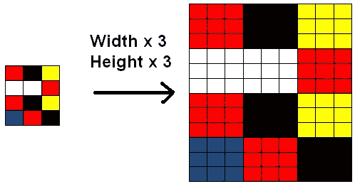

# 图像的下采样和上采样——揭开理论的神秘面纱

> 原文：<https://medium.com/analytics-vidhya/downsampling-and-upsampling-of-images-demystifying-the-theory-4ca7e21db24a?source=collection_archive---------2----------------------->

照片由 [timJ](https://unsplash.com/@the_roaming_platypus?utm_source=medium&utm_medium=referral) 在 [Unsplash](https://unsplash.com?utm_source=medium&utm_medium=referral) 上拍摄

大家好！希望大家编码愉快！

好吧，告诉你一点关于我自己的事情，我已经从全栈开发做了一个“小的职业转变”,并试图追求数据科学。我从零开始，希望在理解这个主题的所有细节的同时达到顶峰。在这个同化过程中，如果你们指出任何修正或者建议更好的方法来做这篇文章中已经提到的事情，我会很高兴。我希望你们都喜欢阅读！

虽然本文主要面向技术方面(机器学习和深度学习的爱好者和实践者)，但并不局限于此。这里提到的概念也适用于任何图像处理领域，包括图像 photoshopping。

# 背景

计算机以数字的形式更好地理解事物，无论它必须做数学计算，处理多媒体、文本或信号，所有这些都以数字的形式在计算机中表现出来。这个主题中的问题是图像的大小调整。

想想图像是如何存储在计算机上的！图像被分解成称为像素的微小元素。每个像素代表一种颜色。因此，分辨率为 1024 x 798 像素的图像具有 1024 x 798 像素(817，152 像素)。这意味着矩阵形式的许多色点。

所以让我们从两者中相对容易的开始:

# 向下采样

在阅读了这项技术的名称后，人们会直观地想到它与图像的缩小有关。没错。这个想法是正确的，我们必须有人缩小图像，原因有很多，比如:

*   它使得数据的大小更易于管理
*   减少数据的维数，从而加快数据(图像)的处理速度
*   减少数据的存储大小

根据用途，这种技术还有其他一些用途。

它有时与图像压缩混淆，图像压缩是不同的东西，有完全不同的用途。这里我们只关心图像的缩小。那是什么意思？这实质上意味着扔掉一些(不必要的)信息。

由此，我们可以得出一个提示，我们需要从图像中丢弃一些行和/或列。我们需要透露一些信息。

在用于下采样的各种技术中使用了许多算法，即:

*   [Mipmap](http://number-none.com/product/Mipmapping,%20Part%201/index.html)
*   [箱式取样](https://scholarworks.rit.edu/cgi/viewcontent.cgi?article=10864&context=theses)
*   [Sinc](https://www.nayuki.io/page/sinc-based-image-resampler)

# 上采样

另一方面，上采样只是下采样的逆目标:增加图像的行数和/或列数(维度)。这可用于多种情况，如在 GANs(生成对抗网络)中使用的情况，其中目的是从随机向量样本中构建图像，模仿来自真实或真实分布的图像。还有很多其他的，比如提高图像质量等等。让我们更详细地讨论这个问题。

向下采样时，我们的意图相当简单明了，但向上采样就没那么简单了。我们需要以某种方式增加图像的尺寸，并填补空白(列/行)。假设您想要将原始图像向上采样 3 倍，这意味着您需要使用一些逻辑为图像中的每一行/列再添加 2 行/列。一种方法是重复原始图像中的每一列/行。

图片来源:giassa.net

如果你这样做，有趣的是，你会观察到两个图像:原始图像和结果图像看起来非常相似，如果不是完全相同的话。为了让大家明白这一点，您没有在结果图像中创建任何“新”数据。因为重复的行和列完全是多余的，所以这种方法是无用的，并且它不提供任何新的信息。

添加新列的明智方法是在行/列之间插入新数据，使用一些高级数学产品提供相当准确的中间值。

这些算法的一些例子是:

*   [最近邻插值](https://theailearner.com/2018/12/29/image-processing-nearest-neighbour-interpolation/)
*   [双线性插值](https://theailearner.com/2018/12/29/image-processing-bilinear-interpolation/)
*   双三次样条插值
*   广义双三次插值

# 进一步阅读

我在写这篇文章的时候参考了一些资料，希望对你有用。

 [## 吉亚萨。网

### 好吧，既然我们可以对图像进行降采样并降低它的尺寸，那么如果能够增加它的尺寸就好了…

www.giassa.net](https://www.giassa.net/?page_id=200)  [## 图像缩放

### 这篇文章请添加需要关注的计算机图形专家。原因或谈话参数…

en.wikipedia.org](https://en.wikipedia.org/wiki/Image_scaling) 

请让我知道你是否觉得它有用，或者你是否找到了其他一些可能帮助我和其他人更清楚地理解它的文章

# 跟我来

伙计们，如果你喜欢阅读这篇文章，并想阅读更多内容，跟随我成为一名见多识广的数据科学家，请在 [Medium](/@aashishchaubey) 、 [Twitter](https://twitter.com/AashishLChaubey) 和 [LinkedIn](https://www.linkedin.com/in/chaubey-aashish/) 上关注我。也请不要忘记留下你对这篇文章的赞赏或评论！