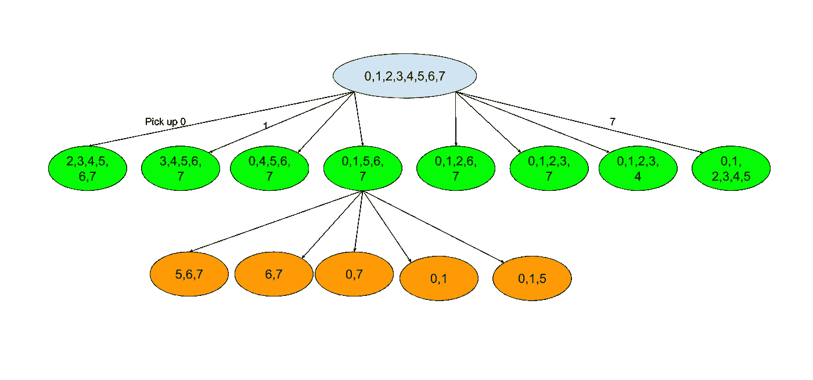
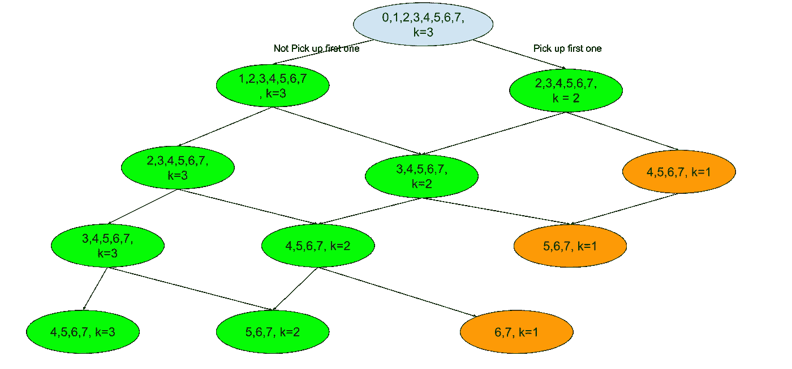

# 3n 片 DP 披萨

> 原文：<https://medium.com/analytics-vidhya/dp-pizza-with-3n-slices-b5a9efece786?source=collection_archive---------10----------------------->

## 从 n！到 2^n 到北

[](https://leetcode.com/problems/pizza-with-3n-slices/) [## 3n 片披萨- LeetCode

### 有一个由 3n 片不同大小的比萨饼，你和你的朋友将采取比萨饼切片如下:你将…

leetcode.com](https://leetcode.com/problems/pizza-with-3n-slices/) 

## 一个天真的解决方案将会失败

```
from functools import lru_cache
class Solution:
    def maxSizeSlices(self, slices: List[int]) -> int:
        [@lru_cache](http://twitter.com/lru_cache)(None)
        def dp(a):    
            if len(a)==3:return max(a)
            else:
                res = -float('inf')
                for i,k in enumerate(a):
                    if i==0:
                        new_a = a[2:-1]
                        if len(new_a)%3!=0:print(new_a)
                    elif i==len(a)-1:
                        new_a = a[1:-2]
                    else:
                        new_a = a[:i-1]+a[i+2:]
                    this_res = k+dp(new_a)
                    res = max(res, this_res)
            return res
        return dp(tuple(slices))
```

运行结果:

```
**24 / 69** test cases passed.Status:Time Limit Exceeded
```

## 这个幼稚的解决方案的时间复杂度是多少？



如果我们有 8 块比萨饼，这是一个简单的例子

从这个例子中，我们可以看到:

*   第一步:我们有 8 个选择
*   第二步:除了两个边界节点，我们有 8-3 个选择。
*   第 3 步:8–3–3
*   …

所以我们有的是 n！当我们有 3n 片比萨饼时的可能状态。这解释了为什么我们得到了 TLE。我们能做得更好吗？

## 使用早期修剪的更好方法(失败)

是的，我们可以通过早期修剪做得更好。主要观点:

1.  到目前为止，DFS 将收集最多的比萨饼
2.  对于一个新的搜索路径，如果我们确定它不能击败当前的最佳结果，就早点停止。

为了做 2，而不是计算我们得到了什么，计算别人到目前为止得到了什么。如果其他人到目前为止得到的已经大于他们能得到的最小比萨饼(这意味着我们不能改善我们的结果)，我们停止探索这个分支。

代码如下:

```
from functools import lru_cache
class Solution:
    def maxSizeSlices(self, slices: List[int]) -> int:
        self.others_min = float('inf')
        def dfs(slices, others):
            if len(slices)==3:
                others += sum(slices)-max(slices)
                self.others_min = min(self.others_min, others)
                return
            for i, slice in enumerate(slices):
                if i==0:
                    new_others = others + (slices[i+1]+slices[-1])
                    new_slices = slices[2:-1]
                elif i==len(slices)-1:
                    new_others = others +  (slices[0] + slices[i-1])
                    new_slices = slices[1:-2]
                else:
                    new_others = others + (slices[i-1]+slices[i+1])
                    new_slices = slices[:i-1]+slices[i+2:]
                # if others >= others_min, no need to further explore
                if new_others<self.others_min:  
                    dfs(new_slices, new_others)
        dfs(slices, 0)
        return sum(slices)-self.others_min
```

然而，这一个比上一个慢

```
**15 / 69** test cases passed.Status:Time Limit Exceeded
```

为什么这种动态规划方法能够取得成功。

[](https://www.quora.com/Given-a-pizza-with-3n-slices-e-g-9-12-repeatedly-pick-a-slice-save-the-size-of-this-slice-When-you-do-this-the-slice-on-the-left-goes-to-someone-on-the-left-and-the-slice-on-the-right-goes-to-someone-on-the-right-Repeat-this-process-until-no-slices-are-left-How-can-you-write-a-program-to-find-a-list) [## 给定具有 3n 个切片的比萨饼(例如 9，12，...)，反复挑选一片(保存这个的大小…

### 回答(第 1 步，共 3 步):起初，动态编程似乎没有希望，因为获取切片的顺序很重要…

www.quora.com](https://www.quora.com/Given-a-pizza-with-3n-slices-e-g-9-12-repeatedly-pick-a-slice-save-the-size-of-this-slice-When-you-do-this-the-slice-on-the-left-goes-to-someone-on-the-left-and-the-slice-on-the-right-goes-to-someone-on-the-right-Repeat-this-process-until-no-slices-are-left-How-can-you-write-a-program-to-find-a-list) 

从上面的链接

“起初，动态编程似乎没有希望，因为取切片的顺序很重要。为了看到这一点，考虑切片:… A B C D E …，其中点代表更多的切片，假设切片 A、C 和 E 非常大，因此是理想的。如果我先拿 C 片，那么 A 和 E 是邻居，我只能拿其中一个，而如果我先拿 A 片，那么就有可能在连续的移动中拿 C 片和 E 片。给问题增加了切片顺序的额外维度--有 *n* ！取一组特定的 *n* 个切片的顺序— —使得子问题的集合看起来是指数级的大

## 数据处理

一个很好的总结

[https://leet code . com/problems/pizza-with-3n-slices/discuse/546574/Excellent-explain-with-math-proof-on-Quora](https://leetcode.com/problems/pizza-with-3n-slices/discuss/546574/Excellent-explanation-with-math-proof-on-Quora)

“基本想法:

1.  转化成这个问题:给定 n 个数，从中挑出 n/3，使和最大。选取的数字不能相邻
2.  这里 0 和 n-1 不能共存。所以我们需要一些特殊的技巧:要么弹出最小的(就像 quora 页面建议的那样)，要么处理 0..n-2 和 1..n-1 分开，就像论坛上其他人指出的那样”

## 具有早期剪枝的简洁 DP 解决方案

```
import functools
class Solution:
    def maxSizeSlices(self, A: List[int]) -> int:
        n = len(A)//3
        @functools.lru_cache(None)
        def dp(i, j, k):
            if k == 1: return max(A[i:j + 1])
            """
            We have several cases:    
            case1: my_pizza, others, my_pizza, others
            case2: others, my_pizza, others, my_pizza
            case3: others, my_pizza, others
            case4: my_pizza, others, my_pizza
            it means if I need K pizza, case 1 and case 2 need 2k. case 3 need 2k+1, case4 needs 2k-1(minimum)
            If less than 2k-1, impossible
            """
            if j - i + 1 < 2*k - 1: return -float('inf')
            return max(dp(i+2, j, k - 1) + A[i], dp(i+1, j, k))
        # Lots of posts pointed out why two cases here.
        return  max(dp(0, len(A) - 2, n), dp(1, len(A) - 1, n))
```

## DP 复杂性



动力定位过程图解。我们有两个行动:1)不拿起第一片。2)拿起第一片

从上面的插图中，我们可以看到树有 n 层。如果每个节点我们有两个选择，那么我们将有:sum(2^i 对于范围(3n)中的 I，复杂度是 O(2^n).同时，我们也可以观察到我们有重叠的节点。如果我们考虑重叠节点，我们将有:1，2，3，4…每层 n 个节点。这是 O(n)。因为 n 只有 500，所以即使不使用早期修剪，n 也是可行的。

## 不使用早期修剪的 DP。

```
import functools
class Solution:
    def maxSizeSlices(self, A: List[int]) -> int:
        n = len(A)//3
        [@functools](http://twitter.com/functools).lru_cache(None)
        def dp(i, j, k):
            # the bottom case will be we only have two slice pizza left.
            # if k==0: good, we alreay have enough pizza, return 0
            # if k==1: good, return the maximum pizza
            # if k==2: impossible.
            if j-i+1<=2:
                if k==0:return 0
                elif k==1:return max(A[i:j + 1])
                else:return -float('inf')
            return max(dp(i+2, j, k - 1) + A[i], dp(i+1, j, k))
        # Lots of posts pointed out why two cases here.
        return  max(dp(0, len(A) - 2, n), dp(1, len(A) - 1, n))
```

在本文中，我们将算法的复杂度从:

O(n！)到 O(2^n)到 O(n)。O(2^n)一个是一个解决方案，如果我们不使用记忆。

希望有帮助。

参考

[https://leet code . com/problems/pizza-with-3n-slices/discuse/546474/Python-rober-n3-Houses-in-Cycle](https://leetcode.com/problems/pizza-with-3n-slices/discuss/546474/Python-Robber-n3-Houses-in-Cycle)