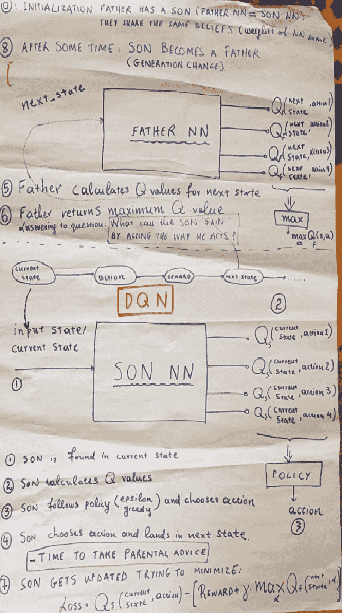

# DQN 算法:一个父子故事

> 原文：<https://medium.com/analytics-vidhya/dqn-algorithm-a-father-son-tale-b4bf6ff1ae2f?source=collection_archive---------16----------------------->

深度 Q 网络(DQN)强化学习算法有一个惊人的简单和现实生活的类比，可以用它来解释。它有助于理解算法所涉及的操作序列。

父亲带着儿子散步

通过下面简单的叙述，可以从概念上理解该算法，该叙述说明了训练的发展:

我们有一个父亲和一个儿子(=> 2 个不同的神经网络)

0.父亲教导 T2 的儿子能够在生活中独立行动。**父亲**生下**儿子**。

1–2.儿子**在当前状态下被发现，基于他所知道的，他为他能采取的行动计算 Q 值。我喜欢认为 **Q-** 值= **质量-** 值。**

3–4.**儿子**遵循一项政策，采取一项行动，将他带入下一个状态。

*时间为* ***父母建议*** *。* ***子*** *问* ***父*** *他的行为有什么价值。*

5–6.**父亲**让**儿子**知道儿子找到的状态的最大 Q 值是多少。

7.儿子根据父亲的输入更新影响他决策的权重/因素。

这种训练的缩影可以在父亲告诉儿子的下面这句话中找到:

> *‘我无法告诉你我的* ***儿子*** *你是对还是错。我能告诉你的唯一一件事是，随着你在你被发现的州所采取的行动把你带到了新的州，我作为一个* ***父亲*** *的经验告诉我，对你现在起的行动来说，你能获得的最好结果是< QMAX >。*

## 8.一段时间后(几年=儿子接受父亲的建议播放几集),儿子自己成为了父亲，下一代的训练继续进行。

这个比喻还支持重播缓冲器的概念，其中保存了最近的剧集。这在一个不断发展的系统中是有意义的，在这个系统中，知识是跨代积累的，下一代需要最新一代的更新和指导。

可以在[https://gist . github . com/IGT zolas/8a8f 3156153 bcec 85 abde 7544 f 2832 da](https://gist.github.com/igtzolas/8a8f3156153bcec85abde7544f2832da)中找到如上所述的算法的基于 pytorch 的实现，其考虑了父、子、代等概念

该代码主要基于以下内容:[https://github.com/seungeunrho/minimalRL/blob/master/dqn.py](https://github.com/seungeunrho/minimalRL/blob/master/dqn.py)

# 双 DQN

现在我们有了理解 DQN 的隐喻，我们可以很容易地更新我们的隐喻来解释双 DQN 背后的想法。

双重 dqn 训练的集大成者可以在父亲告诉儿子的以下句子中找到:

> *‘你告诉我，我的儿子，你认为你的下一步行动应该是基于你的想法的下一步行动。我告诉你，如果你现在(在你的下一个状态)采取行动，下一个行动就值那么多钱。请更新你的信仰！*

在代码中，DQN 和双 DQN 的区别是:

差异 DQN 加倍 QN

双 DQN 的实现见:[https://gist . github . com/igtzolas/CD 01 b 6 e 5 a4 df 71 bbff 541 f 65 e 254 f 781](https://gist.github.com/igtzolas/cd01b6e5a4df71bbff541f65e254f781)

非常感谢您的阅读！