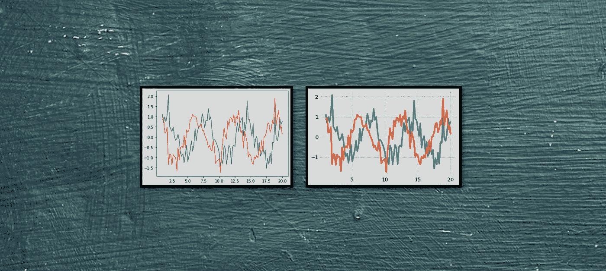

# 用一行代码彻底美化可视化效果:设计情节

> 原文：<https://medium.com/analytics-vidhya/drastically-beautifying-visualizations-with-one-line-styling-plots-35a5712c4f54?source=collection_archive---------2----------------------->

背景图片: [Pixabay](https://pixabay.com/photos/blackboard-wall-black-dark-grunge-1846865/)

## 制作吸引人的情节从未如此容易

可视化中最被低估的部分是它的调色板——可视化人员经常花大量时间添加记号和注释，却放弃选择合适的调色板。颜色是我们用来与世界互动的最具信息性的信号之一；一个情节恶劣的…