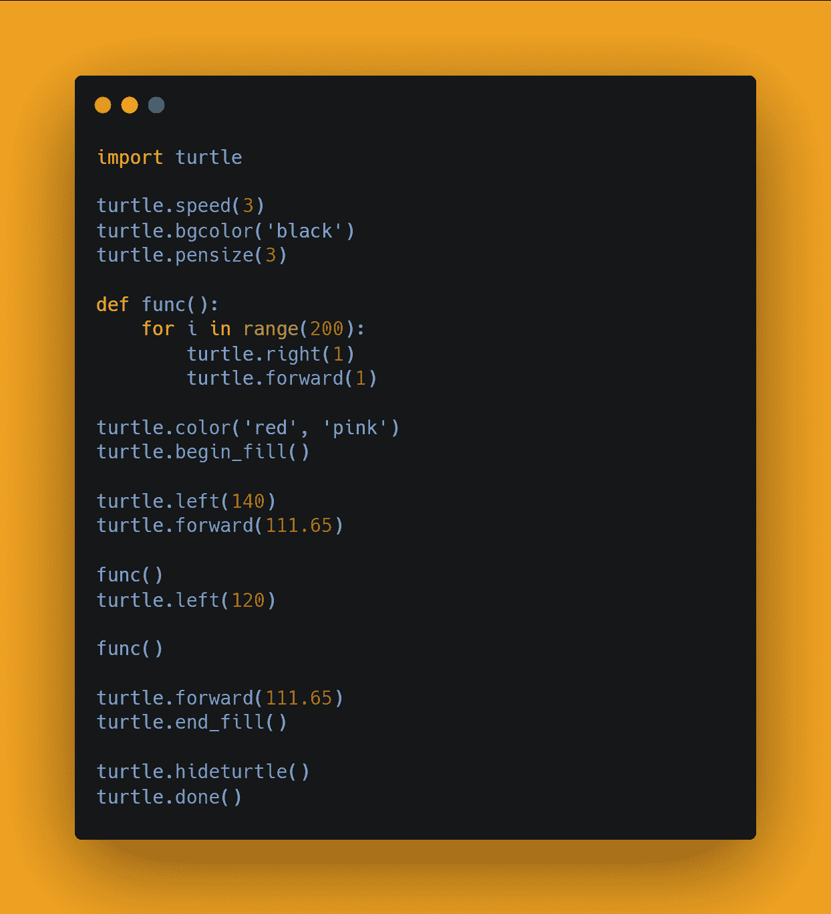
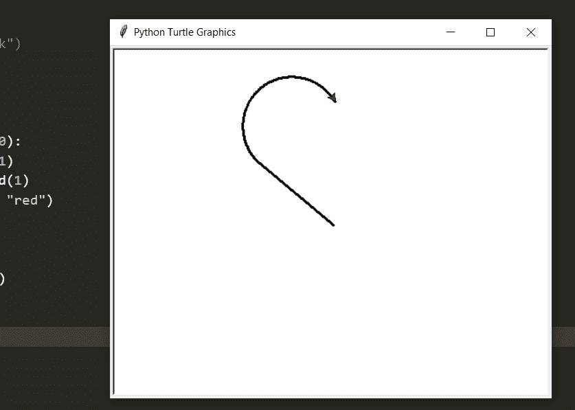
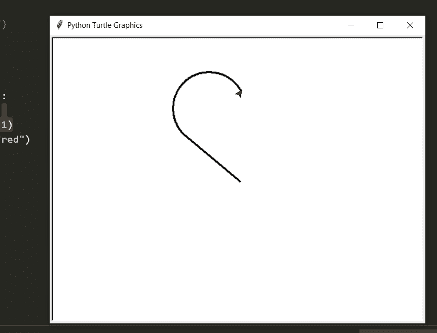
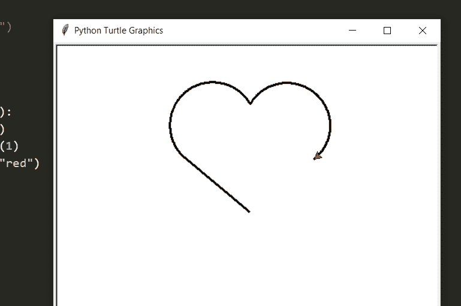
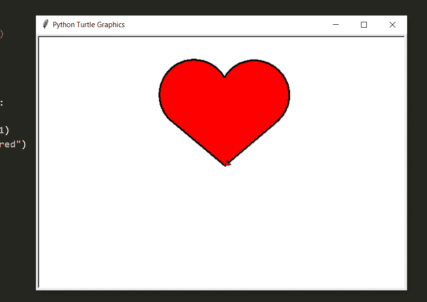
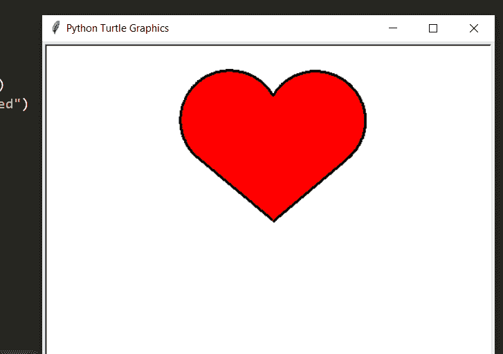

# 用蟒蛇画心用乌龟

> 原文：<https://medium.com/analytics-vidhya/draw-heart-with-python-using-turtle-7bd8b9ef31d9?source=collection_archive---------1----------------------->

在这篇博客文章中，我们将学习如何**用 Turtle 创建一个心脏，**我们将用 Python 实现它。


[python 中终极资源的储存库](https://github.com/ayushi7rawat/Ultimate-Python-Resource-Hub)。发现有用就掉颗星！有什么要补充的吗？开个 PR 就一样了！

你可以参考我的 YouTube 视频教程，以便更好地理解:

# 该博客将涵盖哪些内容:

```
1\. Turtle Introduction
2\. Creating a heart with Turtle
```

# 乌龟是什么？

`Turtle`是预装的 Python 库。它通过为用户提供一个虚拟画布，使他们能够创建图片和形状。你用来画画的屏幕笔叫做乌龟。

乌龟有三个属性:位置、方位(或方向)和笔。

# 移动龟头

乌龟可以向四个方向移动:

*   向前
*   向后的
*   左边的
*   对吧

如果你想了解更多，可以参考[海龟文档](https://docs.python.org/3/library/turtle.html)。使用此链接导航到文档。

现在你已经了解了海龟的基础知识，我们可以前进到编码部分了。

# 该编码了！

你可以在我的 [GitHub 库](https://github.com/ayushi7rawat/Youtube-Projects/tree/master/Heart%20with%20turtle)找到所有代码。发现有用就掉颗星。



为了访问 python 库，您需要将其导入到您的 Python 环境中，使用下面的命令将`turtle`导入到您的 Python 脚本中。

```
import turtle
```

现在让我们定义一些属性，

*   让我们使用`speed`方法将速度设置为`3`，这意味着心脏将不仅仅出现在屏幕上，绘图还会有一些动画。
*   如果你想改变背景颜色，你可以使用`bgcolor`方法，默认为白色。
*   你可以用`pensize`的方法调整笔的粗细，会稍微粗一点。

```
turtle.speed(3)
#turtle.bgcolor("black")
turtle.pensize(3)
```

现在让我们定义一个函数来定义曲线，我称它为`myfunc`。

```
def curve():
    for i in range(200):
        turtle.right(1)
        turtle.forward(1)
turtle.color("black", "red")  
turtle.begin_fill()turtle.left(140)
turtle.forward(111.65)
curve()
```

我将在这里为第一条曲线定义一个循环，我们将设置正确的方向并向前移动。现在让我们使用`color`方法设置`turtle`颜色

*   第一个参数是边框颜色，即笔的颜色，我们将其作为`black`传递
*   第二个参数，`red`是用来填充我们内心的颜色。

一旦我们设置了颜色，我们就可以使用`begin_fill`方法开始填充。

我们调用`left`和`forward`，最后调用我们的函数得到第一条曲线。它看起来会像这样。



```
turtle.left(120)
```

为了改变`pen`的方向，使用`left`方法。



```
curve()
```

现在让我们再次调用曲线函数。



```
turtle.forward(111.65)turtle.end_fill()
```

让它触及起点，完成我们的心。这里我们将利用`forward`方法。一旦我们的心脏完成，我们现在可以使用`end_fill`来填充我们的心脏颜色。



如果你仔细观察，你可以在末端看到笔头。我们将使用`hideturtle`方法来获取它的红色。

```
turtle.hideturtle()
turtle.done()
```

`done`方法用于按住输出龟屏。



这一切都是为了用乌龟创造一颗心。就是这样！很简单，不是吗？希望这篇教程有所帮助。

你可以在我的 [GitHub 库](https://github.com/ayushi7rawat/Youtube-Projects/tree/master/Heart%20with%20turtle)找到所有代码。发现有用就掉颗星。

感谢您的阅读，我很乐意通过 [Twitter](https://twitter.com/ayushi7rawat) 与您联系。

请分享您的宝贵反馈和建议！

你绝对应该看看我的其他博客:

*   [Python 3.9:你需要知道的一切](https://ayushirawat.com/python-39-all-you-need-to-know)
*   [终极 Python 资源枢纽](https://ayushirawat.com/the-ultimate-python-resource-hub)
*   [GitHub CLI 1.0:你需要知道的一切](https://ayushirawat.com/github-cli-10-all-you-need-to-know)
*   [成为更好的程序员](https://ayushirawat.com/become-a-better-programmer)
*   [如何制作自己的谷歌 Chrome 扩展](https://ayushirawat.com/how-to-make-your-own-google-chrome-extension-1)
*   [使用 Python 从任何 pdf 创建您自己的有声读物](https://ayushirawat.com/create-your-own-audiobook-from-any-pdf-with-python)
*   你很重要，你的心理健康也很重要！

# 资源:

*   [docs.python.org/3/library/turtle.html](https://docs.python.org/3/library/turtle.html)
*   [en.wikipedia.org/wiki/Turtle_graphics](https://en.wikipedia.org/wiki/Turtle_graphics)

在我的下一篇博客文章中再见，保重