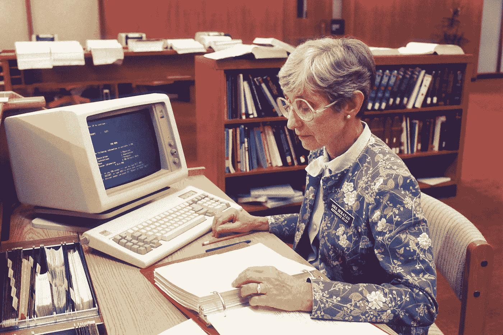

# 从任何具有文本挖掘的书籍中汲取灵感

> 原文：<https://medium.com/analytics-vidhya/drawing-insights-from-any-book-with-text-mining-in-r-part-1-ffc9788d4cf2?source=collection_archive---------10----------------------->

[国家癌症研究所](https://unsplash.com/@nci?utm_source=medium&utm_medium=referral)在 [Unsplash](https://unsplash.com?utm_source=medium&utm_medium=referral) 上拍摄的照片

**文本挖掘**和**自然语言处理**是目前数据挖掘中最有趣的两个领域。无论您是处理一些有争议的政治候选人的推文，还是翻阅数百页的书籍来发现某种模式，现在都可以使用 R(或 Python，就此而言)中可用的算法和软件包做很多事情。