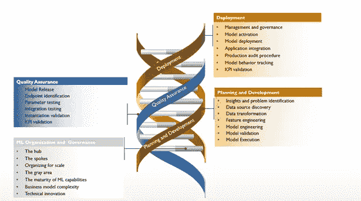
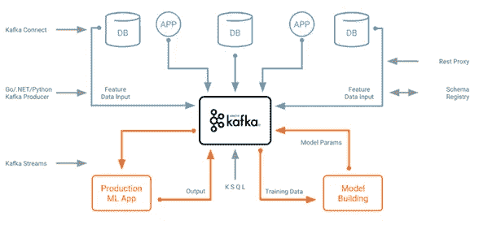
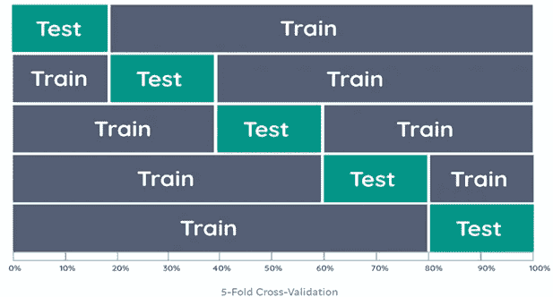
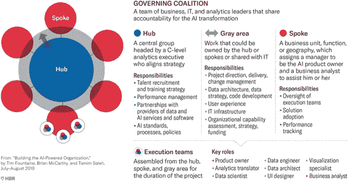

# 使用敏捷方法开发和部署机器学习(ML)模型，更快地交付商业价值

> 原文：<https://medium.com/analytics-vidhya/drives-business-values-faster-using-agile-approach-to-develop-and-deploy-machine-learning-ml-c01d8695d433?source=collection_archive---------16----------------------->

商业和技术专业人员在操作 ML 以进行有效的开发、部署和治理方面一直面临着挑战。我们许多人仍然认为操作化过程更多的是一门艺术，而不是一个系统的方法。这给 ML 模型的可伸缩性和维护带来了巨大的挑战。为什么？因为 ML 计划不同于传统的 IT 产品开发过程。ML 计划是非常实验性的，需要更多领域的技能，例如统计分析、数据分析、平台工程和应用程序开发。此外，通常缺乏对流程的理解，相关团队之间缺乏沟通，开发和运营团队不愿意参与到彼此的领域中，以有效地协调 ML 模型的开发和运营。

建议负责任的业务和 It 专业人员重新思考并关注:

1.机器学习发展为自己的生命周期。例如，通过利用 ML、DevSecOps 和 DataOps 技能和能力建立机器学习开发生命周期(MLDLC ),其中数据架构排在第一位。

2.建立 ML 平台，支持 AI 用例。

3.一旦实施，管理和治理需要到位，以持续管理和监控 ML 模型、相关数据和商业价值。

开发和操作 ML 模型的敏捷解决方案方法

在下文中，我们将讨论数据、平台、流程等关键能力。需要一个有效的运作框架来应对上述挑战。MLDLC 是使用跨行业标准工艺得到的。这是一个简单而实用的规程，是数据和工程完整性和健壮性所需要的。这导致建立一个 ML 模型开发生命周期，它包括四个主要周期——开发、质量保证、部署和管理以及治理。

典型的机器学习架构包括五个功能阶段:

**规划与发展:**

与由软件开发者编码的静态算法相比，ML 模型是一种学习和动态更新的算法。您可以将软件应用程序视为算法的组合，由设计模式定义，由软件工程师编码，执行计划的任务。一旦应用程序发布到产品中，它可能不会按计划执行，促使开发人员重新思考、重新设计和重写它(持续集成/持续交付)。另一方面，ML 模型本质上是动态算法。这种动态给与产品所有者和质量保证(QA)团队一起工作的计划者带来了许多新的挑战。比如 QA 团队应该如何测试和报告？

与其他 IT 项目不同，播种项目组合方法的适当时机是在计划阶段，并且应该从创建一组要解决的业务问题开始:

**洞察力和问题识别。**关注传统编程难以解决的问题。例如，考虑智能回复。智能回复团队认识到，用户花费大量时间回复电子邮件和消息；能够预测可能的反应的产品可以节省用户的时间。想象一下，试图用常规编程创建一个像智能回复这样的系统。没有明确的方法。相比之下，机器学习可以通过检查数据中的模式并适应它们来解决这些问题。把 ML 想象成你工具箱中的一个工具，只在适当的时候使用它。

*记住这些例子，问自己以下问题:*

1.我的产品面临什么问题？

2.对 ML 来说会是个好问题吗？

*不要反过来问问题！*

**数据源发现**:解决所选问题的用例可能来自行业最佳实践。另一种方法是创建“数据地图”，在那里我们可以探索尚未开发的现有分析和数据资产。可以自动化的业务流程，以进一步推动现有的业务想法，并发现对新数据集的需求，应该包括在分析过程中。与业务线和 IT 组织合作，利用产生大量数据的应用程序来寻找未开发的数据源和见解。总的来说，人工智能的持续创新是由数据、想法、ML 模型和跨职能团队驱动的。

**数据转换**:构建一个数据管道，将不同结构的不同来源的数据接收到一个逻辑数据仓库(LDW)中。数据集成组件支持 ML 管道需求，例如实时、近实时和批量数据流。这应该基于初步的用例，并需要发展以支持即将到来的问题的解决。机器学习和 Apache Kafka 生态系统是大规模培训和部署分析模型的绝佳组合:

用于数据转换的 Apache Kafka 生态系统

**特征工程**或特征分析是对描述您的 fata 固有结构的特征进行分析和选择的过程。许多摄取的数据可能包含冗余或不相关的变量。有时特征分析是样本选择过程的一部分。这是一个重要的子组件，有助于过滤可能违反隐私条件或促进不道德预测的数据。

**模型工程**或数据建模包括 ML 数据处理中使用的数据模型设计和机器算法(包括聚类和训练算法)。体系结构的建模部分是算法被选择和调整以解决在执行阶段被检查的问题的地方。例如，如果学习应用程序将涉及聚类分析，数据聚类算法将是这里使用的 ML 数据模型的艺术。如果要执行的学习是受监督的，那么数据训练算法也将被涉及。可扩展算法是 ApacheMXNet、Apache Spark MLiB 等的一部分。

**模型验证:**没有一种验证方法适用于所有场景。了解您是在处理组、时间索引数据，还是在验证过程中泄漏数据是很重要的。那么哪种验证方法适合我呢？看情况！但是验证技术通常止步于 k 倍交叉验证。为了最小化抽样偏差，我们可以稍微不同地考虑方法验证。如果我们不是进行一次分割，而是进行多次分割，并对这些分割的所有组合进行验证，会怎么样呢？这就是 k 倍交叉验证的用武之地。它将数据分成 k 个折叠，然后在 k-1 个折叠上训练数据，并在被遗漏的一个折叠上进行测试。它对所有组合执行此操作，并对每个实例的结果进行平均。

说明性的 ML 模型验证方法(来源:towardsdatascience.com)

优点是所有的观察值都用于训练和验证，并且每个观察值只用于一次验证。

**模型执行**:执行是处理和训练数据被转发用于执行 ML 例程(如 A/B 测试和调优)的环境。根据 ML 例程的先进程度，执行所需的性能可能非常重要。因此，这方面的一个关键考虑因素是有效执行 ML 例程所需的处理能力——无论该基础设施是作为云提供商的服务在内部托管的。例如，对于其中只有四个或五个输入(或特征)的相对简单的神经网络，可以使用台式服务器或膝上型计算机上的常规 CPU 进行处理，反之亦然。ML 和数据科学团队通常会在部署之前测试和调试 mL 模型或算法。ML 模型的测试通常是多维的——也就是说，开发人员必须测试数据、适当的模型拟合和适当的执行。这可能具有挑战性，建议设计尽可能模拟生产的测试环境，以避免在操作整个工作流程时出现问题。

**质量保证:**

**模型发布。****模型是升级到发布步骤，准备由运营团队承担，并被标记为“候选”模型。这是开发审查，但还没有完全生产就绪。它在模型管理系统的注册表中注册。**

****终点识别**。这是对决策点的验证，在这里模型将被交付其洞察力。一般来说，这个实现是 REST API 或容器映像的形式，这取决于部署。与基于人工智能的系统(例如，Chabot、图像分类系统等)的模型的端点识别点相关的信息。).**

****参数测试**。目标业务流程可能受到技术约束，生产环境中输入数据的速度、形状、数量和质量可能与用于开发模型的沙箱中的数据不完全一致。该步骤旨在测试模型成为真实应用程序、仪表板或分析报告的一部分后数据的一致性。**

****集成测试**。如果预期数据与开发假设相匹配，集成假设(即 REST APIs、微服务调用和代码集成)也必须经过测试，以确保适当的性能。**

****实例化验证**。由于生产中的模型通常是模型集合的一部分，即使这些基本模型中的微小变化(例如在同一国家的多个州或地区实例化的购买模型的倾向)也可能产生完全不同的结果**

****KPI 验证**。模型性能不仅应根据技术参数(如精度)进行衡量，还应根据作为业务理解步骤一部分提出的估计业务目标(目标和关键结果)的假设进行衡量，业务理解步骤在前期工作步骤的构思部分中已有说明。**

****部署:****

**一旦模型经过测试并确认在预定义的参数范围内运行，就可以部署该模型了。部署阶段的目标是在端点处跨组织的现有业务流程中激活该模型，我们之前已经讨论过了。从这一点开始，只要模型满足业务需求及其性能目标，它就会保持活动状态。在部署阶段，实施模型开发流程有七个关键步骤:**

****管理和治理**。一旦模型准备好被激活，它应该被包含在目录中，被记录，并被版本化。模型管理系统应该作为管理和控制模块的单一参考点。一般来说，企业是模型的所有者，同样，它也拥有用于构建和训练模型的数据。**

****模式激活**。在这一步中，经验证的模型被转换为激活的模型。这些模型是“生产就绪”的，并且有完整的文档记录，符合企业和政府的规则和政策。**

****车型部署**。基于架构，然后执行模型，例如，内部部署、AWS/Azure 或混合。应该采取措施来保证模型有效的事务处理。**

****应用集成**。在这一步中，模型加入基于人工智能的系统，例如聊天机器人框架。应用程序开发人员或数据分析师开始将模型集成到生产应用程序或分析平台中。该模型最终有望交付商业价值。**

****生产审核程序**。一旦模型被部署，监控模型的性能是非常重要的。为此，必须实施模型分析，以收集必要的数据来监控生产中的模型。诸如准确性、响应时间、输入数据变化和基础设施性能等指标应该可操作化，以保持模型的生产处于控制之下。**

****模特行为追踪**。性能阈值和通知机制在这一步中实现。模型行为跟踪和生产审计程序一起系统地通知任何偏差或可疑行为。**

****KPI 验证**。从 QA 循环继续，并由最后两个步骤提供，KPI 验证步骤一致地测量基于 AI 的生产系统中模型的商业贡献。这个概念是接收可以归因于模型的估计的商业价值。生产审计数据和程序反馈到 KPI 验证过程。**

****洗钱组织与治理:****

**Tim Fountaine 和他的同事在他们的研究中提出了 HBR 的两个案例。一家公司将其人工智能和分析团队整合到一个中心，所有分析人员都向首席数据和分析官报告，并根据需要部署到业务部门。第二家公司分散了几乎所有的分析人才，让团队驻留在业务部门并向其报告。两家公司都在各自行业的顶端开发了人工智能；第二个组织在短短两年内从 30 个盈利的人工智能项目增长到 200 个。两者都是在考虑了他们组织的结构、能力、策略和独特的特征之后选择了他们的模型。**

****

**ML 组织和治理的轴辐模型**

****枢纽。**一小部分职责最好由一个中心来处理，由首席分析官或首席数据官来领导。这些包括数据治理、人工智能招聘和培训战略，以及与数据和人工智能服务和软件的第三方提供商合作。中心应该培养人工智能人才，创建人工智能专家可以分享最佳实践的社区，并为整个组织的人工智能开发制定流程。Hubs 还应该负责 AI 相关的系统和标准。这些应该由公司计划的需求来驱动。**

****辐条**。另外一些职责应该总是由代言人来承担，因为他们最接近那些将要使用人工智能系统的人。其中包括与采用相关的任务，包括最终用户培训、工作流重新设计、激励计划、绩效管理和影响跟踪。**

****组织规模**。人工智能公司在中枢和辐条之间划分关键角色。一些任务总是由中心拥有，而辐条总是拥有执行权。其余的工作属于灰色地带，公司的个体特征决定了它应该在哪里完成。**

****灰色区域**。就责任而言，成功的人工智能转型中的许多工作都属于 g 射线领域。决定组织内部的责任归属并不是一门精确的科学，但是它应该受到三个因素的影响:**

****ML 能力的成熟度**。当一家公司处于人工智能之旅的早期，对于分析高管、数据科学家、数据工程师、用户界面设计师、以图形方式解释分析结果的可视化专家等来说，坐在一个中心内并根据需要部署到辐条通常是有意义的。通过合作，这些参与者可以建立公司的核心人工智能资产和能力，如通用分析工具、数据流程和交付方法。但是久而久之和过程变得标准化了，这些专家可以同样(或者更)有效地驻留在辐条中。**

****商业模式复杂**。人工智能工具支持的业务功能、业务线或地理位置越多，就越需要建立人工智能专家协会(比如，数据科学家或设计师)。拥有复杂业务的公司通常将这些行会整合到中心，然后根据需要将它们分配给业务单位、职能部门或地理区域。**

****所需技术创新的速度和水平**。当他们需要快速创新时，一些公司将更多灰色区域战略和能力建设放在中心，因此他们可以更好地监控行业和技术变化，并快速部署人工智能资源，以应对竞争挑战。**

**注:1)该术语由 Gartner、Google 和微软推广。**

**参考:HBR、谷歌、TowardsDataScience、Confluent 和 Gartner**