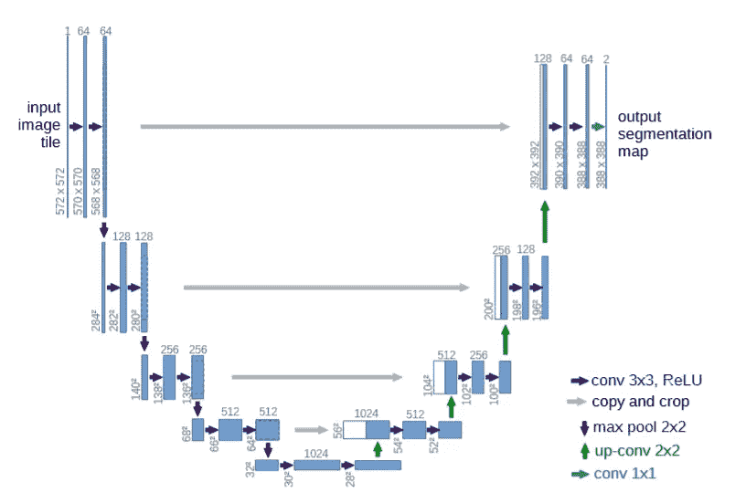

# 无人机航拍图分割

> 原文：<https://medium.com/analytics-vidhya/drone-aerial-view-segmentation-44046ff003b5?source=collection_archive---------13----------------------->

*如何教会无人机看清下面是什么并以高分辨率分割物体*

## 介绍

无人机的使用在过去几年中已经得到普及，它提供*高分辨率*图像，与卫星图像*相比，具有更低的成本*，灵活性和低空飞行，从而导致对该领域越来越多的兴趣，甚至它可以*携带各种传感器*，如磁传感器。

无人机( [Unsplash](https://unsplash.com/photos/ZlkRrzJl20Q) )

由于鸟瞰视图，教无人机看东西相当具有挑战性，并且大多数预训练模型都是在我们日常看到的正常图像(视点)中训练的(ImageNet、PASCAL VOC、COCO)。在这个项目中，我想尝试如何训练无人机数据集，目标是:

*   模型重量轻(参数少)
*   高分(希望如此)
*   快速推理延迟。

## 数据集

> [2] [语义无人机数据集](https://www.kaggle.com/bulentsiyah/semantic-drone-dataset)专注于对城市场景的语义理解，以提高自主无人机飞行和着陆程序的安全性。这些图像描绘了在离地面 5 到 30 米的**高度上从天底(鸟瞰)获得的 20 多所房屋。高分辨率摄像机用于采集尺寸为 **6000x4000px (24Mpx** )的图像。训练集包含 **400 个公开可用的图像**，测试集由 200 个私有图像组成。**

数据集的样本图像

数据集的复杂性限于下面列出的 **20 个类别**(但实际上它的掩码中有 23 个类别:*树、草、其他植被、泥土、砾石、岩石、水、铺砌区域、水池、人、狗、汽车、自行车、屋顶、墙、栅栏、栅栏柱、窗户、门、障碍物。*

## 方法

**预处理**

我 ***用*相同的比例*调整图像*** 的大小就像原来输入到 **704 x 1056** 一样，我*不把图像裁剪成面片*因为几个原因，对象不算太小，不占用太多内存，节省我的训练时间。我将数据集分为三部分训练(306)、验证(54)和测试(40)集，并应用了水平翻转、垂直翻转、网格变形、随机亮度对比度，并将高斯噪声添加到训练数据中，小批量大小为 3。

**模型架构**

我使用两种模型架构，我特意使用轻量级模型作为主干，如 MobileNet 和 EfficientNet，以提高计算效率。

*   **U-Net** 以 *MobileNet_V2* 和 *EfficientNet-B3* 为骨干
*   **FPN** (特色金字塔网络)与*高效网-B3* 骨干网

我看到[*Parmar 的论文*](https://arxiv.org/abs/2007.02839)*【3】*对于模型的选择(我之前已经训练过不同的模型，这些选择看起来很管用)

U-Net Arch ( [来源](https://arxiv.org/abs/1505.04597))

特色金字塔网络(FPN) ( [来源](https://towardsdatascience.com/review-fpn-feature-pyramid-network-object-detection-262fc7482610))

**培训策略**

在培训过程中我采用了*两阶段*培训，

*   ***第一次训练的模型为第 30 个*** 历元患有斜视
*   ***其次，使用加权 CrossEntropyLoss 和 Lovasz Softmax 损失继续 20 个历元*** 以最大化 IoU 得分[1][4]，对两个阶段使用一个周期学习率策略。损失看起来是这样的。

加权 CrossEntropyLoss 和 Lovasz Softmax

用 ***α*** 表示重量，用 ***输出*** 表示模型。在此过程中，给定的权重为 0。 **7** 。

*   如果验证损失 7 次没有改善，使用早期停止

## 结果

在这个实验中，FPN 模型比 U-Net 给出了最好的结果，FPN 损耗也比 U-Net 基模型下降得更快，由于早期停止，训练时间更少。

**损失**

与其他模型相比，FPN 基本模型收敛很快，且达到大约 0.3 最小损耗，而 U-Net B3 和 MobileNet_v2 大约为 0.4 到 0.5。第二阶段训练中的损失增加，因为它*对交叉熵和 Lovasz 之间的乘积求和。*

培训损失

**评估指标**

使用两个指标来评估模型性能，交集/并集和像素精度，使用 Lovasz loss 的训练提高了 IoU 得分，如果我们看到下图，交叉熵将 IoU 固定在 50%左右，这在 U-Net MobileNet_v2 中可以清楚地看到

培训 mIoU

如果我们看到下面的像素精度，使用 Lovasz 的训练并没有真正提高像素精度，它只是停留在阶段 1 的精度，而训练阶段 1 的交叉熵在提高精度方面更好，这就是为什么我首先使用交叉熵并继续使用 Lovasz。

训练像素精度

**推论**

在模型被教会看物体之后，是时候用测试集来看看模型的表现了，在我把它放在掩体里之前，模型从来没有见过这个测试集。测试集由 40 幅图像组成，我将测试集的大小调整为 768 x 1152(原来是 4000 x 6000)以保存我的免费 colab GPU，结果相当令人满意，下面是来自 3 个不同模型的推理示例。

模型推理

为了总结结果，我制作了这个表格来比较每个型号性能的结果，以记住推断延迟实际上取决于您的机器和图像分辨率(我的是 768 x 1152)，在这个总结中，我使用随时间变化的 Google Colab GPU，通常包括 [*Nvidia K80s、T4s、P4s 和 P100s*](https://research.google.com/colaboratory/faq.html#resource-limits) 来进行推断，并计算所有测试集花费的平均时间*。*

模型比较

## 结论

让我们总结一下到目前为止我们已经完成的工作

*   ***FPN 架构在该数据集中运行良好*** ，甚至在相同主干的情况下也优于 U-Net 基础模型
*   **Lovasz Softmax** loss 对 ***提升 IoU 得分*** 效果很好，并没有真正提高精度，反而交叉熵提升了像素精度。
*   用 MobileNet_v2 建模轻量级(较少参数)且还具有快速推理延迟是 U-Net，即使牺牲了模型分数。

分数和推理时间之间的权衡实际上取决于目的和计算资源。

我真的很兴奋将这个模型嵌入到真正的无人机应用中。

有关我的项目的更多信息，请访问 [***我的 github***](https://github.com/said-rasidin)

## 参考

[1]伯曼，马克西姆&兰嫩，阿马尔&布拉施科，马修。(2018).Lovasz-Softmax 损失:神经网络中交集过合并度量优化的易处理替代。4413–4421.2018.00464。

[2]格拉茨工业大学。(2019).2020 年 7 月 13 日访问。[http://dronedataset . ICG . tugraz . at](http://dronedataset.icg.tugraz.at/)。

[3]帕马尔、维韦克&巴蒂亚、纳拉亚尼&内吉、舒巴姆&苏里、马南博士。(2020).面向无人机边缘部署的优化语义分割架构探索。

[4]拉赫林，亚历山大&达维多夫，亚历克斯&尼科连科，谢尔盖。(2018).基于 U-Net 和 Lovász-Softmax Loss 的卫星影像土地覆盖分类。257–2574.10.1109/CVPRW.2018.00048